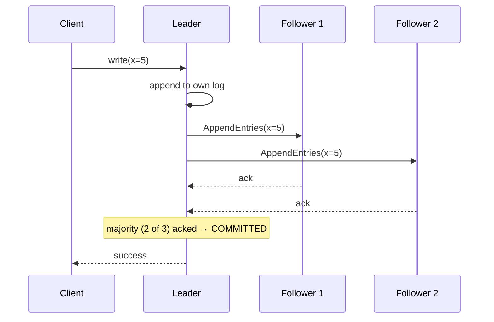
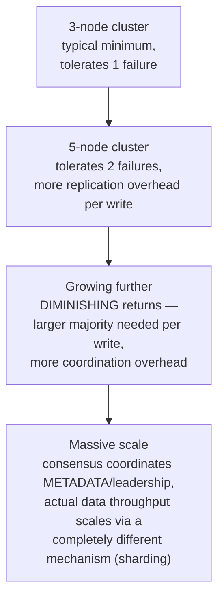

# Consensus (Raft & Paxos)

> [!abstract] What you'll be able to do after this chapter
> Explain exactly how Raft elects a leader and replicates a log safely across failures, why a minority partition can never make progress, and why Raft exists at all when Paxos came first.

> [!info] What this underpins
> [[HLD/18 - Design a Distributed Lock Service/Design a Distributed Lock Service|The Distributed Lock Service chapter]] leans on this directly — a distributed lock service needs *something* to agree on who holds the lock even as nodes fail. This is that "something," taught once, in full depth.

---

## Why this exists

Multiple nodes need to agree on a **single value** — who's the leader, what the next log entry is, who holds a lock — even when nodes crash or the network partitions. A naive "ask everyone and take a majority vote" scheme breaks the moment two nodes think they're both leader simultaneously (**split-brain**, [[Glossary/Split-Brain|glossary]]), or a crashed node's stale state gets treated as current.

## Paxos — the original, notoriously hard-to-explain answer

Paxos solves this with three roles: **Proposers** suggest values, **Acceptors** vote on them, **Learners** find out what was decided. It works in two phases:

1. **Prepare/Promise:** a proposer asks acceptors "will you promise not to accept anything numbered lower than N?" A majority of promises lets the proposer proceed.
2. **Accept/Accepted:** the proposer sends an actual value; acceptors accept it unless they've since promised a higher-numbered proposal.

Paxos is provably correct and foundational (Google Chubby, Spanner use Paxos variants), but its **basic form only agrees on a single value per run** — real systems need a continuously-replicated *log* of many values, which requires "Multi-Paxos," an extension that the original papers famously under-specify. This gap in understandability is precisely why Raft exists.

## Raft — designed for understandability, not just correctness

Raft decomposes the problem into three independent sub-problems: **leader election**, **log replication**, and **safety**.

### Leader election

Every node is in one of three states: **Follower**, **Candidate**, **Leader**. Time is divided into **terms** (monotonically increasing integers). A follower that hasn't heard from a leader within a **randomized election timeout** becomes a candidate, increments its term, votes for itself, and sends `RequestVote` RPCs to all peers.

> [!tip] Why the election timeout is randomized — a real, specific reason
> If every follower used the *same* timeout, they'd all become candidates simultaneously on leader failure, splitting the vote repeatedly with no majority ever forming. Randomizing each node's timeout (typically 150-300ms, randomized within that range) makes it overwhelmingly likely exactly one node times out first, becomes a candidate, and wins before others even start their own election — split votes become rare, not structural.

A candidate wins with votes from a **majority** of nodes. Each node votes for at most one candidate per term, on a first-come-first-served basis, and — critically — **only votes for a candidate whose log is at least as up-to-date as its own** (the *election restriction*, see Safety below).

### Log replication

The leader appends new entries to its own log, then sends them to followers via `AppendEntries` RPCs (also used as heartbeats). An entry is considered **committed** once a **majority** of nodes have it in their log — at that point it's safe to apply to the state machine and safe to acknowledge to the client.

### Safety — the part that makes it actually correct

> [!bug] The subtle bug Raft's "election restriction" exists to prevent
> Imagine a leader commits an entry to a majority, then crashes before telling everyone. A new election happens — if a node that *never saw that entry* could win, the committed entry would be lost, silently violating durability. Raft's fix: a candidate's `RequestVote` includes its last log entry's term and index; a voter **refuses** to vote for any candidate whose log is less up-to-date than its own. This guarantees any node that can win an election already has every previously-committed entry — a new leader can never be missing committed data.

## What happens during a network partition

If the cluster splits into a minority and a majority side: the **majority side** can still elect a leader (has enough nodes to reach quorum) and continues making progress. The **minority side** can never elect a leader — no candidate there can ever get a majority of votes — so it correctly stops accepting writes rather than risk diverging. This is Raft's CP choice under [[CS Fundamentals/06 - Distributed Systems/CAP Theorem & PACELC|CAP]]: it sacrifices availability on the minority side to guarantee consistency everywhere it does respond.

## Raft vs. Paxos, and who actually uses which

| | Paxos | Raft |
|---|---|---|
| Understandability | Notoriously difficult; Multi-Paxos under-specified in original papers | Explicitly designed to be teachable |
| Real-world users | Chubby, Spanner (Paxos variants) | etcd, Consul, TiKV |
| Core idea | Same fundamentally — majority quorums, proposal numbering | Same fundamentally — majority quorums, terms |

They solve the identical problem and are provably equivalent in power — Raft's contribution is decomposing it into pieces engineers can actually reason about and implement correctly, which is exactly why it won in practice for new systems.

## Scaling: cluster size is about fault tolerance, not throughput

> [!warning] A genuinely counterintuitive point worth stating precisely
> Adding more nodes to a Raft cluster does **not** increase throughput — every write still needs acknowledgment from a majority, and a *larger* cluster means a *larger* majority is required, adding coordination overhead rather than removing it. Cluster size is sized purely for **fault tolerance** (how many simultaneous node failures can be survived), never for scaling write capacity. High-throughput systems never try to "scale Raft" for data throughput — they use consensus for a small amount of coordination (leadership, configuration, locks) while the actual data plane scales through [[CS Fundamentals/06 - Distributed Systems/Sharding & Partitioning|sharding]], an entirely separate mechanism.

## Failure scenarios

> [!bug] What actually happens, beyond the partition case already covered
> - **A follower crashes:** no impact as long as the majority remains available — on rejoin, the recovering follower catches up via `AppendEntries` backfilling whatever it missed.
> - **The leader crashes:** followers' election timeouts fire, a new election happens (Section on leader election) — a brief unavailability window for writes during the election itself, bounded by the election-timeout range.
> - **More than half the cluster crashes simultaneously:** total unavailability for writes — the cluster correctly refuses to make progress rather than risk split-brain, the deliberate CP tradeoff already named under "What happens during a network partition."

## Monitoring

> [!info] What to watch
> **Leader stability** — frequent re-elections signal an unstable leader (network flakiness, resource starvation), not normal operation. **Log replication lag per follower** — a consistently lagging follower is a candidate for investigation before it becomes the deciding factor in an availability incident. **Election frequency** — a genuinely important top-level health signal; a healthy cluster should have leader changes as a rare event, not a routine one.

## Common mistakes

> [!warning] Real, recurring errors
> 1. **Running an even-sized cluster** (2, 4, 6 nodes) — provides *worse* fault tolerance per node than the next-smaller odd size, since majority math doesn't improve and a tie becomes possible; always size Raft/Paxos clusters with an odd node count.
> 2. **Assuming more nodes means more throughput** — Section "Scaling" above; the opposite is closer to true.
> 3. **Not accounting for the leader-election unavailability window in SLA calculations** — a real, bounded but nonzero gap that a naive "the cluster is always available" assumption misses.

---

## Interview Q&A

> [!info] Leveled by seniority
> **Beginner:** "What problem does consensus solve?" — getting multiple nodes to agree on a single value despite failures. **Intermediate:** "Why does Raft use randomized election timeouts?" — Section on leader election, preventing simultaneous candidacies and repeated split votes. **Senior:** "A Raft-backed service is experiencing frequent, brief unavailability windows — diagnose it." — expects checking election frequency first; frequent re-elections point to an unstable leader (network or resource issue), not a fundamental Raft problem. **Staff:** "Design the cluster sizing and deployment topology for a Raft-backed configuration store that must survive a single data-center failure." — expects reasoning about node placement across failure domains (not just node count), ensuring a majority can still form even if one entire data center is lost. **Architect:** "Why wouldn't you use Raft consensus directly as the data plane for a high-throughput key-value store?" — expects the Scaling section's answer: consensus overhead scales the wrong direction for throughput; real systems use consensus for coordination metadata while sharding handles actual data throughput.

> [!question]- What happens if two nodes think they're leader at the same time?
> Raft prevents this by term numbers — a node discovering a higher term than its own immediately steps down to follower. A stale leader that's been partitioned away will eventually rejoin, see a higher term in an `AppendEntries` or `RequestVote` from the real leader, and demote itself. Until it rejoins, it *can* still think it's leader — but it can never commit anything, since it can't reach a majority from the minority side it's stuck on.

> [!question]- Why does commit require a majority rather than all nodes?
> Requiring all nodes would mean a single crashed follower halts the entire system — unacceptable for availability. Requiring a majority means the system tolerates `(N-1)/2` failures while still guaranteeing any two majorities overlap by at least one node — that overlap is what guarantees a new leader always has every committed entry.

> [!question]- How does this connect to the Distributed Lock Service chapter?
> A distributed lock is really "the cluster agrees on who holds the lock right now" — exactly the single-value-agreement problem consensus solves. Real systems (etcd, ZooKeeper) build locks, leader election, and configuration management as *applications* on top of a consensus log, rather than solving distributed agreement freshly for each feature.

---
*Related: [[00 - Start Here/How This Handbook Works|Book Map]] · [[HLD/18 - Design a Distributed Lock Service/Design a Distributed Lock Service|Design a Distributed Lock Service]] · [[CS Fundamentals/06 - Distributed Systems/CAP Theorem & PACELC|CAP Theorem & PACELC]] · [[Glossary/Split-Brain|Split-Brain]] · [[Glossary/Raft (Consensus)|Raft (glossary)]]*
