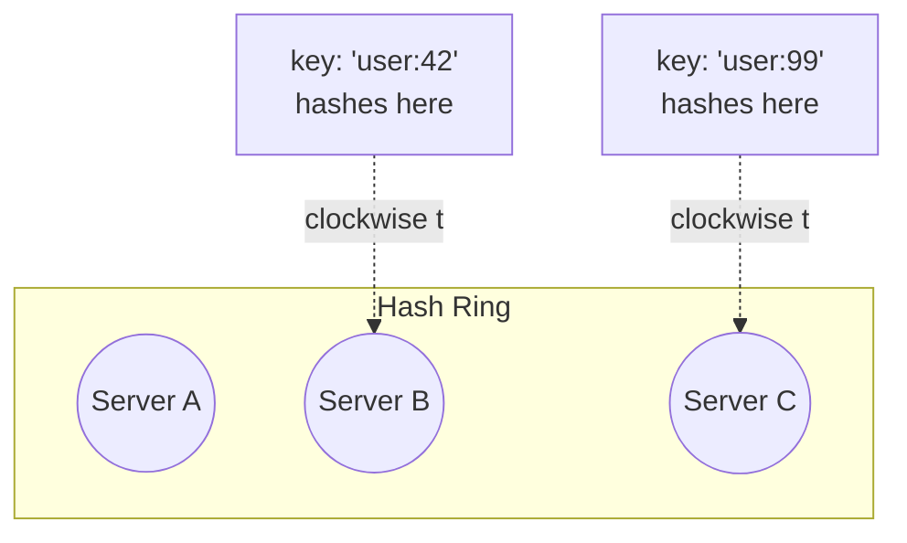
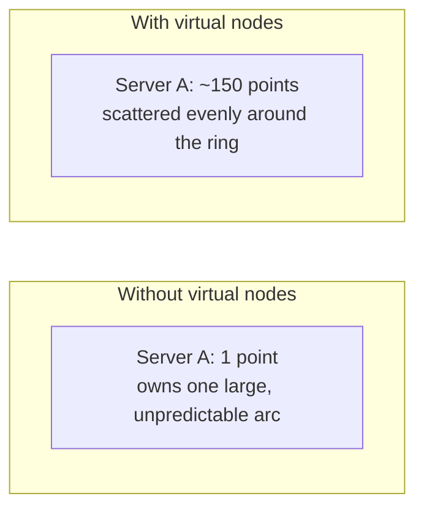
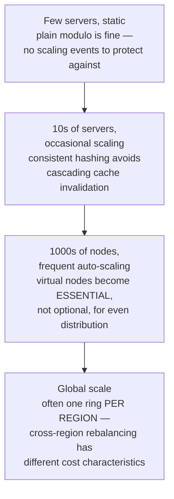

# Consistent Hashing

> [!abstract] What you'll be able to do after this chapter
> Quantify precisely *why* modulo hashing catastrophically fails on scaling events, draw the ring and virtual-node mechanics from memory, and contrast this against Redis Cluster's genuinely different hash-slot approach with precision.

> [!info] Referenced everywhere in this handbook
> This chapter delivers the full depth already promised by the [[Glossary/Consistent Hashing|glossary stub]] and used throughout [[HLD/03 - Design a Distributed Cache (build Redis)/Design a Distributed Cache|Distributed Cache]], [[CS Fundamentals/03 - Databases/Cassandra Internals|Cassandra Internals]], and [[HLD/01 - Design TinyURL (URL Shortener)/Design TinyURL|TinyURL]].

---

## 1. Why it exists — the failure of naive modulo hashing

`hash(key) % N` (`N` = number of servers) is the obvious first approach to sharding. It fails catastrophically the moment `N` changes: adding or removing **one** server changes the modulus for **every** key, remapping almost the entire keyspace to a different server at once — a massive, unnecessary cache-miss storm or data-reshuffling event triggered by a routine scaling operation.

> [!bug] Quantify this precisely — a strong depth signal
> Going from `N` to `N+1` servers under modulo hashing remaps **`(N/(N+1))` of all keys** — for `N=10`, that's over 90% of the entire keyspace, just from adding one server. Consistent hashing bounds this to roughly **`1/(N+1)`** of keys on average — a night-and-day difference, and worth stating with the actual fraction rather than just "it's better."

## 2. The mechanism — a ring, not a modulus

Hash **both keys and server identifiers** onto the same circular space (e.g. `0` to `2^32-1`). A key belongs to the **first server encountered going clockwise** from the key's position on the ring.

**Adding a server:** it claims a position on the ring; only keys between it and its counterclockwise neighbor (previously belonging to that neighbor) move — everything else is completely undisturbed. **Removing a server:** its keys move to its clockwise neighbor; again, nothing else is affected.

## 3. Virtual nodes — the refinement that makes this actually work well

With just **one** ring position per physical server, distribution can be quite **uneven** — especially with few servers, some can randomly end up owning much larger arcs of the ring than others purely by chance.

> [!tip] The fix, and why it also smooths rebalancing
> Give each physical server **many** points on the ring (commonly 100-200 **virtual nodes**), scattering its presence evenly. This dramatically smooths load distribution — and as a second benefit, it also smooths rebalancing: a newly-added server's virtual nodes are scattered around the ring, so it takes many **small** slices from many existing servers instead of one large slice from a single unlucky neighbor.

## 4. Real system usage

The original **Amazon Dynamo** paper introduced this technique; **Cassandra** uses it directly with vnodes (see [[CS Fundamentals/03 - Databases/Cassandra Internals|Cassandra Internals]]); **DynamoDB** is built on the same lineage. Load balancers use consistent hashing for **session affinity** (sticky sessions) without needing a shared session store at all — the same client repeatedly hashes to the same backend.

> [!warning] Redis Cluster does NOT use this — say this precisely if compared
> As covered in [[CS Fundamentals/04 - Caching/Redis Internals|Redis Internals]], Redis Cluster instead uses **16,384 fixed hash slots**, reassigned in whole-slot chunks — a related but genuinely **different** mechanism (discrete, fixed-count slots vs. a continuous ring with virtual nodes). Conflating the two in an interview is a real, catchable imprecision.

## 5. When it's not needed

A **small, static cluster that never scales** doesn't need this — the entire benefit of consistent hashing is handling **dynamic membership changes** gracefully; if `N` never changes, plain modulo hashing's catastrophic-remap cost never actually triggers, and the simpler approach is fine.

## 6. Replication via the ring — not just partitioning

> [!success] The mechanism that gives Dynamo/Cassandra BOTH partitioning and replication from one structure
> A key isn't just owned by the single node it hashes closest to clockwise — it's replicated to the next **R** *distinct physical* nodes walking clockwise from that point (skipping virtual nodes belonging to a server already in the replica set). This means the exact same ring mechanism that solves partitioning also solves replication placement, with zero additional coordination structure needed — worth naming explicitly, since it's easy to describe consistent hashing as purely a partitioning technique and miss that real systems get replication from it almost for free.

## 7. Scaling: 1 user to 1 billion

At small scale with a static server count, plain modulo hashing's catastrophic-remap cost simply never triggers, since nothing ever changes `N` — the simpler approach is genuinely fine. As scaling events become routine, consistent hashing's bounded-remap property starts mattering in practice, not just in theory. At very large scale (thousands of nodes with frequent auto-scaling), virtual nodes stop being a nice-to-have refinement and become load-bearing — without them, uneven distribution at that many topology changes per day would be a constant operational irritant. At true global scale, systems often maintain **separate rings per region** rather than one global ring, since cross-region data movement has fundamentally different (higher) cost characteristics than intra-region rebalancing.

## 8. Failure scenarios

> [!bug] What actually happens, and one genuinely elegant property
> - **A physical server crashes:** its virtual nodes' key ranges are automatically taken over by their clockwise neighbors — the ring mechanism itself handles this with **no special crash-detection logic** beyond ordinary ring-membership-change handling, since a crash and a graceful removal look structurally identical to the ring. This uniformity is a genuinely elegant property worth naming explicitly.
> - **Network partition splitting nodes' view of the ring:** different nodes may temporarily disagree about current ring membership — resolved via [[Glossary/Gossip Protocol|gossip protocol]] propagating membership changes until the cluster converges on a consistent view.
> - **A node rejoining after being down:** it needs to catch up on writes that happened to its key ranges while it was absent (typically via read-repair or hinted handoff mechanisms, covered in depth in [[CS Fundamentals/03 - Databases/Cassandra Internals|Cassandra Internals]]) before it can be fully trusted for reads again.

## 9. Monitoring

> [!info] What to watch
> **Key distribution skew** across nodes — confirms virtual nodes are actually achieving even distribution in practice, not just in theory. **Rebalancing data-movement volume** during scaling events — validates the bounded-remap property is holding (a scaling event moving far more data than the expected `~1/(N+1)` fraction signals a configuration problem, like too few virtual nodes). **Ring convergence time** after a membership change — how long until all nodes agree on the current ring state, directly tied to gossip protocol propagation speed.

## 10. Common mistakes

> [!warning] Real, recurring errors
> 1. **Too few virtual nodes** — poor load distribution, defeating the main reason virtual nodes exist. **Too many** — ring lookup and membership-change propagation overhead grows for diminishing distribution benefit past a reasonable point (100-200 is the commonly cited sweet spot for a reason).
> 2. **Forgetting replication when using consistent hashing for a genuine data store** — the ring alone gives partitioning, not fault tolerance; without explicitly replicating to the next R clockwise nodes (Section 6), a single node failure means genuine data loss for its key range, not just a rebalance.
> 3. **Conflating consistent hashing with Redis Cluster's hash-slot approach** — a related but genuinely different mechanism, covered in Section 4's warning callout.

---

## 🎯 Interview follow-up Q&A

> [!info] Leveled by seniority
> **Beginner:** "What problem does consistent hashing solve?" — avoiding the catastrophic remap that plain `hash(key) % N` causes when `N` changes. **Intermediate:** "Why do virtual nodes matter?" — Section 3, even distribution and smoother rebalancing. **Senior:** "How does consistent hashing give you replication, not just partitioning?" — Section 6, replicate to the next R distinct physical nodes clockwise. **Staff:** "Design a globally-distributed key-value store's partitioning scheme — would you use one ring or many?" — expects the Section 7 answer: per-region rings, with cross-region replication/routing handled as a separate concern layered on top, not one unified global ring. **Architect:** "A production cluster using consistent hashing is showing uneven load despite virtual nodes — how do you diagnose it?" — expects a systematic approach: check actual key distribution metrics first (is it a hashing-distribution problem or a genuine hot-key problem no amount of rebalancing fixes, per [[CS Fundamentals/06 - Distributed Systems/Sharding & Partitioning|Sharding & Partitioning]]'s hot-key discussion), rather than assuming more virtual nodes is automatically the fix.

> [!quote]- "Why does adding one server under naive modulo hashing remap almost everything?"
> Because the modulus itself changes — `hash(key) % N` becomes `hash(key) % (N+1)` for every key simultaneously, and there's no relationship between a key's old assigned server and its new one under a different modulus. Roughly `N/(N+1)` of all keys end up somewhere different.

> [!quote]- "What problem do virtual nodes solve that basic consistent hashing (one point per server) doesn't?"
> Uneven load distribution — with few ring points, some servers can randomly own disproportionately large arcs. Scattering each server across ~100-200 points averages this out, and as a side benefit, makes each rebalancing event spread thinly across many existing servers instead of concentrated on one unlucky neighbor.

> [!quote]- "How does Redis Cluster's approach differ from classic consistent hashing?"
> Redis Cluster uses a fixed 16,384-slot partitioning (`CRC16(key) mod 16384`), with resharding moving whole slots between nodes — a discrete, coarser-grained scheme, not a continuous ring with virtual nodes, even though both solve the same underlying "minimize remapping on topology change" problem.

---
*Related: [[00 - Start Here/How This Handbook Works|Book Map]] · [[CS Fundamentals/04 - Caching/Redis Internals|Redis Internals]] · [[CS Fundamentals/03 - Databases/Cassandra Internals|Cassandra Internals]] · [[HLD/03 - Design a Distributed Cache (build Redis)/Design a Distributed Cache|Design a Distributed Cache]]*
