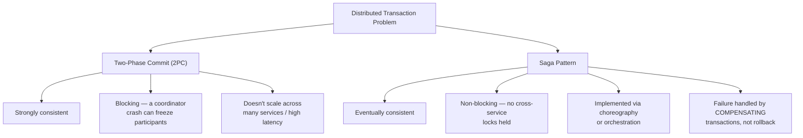
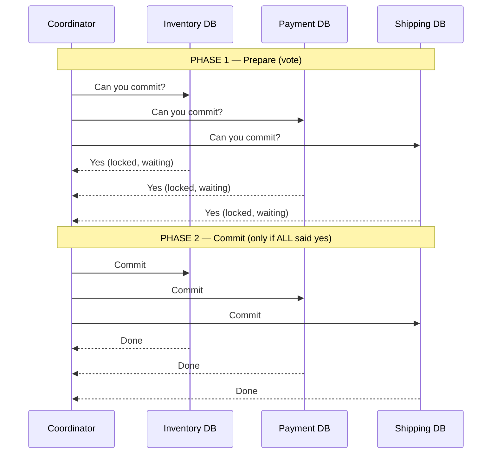
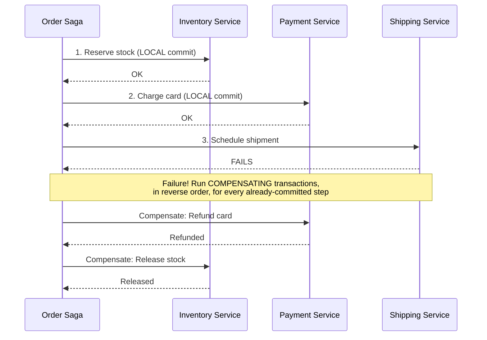
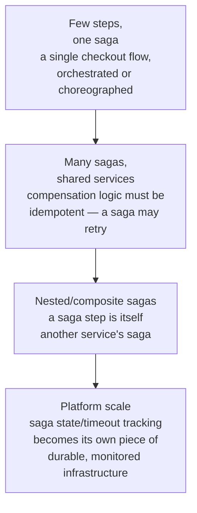

# Distributed Transactions: Saga Pattern & Two-Phase Commit

> [!abstract] What you'll be able to do after this chapter
> Explain exactly why 2PC blocks when its coordinator crashes, walk through a Saga's compensating-transaction cascade for a real multi-step business process, and state precisely why almost every large-scale distributed system chooses Saga over 2PC despite 2PC being strongly consistent.

> [!info] Distinct from Event-Driven Architecture's choreography/orchestration
> [[CS Fundamentals/07 - Architecture and Deployment Patterns/Event-Driven Architecture|The Event-Driven Architecture chapter]] already covers *how* a Saga is implemented — choreography (decentralized) or orchestration (a central coordinator). This chapter covers the *transaction-consistency problem* both 2PC and Saga are solving in the first place, and precisely why Saga's answer looks so different from a normal database transaction's ACID guarantees.

---

## The big picture

## What is it, and why does it exist?

A **distributed transaction** is an operation that must succeed or fail *atomically* across multiple independent databases or services — book a flight, book a hotel, and charge a card, where either all three happen or none of them do. A single database gives you this for free via ACID transactions. The moment the data lives in separate databases owned by separate services — exactly the [[CS Fundamentals/07 - Architecture and Deployment Patterns/Monolith vs Microservices|database-per-service reality microservices introduce]] — that free atomicity disappears, and something has to replace it.

**The problem this solves:** once inventory, payment, and shipping each own their own database, a checkout flow spanning all three can no longer rely on one local `COMMIT`/`ROLLBACK`. If the payment step fails after inventory has already been reserved, *something* has to notice and put inventory back — no database automatically knows about the other two. Two fundamentally different answers exist to this problem, with sharply different tradeoffs: **Two-Phase Commit**, which extends the all-or-nothing guarantee across services by holding locks until everyone agrees, and the **Saga Pattern**, which gives up strict atomicity in exchange for never holding a cross-service lock at all.

> [!example] Layman analogy
> Booking a vacation package (flight + hotel + car) through three separate, unrelated companies. **2PC** is like calling all three, asking each "can you hold this for me?", waiting for all three to say yes, and only then telling all three "confirm it" — if any one says no, you tell the others "never mind." Every company has to keep your reservation on hold, uncertain, until you get back to all of them. **Saga** is booking each one immediately, one at a time — and if the car rental fails after the flight and hotel are already booked, you call the airline and hotel back and explicitly *cancel* what you already confirmed, rather than never having confirmed it in the first place.

## Two-Phase Commit (2PC) — extending atomicity across services

A **coordinator** drives two phases. In the **Prepare** phase, it asks every participant "can you commit this?" — each participant does everything short of actually committing (validates the operation, acquires locks, writes to its own log) and replies yes or no, without yet making the change visible. Only if **every** participant votes yes does the coordinator send **Commit** to all of them in the second phase; if even one votes no, it sends **Abort** to all of them instead, and everyone rolls back.

> [!bug] The precise reason 2PC blocks — the central weakness, stated exactly
> Once a participant votes "yes" in the Prepare phase, it **must** hold its locks and wait — it cannot unilaterally decide to commit or abort on its own, since the coordinator might still tell every other participant to abort. If the coordinator crashes **after** collecting all the "yes" votes but **before** sending the final Commit/Abort decision, every participant is stuck holding its locks indefinitely, unable to safely proceed in either direction, until the coordinator recovers and tells them what was actually decided. This is 2PC's defining flaw: a single coordinator failure at exactly the wrong moment can freeze part of the system, with real locks held and real work blocked, for as long as that coordinator stays down.

2PC gives genuine strong consistency — at any point, the transaction is either fully committed everywhere or fully rolled back everywhere, never partially applied. The cost is exactly the blocking behavior above, plus the practical reality that every participant must hold locks for the full round-trip duration across every service involved — the more services and the higher the network latency between them, the longer locks are held, and the worse this scales. This is why 2PC is common *within* a single database engine's own internal distributed-commit machinery, but rare as the mechanism gluing together independently-owned microservices at real scale.

## The Saga Pattern — local transactions plus compensation

A Saga breaks one distributed transaction into a sequence of **local transactions**, each committed independently the moment it succeeds — no cross-service lock is ever held. Every step that changes state also defines a **compensating transaction**: an explicit action that semantically undoes it. If step 3 fails, the Saga doesn't roll back a still-open transaction (there isn't one) — it runs the compensations for every step that already committed, in reverse order, each one a *new*, independent local transaction in its own right.

> [!warning] Sagas are eventually consistent, not atomic — say this precisely
> Between step 1 committing and step 3 failing, the system is genuinely, visibly in a partial state — stock is reserved and the card is charged, but shipping hasn't happened yet. Anyone reading Inventory or Payment during that window sees real, committed data that will later be compensated away. This is a fundamentally different consistency model than 2PC's all-or-nothing atomicity, not a lesser version of it — and it's precisely why compensations must be designed as real, correct business operations (a genuine refund, a genuine stock release), not an afterthought.

> [!tip] Choreography vs. orchestration — already covered, cross-linked here
> A Saga can be driven by [[CS Fundamentals/07 - Architecture and Deployment Patterns/Event-Driven Architecture|choreography or orchestration]], precisely as that chapter defines them — each service reacting to the previous one's event, or a central coordinator explicitly calling each step and its compensation. Both are valid ways to *implement* the sequence-plus-compensation idea described here; neither is "the" Saga pattern by itself.

## 2PC vs. Saga — the precise comparison

| | Two-Phase Commit | Saga Pattern |
|---|---|---|
| **Consistency** | Strong — atomic across all participants | Eventual — a real, visible partial-state window exists |
| **Locking** | Holds cross-service locks for the full round trip | No cross-service locks — each local transaction commits immediately |
| **Failure behavior** | Coordinator crash mid-protocol can block participants indefinitely | A failed step triggers compensations for already-completed steps |
| **Scalability** | Poor — more participants and higher latency both directly increase lock-hold time | Good — no lock contention across services, scales with the number of independent local transactions |
| **Implementation complexity** | Conceptually simpler protocol, but needs real distributed-transaction infrastructure (XA) | Requires designing a correct compensating action for every step — genuine design effort |
| **Where it's actually used** | Rare across independently-owned microservices; more common inside a single database's internal replication/commit machinery | The default answer for cross-service transactions in modern microservice architectures |

## Where this shows up later

> [!success] Direct connections
> [[CS Fundamentals/07 - Architecture and Deployment Patterns/Event-Driven Architecture|Event-Driven Architecture]] — choreography and orchestration, the two ways to actually implement a Saga's sequence of steps. [[CS Fundamentals/07 - Architecture and Deployment Patterns/Monolith vs Microservices|Monolith vs. Microservices]] — this chapter is the direct answer to that chapter's "distributed data consistency is the single biggest new problem microservices introduces" point. [[HLD/23 - Design an E-commerce System/Design an E-commerce System|Design an E-commerce System]] — the checkout saga there is a full, applied, real implementation of exactly this pattern. [[CS Fundamentals/03 - Databases/ACID & Isolation Levels|ACID & Isolation Levels]] — the single-database atomicity guarantee this chapter's whole problem exists because you no longer have for free.

## Scaling: a handful of steps to a platform-wide saga mesh

> [!info] Why 2PC doesn't get a "scaling" story the way Saga does
> 2PC's fundamental blocking behavior gets *worse*, not better, as more participants or higher latency are added — there's no scaling path for it, which is exactly why the industry default at real scale is Saga, not "2PC, tuned better."

## Failure scenarios

> [!bug] What actually happens
> - **2PC's coordinator crashes between collecting votes and sending the final decision:** already covered above — every participant is stuck holding locks, unable to proceed, until the coordinator recovers (or a separate recovery protocol resolves the uncertainty) — a real, unbounded availability cost.
> - **A Saga's compensating transaction itself fails:** worse than the original failure — now the system is in a partial state *and* the attempted fix didn't work. Real Saga implementations need the compensation itself to be retried (with [[Glossary/Idempotency|idempotency]], since a retry might re-run a compensation that partially succeeded) rather than assumed to always work on the first try.
> - **A Saga step succeeds but its success acknowledgment is lost** (network failure after the actual write): the orchestrator or next choreography step may believe it failed and trigger compensation for a step that actually did succeed — the same at-least-once-delivery idempotency discipline from [[CS Fundamentals/07 - Architecture and Deployment Patterns/Event-Driven Architecture|Event-Driven Architecture]] applies directly here too.

## Monitoring

> [!info] What to watch
> **In-flight saga duration and stuck-saga count** — a saga that's been "in progress" far longer than normal is a direct signal something failed silently or a compensation is stuck retrying. **Compensation failure rate** — a nonzero, persistent rate here means the system is accumulating genuinely inconsistent state that isn't self-healing. **2PC lock-hold duration per transaction** (where 2PC is still used) — directly measures how much blocking risk each transaction is carrying, and how exposed the system is to a coordinator failure at any given moment.

## Common mistakes

> [!warning] Real, recurring errors
> 1. **Writing a compensating transaction that isn't actually idempotent** — the Failure Scenarios entry above; a compensation that gets retried and re-applies its effect twice (double-refunding, for instance) is a real, common bug.
> 2. **Reaching for 2PC by default because it "sounds more correct"** — the comparison table above; 2PC's strong consistency is real, but the blocking cost is usually far worse in practice for independently-owned services than the eventual-consistency window a Saga accepts.
> 3. **Treating a Saga's partial-state window as if it doesn't exist** — a naive read during that window sees real, uncompensated data; systems built on top of a Saga need to be aware of this window, not assume the process is invisible until fully complete.

---

## Interview Q&A

> [!info] Leveled by seniority
> **Beginner:** "What problem does the Saga pattern solve?" — keeping a business process consistent across multiple services' independent databases, without a single cross-service transaction. **Intermediate:** "Why does 2PC block, precisely?" — a participant that's voted "yes" must hold its locks until the coordinator's final decision; if the coordinator crashes in between, it's stuck indefinitely. **Senior:** "A saga's compensation for a failed step keeps failing — diagnose it and propose a fix." — expects recognizing this leaves the system in a genuinely inconsistent state, and proposing durable retry with idempotency plus alerting/escalation (a dead-letter-style path) rather than silently dropping the failed compensation. **Staff:** "Design the transaction strategy for a checkout flow spanning inventory, payment, and shipping, where payment is the step most likely to fail." — expects ordering the saga so the *least reversible or highest-cost-to-compensate* step happens last (payment charged only after inventory is confirmed reservable), minimizing how often an expensive compensation is actually needed. **Architect:** "Under what real circumstances would you actually choose 2PC over Saga for a new distributed system?" — expects a genuine, narrow answer: a small, fixed number of participants, all within the same low-latency network, with strong consistency being a hard business requirement outweighing the availability risk — the actual rare case 2PC's tradeoffs are still worth it for.

> [!question]- Why can't a Saga just "roll back" like a normal database transaction?
> There's no single transaction spanning all the services to roll back — each step already committed locally and independently the moment it succeeded. The only way to undo an already-committed local transaction in another service is to explicitly ask that service to reverse it via its own new operation — which is exactly what a compensating transaction is.

> [!question]- Is a Saga's compensation guaranteed to always succeed?
> No — and this is a real, structural weakness worth naming directly in an interview. If a compensation itself fails, the system needs a retry strategy (with idempotency) and, ultimately, a way to escalate an unresolvable failure to a human or a dead-letter-style process — a Saga's design has to account for "what if undoing this also doesn't work," not just "what if the original step fails."

> [!question]- Why is 2PC still used at all, if Saga is generally the better choice for microservices?
> 2PC gives strong, immediate atomicity with no partial-state window — a real requirement in some cases (certain financial settlement systems, for instance) where an application genuinely cannot tolerate even a brief, visible inconsistent state. It's also common *inside* a single distributed database's own internal commit protocol across its own replicas, a very different situation from gluing together independently-owned microservices over a real network.

## Summary / Cheat Sheet

- **The core problem:** database-per-service means no free cross-service atomicity — something has to replace what a single-database transaction gave you for free.
- **2PC** = strongly consistent, but **blocking** — a coordinator crash mid-protocol can freeze participants holding locks indefinitely. Doesn't scale well with more participants or higher latency.
- **Saga** = eventually consistent, **non-blocking** — a sequence of local transactions, each with a compensating "undo" action run in reverse order if a later step fails.
- Saga is implemented via **choreography** (decentralized) or **orchestration** (central coordinator) — see Event-Driven Architecture for the precise distinction.
- Compensating transactions must be **idempotent** — they can be retried, and a real Saga design must handle a compensation itself failing.
- The industry default at real microservices scale: **Saga**, not 2PC — 2PC's blocking cost usually outweighs its consistency benefit once services are independently owned and network latency is real.

---
*Related: [[CS Fundamentals/00 - Learning Path|CS Fundamentals Learning Path]] · [[CS Fundamentals/07 - Architecture and Deployment Patterns/Event-Driven Architecture|Event-Driven Architecture]] · [[CS Fundamentals/07 - Architecture and Deployment Patterns/Monolith vs Microservices|Monolith vs Microservices]] · [[CS Fundamentals/03 - Databases/ACID & Isolation Levels|ACID & Isolation Levels]] · [[HLD/23 - Design an E-commerce System/Design an E-commerce System|Design an E-commerce System]]*
