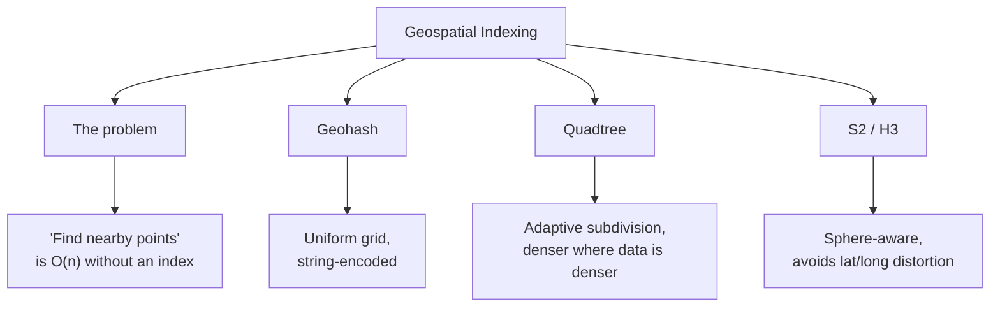
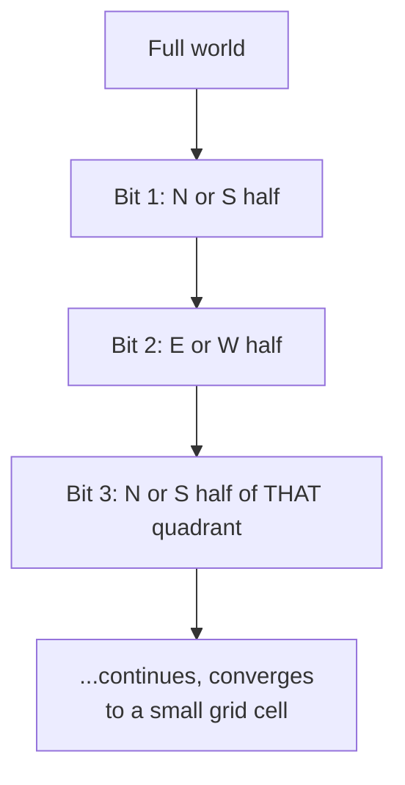
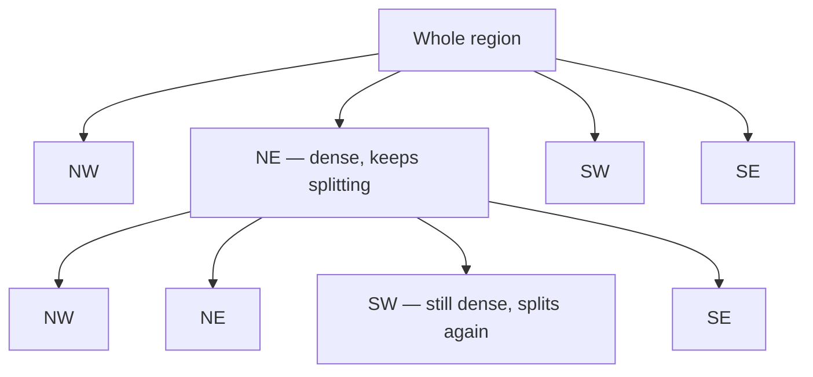
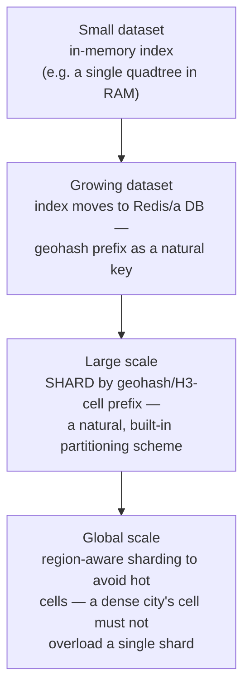

# Geospatial Indexing

> [!abstract] What you'll be able to do after this chapter
> Explain the geohash-vs-quadtree tradeoff precisely (uniform grid vs. density-adaptive subdivision, not two names for the same idea), name the boundary problem and why it's structural, and know why real production systems increasingly use sphere-aware indexes like S2/H3 instead of raw lat/long grids.

> [!info] The general theory behind two applied case studies
> [[HLD/10 - Design Uber/Design Uber|Design Uber]] and [[HLD/16 - Design a Food Delivery System/Design a Food Delivery System|Design a Food Delivery System]] both already walk through geohash vs. quadtree and the boundary problem concretely, applied to a specific system's numbers. This chapter is the general data-structure theory underneath those — read this first if the applied version moved too fast, or after if you want the theory generalized.

---

## The big picture

## What is it, and why does it exist?

Geospatial indexing structures location data (latitude/longitude pairs) so that "find everything within radius R of this point" is fast — sublinear in the number of points — instead of scanning every stored location and computing distance to each one.

**The problem this solves:** a naive proximity search (compute the distance from the query point to every stored point, keep the close ones) is `O(n)` per query — completely impractical once `n` is millions of drivers, restaurants, or points of interest, and a query needs to run continuously as locations update in real time. Geospatial indexes solve this the same way any index solves "find things near X" — by structuring the data so a query only has to examine a small, relevant subset, never the entire set.

> [!example] Layman analogy
> A library organized by subject and shelf location instead of by arrival date. Finding "all books about astronomy" in an arrival-date-ordered library means checking every single book; in a subject-organized library, you go straight to the astronomy shelf. Geospatial indexing organizes location data by *where it is*, so "what's near here" becomes a lookup in one small region instead of a scan of everything.

## Geohash — a uniform grid, string-encoded

> [!tip] The core idea
> A geohash interleaves the bits of a location's latitude and longitude, recursively halving the search space with each bit — north/south halves, then east/west halves, alternating — and encodes the resulting bit string in base32. The result: **a longer shared prefix between two geohashes means the two points are closer together**, and grouping/querying locations becomes grouping/querying by geohash-string prefix.

A location update becomes a write keyed by its current geohash; a proximity query becomes "look up this geohash prefix, plus its **neighboring** prefixes." Every cell at a given geohash length is the **same physical size**, regardless of how densely packed the actual data is in that region.

## Quadtree — adaptive subdivision

> [!tip] The core idea
> A quadtree recursively splits a region into four quadrants, but **only subdivides further where the data is actually dense** — a quadrant with few points stays large; a quadrant packed with points keeps splitting into smaller and smaller quadrants until each is sparse enough to search efficiently.

This is quadtree's genuine advantage over geohash for real-world, unevenly-distributed data: Manhattan and a rural highway have wildly different point densities, and a quadtree's resolution naturally adapts — fine-grained where points are packed, coarse where they're sparse — while geohash's fixed cell size at a given prefix length is either too coarse for the dense area or wastefully fine-grained everywhere else.

## The boundary problem — structural, not a bug to eliminate

> [!bug] Why an exact-cell match is never sufficient
> A point just across a cell's boundary can be physically **closer** to the query point than a point technically inside the same cell. Querying only the exact matching cell will miss it. The fix in both geohash and quadtree schemes is the same: always query the matching cell **plus its immediate neighbors**, never the exact cell alone — a structural requirement of any grid-based spatial index, not an edge case to special-case away. [[HLD/10 - Design Uber/Design Uber|The Uber chapter]] walks through this exact problem concretely, with a driver just outside a rider's geohash cell.

## S2 / H3 — sphere-aware indexing

> [!info] Why lat/long grids distort, and what fixes it
> Latitude/longitude is not a uniform coordinate system on a sphere — degrees of longitude represent a much smaller real-world distance near the poles than at the equator, meaning a "uniform" geohash grid is actually a *distorted* grid in real physical terms. **S2** (Google's library) and **H3** (Uber's own open-sourced library, developed specifically after running geohash/quadtree at Uber's actual scale) both index the sphere directly — S2 via a hierarchical decomposition of a cube projected onto the sphere, H3 via a hexagonal grid — avoiding the pole-distortion problem and, for H3 specifically, giving every cell a uniform number of equidistant neighbors (a hexagon has 6 neighbors, all genuinely adjacent; a square grid cell's diagonal neighbors are a different distance than its edge neighbors, a real, if subtle, correctness wrinkle geohash's square cells inherit).

## Comparison, precisely

| | Geohash | Quadtree | S2 / H3 |
|---|---|---|---|
| **Cell size** | Uniform at a given prefix length | Adaptive — denser where data is denser | Uniform (S2) or near-uniform (H3 hexagons) |
| **Sphere-aware** | No — lat/long distortion near poles | No, inherits whatever coordinate system it's built on | Yes — the entire point of both |
| **Neighbor queries** | Must handle boundary problem explicitly | Must handle boundary problem explicitly | H3's hexagons give uniform-distance neighbors, simplifying this |
| **Simplicity** | Simple to implement, string-prefix-based | More implementation complexity (tree structure, rebalancing) | Library-provided, not hand-rolled in practice |
| **Real users** | Widely used, simple systems | Density-skewed systems needing adaptive resolution | Uber (H3), Google (S2) at large scale |

## Where this shows up later

> [!success] Direct connections
> [[HLD/10 - Design Uber/Design Uber|Design Uber]] and [[HLD/16 - Design a Food Delivery System/Design a Food Delivery System|Design a Food Delivery System]] — both fully applied case studies, including the exact boundary-problem walkthrough this chapter names generally. [[CS Fundamentals/06 - Distributed Systems/Consistent Hashing|Consistent Hashing]] — a different hashing structure solving a different problem (routing, not proximity), worth contrasting directly.

## Scaling: in-memory index to globally-sharded

## Failure scenarios

> [!bug] What actually happens
> - **A dense area overloads a single cell/shard** ("hot cell"): a geohash's uniform cell size means a packed city center and an empty rural cell are treated identically for sharding purposes — a real, concrete argument for quadtree or H3's adaptive resolution at genuinely uneven-density scale.
> - **The boundary problem is missed** (querying only the exact cell): a real, physically-closer candidate is silently excluded from results — already covered above as a structural risk, not a rare edge case.
> - **Resolution/precision mismatch:** too coarse a cell size returns too many false candidates needing expensive distance filtering; too fine fragments a naturally-dense area into many small cells, multiplying the number of neighbor cells a single query must check.

## Monitoring

> [!info] What to watch
> **Cell/shard density distribution** — the direct signal for whether a hot-cell problem is developing before it becomes a real bottleneck. **Boundary-adjacent query rate** — how often a query result actually depends on a neighboring cell, not just the exact match; a very high rate can indicate the cell size is too coarse relative to typical query radius. **Candidate-set size per query, pre- and post-distance-filtering** — a large gap signals a lot of wasted work in the geospatial layer that the final distance filter throws away.

## Common mistakes

> [!warning] Real, recurring errors
> 1. **Querying only the exact matching cell, without adjacent cells** — the boundary problem above; the single most common correctness bug in a hand-rolled geospatial index.
> 2. **Using geohash for wildly uneven density without acknowledging the hot-cell tradeoff** — quadtree or H3 exist specifically to address this; picking geohash by default without considering density skew is a real, avoidable design gap.
> 3. **Treating straight-line proximity as the final ranking** instead of a first-pass candidate filter — per the Uber chapter's own deep dive, real road distance/ETA, not straight-line distance, determines the actual best match.

---

## Interview Q&A

> [!info] Leveled by seniority
> **Beginner:** "What problem does geospatial indexing solve?" — making "find nearby points" sublinear instead of scanning every stored location. **Intermediate:** "What's the real difference between geohash and quadtree?" — geohash is a uniform grid; quadtree adapts its resolution to actual data density — a genuine tradeoff, not two names for the same structure. **Senior:** "A ride-hailing system's driver-matching queries are slow specifically in the downtown core but fine everywhere else — diagnose it." — expects recognizing this as the hot-cell problem from uneven density, and proposing quadtree or H3's adaptive resolution as the structural fix, not just "add more servers" to the same fixed-size-cell scheme. **Staff:** "Design the geospatial index for a food-delivery platform spanning dense cities and sparse suburbs simultaneously." — expects quadtree or H3 specifically because of the density variance, with sharding aligned to the adaptive cell structure rather than a uniform geohash-prefix shard scheme that would create hot shards in dense areas. **Architect:** "Why have production systems like Uber moved away from geohash/quadtree toward custom systems like H3?" — expects naming the sphere-distortion problem precisely (lat/long isn't uniform on a sphere) and H3's uniform-neighbor-distance hexagonal grid as a genuine, measurable improvement at global scale, not just a rewrite for its own sake.

> [!question]- Why must a proximity query always check neighboring cells, not just the exact match?
> A point can be geographically closer to the query point while falling in an adjacent cell purely due to where the grid lines happen to fall — the boundary problem, structural to any grid-based spatial index. Skipping neighbor cells silently drops legitimately closer candidates from the result.

> [!question]- Why doesn't quadtree also suffer from the sphere-distortion problem S2/H3 solve?
> It can — a quadtree built directly on raw lat/long coordinates inherits the same distortion, since the distortion comes from the coordinate system, not the indexing structure built on top of it. S2 and H3 solve this by indexing a genuinely sphere-aware representation underneath, something a quadtree could theoretically also be built on top of, but rarely is in practice compared to purpose-built libraries.

## Summary / Cheat Sheet

- **The problem:** naive proximity search is `O(n)` per query — geospatial indexing makes it sublinear by structuring data by location.
- **Geohash:** uniform grid, string-prefix-encoded, simple, but fixed cell size regardless of actual density.
- **Quadtree:** adaptive subdivision, denser resolution where data is denser — the real fix for uneven density.
- **S2 / H3:** sphere-aware, avoiding lat/long distortion near the poles; H3's hexagons additionally give uniform-distance neighbors.
- **The boundary problem** is structural — always query the matching cell **plus neighbors**, never the exact match alone.
- Geospatial index results are a **candidate set** (straight-line proximity) — real systems layer routing/ETA on top before final ranking.

---
*Related: [[CS Fundamentals/00 - Learning Path|CS Fundamentals Learning Path]] · [[HLD/10 - Design Uber/Design Uber|Design Uber]] · [[HLD/16 - Design a Food Delivery System/Design a Food Delivery System|Design a Food Delivery System]] · [[CS Fundamentals/06 - Distributed Systems/Consistent Hashing|Consistent Hashing]]*
