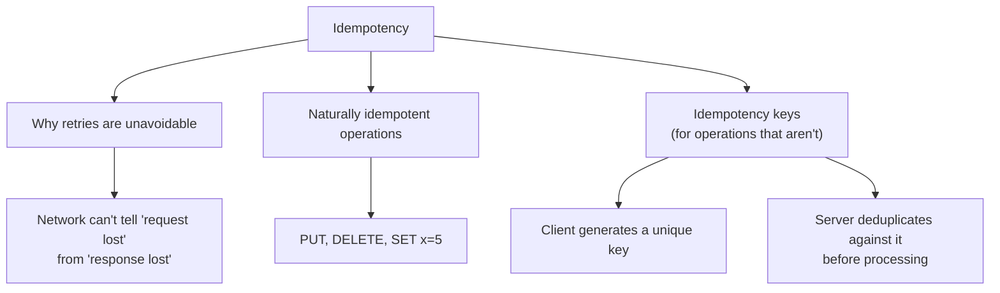
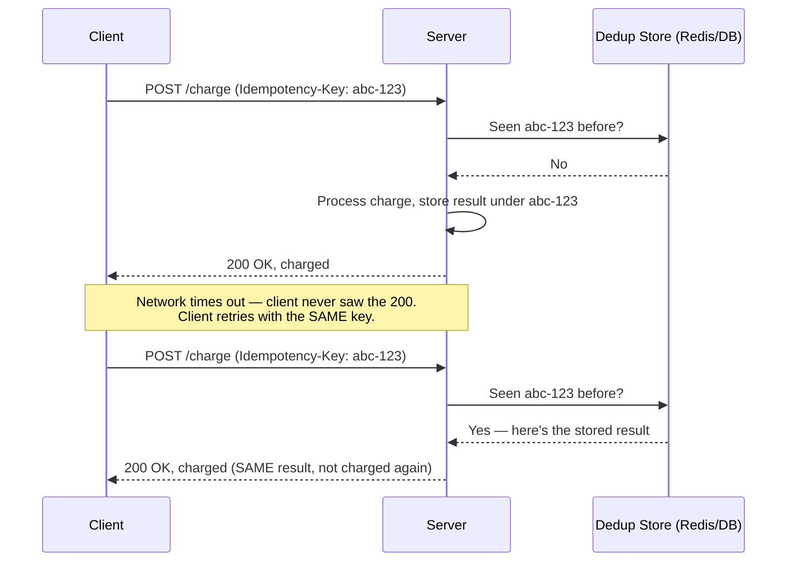
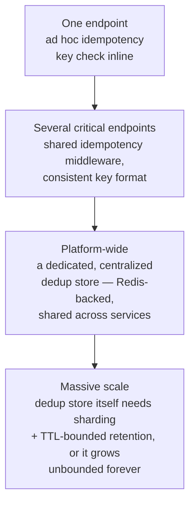

# Idempotency

> [!abstract] What you'll be able to do after this chapter
> Explain precisely why retries are unavoidable in any distributed system (not a design flaw to eliminate), design an idempotency-key mechanism that makes a retried payment safe, and name the exact race condition a naive implementation misses.

> [!info] The primitive underneath three other chapters
> [[CS Fundamentals/06 - Distributed Systems/Resilience Patterns|Resilience Patterns]] recommends retrying failed calls. [[CS Fundamentals/06 - Distributed Systems/Distributed Transactions - Saga Pattern and Two-Phase Commit|Saga's compensating transactions]] can themselves need retrying. [[CS Fundamentals/07 - Architecture and Deployment Patterns/Event-Driven Architecture|Event-driven consumers]] get at-least-once delivery from their broker. All three *require* idempotency to be safe — this chapter is that one required property, taught once, in full.

---

## The big picture

## What is it, and why does it exist?

An operation is **idempotent** if performing it multiple times produces the exact same result as performing it once. `SET x = 5` is idempotent — running it five times leaves `x` at `5`. `x = x + 1` is not — running it five times gives a different answer than running it once.

**The problem this solves:** in a distributed system, a client that sends a request and doesn't receive a response genuinely cannot tell whether the request never arrived, arrived but the server crashed before responding, or arrived, succeeded, and only the *response* was lost in transit. All three look identical from the client's side — a timeout. The only safe general strategy is to **retry** — but retrying a non-idempotent operation (`POST /charge {amount: 500}`) after a timeout risks charging the customer twice if the original request actually did succeed. Idempotency is what makes retrying safe by default, rather than something to reason about case by case.

> [!example] Layman analogy
> An elevator call button that's already lit. Pressing it again doesn't summon a second elevator — the system recognizes the request is already in flight and simply doesn't duplicate the effect. Idempotency is building that same recognition into an API: pressing "charge the card" twice with the same request identity has the same effect as pressing it once.

## Naturally idempotent vs. requires an explicit key

> [!info] HTTP's own idempotency contract — and where it quietly breaks in practice
> By specification, `GET`, `PUT`, `DELETE`, `HEAD`, `OPTIONS` are idempotent; `POST` and `PATCH` are not. In practice, this contract is easy to violate without the framework ever telling you: a `PUT` that *appends* to a list instead of replacing it is **not actually idempotent**, despite using the "idempotent" verb — the verb is a convention the implementation has to genuinely honor, not a guarantee enforced for you.

For operations that are inherently non-idempotent — `POST /charge`, `POST /orders` — the standard fix is an explicit **idempotency key**.

## The idempotency key mechanism, precisely

The client generates a unique key (a UUID, typically) **once**, before the first attempt, and reuses the exact same key on every retry of that logical operation. The server maintains a **dedup store** — checked before processing begins: if the key has been seen, the server returns the *original* stored result immediately, without re-executing the underlying operation at all.

> [!bug] The race condition a naive implementation misses
> If two requests carrying the **same key** arrive concurrently — a genuine double-click, or a client retrying slightly too early, before the first attempt has finished — a naive "check store, then process, then write to store" sequence has a gap: both requests can pass the "have I seen this key" check before either has written its result, and both proceed to charge the card. The fix: the check-and-reserve step must be a single **atomic** operation (`SETNX` in Redis, or an `INSERT ... ON CONFLICT` in a relational database) that claims the key *before* processing starts — a second concurrent request sees the key already claimed and either waits for the first to finish or is rejected outright, never proceeding to execute the operation itself.

## Where idempotency keys actually come from

The idempotency key doesn't have to be a purpose-built UUID — several already-covered chapters produce something that doubles as one. A [[LLD/20 - Design a Distributed ID Generator/Design a Distributed ID Generator|distributed ID generator's]] generated ID, a Kafka message's own offset plus partition, or a client-generated request UUID attached at creation time are all valid idempotency keys — the requirement is only that the *same* logical request always carries the *same* key across every retry attempt.

## Tradeoffs

Idempotency keys add real storage overhead — every processed request's key and result need to be retained for at least as long as a client might plausibly retry, and that store needs to be durable and, at scale, itself replicated. They also add a small amount of latency to every request (the dedup-store check), a real, worthwhile cost given what it prevents.

## Where this shows up later

> [!success] Direct connections
> [[CS Fundamentals/06 - Distributed Systems/Resilience Patterns|Resilience Patterns]] — retries are only safe to automate because of idempotency; this chapter is the property that claim depends on. [[CS Fundamentals/06 - Distributed Systems/Distributed Transactions - Saga Pattern and Two-Phase Commit|Distributed Transactions]] — a Saga's compensating transactions need to be idempotent, since a compensation can itself be retried after a failure. [[CS Fundamentals/07 - Architecture and Deployment Patterns/Event-Driven Architecture|Event-Driven Architecture]] — brokers generally guarantee at-least-once delivery, never exactly-once, making idempotent consumers required, not optional. [[HLD/17 - Design a Payment System/Design a Payment System|Design a Payment System]] — the applied, highest-stakes case study for exactly this mechanism.

## Scaling: one endpoint to a platform-wide dedup layer

## Failure scenarios

> [!bug] What actually happens
> - **Two concurrent requests race on the same key before the first completes:** the exact scenario the atomic check-and-reserve mechanism above exists to prevent — without it, both proceed and the operation executes twice.
> - **The idempotency key's TTL expires before a legitimately delayed retry arrives:** a retry that shows up just after expiry is treated as brand-new and re-executed — a real tuning tradeoff between dedup-store size (short TTL) and safety margin for slow, legitimate retries (long TTL).
> - **The dedup store itself becomes unavailable:** the system must make an explicit choice — **fail closed** (reject the request rather than risk a duplicate, safer but reduces availability) or **fail open** (process anyway, risking a duplicate) — a real, deliberate design decision, not a default either way.

## Monitoring

> [!info] What to watch
> **Duplicate-request rate** (requests where the key was already seen) — a direct signal of how often retries are actually happening, useful both for capacity planning and as an early signal of upstream network instability. **Dedup-store hit latency** — since this check sits on the critical path of every idempotent-key-protected request. **Near-TTL-expiry retry rate** — retries arriving close to the TTL boundary are the population most at risk of the TTL failure scenario above; tracking this informs whether the TTL is tuned correctly.

## Common mistakes

> [!warning] Real, recurring errors
> 1. **Assuming an HTTP verb's spec-level idempotency guarantees the implementation is actually idempotent** — the HTTP contract section above; the framework never verifies this for you.
> 2. **No atomic check-and-reserve step**, allowing the concurrent-request race condition above.
> 3. **Setting the idempotency-key TTL too short** relative to realistic client retry/backoff windows, causing legitimate retries to be treated as new requests.

---

## Interview Q&A

> [!info] Leveled by seniority
> **Beginner:** "What does it mean for an operation to be idempotent?" — running it multiple times has the exact same effect as running it once. **Intermediate:** "Why are `GET` and `PUT` idempotent by spec but `POST` isn't?" — `PUT` replaces a resource wholesale (repeating it lands on the same end state); `POST` typically creates a new resource each time by design, so repeating it naturally creates duplicates. **Senior:** "A payment consumer crashed mid-processing and restarted — did the customer get charged twice?" — expects the correct framing: the answer is "no, because the write is idempotent via a dedup key," never "we made sure it never crashes," since crashes are assumed, not prevented. **Staff:** "Design the idempotency-key mechanism for a payments API expected to handle bursts of concurrent retries from flaky mobile clients." — expects an atomic check-and-reserve step (not check-then-process), a TTL long enough to cover mobile clients' realistic retry/backoff windows, and an explicit fail-open-vs-fail-closed decision for when the dedup store itself is unavailable. **Architect:** "How would you decide the idempotency-key TTL and dedup-store retention policy for a platform-wide shared service?" — expects balancing storage growth (an unbounded store is untenable at scale) against the real risk of a legitimate, slow retry arriving just after expiry — a genuine, quantifiable tradeoff, not a default value picked without reasoning.

> [!question]- Why can't the server just detect duplicates by comparing request contents instead of requiring an explicit key?
> Two genuinely different requests can have identical contents (two separate $10 charges to the same card, placed independently, moments apart) — content alone can't distinguish "this is a retry of an earlier request" from "this is a new, coincidentally identical request." An explicit key, generated once per logical operation and reused only on retries, is the only reliable signal of *intent* to retry versus a new request.

> [!question]- Is idempotency the same thing as exactly-once delivery?
> No — a real, common point of confusion. Message brokers generally cannot guarantee exactly-once *delivery* (a message might be delivered twice due to network retries or consumer-side ack timing). Idempotency achieves the *practical equivalent* — exactly-once *processing* — by making a duplicate delivery harmless, rather than by preventing the duplicate delivery from ever happening in the first place.

## Summary / Cheat Sheet

- **Idempotent** = doing it N times has the same effect as doing it once. Required because a distributed system can't reliably tell "request lost" from "response lost," making retries unavoidable.
- **Naturally idempotent:** `PUT`, `DELETE`, `SET x=5`. **Not naturally idempotent:** `POST /charge`, anything additive.
- **Idempotency key mechanism:** client generates a key once, reuses it on every retry; server atomically checks-and-reserves the key before processing, returning the stored result on any repeat.
- **The race condition to get right:** check-and-reserve must be atomic, or concurrent same-key requests can both slip through before either finishes.
- Real tradeoffs: dedup-store storage/TTL sizing, and an explicit fail-open vs. fail-closed decision if the dedup store itself goes down.

---
*Related: [[CS Fundamentals/00 - Learning Path|CS Fundamentals Learning Path]] · [[CS Fundamentals/06 - Distributed Systems/Resilience Patterns|Resilience Patterns]] · [[CS Fundamentals/06 - Distributed Systems/Distributed Transactions - Saga Pattern and Two-Phase Commit|Distributed Transactions: Saga Pattern & Two-Phase Commit]] · [[CS Fundamentals/07 - Architecture and Deployment Patterns/Event-Driven Architecture|Event-Driven Architecture]] · [[HLD/17 - Design a Payment System/Design a Payment System|Design a Payment System]]*
