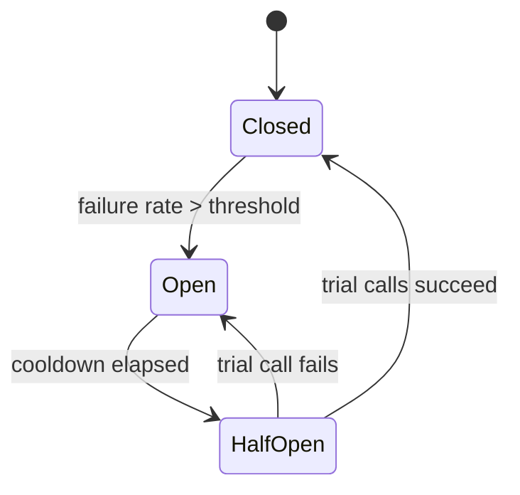
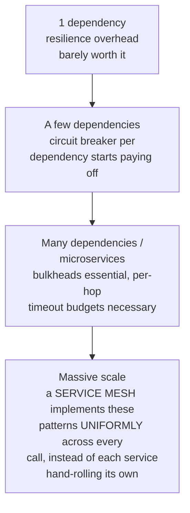

# Resilience Patterns (Circuit Breaker, Retry, Bulkhead)

> [!abstract] What you'll be able to do after this chapter
> Implement a real circuit breaker with correct half-open probing, explain precisely why naive retry causes cascading outages, and design timeout budgets across a multi-hop call chain instead of copy-pasting one timeout everywhere.

---

## Why this exists

Every chapter in this book has services calling other services. Any one of those calls can be slow or fail. Without deliberate handling, one struggling dependency doesn't just degrade — it can **cascade**: threads pile up waiting on a slow call, exhausting the caller's own capacity, which then makes the caller slow for *its* callers, and the failure spreads backward through the whole call graph. These four patterns exist specifically to stop that spread.

## Circuit Breaker — fail fast instead of piling up

A circuit breaker wraps a call to a dependency and tracks its recent failure rate. Three states:

- **Closed** — normal operation, calls pass through, failures are counted.
- **Open** — failure rate crossed a threshold; calls **fail immediately** without even attempting the dependency, for a cooldown period.
- **Half-Open** — after the cooldown, a small number of trial calls are let through to test if the dependency recovered.



> [!tip] Why "fail fast" is a genuine improvement, not just giving up
> Without a breaker, every caller keeps retrying a dying dependency at full volume, each attempt still paying the full timeout before failing — piling up latency and holding resources (threads, connections) the whole time. An **open** breaker fails in microseconds instead, freeing the caller to degrade gracefully (return cached data, a fallback response, or a fast error) instead of hanging. It protects both the caller's own resources *and* gives the struggling dependency room to recover instead of being hit at full load while already failing.

```go
// FILE: circuit_breaker.go
package resilience

import (
    "errors"
    "sync"
    "time"
)

type State int

const (
    Closed State = iota
    Open
    HalfOpen
)

var ErrCircuitOpen = errors.New("circuit breaker is open")

type CircuitBreaker struct {
    mu               sync.Mutex
    state            State
    failureThreshold int
    consecutiveFails int
    cooldown         time.Duration
    openedAt         time.Time
}

func NewCircuitBreaker(failureThreshold int, cooldown time.Duration) *CircuitBreaker {
    return &CircuitBreaker{failureThreshold: failureThreshold, cooldown: cooldown}
}

// Execute runs fn through the breaker — the caller never needs to
// know which state the breaker is in, only whether the call ran.
func (cb *CircuitBreaker) Execute(fn func() error) error {
    if !cb.allowRequest() {
        return ErrCircuitOpen
    }

    err := fn()
    cb.recordResult(err)
    return err
}

func (cb *CircuitBreaker) allowRequest() bool {
    cb.mu.Lock()
    defer cb.mu.Unlock()

    switch cb.state {
    case Open:
        if time.Since(cb.openedAt) >= cb.cooldown {
            cb.state = HalfOpen // cooldown elapsed — allow ONE trial call through
            return true
        }
        return false
    default: // Closed or HalfOpen both allow the call
        return true
    }
}

func (cb *CircuitBreaker) recordResult(err error) {
    cb.mu.Lock()
    defer cb.mu.Unlock()

    if err == nil {
        // A successful call in HalfOpen proves recovery — close fully.
        // A successful call in Closed just resets the failure streak.
        cb.consecutiveFails = 0
        cb.state = Closed
        return
    }

    cb.consecutiveFails++
    if cb.state == HalfOpen {
        // The trial call failed — the dependency hasn't recovered.
        // Reopen immediately rather than accumulating more failures.
        cb.state = Open
        cb.openedAt = time.Now()
        return
    }
    if cb.consecutiveFails >= cb.failureThreshold {
        cb.state = Open
        cb.openedAt = time.Now()
    }
}
```

## Retry with exponential backoff and jitter

> [!bug] Naive immediate retry is a self-inflicted thundering herd
> If a dependency is struggling and every caller retries immediately on failure, the retry traffic *adds to* the load on an already-overloaded system — making recovery slower or impossible. Worse: if many callers all back off by the *same* fixed delay, they all retry **simultaneously** again, recreating the exact same spike on a delay.

The fix is exponential backoff (`delay = base * 2^attempt`) **plus jitter** — randomizing the actual delay within a range so retries from different callers spread out instead of syncing up:

```go
// FILE: retry.go
package resilience

import (
    "math/rand"
    "time"
)

// RetryWithBackoff retries fn up to maxAttempts times, waiting an
// exponentially growing, randomized ("full jitter") delay between
// attempts — the randomization is what prevents every caller's
// retries from re-synchronizing into another simultaneous spike.
func RetryWithBackoff(maxAttempts int, baseDelay time.Duration, fn func() error) error {
    var err error
    for attempt := 0; attempt < maxAttempts; attempt++ {
        if err = fn(); err == nil {
            return nil
        }
        if attempt == maxAttempts-1 {
            break
        }
        maxDelay := baseDelay * time.Duration(1<<attempt) // base * 2^attempt
        jittered := time.Duration(rand.Int63n(int64(maxDelay)))
        time.Sleep(jittered)
    }
    return err
}
```

## Bulkhead — isolating failure domains within one process

Named after ship bulkheads that stop one flooded compartment from sinking the whole vessel: allocate **separate resource pools** (thread pools, connection pools, semaphores) per dependency, so a slow or exhausted call to Dependency A can't starve the resources needed to call Dependency B.

> [!warning] Without a bulkhead, a single dependency can take down calls to unrelated dependencies
> A shared thread pool of 100 workers serving five different downstream calls means one dependency hanging can occupy all 100 workers — even calls to the other four, perfectly healthy dependencies now have no workers left to run on. A bulkhead (say, 20 workers reserved per dependency) means Dependency A hanging can cost at most its own 20 workers — the other four keep working normally.

## Timeout budgets across a call chain

A single request touching Service A → B → C needs a **total** time budget, allocated across hops — not the same fixed timeout copy-pasted at every hop.

> [!bug] The compounding-timeout bug
> If A calls B with a 5s timeout, and B calls C with its *own* 5s timeout, A can end up waiting far longer than 5s in the worst case if B's internal retry/timeout logic runs before B itself gives up and returns to A. The fix: propagate a **deadline**, not a fixed duration, down the call chain (Go's `context.WithDeadline` is exactly this) — each hop computes its *remaining* budget from the shared deadline, so the total end-to-end time is bounded no matter how many hops are involved.

## Scaling: 1 dependency to a full service mesh



At large scale with many services, hand-implementing circuit breakers, retries, and bulkheads independently in every service becomes real duplicated effort and inconsistency risk — a service mesh (Istio/Envoy sidecars, the east-west traffic layer from [[CS Fundamentals/02 - Networking/API Gateway|the API Gateway chapter]]) applies these patterns uniformly at the infrastructure layer, so individual services don't need to reimplement them correctly each time.

## Failure scenarios

> [!bug] What actually happens, beyond a hard failure
> - **A dependency degrades gradually rather than failing outright:** genuinely harder to detect than a clean failure — this is exactly why a circuit breaker tracks a **failure rate** over a window, not a simple binary up/down signal, catching creeping degradation before it becomes a full outage.
> - **The circuit breaker itself is misconfigured:** too sensitive a threshold trips on normal transient blips (false positives, unnecessarily degrading availability); too lax a threshold fails to protect in time (the breaker exists but doesn't actually help) — real tuning work, not a set-once configuration.
> - **A retry storm during a widespread outage:** even with jitter, if *every* service across a large system simultaneously starts retrying a shared dependency the moment it shows signs of recovery, the aggregate retry volume itself can re-crash it — a harder, system-wide version of the thundering-herd problem that sometimes needs coordinated backoff or rate limiting layered on top of per-caller jitter, not just jitter alone.

## Monitoring

> [!info] What to watch
> **Circuit breaker state transitions** (Closed→Open events) — a direct, real-time dependency-health signal, often faster to notice than aggregate error-rate dashboards. **Retry rate and success-after-retry rate** — distinguishes "retries are helping" from "retries are just adding load to an already-struggling dependency." **Per-bulkhead resource utilization** — confirms dependency-specific pools are actually isolating load as designed, not silently sharing capacity somewhere upstream.

## Common mistakes

> [!warning] Real, recurring errors
> 1. **Using default circuit-breaker thresholds without tuning to the actual dependency's failure characteristics** — a dependency with naturally spiky, brief error bursts needs a different threshold than one with a slow, steady degradation pattern.
> 2. **Retrying non-idempotent operations without an idempotency key** — reintroduces the exact duplicate-side-effect risk [[Glossary/Idempotency|Idempotency]] and [[HLD/17 - Design a Payment System/Design a Payment System|the Payment System chapter]] already cover in depth.
> 3. **Sharing one resource pool across all dependencies** — the exact motivation for bulkheads in the first place; skipping this reintroduces the single-dependency-starves-everything failure mode.

---

## Interview Q&A

> [!info] Leveled by seniority
> **Beginner:** "What does a circuit breaker do?" — stops calling a failing dependency after too many failures, failing fast instead of piling up timeouts. **Intermediate:** "Why does retry need jitter, not just exponential backoff?" — prevents synchronized retry waves from every caller re-hitting the dependency simultaneously. **Senior:** "A dependency recovered from an outage, but immediately went down again under the recovery traffic — diagnose it." — expects recognizing a retry-storm pattern (Failure Scenarios above), not assuming the dependency's fix didn't work. **Staff:** "Design the resilience strategy for a service with 15 downstream dependencies of varying criticality." — expects differentiated treatment: aggressive circuit breaking and generous bulkheads for non-critical dependencies (fail fast, degrade gracefully), more conservative handling for dependencies the request genuinely cannot succeed without. **Architect:** "How would you decide whether to hand-implement resilience patterns per-service versus adopting a service mesh?" — expects a real tradeoff: mesh adoption cost and operational complexity vs. consistency and reduced duplicated effort across many services — the right call shifting decisively toward mesh as service count grows, per the Scaling section.

> [!question]- How do these four patterns compose together in one call?
> Wrap the call in a circuit breaker (fail fast if the dependency is known-bad); inside that, retry with backoff+jitter for transient failures while the breaker is closed; the call itself runs against a bulkheaded resource pool scoped to that specific dependency; and the whole thing respects a deadline propagated from the original request, not a locally-invented timeout. Layering all four is standard in production resilience libraries (e.g. Netflix's Hystrix, or Go's `sony/gobreaker` + context deadlines).

> [!question]- Why does the circuit breaker only allow ONE trial call in half-open, not several?
> If several trial calls went through simultaneously while the dependency is still actually down, all of them would fail and pile up load again — precisely what the breaker exists to prevent. A single trial call gets a clean, low-risk answer to "has it recovered?" before committing to a full reopen.

> [!question]- Where in this book's earlier chapters would a circuit breaker have mattered?
> [[HLD/23 - Design an E-commerce System/Design an E-commerce System|The E-commerce checkout saga]]'s call to the payment service — if the payment provider is down, retrying every checkout attempt against it at full volume both wastes the caller's resources and makes the payment provider's own recovery harder. A circuit breaker there fails fast and lets the saga's compensating logic trigger immediately instead of hanging.

---
*Related: [[00 - Start Here/How This Handbook Works|Book Map]] · [[Glossary/Circuit Breaker|Circuit Breaker (glossary)]] · [[Glossary/Backpressure|Backpressure]] · [[HLD/23 - Design an E-commerce System/Design an E-commerce System|Design an E-commerce System]]*
