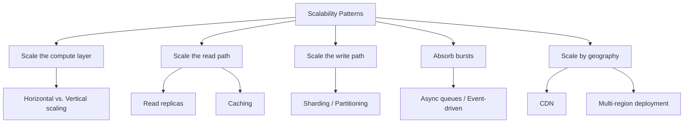
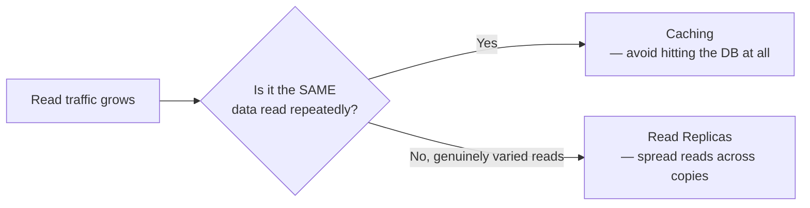
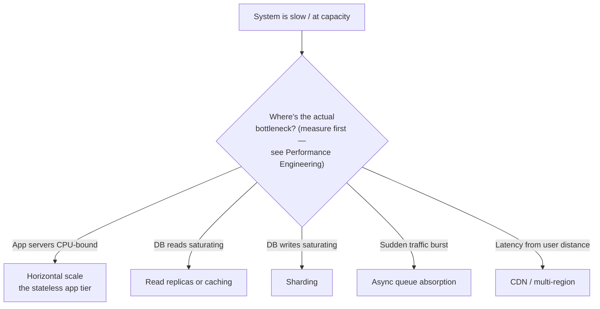

# Scalability Patterns

> [!abstract] What you'll be able to do after this chapter
> Name every real scaling lever this handbook uses, in one place, and know which layer of a system each one actually targets — instead of "add more servers" as an undifferentiated catch-all answer.

> [!info] A consolidation, not new material
> Every technique in this chapter already has a full, deep treatment elsewhere in this handbook. This chapter's value is being the **single, named reference** tying them together — exactly the gap between "I know these individual techniques" and "I can reason about which one actually applies to a given bottleneck."

---

## The big picture

## Horizontal vs. vertical scaling — the foundational choice

> [!info] Already covered precisely
> [[00 - Start Here/100 System Design Interview Questions|The 100-questions file]] states this distinction exactly: vertical scaling (bigger machine) is simpler with zero data-distribution complexity but hits a hard ceiling and stays a single point of failure; horizontal scaling (more machines) has no ceiling and gives redundancy for free, but requires the system to be designed for distribution — stateless services, partitioned data — from the start.

Every other pattern in this chapter is really a specific instance of "how do I scale horizontally for this particular layer or access pattern."

## Scaling the read path

- **Read replicas:** copies of the primary database that serve read traffic, offloading it from the single primary — the direct database-layer instance of horizontal scaling. Full mechanics of the consistency tradeoff this introduces (replica lag) are in [[CS Fundamentals/03 - Databases/ACID & Isolation Levels|ACID & Isolation Levels]] and [[CS Fundamentals/06 - Distributed Systems/CAP Theorem & PACELC|CAP Theorem & PACELC]].
- **Caching:** for data read far more often than it changes, skip the database entirely for most reads. Full depth in [[CS Fundamentals/04 - Caching/Caching Strategies|Caching Strategies]], [[CS Fundamentals/04 - Caching/Redis Internals|Redis Internals]], and [[CS Fundamentals/02 - Networking/CDN Internals|CDN Internals]] for geographically-distributed static content specifically.

## Scaling the write path

Writes are structurally harder to scale than reads — every write eventually needs to land somewhere consistent. The primary lever: **sharding/partitioning** — splitting data across multiple independent primaries by key, so no single node absorbs all write traffic. Full mechanics (range vs. hash vs. directory-based sharding, the hot-shard problem, resharding without downtime) are in [[CS Fundamentals/06 - Distributed Systems/Sharding & Partitioning|Sharding & Partitioning]] — this chapter doesn't re-derive that, it just names sharding as *the* write-scaling lever, distinct from every read-scaling lever above.

## Absorbing bursts: async decoupling

> [!tip] Direct reuse of Event-Driven Architecture
> Instead of scaling to handle a traffic spike synchronously in real time, **absorb** it — accept work into a durable queue faster than it's processed, and let consumers work through the backlog at a sustainable pace rather than the system needing to instantly match peak arrival rate with peak processing capacity. Full depth in [[CS Fundamentals/07 - Architecture and Deployment Patterns/Event-Driven Architecture|Event-Driven Architecture]] and [[CS Fundamentals/05 - Messaging & Streaming/Kafka Internals|Kafka Internals]]. This is precisely why [[HLD/15 - Design a Ticket Booking System/Design a Ticket Booking System|the Ticket Booking System's waiting room]] and [[HLD/20 - Design a Log Aggregation and Monitoring System/Design a Log Aggregation and Monitoring System|Log Aggregation's]] Kafka-fronted ingestion both exist — absorbing a burst rather than trying to serve it all synchronously at peak rate.

## Scaling by geography

- **CDN:** pushes static/cacheable content physically close to users, reducing both latency and origin load simultaneously — [[CS Fundamentals/02 - Networking/CDN Internals|CDN Internals]].
- **Multi-region deployment:** scales beyond a single geographic area's capacity *and* provides resilience against a whole-region failure — [[CS Fundamentals/07 - Architecture and Deployment Patterns/Cloud Fundamentals|Cloud Fundamentals']] region/AZ distinction, applied concretely in [[HLD/14 - Design a Multi-Region Rate Limiter/Design a Multi-Region Rate Limiter|the Multi-Region Rate Limiter chapter]].

## Choosing the right lever — a diagnostic flow

> [!warning] Never skip the measurement step
> [[CS Fundamentals/09 - Operational Excellence/Performance Engineering|Performance Engineering]]'s core lesson applies directly here: applying a scaling pattern to a layer that *isn't* actually the bottleneck wastes effort and adds complexity for zero real gain. Profile and load-test first; scale the layer the data actually identifies, not the one intuition points at.

## Where this shows up later

> [!success] This chapter is a map, not a destination
> Every HLD chapter's Step 3-5 "building it incrementally" section is, in effect, applying one or more of these exact levers at the right moment — introduced only once the naive version's specific bottleneck is felt, never proactively "just in case." That incremental-introduction discipline *is* this chapter's diagnostic flow, applied narratively, chapter after chapter, throughout the rest of this handbook.

---

## Interview Q&A

> [!question]- A system is slow under load — how do you decide which scaling pattern to apply?
> Measure first — check CPU/memory on app servers, database read vs. write latency, queue depth, network — per [[CS Fundamentals/09 - Operational Excellence/Performance Engineering|Performance Engineering]]. The bottleneck's *location* determines the lever: app-tier CPU-bound means horizontal app scaling; DB reads saturating means replicas or caching; DB writes saturating means sharding. Applying a lever without first confirming where the actual bottleneck is is a common, avoidable mistake.

> [!question]- Why is scaling writes structurally harder than scaling reads?
> Reads can be served from any number of identical copies of the same data — trivially parallelizable. Writes must eventually be reconciled into a single consistent view (even if eventually consistent) — you can't have unlimited independent copies each accepting writes without a strategy (sharding, conflict resolution) for reconciling them, which reads never need.

> [!question]- How do caching and read replicas differ as read-scaling levers, and when would you use one over the other?
> Caching skips the database entirely for repeat reads of the same data — best when a subset of data is read disproportionately often. Read replicas scale genuinely varied read traffic that caching wouldn't help with (each read is for different data) — the two are complementary, not competing, and most real systems at scale use both simultaneously for different parts of their read traffic.

## Summary / Cheat Sheet

- **Vertical scaling** = bigger machine, simple, hard ceiling. **Horizontal scaling** = more machines, no ceiling, needs distribution-aware design.
- **Reads** scale via **replicas** (varied data) and **caching** (repeated data).
- **Writes** scale via **sharding/partitioning** — structurally harder than reads, no way around eventual reconciliation.
- **Bursts** get absorbed via **async queues**, not matched synchronously in real time.
- **Geography** scales via **CDN** (static content) and **multi-region** (both capacity and resilience).
- Always **measure the actual bottleneck** before applying any lever — see Performance Engineering.

---
*Related: [[CS Fundamentals/00 - Learning Path|CS Fundamentals Learning Path]] · [[CS Fundamentals/06 - Distributed Systems/Sharding & Partitioning|Sharding & Partitioning]] · [[CS Fundamentals/04 - Caching/Caching Strategies|Caching Strategies]] · [[CS Fundamentals/09 - Operational Excellence/Performance Engineering|Performance Engineering]]*
