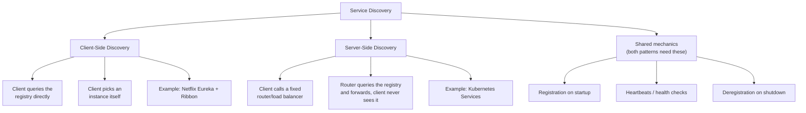
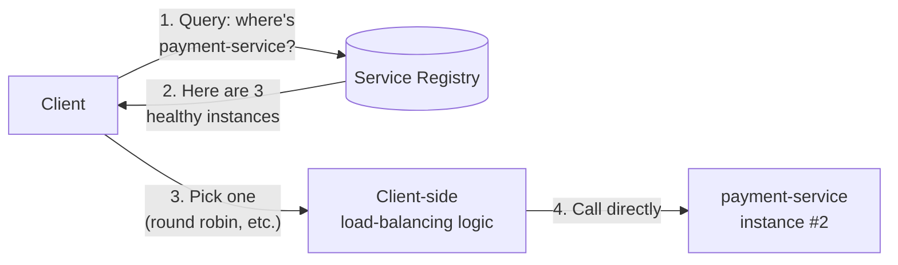
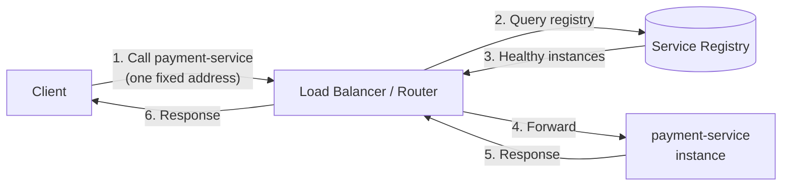
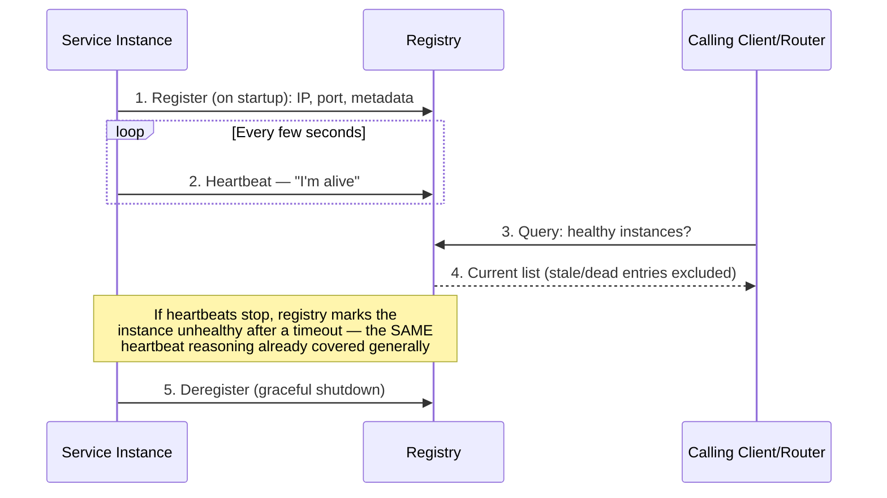

# Service Discovery

> [!abstract] What you'll be able to do after this chapter
> Explain precisely how a service finds another service's current network address when instances are constantly starting, stopping, and rescaling — and choose correctly between client-side and server-side discovery instead of treating "service discovery" as a vague buzzword.

---

## The big picture

## What is it, and why does it exist?

Service discovery is the mechanism by which one service finds the current network address (IP + port) of another service it needs to call — a **service registry** acting as the live, always-current source of truth for "which instances of this service are healthy right now."

**The problem this solves:** in a static world, you'd hardcode `payment-service = 10.0.0.5:8080` in a config file. That breaks immediately in any modern deployment — auto-scaling adds and removes instances constantly, container orchestration reschedules instances to new IPs on every restart, and rolling deployments replace instances continuously. Hardcoded addresses go stale within minutes. Before service discovery existed as a first-class mechanism, teams relied on manual config updates (slow, error-prone, doesn't survive an autoscale event) or DNS round-robin with long TTLs (too slow to react to instance churn, and DNS wasn't designed for frequent, health-aware updates).

> [!example] Layman analogy
> A company directory. You don't memorize every employee's direct desk extension — desks and people change constantly. You call the receptionist (the registry) and say "connect me to whoever's currently handling payments," and the receptionist always has the live, current mapping — including knowing who's out sick (unhealthy) and shouldn't be connected.

## Client-side discovery

The **calling client** queries the registry itself and decides which instance to call, embedding load-balancing logic directly in the client. No extra network hop between the client and the actual instance once the lookup completes.

## Server-side discovery

The client calls a **fixed, well-known address** (a load balancer or router) and never talks to the registry at all — the router does that lookup on the client's behalf. This is exactly [[CS Fundamentals/02 - Networking/Load Balancing|the Load Balancing chapter's]] missing piece: "how does the load balancer know which backends currently exist" is precisely the question server-side service discovery answers.

## The shared lifecycle: registration, health checks, deregistration

> [!info] This is the same heartbeat mechanism already covered generally
> "How do you detect a server or node is down?" from [[00 - Start Here/100 System Design Interview Questions|the 100-questions file]] is answered by exactly this mechanism, applied here specifically to service instances rather than nodes in general — missed heartbeats past a threshold mark an instance unhealthy and remove it from the registry's answer set.

---

## Tradeoffs

| | Client-Side Discovery | Server-Side Discovery |
|---|---|---|
| **Extra network hop** | No — client calls the instance directly after lookup | Yes — every call passes through the router |
| **Client complexity** | Higher — every service (in every language) needs discovery-library logic | Lower — clients just call a fixed address, know nothing about discovery |
| **Polyglot friction** | Real — a discovery client library needs to exist and be maintained for every language in use | None — the router is the only thing that needs discovery logic |
| **Real examples** | Netflix Eureka + Ribbon | Kubernetes Services (kube-proxy + DNS), AWS ELB with target groups, Consul (supports both) |

## Where this shows up later

> [!success] Direct connections to chapters already written
> [[CS Fundamentals/02 - Networking/Load Balancing|Load Balancing]] — server-side discovery is literally "how the load balancer's backend list stays current." [[CS Fundamentals/06 - Distributed Systems/Resilience Patterns|Resilience Patterns]] — a registry entry can go stale between health checks; a client hitting a now-dead instance still needs a circuit breaker/retry, discovery reduces this window but doesn't eliminate it. [[CS Fundamentals/06 - Distributed Systems/Consensus (Raft & Paxos)|Consensus]] — production registries (Consul, etcd-backed systems) use consensus internally to keep the registry itself consistent and available across its own replicas.

---

## Key Takeaways

> [!tip] Perfect pairs
> **Client-side discovery** pairs naturally with a **thin, dumb load balancer** (or none at all) — the intelligence lives in the client. **Server-side discovery** pairs naturally with a **smart router** — the intelligence lives centrally, clients stay simple.

> [!warning] Important rules
> 1. **Always health-check before serving traffic** — a freshly-registered instance that hasn't passed its first health check shouldn't receive real requests yet (it might still be starting up).
> 2. **Deregister gracefully on shutdown** — don't rely purely on heartbeat timeout to remove a deliberately-stopping instance; that window of "registered but already gone" is exactly where requests fail.
> 3. **Cache lookups with a short TTL** — querying the registry on every single request would make the registry itself the bottleneck; a brief client-side cache absorbs the load while staying reasonably fresh.

---

## Interview Q&A

> [!question]- Why does Kubernetes use server-side discovery by default?
> Kubernetes Services provide a single, stable virtual IP/DNS name per service — `kube-proxy` handles routing to actual pod IPs behind the scenes, and the pod set changes constantly as pods are rescheduled. This keeps application code entirely ignorant of discovery — a pod just calls `payment-service` by name, and the platform handles the rest, which fits Kubernetes' broader goal of keeping application code portable across environments.

> [!question]- What happens if the service registry itself goes down?
> This is why production registries (Consul, etcd, Kubernetes' own control plane) are themselves built as a **replicated, consensus-backed cluster** rather than a single instance — the registry can't be the single point of failure for every service-to-service call in the whole system. Clients often also cache the last-known-good instance list, so a brief registry outage doesn't immediately stop all traffic — it just stops *updates* to the list until the registry recovers.

> [!question]- How would you choose between client-side and server-side discovery for a new system?
> If the team already standardizes on one language/runtime and wants to avoid an extra network hop for latency-sensitive calls, client-side is viable. If the system is polyglot (multiple languages/frameworks) or already has infrastructure like Kubernetes providing server-side discovery for free, adding client-side discovery logic on top is usually unnecessary complexity — server-side is the more common default in modern container-orchestrated deployments specifically because it keeps application code simple.

## Summary / Cheat Sheet

- **Service registry** = the live source of truth for "which instances of this service are healthy right now."
- **Client-side discovery**: client queries the registry and picks an instance itself — no extra hop, but discovery logic lives in every client.
- **Server-side discovery**: client calls a fixed router; the router queries the registry — simpler clients, one extra hop.
- Shared lifecycle every registry implements: **register → heartbeat → (query) → deregister/timeout**.
- Kubernetes = server-side discovery by default. Netflix Eureka = the classic client-side example.

---
*Related: [[CS Fundamentals/00 - Learning Path|CS Fundamentals Learning Path]] · [[CS Fundamentals/02 - Networking/Load Balancing|Load Balancing]] · [[CS Fundamentals/06 - Distributed Systems/Resilience Patterns|Resilience Patterns]] · [[CS Fundamentals/06 - Distributed Systems/Consensus (Raft & Paxos)|Consensus (Raft & Paxos)]]*
