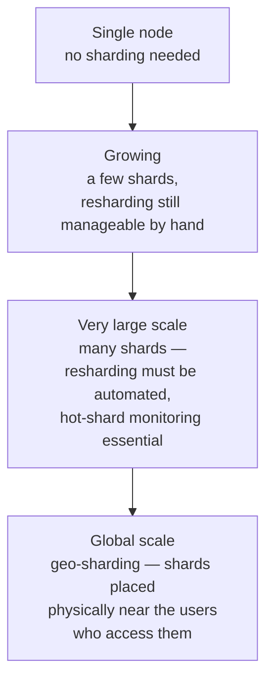

# Sharding & Partitioning

> [!abstract] What you'll be able to do after this chapter
> Choose correctly between range, hash, and directory-based sharding for a given access pattern, explain precisely why each creates hotspots under different conditions, and describe how resharding actually happens without downtime.

> [!info] This is the general version of a problem you've already solved per-database
> [[CS Fundamentals/03 - Databases/Cassandra Internals|Cassandra]] and [[CS Fundamentals/03 - Databases/MongoDB Internals|MongoDB]] each made a specific sharding choice with specific failure modes (Mongo's hot-shard-key problem, Cassandra's hash-ring). This chapter is the general theory underneath both, taught once.

---

## Why this exists

A single node can't hold all the data or serve all the traffic once a system outgrows it. **Sharding** splits data across multiple nodes so each holds only a subset — the question is *how* to decide which subset goes where, and that choice has real, different failure modes.

## Three strategies

### Range-based sharding

Data is partitioned by **contiguous ranges** of the shard key (e.g., user IDs 1-1M on shard A, 1M-2M on shard B).

- **Pro:** range queries (`WHERE id BETWEEN x AND y`) stay on one or few shards — efficient.
- **Con — the hotspot problem:** if the shard key is monotonically increasing (timestamps, auto-increment IDs), *all new writes* land on the single shard currently holding the highest range. Every other shard sits idle while one shard absorbs 100% of write traffic — a severe, structural hotspot.

### Hash-based sharding

The shard key is hashed, and the hash determines the shard (`shard = hash(key) % N`, or better, via [[CS Fundamentals/06 - Distributed Systems/Consistent Hashing|consistent hashing]]).

- **Pro:** hashing spreads keys near-uniformly — the monotonic-write hotspot above disappears entirely.
- **Con:** range queries now require a **scatter-gather** across every shard, since consecutive keys are scattered randomly — no shard holds a useful contiguous range anymore.

> [!tip] Plain `hash(key) % N` vs. consistent hashing — don't conflate them
> `% N` reshuffles *almost every key* when `N` changes (adding/removing a shard) — a resharding disaster. [[CS Fundamentals/06 - Distributed Systems/Consistent Hashing|Consistent hashing]] (already covered in depth) is the fix: adding/removing a node only remaps the keys on the ring segment adjacent to that node, not the whole keyspace. Any real hash-sharded system uses consistent hashing, not naive modulo, for exactly this reason.

### Directory-based (lookup) sharding

A separate **lookup service** maps each key to its shard explicitly, rather than computing it.

- **Pro:** maximally flexible — can rebalance individual keys, use arbitrary placement logic (e.g., co-locate related data, account for shard capacity differences).
- **Con:** the lookup service itself is a new dependency and potential bottleneck/single point of failure — every access now pays an extra hop unless aggressively cached.

## The hot-shard problem, generalized

> [!bug] Hashing solves *key* skew, not *access-pattern* skew
> Hash sharding fixes the monotonic-write hotspot, but a single **celebrity key** — one user, one product, one chat room getting disproportionate traffic — still lands entirely on one shard no matter how uniformly the hash function distributes other keys. This is exactly [[CS Fundamentals/03 - Databases/MongoDB Internals|MongoDB's hot-shard-key problem]] from the dedicated chapter — worth recognizing as the *same* underlying issue, not a MongoDB-specific quirk. The general fix is the same one used there: add entropy to the key itself (e.g., append a random suffix and fan out reads across the resulting sub-keys) when a single logical key's traffic genuinely exceeds one shard's capacity.

## Resharding without downtime

Adding a shard (to grow capacity) requires moving *some* data to the new node without stopping traffic:

1. The new shard joins the consistent-hash ring, claiming ownership of a slice of the keyspace previously owned by neighboring shards.
2. Data for that slice is copied from the old owner(s) to the new shard **in the background**, while the old owner keeps serving reads/writes for it.
3. Once copying catches up, ownership cuts over — new writes for that slice route to the new shard; the old shard's copy is deleted.

> [!warning] The real risk during cutover
> Between "copy started" and "cutover complete," a write could land on the old shard after the new shard is already considered authoritative for reads, or vice versa — a genuine dual-write consistency window. Real systems handle this either by routing **all writes** for a migrating slice through the new owner immediately (accepting a brief period where reads might miss recent writes on the old shard) or by dual-writing during the transition and reconciling. This exact tension — and its resolution — is a strong follow-up worth being ready to walk through precisely.

## Cross-shard operations

A query or transaction that spans multiple shards (a JOIN across shards, a transaction touching two users on different shards) can't rely on a single node's local ACID guarantees anymore. Two real answers: **[[Glossary/Two-Phase Commit (2PC)|Two-Phase Commit]]** (strong consistency, but blocks on coordinator failure) or the **[[Glossary/Saga Pattern|Saga pattern]]** (eventual consistency via compensating actions, already used in depth in [[HLD/23 - Design an E-commerce System/Design an E-commerce System|the E-commerce checkout saga]]) — the same tradeoff spectrum that recurs throughout this book: strong-and-blocking vs. eventual-and-available.

## Scaling: 1 user to 1 billion

At small scale, sharding isn't needed at all — a single node handles the full dataset and traffic. As data grows, a handful of shards is manageable with mostly-manual resharding events. At very large scale, resharding needs to be a routine, automated, well-tested process (not a rare, manual, high-risk event), and hot-shard monitoring becomes essential rather than optional, since with many shards the odds of at least one celebrity key existing somewhere rise substantially. At true global scale, **geo-sharding** — placing specific shards physically close to the users who predominantly access them — combines this chapter's partitioning strategies with [[CS Fundamentals/07 - Architecture and Deployment Patterns/Cloud Fundamentals|the region/AZ reasoning]] already covered, reducing latency for the common case at the cost of real complexity for cross-region access to "someone else's" shard.

## Failure scenarios

> [!bug] What actually happens
> - **A single shard goes down:** only that shard's slice of data becomes unavailable — the rest of the system keeps functioning, a real, direct availability benefit of sharding (assuming each shard has its own replication for durability, a separate concern from partitioning itself).
> - **Resharding gets stuck mid-migration:** the dual-write consistency window from the "real risk during cutover" warning above becomes an actual incident if the migration stalls partway — reads and writes can disagree about which shard is authoritative until it's resolved.
> - **A shard key choice turns out to be wrong after significant data has already accumulated:** the most expensive failure mode in this chapter — correcting a bad shard key after the fact means a full re-shard of already-large data, which is exactly why getting this decision right early matters far more than most other sharding details.

## Monitoring

> [!info] What to watch
> **Per-shard load/traffic distribution** — the direct, first-line signal for detecting a hotspot before it becomes a customer-visible problem. **Resharding progress/lag** during an active migration — confirms the background copy is keeping pace with live writes, not falling further behind. **Per-shard replication health** — a shard's own replication lag/failure is a separate concern from sharding itself, but compounds badly if not tracked per-shard individually.

## Common mistakes

> [!warning] Real, recurring errors
> 1. **Choosing a monotonic shard key** — Section "The hot-shard problem" already covers this precisely.
> 2. **Choosing a shard key that doesn't appear in most queries** — forces scatter-gather across every shard for the majority of the workload, defeating much of sharding's benefit.
> 3. **Not planning for resharding from day one** — treating the initial shard count as permanent makes growth a much more painful retrofit later than if resharding was designed for from the start.
> 4. **Forgetting the cross-shard transaction cost until it's already a production problem** — the 2PC/Saga decision (above) is far easier to make deliberately upfront than to retrofit once cross-shard operations are already widespread in the codebase.

---

## Interview Q&A

> [!info] Leveled by seniority
> **Beginner:** "What is sharding and why is it needed?" — splitting data across multiple nodes once one node can't hold it all or serve all the traffic. **Intermediate:** "Compare range vs. hash sharding." — the tradeoff table above: range enables efficient range queries but risks monotonic-write hotspots; hash distributes evenly but breaks range queries. **Senior:** "A specific shard is consistently overloaded while others sit idle — diagnose it." — expects distinguishing a genuine celebrity-key hotspot (needs key-splitting) from a shard-key design flaw (needs resharding with a better key), not applying the same fix reflexively. **Staff:** "Design a resharding strategy for a live system that cannot tolerate downtime." — expects the "Resharding without downtime" section's answer walked through concretely: background copy, then a clean cutover, naming the dual-write risk window explicitly. **Architect:** "How would you decide between application-level sharding and a database that shards natively (like Cassandra or MongoDB)?" — expects a real tradeoff: native sharding trades some control for significantly less operational complexity to build and maintain, application-level sharding trades more upfront engineering effort for full control over placement logic — not a reflexive "always shard yourself" or "always use a sharded database."
> The key must appear in the majority of queries (otherwise most queries scatter-gather across every shard regardless of sharding strategy), and it must not create a hotspot under the actual write pattern — a monotonic key (timestamp, auto-increment ID) is a red flag for range sharding specifically; hash sharding sidesteps it but check for celebrity-key skew instead.

> [!question]- Why does hash sharding break range queries, and is there a fix?
> Because the hash destroys locality — consecutive keys land on unrelated shards. If range queries are also required, some systems use a **composite** key (a coarse prefix that's range-partitioned, hashed *within* each range) — a real hybrid, at the cost of added complexity. Naming this hybrid explicitly, rather than presenting hash vs. range as mutually exclusive, is a stronger interview answer.

> [!question]- What actually breaks if you reshard using plain `hash(key) % N` instead of consistent hashing?
> Changing `N` remaps nearly every key to a different shard simultaneously — the exact problem [[CS Fundamentals/06 - Distributed Systems/Consistent Hashing|Consistent Hashing]] was built to solve. A production resharding event using modulo hashing would need to move almost all data at once instead of the small fraction consistent hashing requires.

---
*Related: [[00 - Start Here/How This Handbook Works|Book Map]] · [[CS Fundamentals/06 - Distributed Systems/Consistent Hashing|Consistent Hashing]] · [[CS Fundamentals/03 - Databases/MongoDB Internals|MongoDB Internals]] · [[CS Fundamentals/03 - Databases/Cassandra Internals|Cassandra Internals]] · [[Glossary/Saga Pattern|Saga Pattern]]*
