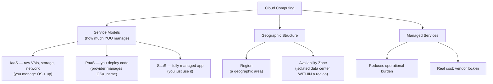
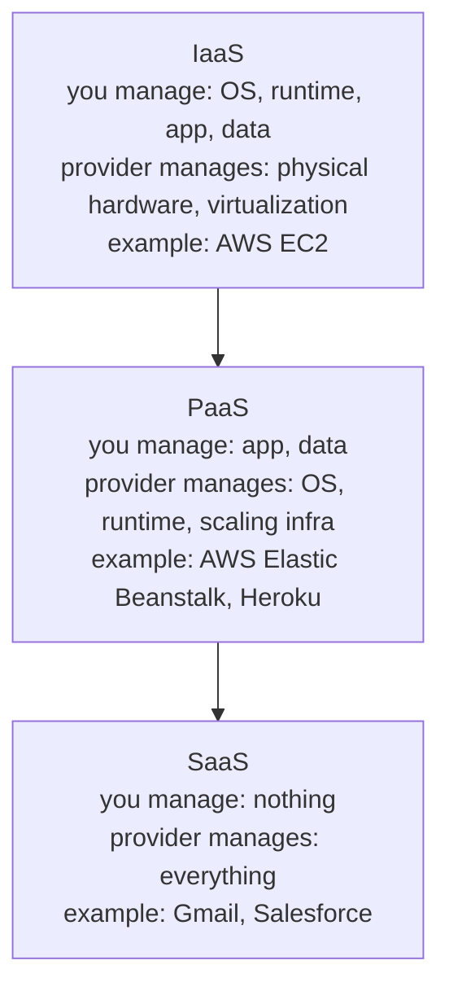
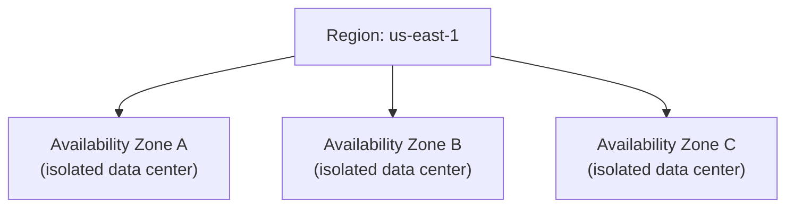
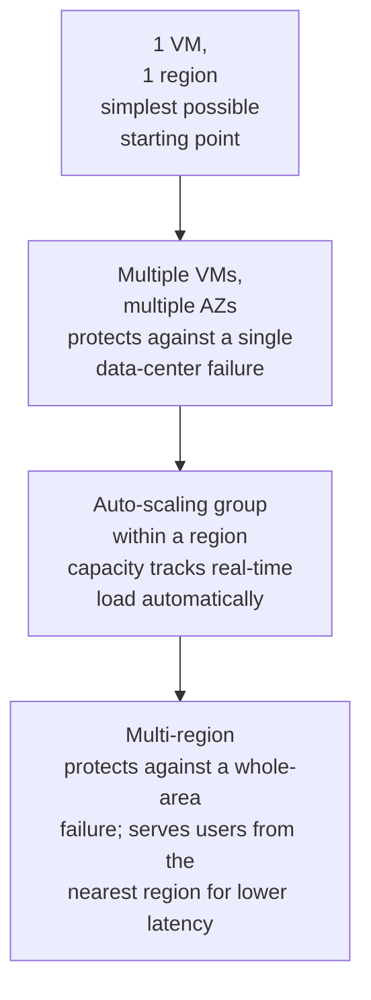

# Cloud Fundamentals

> [!abstract] What you'll be able to do after this chapter
> State the IaaS/PaaS/SaaS hierarchy precisely (a classic, exact-wording interview question), explain the real region-vs-availability-zone distinction, and name vendor lock-in as a genuine, named cost of managed services rather than presenting cloud as strictly superior to self-hosting.

---

## The big picture

## What is it, and why does it exist?

Cloud computing is the model of renting computing resources — servers, storage, databases, networking — from a third-party provider (AWS, GCP, Azure) over the internet, on demand, instead of buying and operating physical hardware yourself.

**The problem this solves:** before cloud computing, running a service meant buying physical servers (a large upfront capital expense, months of lead time to procure and install), housing them in a data center, and staffing people to maintain the hardware — and over-provisioning for peak load that then sits mostly idle the rest of the time. Cloud computing turns that fixed capital expense into a variable operational one: rent exactly the capacity needed, scale it up or down on demand, pay only for what's actually used.

> [!example] Layman analogy
> Owning a car vs. using a ride-sharing service. Owning means a large upfront cost, and you personally maintain a vehicle that sits idle most of the day. Ride-sharing means paying only when you actually need a ride, someone else maintains the fleet, and you can summon far more capacity instantly (multiple cars at once) for an unusual event, without owning that capacity year-round.

## IaaS / PaaS / SaaS — the exact hierarchy

> [!tip] A classic, precise-wording interview question — say it exactly
> **IaaS (Infrastructure as a Service):** raw virtual machines, storage, and networking — you manage everything from the OS upward. **PaaS (Platform as a Service):** the provider manages the OS and runtime — you just deploy your application code. **SaaS (Software as a Service):** a fully managed application — you just use it, managing nothing underneath at all. Each step up the hierarchy trades control for reduced operational burden.

## Regions and Availability Zones — the real, precise distinction

> [!warning] A commonly conflated pair, worth stating exactly
> A **Region** is a broad geographic area (e.g., `us-east-1`). An **Availability Zone (AZ)** is an isolated data center **within** a region — physically separate power, cooling, and networking from other AZs in the same region, but low-latency connected to them. Deploying across multiple **AZs** protects against a single data center failing. Deploying across multiple **Regions** protects against an entire geographic area failing (a regional power grid issue, a natural disaster) — a strictly larger, rarer, and more expensive-to-guard-against failure mode.

> [!info] Direct reuse
> This is exactly the geographic reasoning [[HLD/14 - Design a Multi-Region Rate Limiter/Design a Multi-Region Rate Limiter|the Multi-Region Rate Limiter chapter]] builds on — multi-AZ deployment as the default resilience baseline, multi-region as the deliberate, more expensive next step for the specific failure modes that justify it.

## Managed services — the real tradeoff

A **managed service** is the provider's own hosted, operated version of a technology — AWS RDS is "managed Postgres," letting you skip operating the database yourself (patching, backups, failover) entirely.

| Benefit | Cost |
|---|---|
| Dramatically reduced operational burden — the provider handles patching, backups, failover | Higher per-unit cost than self-hosting at very large scale |
| Faster to get started — no setup/operational expertise needed upfront | **Vendor lock-in** — migrating off a cloud-specific managed service later is genuinely, non-trivially expensive |

> [!bug] Vendor lock-in is a real, named cost — not a hypothetical one
> A managed service's convenience often comes with provider-specific APIs, configuration, and operational quirks that don't transfer to another cloud provider or to self-hosting. Migrating away later means re-architecting around a different (or absent) managed equivalent — a real, budgeted engineering cost many companies underestimate when adopting a managed service for its initial convenience.

## Where this shows up later

> [!success] Direct connections
> Every "the system auto-scales" claim made casually throughout this book's HLD chapters is enabled by cloud elasticity — the ability to add/remove capacity automatically based on load. [[HLD/14 - Design a Multi-Region Rate Limiter/Design a Multi-Region Rate Limiter|Multi-Region Rate Limiter]]'s region/AZ reasoning is a direct application of the geographic structure above. [[CS Fundamentals/07 - Architecture and Deployment Patterns/Kubernetes Fundamentals|Kubernetes]] is frequently consumed *as* a managed cloud service itself (AWS EKS, GCP GKE) — tying this chapter directly back to the previous one.

## Scaling: 1 VM to a global, multi-region footprint

## Failure scenarios

> [!bug] What actually happens
> - **A single AZ fails:** already covered above — traffic and capacity in the surviving AZs absorb the load, the direct reason multi-AZ is the resilience baseline.
> - **An entire region fails** (rare, but real — a regional power grid or networking incident): only a multi-region deployment survives this; single-region deployments, even multi-AZ ones, go down entirely — the specific, higher-cost failure mode multi-region deliberately guards against.
> - **A managed service has an undocumented quota/rate limit hit unexpectedly at scale:** a real, common surprise — managed services abstract away infrastructure but not their own internal limits, which can throttle a system precisely when it's growing fastest.

## Monitoring

> [!info] What to watch
> **Per-AZ and per-region health/error rate** — the direct signal for whether a failure is isolated to one AZ/region or systemic. **Managed-service quota utilization** — proactively catches the quota-limit failure scenario above before it becomes an incident. **Cost per unit of traffic/compute** — cloud's pay-for-what-you-use model makes cost itself an operational metric worth tracking, not just a finance-team concern.

## Common mistakes

> [!warning] Real, recurring errors
> 1. **Deploying to a single AZ "to keep it simple"** — reintroduces the single-data-center-failure risk multi-AZ exists specifically to remove, for a cost savings that's usually small relative to the risk.
> 2. **Adopting a deeply provider-specific managed service without weighing lock-in** — the vendor lock-in section above; a real, deliberate architectural decision, not a default.
> 3. **Not monitoring managed-service quotas until they're hit in production** — the quota failure scenario above; these limits are discoverable and plannable ahead of time.

---

## Interview Q&A

> [!info] Leveled by seniority
> **Beginner:** "What's the difference between IaaS, PaaS, and SaaS?" — the exact hierarchy above, by how much you manage vs. the provider does. **Intermediate:** "Why deploy across multiple AZs?" — protects against a single data-center-level failure; already covered precisely above. **Senior:** "A managed database is throttling writes unexpectedly under increased load — diagnose it." — expects checking the provider's documented quota/throughput limits for that managed tier first, per the Failure Scenarios above, rather than assuming an application bug. **Staff:** "Design a deployment topology for a service that needs to survive a regional cloud outage." — expects multi-region deployment with active traffic routing, explicitly distinguishing this from (cheaper, more common) multi-AZ alone. **Architect:** "How would you evaluate whether adopting a new provider-specific managed service is worth the lock-in risk?" — expects weighing the real, quantifiable operational-burden reduction against the concrete cost of a future migration, not treating either lock-in or self-hosting as automatically correct.

> [!question]- Why would a company choose IaaS over PaaS for a given workload?
> When the team needs fine-grained control over the OS/runtime environment — custom kernel parameters, specific runtime versions, unusual networking setups — that PaaS's managed abstraction doesn't expose. PaaS trades that control for significantly less operational burden, the right choice when the team just wants to ship application code without managing infrastructure underneath it.

> [!question]- Why deploy across multiple Availability Zones instead of just adding more servers in one AZ?
> More servers in one AZ doesn't protect against that AZ's power, cooling, or networking failing entirely — all those servers go down together. Spreading across AZs means a single data-center-level failure only takes out a fraction of capacity, not all of it — the same fault-isolation reasoning behind not putting all resources behind one point of failure, applied at the physical-infrastructure level.

> [!question]- What's a real, concrete example of vendor lock-in costing a company?
> Building an application deeply around a cloud provider's proprietary managed database (custom query extensions, provider-specific scaling/replication features) means migrating to another provider later requires re-architecting significant portions of the application, not just moving data — a real, budgeted risk worth weighing explicitly against the convenience gained upfront, not an abstract concern.

## Summary / Cheat Sheet

- **IaaS** (you manage OS+) → **PaaS** (you manage just app+data) → **SaaS** (you manage nothing) — decreasing control, decreasing operational burden.
- **Region** = broad geographic area. **Availability Zone** = isolated data center *within* a region. Multi-AZ protects against a data-center failure; multi-region protects against a whole-area failure.
- **Managed services** trade operational burden for cost and **vendor lock-in** — a real, named tradeoff, not free convenience.

---
*Related: [[CS Fundamentals/00 - Learning Path|CS Fundamentals Learning Path]] · [[HLD/14 - Design a Multi-Region Rate Limiter/Design a Multi-Region Rate Limiter|Design a Multi-Region Rate Limiter]] · [[CS Fundamentals/07 - Architecture and Deployment Patterns/Kubernetes Fundamentals|Kubernetes Fundamentals]]*
