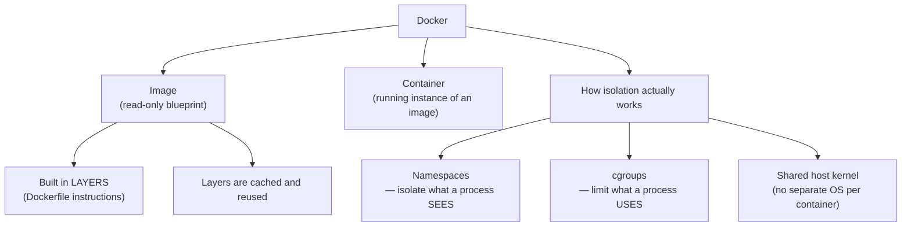
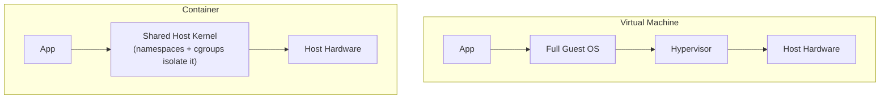
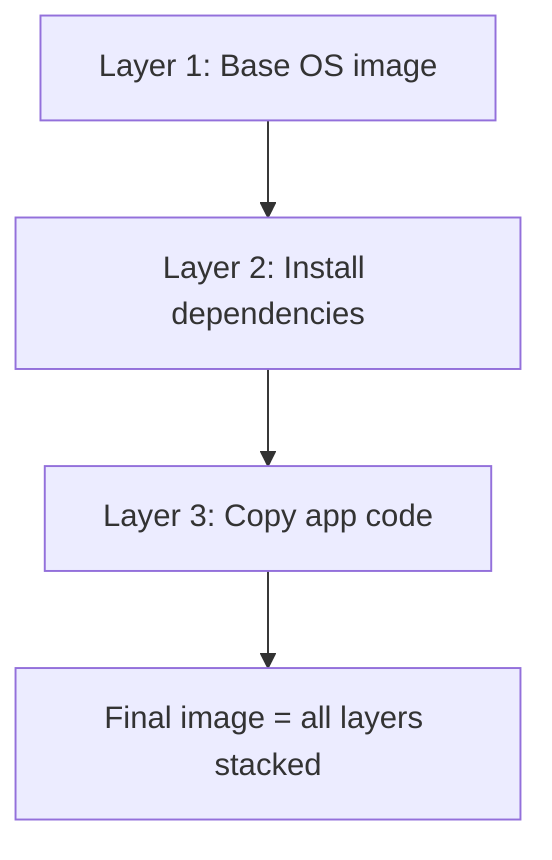

# Docker Fundamentals

> [!abstract] What you'll be able to do after this chapter
> Explain precisely why containers are lightweight compared to VMs (namespaces + cgroups, not a separate kernel), derive why image-layer caching makes rebuilds fast, and connect container memory limits directly to the OOM-killer mechanism already covered.

---

## The big picture

## What is it, and why does it exist?

Docker packages an application plus all its dependencies — libraries, runtime, system tools — into a single, portable, isolated unit called a **container**, which runs consistently on any machine with Docker installed.

**The problem this solves:** "works on my machine" — an application running fine in development fails in production due to different OS versions, missing dependencies, or mismatched library versions. Before Docker, full **virtual machines** solved isolation by giving each application its own complete OS, but that's heavyweight — gigabytes of overhead per VM, and slow (minutes) to start. Docker solves the same isolation problem using OS-level mechanisms instead of full hardware virtualization — dramatically lighter.

> [!example] Layman analogy
> The literal shipping container this technology is named after: before standardized shipping containers, cargo was loaded and unloaded by hand, in whatever shape it arrived, incompatible across ships, trucks, and trains. A standard container can be moved by *any* compatible crane, ship, or truck without anyone caring what's inside. Docker does this for software — package your app once, run it anywhere Docker exists, without caring about the host's specific setup.

## Image vs. container — the Class vs. Object analogy

An **image** is a read-only template — your app, its dependencies, and a minimal filesystem, built in layers via a **Dockerfile**. A **container** is a running *instance* of an image — you can start many containers from the same image, exactly the same relationship a `class` has to its `object` instances in ordinary object-oriented code.

## Internal working — why containers are lightweight, precisely

> [!success] The real mechanism, not just "containers are lighter"
> Docker uses two Linux kernel features directly, without any separate guest operating system:
> - **Namespaces** isolate what a process can **see** — its own process list, its own network stack, its own filesystem view — so containers can't see each other's processes or files, even though they're all running on the same underlying kernel.
> - **cgroups** (control groups) limit what a process can **use** — CPU, memory, I/O bandwidth. This is the *exact same mechanism* [[CS Fundamentals/01 - Operating Systems/Memory Management & Virtual Memory|the Memory Management chapter's]] OOM-killer discussion applies to — a container's memory limit is enforced via cgroups, and exceeding it triggers the identical OOM-kill mechanism, just scoped to that one container instead of the whole machine.
>
> Because every container shares the **same host kernel** — no separate kernel per container, unlike a VM's separate guest OS — containers start in seconds (often sub-second) instead of minutes, and cost megabytes of overhead instead of gigabytes.

## Image layers, and why rebuilds are fast

Each Dockerfile instruction creates a new, **cached** layer. Rebuilding an image after changing only the application code (Layer 3) reuses the *already-built, cached* Layers 1 and 2 unchanged — you don't pay the cost of reinstalling dependencies just because a line of app code changed. This is precisely why ordering a Dockerfile matters: put the least-frequently-changing instructions (base image, dependency installation) *before* the most-frequently-changing ones (copying app code), so cache reuse is maximized.

## Tradeoffs: Container vs. VM

| | Virtual Machine | Container |
|---|---|---|
| Isolation | Full — separate kernel per VM | Process-level — shared host kernel |
| Startup time | Minutes | Seconds, often sub-second |
| Overhead | High — gigabytes, full guest OS | Low — megabytes, just app + dependencies |
| Security boundary | Stronger — a VM escape must break out of full hardware virtualization | Weaker — a kernel vulnerability is a larger shared attack surface across all containers on that host |

## Where this shows up later

> [!success] Direct connections
> [[CS Fundamentals/01 - Operating Systems/Memory Management & Virtual Memory|Memory Management & Virtual Memory]] — container memory limits are cgroups, and exceeding them triggers the same OOM-kill mechanism already covered. [[CS Fundamentals/07 - Architecture and Deployment Patterns/Kubernetes Fundamentals|Kubernetes Fundamentals]] (next chapter) — Kubernetes orchestrates containers; it doesn't replace Docker, it manages *many* of them across *many* machines.

---

## Interview Q&A

> [!question]- Why is a container considered less secure than a VM, precisely?
> Containers on the same host share one kernel — a kernel-level vulnerability could theoretically let a process in one container affect another container or the host itself. A VM's isolation boundary is much stronger, since a compromise would need to break out of full hardware virtualization, not just a shared-kernel process boundary. This is a real, legitimate reason some workloads (multi-tenant systems with untrusted code) still prefer VMs, or run containers *inside* VMs for defense in depth.

> [!question]- Why does Dockerfile instruction order affect build speed?
> Each instruction is a cached layer; a change to any instruction invalidates the cache for that layer *and every layer after it*, forcing a rebuild from that point forward. Putting rarely-changing instructions (base image, dependency installs) first and frequently-changing ones (app code copy) last maximizes how much of the build can be served from cache on a typical iteration.

> [!question]- What actually happens when a container exceeds its memory limit?
> The same OOM-kill mechanism from the Memory Management chapter, scoped by cgroups to that container specifically — the kernel terminates a process within the container's cgroup to reclaim memory back under the configured limit, rather than letting it consume unbounded host memory.

## Summary / Cheat Sheet

- **Image** = read-only blueprint, built in cached layers. **Container** = a running instance of an image.
- Lightweight because of **namespaces** (isolate visibility) + **cgroups** (limit resource usage) — **shared host kernel**, no separate guest OS.
- Container memory limits use the exact same OOM-kill mechanism as regular Linux memory pressure, just scoped by cgroups.
- Order a Dockerfile least-to-most-frequently-changing to maximize layer-cache reuse on rebuilds.

---
*Related: [[CS Fundamentals/00 - Learning Path|CS Fundamentals Learning Path]] · [[CS Fundamentals/01 - Operating Systems/Memory Management & Virtual Memory|Memory Management & Virtual Memory]] · [[CS Fundamentals/07 - Architecture and Deployment Patterns/Kubernetes Fundamentals|Kubernetes Fundamentals]]*
