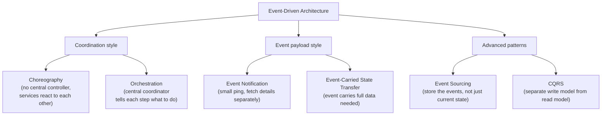
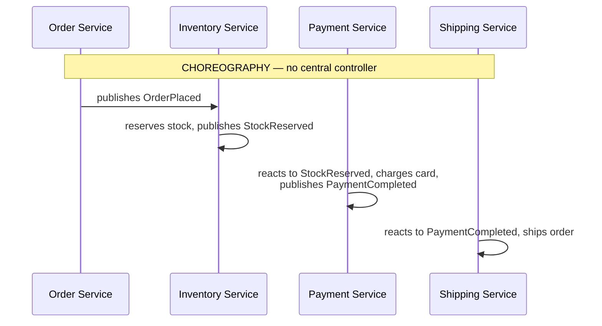
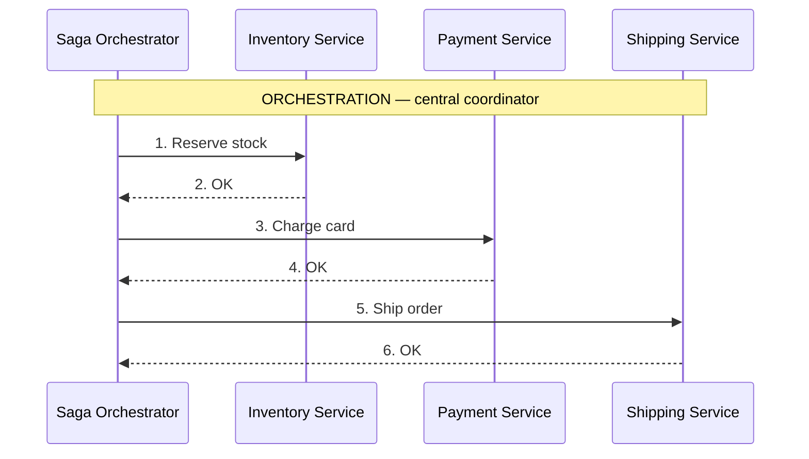
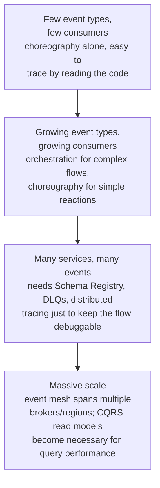

# Event-Driven Architecture

> [!abstract] What you'll be able to do after this chapter
> Name the precise distinction between choreography and orchestration (the two ways Saga can actually be implemented), explain event notification vs. event-carried state transfer, and recognize this as the architectural style underneath every "decouple via Kafka" fix already used throughout this book.

---

## The big picture

## What is it, and why does it exist?

Event-driven architecture is a style where services communicate by publishing and reacting to **events** — facts that already happened — rather than direct request/response calls. A service publishes `OrderPlaced` and doesn't know or care who's listening; interested services react independently, on their own schedule.

**The problem this solves:** direct service-to-service calls create tight **temporal coupling** — the caller blocks waiting for the callee, and if the callee is slow or down, the caller fails too. As a system grows into many services, a chain of synchronous calls (A calls B calls C) becomes fragile: one slow or down link anywhere in the chain breaks the whole request. This is exactly the reasoning already used, one system at a time, in [[HLD/04 - Design a Notification Service/Design a Notification Service|the Notification Service]] and [[HLD/20 - Design a Log Aggregation and Monitoring System/Design a Log Aggregation and Monitoring System|Log Aggregation]] chapters — this chapter is that same reasoning, generalized into a named architectural style rather than a one-off fix.

> [!example] Layman analogy
> A bulletin board vs. a phone call. Direct calls mean phoning every interested party individually whenever something happens — you must know exactly who to call, and wait for each to pick up. Event-driven means pinning a notice to a public bulletin board — anyone interested checks it whenever they want, and you never need to know who's reading it or wait for them to respond.

## Choreography vs. orchestration — the real, precise distinction

> [!tip] This is the exact fork [[Glossary/Saga Pattern|the Saga Pattern]] and [[HLD/23 - Design an E-commerce System/Design an E-commerce System|the E-commerce chapter's checkout saga]] leave implicit
> **Choreography**: each service reacts to the previous service's event independently — no single place owns the whole flow, genuinely decentralized, but harder to see "where are we in this process" from any one place. **Orchestration**: one coordinator explicitly tells each service what to do next and tracks the overall state — easier to reason about and debug, at the cost of that coordinator being a more central, more complex component. Neither is "the" Saga pattern — both are valid ways to *implement* it, and naming which one you mean is a real, expected precision in an interview.

## Event payload style: Notification vs. Carried State

- **Event Notification:** a small "something happened" ping (`OrderPlaced: {orderID: "123"}`) — receivers fetch the actual details separately, via a follow-up call. Keeps events small, but reintroduces a synchronous dependency for the follow-up fetch.
- **Event-Carried State Transfer:** the event itself carries all the data a receiver would need (`OrderPlaced: {orderID, items, total, customerID, ...}`) — receivers never need to call back at all, fully decoupled, at the cost of larger events and needing to keep the event schema in sync with what receivers actually need.

## Advanced patterns: Event Sourcing and CQRS

> [!info] Worth naming precisely, even without full implementation depth
> **Event Sourcing:** instead of storing an entity's *current* state, store the full ordered sequence of events that led to it — current state is derived by replaying events from the start (or from the last snapshot). Gives a complete, genuine audit trail for free, at the cost of needing to think in terms of events rather than direct state mutation. **CQRS (Command Query Responsibility Segregation):** separate models for writes (commands, which change state) and reads (queries, which just look at it) — often paired with Event Sourcing, since the write side stores events while a separately-optimized read side maintains a pre-computed, query-friendly view built by consuming those same events.

## Tradeoffs

| Benefit | Cost |
|---|---|
| Decoupling — producer doesn't know/care who consumes | Eventual consistency — the same tradeoff [[00 - Start Here/100 System Design Interview Questions|already covered generally]], now structural to the whole architecture |
| Resilience — no cascading synchronous failure across a call chain | Harder debugging — a request's effects are scattered across async reactions, needs distributed tracing to reconstruct |
| Independent scaling of producers and consumers | Ordering and duplicate-delivery concerns — needs the same [[Glossary/Idempotency|idempotency]] discipline already covered, plus real ordering guarantees from the underlying broker |

## Where this shows up later

> [!success] The infrastructure and the architectural style, both already covered
> [[CS Fundamentals/05 - Messaging & Streaming/Kafka Internals|Kafka Internals]] and [[CS Fundamentals/05 - Messaging & Streaming/RabbitMQ Internals|RabbitMQ Internals]] are the infrastructure this architectural style runs on. [[Glossary/Idempotency|Idempotency]] is required discipline for any consumer in this style, since brokers generally guarantee at-least-once delivery, not exactly-once. [[Glossary/Saga Pattern|Saga Pattern]] is choreography or orchestration, precisely defined above, applied specifically to distributed transactions.

## Scaling: one topic to a full event mesh

## Failure scenarios

> [!bug] What actually happens
> - **A consumer is down when an event publishes:** the event isn't lost — it sits durably in the broker (per [[CS Fundamentals/05 - Messaging & Streaming/Kafka Internals|Kafka Internals]]) until the consumer comes back and catches up, the core resilience benefit over a synchronous call that would have simply failed.
> - **A consumer processes an event twice** (broker's at-least-once delivery, or a retry after a slow ack): without [[Glossary/Idempotency|idempotency]], this silently double-applies an effect (double-charges, double-ships) — the exact reason idempotency is *required* discipline in this style, not optional hygiene.
> - **Orchestration's central coordinator itself fails mid-flow:** the in-flight saga's state needs to be durably persisted and resumable, or the whole business process stalls indefinitely — a real, specific new failure mode choreography doesn't have, since choreography has no single coordinator to lose.

## Monitoring

> [!info] What to watch
> **Consumer lag** — the gap between events published and events actually processed; a growing lag signals a consumer falling behind or stuck. **Dead-letter queue volume** — a rising DLQ count is a direct, early signal of a systemic processing bug, not isolated bad messages. **End-to-end flow latency** (via distributed tracing) — the only way to see how long a full choreographed or orchestrated business process actually takes, since no single service has that whole-flow view on its own.

## Common mistakes

> [!warning] Real, recurring errors
> 1. **Skipping idempotency because "the broker guarantees delivery"** — at-least-once delivery is not exactly-once processing; the Failure Scenarios section above is the direct consequence of skipping this.
> 2. **Choosing choreography for a complex, many-branch business process** — debugging "which service reacted wrong" across a dozen decentralized reactions is genuinely harder than following one orchestrator's explicit state; orchestration exists precisely for this case.
> 3. **Using Event-Carried State Transfer indiscriminately** — bloats every event and couples every consumer to the producer's schema, when Event Notification's smaller payload would serve better for consumers needing only a signal.

---

## Interview Q&A

> [!info] Leveled by seniority
> **Beginner:** "What's the core benefit of event-driven architecture over direct service calls?" — decoupling; a producer doesn't need to know or wait for consumers. **Intermediate:** "What's the actual difference between choreography and orchestration?" — decentralized reaction with no central owner vs. a central coordinator explicitly driving each step. **Senior:** "A choreographed flow across 6 services has a bug and no one can tell which service caused it — diagnose the process problem, not just the bug." — expects recognizing this as choreography's known debugging weakness at that complexity, and recommending either distributed tracing investment or migrating that specific flow to orchestration. **Staff:** "Design the failure-recovery strategy for an orchestrator that crashes mid-saga." — expects durable, persisted saga state (not in-memory), so a replacement orchestrator instance can resume from the last completed step rather than restarting or losing the in-flight transaction. **Architect:** "How would you decide, platform-wide, which flows should be choreography vs. orchestration?" — expects a real heuristic: simple, few-step reactions default to choreography for decentralization; complex, many-branch, or compliance-sensitive flows (needing an audit trail of "what step are we on") default to orchestration.

> [!question]- When would you choose orchestration over choreography for implementing a Saga?
> When the business process has many steps, complex branching logic, or the team needs strong visibility into "which step failed and why" for operational/debugging purposes — a central orchestrator makes the whole flow's state explicit and queryable in one place. Choreography fits simpler flows with few steps, where the decentralization's flexibility outweighs the loss of one clear "current state" view.

> [!question]- Why is Event-Carried State Transfer sometimes worse than Event Notification, despite avoiding a follow-up call?
> If many different consumers need different subsets of data, carrying everything in every event bloats payload size for consumers that only need a fraction of it, and any schema change to the event risks breaking multiple unrelated consumers simultaneously — Event Notification's smaller, more stable payload with an on-demand follow-up fetch can be the better tradeoff when consumer needs vary widely.

> [!question]- How does Event Sourcing relate to the WAL concept from the Storage Engines chapter?
> Structurally similar — both are "the sequence of changes is the source of truth, current state is derived from replaying it." A WAL exists purely for crash recovery inside one storage engine; Event Sourcing elevates that same idea to be the application's actual, permanent data model, not just an internal recovery mechanism.

## Summary / Cheat Sheet

- **Choreography** = decentralized, services react to each other's events. **Orchestration** = centralized coordinator drives the flow explicitly.
- **Event Notification** = small ping, fetch details separately. **Event-Carried State Transfer** = event carries everything needed.
- **Event Sourcing** = store events, derive state by replay. **CQRS** = separate write and read models, often paired with Event Sourcing.
- The core tradeoff, always: decoupling and resilience, paid for with eventual consistency and harder debugging.

---
*Related: [[CS Fundamentals/00 - Learning Path|CS Fundamentals Learning Path]] · [[CS Fundamentals/05 - Messaging & Streaming/Kafka Internals|Kafka Internals]] · [[Glossary/Saga Pattern|Saga Pattern]] · [[Glossary/Idempotency|Idempotency]]*
