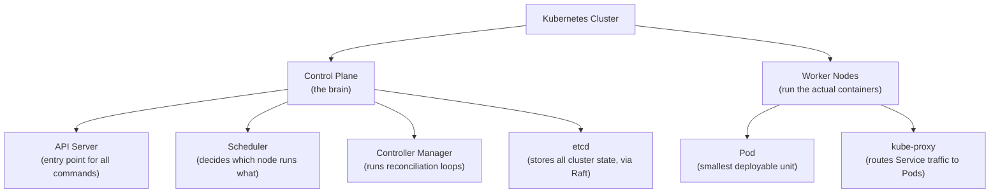
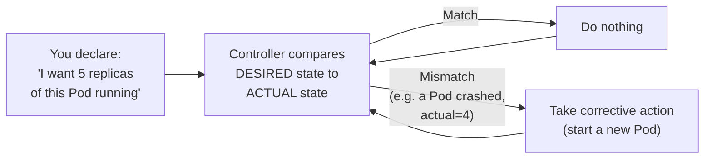
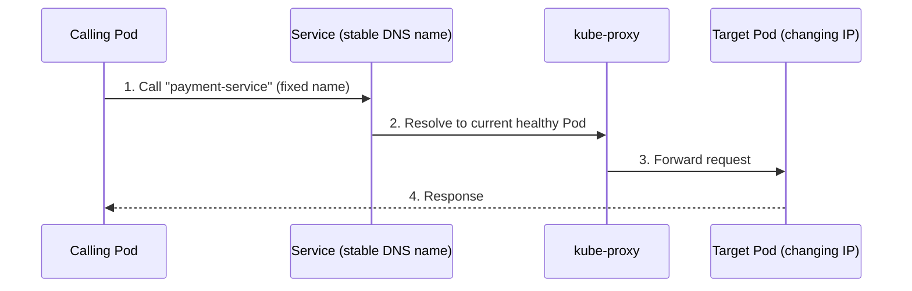
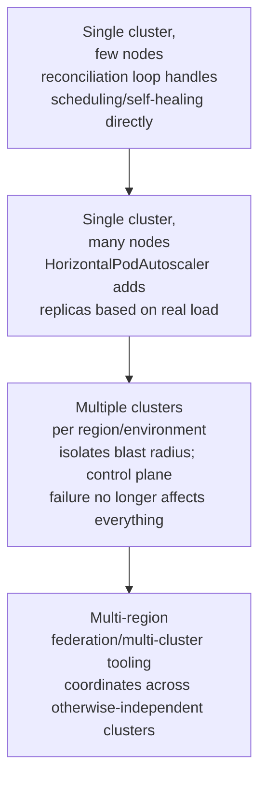

# Kubernetes Fundamentals

> [!abstract] What you'll be able to do after this chapter
> Explain the single most important Kubernetes concept precisely — the declarative, continuously-reconciled desired-state model — and recognize that a Kubernetes Service is a concrete, real-world instance of the server-side service discovery pattern already covered.

> [!info] Builds directly on two earlier chapters
> [[CS Fundamentals/07 - Architecture and Deployment Patterns/Docker Fundamentals|Docker Fundamentals]] covers running *one* container; this chapter is about running *many* containers, across *many* machines, reliably. [[CS Fundamentals/06 - Distributed Systems/Service Discovery|Service Discovery]] covers the general theory; a Kubernetes Service is one of its most common real-world implementations.

---

## The big picture

## What is it, and why does it exist?

Kubernetes is a **container orchestration platform** — given many containers that need to run across many machines, it handles scheduling (which machine runs which container), scaling (adding/removing instances), self-healing (restarting crashed containers), and networking between them, automatically.

**The problem this solves:** Docker packages one container well, but real systems need many containers spread across many machines, need to survive individual machine failures by rescheduling elsewhere, need to scale up and down with load, and need those containers to reliably find and talk to each other — directly building on [[CS Fundamentals/06 - Distributed Systems/Service Discovery|the Service Discovery chapter]]. Manually managing all of this by hand becomes impossible past a small number of machines.

> [!example] Layman analogy
> An orchestra conductor. Individual musicians (containers) know how to play their own instrument, but the conductor (Kubernetes) decides who plays when, replaces a musician who suddenly can't perform, and brings in more musicians for a bigger piece — all without you needing to manually coordinate every individual musician yourself.

## The single most important concept: declarative desired state + continuous reconciliation

> [!success] This loop is Kubernetes, more than any individual component name is
> You never tell Kubernetes *how* to fix a problem — you declare *what you want* (5 replicas, always), and a controller continuously checks reality against that declaration, taking whatever action is needed to close the gap, forever, in a loop. A crashed Pod isn't specially handled — it's just "actual state (4) no longer matches desired state (5)," and the exact same reconciliation logic that runs constantly fixes it, the same way it would fix any other drift.

## Core building blocks

- **Pod:** the smallest deployable unit — one or more tightly-coupled containers sharing network and storage (usually just one container in practice).
- **Node:** a physical or virtual machine running Pods.
- **Cluster:** a set of Nodes managed together.
- **Deployment:** a declarative spec — "keep 5 replicas of this Pod running at all times" — the object the reconciliation loop above is continuously satisfying.
- **Service:** a stable virtual IP/DNS name in front of a constantly-changing set of Pods.
- **kube-proxy:** routes traffic sent to a Service's stable address to one of the actual, current Pod IPs behind it.

## Service = server-side Service Discovery, concretely

> [!info] Not a new pattern — the exact one already covered
> A Kubernetes Service is a direct, real-world instance of [[CS Fundamentals/06 - Distributed Systems/Service Discovery|server-side service discovery]] — the calling Pod never queries a registry itself; it calls a fixed name, and the platform (Service + kube-proxy) does the lookup and routing on its behalf, exactly the pattern already described generally.

## Tradeoffs

> [!warning] "Do you actually need Kubernetes?" is a legitimate question, not a knee-jerk one
> Kubernetes provides genuinely powerful operational capability — self-healing, auto-scaling, zero-downtime rolling deployments — at the cost of real, significant operational complexity: learning curve, cluster maintenance, and a meaningful number of moving parts (API server, scheduler, controllers, etcd, networking) that themselves need to be understood and kept healthy. For a small application with light, predictable load, adopting Kubernetes can be the same category of premature-complexity mistake as [[CS Fundamentals/07 - Architecture and Deployment Patterns/Monolith vs Microservices|adopting microservices before you need them]] — the judgment call, not a reflexive "always use K8s," is what a senior answer demonstrates.

## Where this shows up later

> [!success] Direct connections
> [[CS Fundamentals/06 - Distributed Systems/Service Discovery|Service Discovery]] — Kubernetes Services, covered above. [[CS Fundamentals/06 - Distributed Systems/Consensus (Raft & Paxos)|Consensus (Raft & Paxos)]] — etcd, the control plane's state store, uses Raft internally to stay consistent across its own replicas; the control plane's own reliability depends on exactly the consensus mechanics already covered. [[CS Fundamentals/02 - Networking/Load Balancing|Load Balancing]] — kube-proxy and Kubernetes Ingress are concrete implementations of load-balancing concepts already covered generally.

## Scaling: one cluster to multi-cluster, multi-region

## Failure scenarios

> [!bug] What actually happens
> - **A node fails entirely:** already covered above — reconciliation notices every Pod scheduled there is now missing and reschedules replacements elsewhere, at cluster scale rather than single-Pod scale.
> - **etcd loses quorum:** the control plane can no longer reliably read or write cluster state — no new scheduling decisions, no reconciliation — a direct consequence of etcd's own Raft consensus requiring a majority, per [[CS Fundamentals/06 - Distributed Systems/Consensus (Raft & Paxos)|Consensus]].
> - **A misconfigured resource limit causes cascading Pod evictions:** Pods without resource requests/limits set can starve neighbors on the same node, triggering evictions that then get rescheduled elsewhere, potentially repeating the problem on the next node — a real, common production incident pattern, not hypothetical.

## Monitoring

> [!info] What to watch
> **Pod restart count / crash-loop-backoff rate** — the direct signal that reconciliation is fighting a persistent, unresolved problem rather than a one-off blip. **etcd latency and leader-election frequency** — since the whole control plane depends on etcd, per the Failure Scenarios above. **Node resource utilization vs. Pod resource requests** — mismatches here are the direct precursor to the eviction cascade failure mode.

## Common mistakes

> [!warning] Real, recurring errors
> 1. **Adopting Kubernetes before it's actually needed** — the Tradeoffs warning above, worth repeating as the single most common strategic mistake.
> 2. **Not setting Pod resource requests/limits** — the eviction-cascade failure scenario above; Kubernetes can't schedule intelligently without this information.
> 3. **Treating etcd as an implementation detail rather than critical infrastructure** — its own health directly gates the entire cluster's ability to reconcile anything.

---

## Interview Q&A

> [!info] Leveled by seniority
> **Beginner:** "What does Kubernetes actually do?" — orchestrates many containers across many machines: scheduling, scaling, self-healing, networking. **Intermediate:** "What's the single most important Kubernetes concept?" — declarative desired state, continuously reconciled against actual state, per the section above. **Senior:** "Pods are being evicted repeatedly across a cluster — diagnose it." — expects checking resource requests/limits first, per the eviction-cascade failure scenario, before assuming a Kubernetes bug. **Staff:** "Design a Kubernetes deployment topology for a service that must survive an entire cluster's control plane becoming unavailable." — expects multi-cluster deployment (Scaling section), since a single cluster's control-plane failure is a single point of failure no amount of Pod replication within that cluster protects against. **Architect:** "How would you decide when a platform has outgrown a single Kubernetes cluster?" — expects reasoning about blast-radius isolation (one team's misconfiguration shouldn't threaten every other team's workloads) and etcd/control-plane scaling limits, not just raw node count.

> [!question]- How does Kubernetes handle a node failing entirely, not just one Pod crashing?
> The control plane detects the node is unreachable (missed heartbeats, the same mechanism covered generally in earlier chapters), marks it unhealthy, and the reconciliation loop notices every Pod that was scheduled on that node is now missing from actual state — it reschedules replacements on healthy nodes to restore the declared replica count, the identical mechanism as a single Pod crash, just triggered at a larger scale.

> [!question]- What's the relationship between Docker and Kubernetes?
> Docker builds and runs individual containers on one machine. Kubernetes doesn't replace that — it orchestrates *many* containers (often built with Docker, though Kubernetes supports other container runtimes too) across *many* machines, handling scheduling, scaling, networking, and self-healing that Docker alone has no concept of.

> [!question]- Why does etcd matter so much to Kubernetes' own reliability?
> etcd is where all cluster state lives — every Deployment's desired replica count, every Service's routing config, everything. If etcd is unavailable or inconsistent, the control plane can't reliably reconcile anything. This is exactly why etcd uses Raft consensus internally (per [[CS Fundamentals/06 - Distributed Systems/Consensus (Raft & Paxos)|the Consensus chapter]]) rather than being a single unreplicated store — Kubernetes' own control plane needs the same consistency guarantees it helps applications achieve.

## Summary / Cheat Sheet

- Kubernetes = container orchestration: scheduling, scaling, self-healing, networking across many machines.
- The core mechanism: **declare desired state → controller continuously reconciles actual state to match it**, forever.
- **Pod** = smallest deployable unit. **Deployment** = desired-replica-count declaration. **Service** = stable address in front of changing Pods (= server-side service discovery, concretely).
- **etcd** stores all cluster state, using Raft — the control plane's own reliability depends on consensus.
- "Do you need Kubernetes?" is a real judgment call, not a default yes — significant operational complexity for genuinely powerful capability.

---
*Related: [[CS Fundamentals/00 - Learning Path|CS Fundamentals Learning Path]] · [[CS Fundamentals/07 - Architecture and Deployment Patterns/Docker Fundamentals|Docker Fundamentals]] · [[CS Fundamentals/06 - Distributed Systems/Service Discovery|Service Discovery]] · [[CS Fundamentals/06 - Distributed Systems/Consensus (Raft & Paxos)|Consensus (Raft & Paxos)]]*
