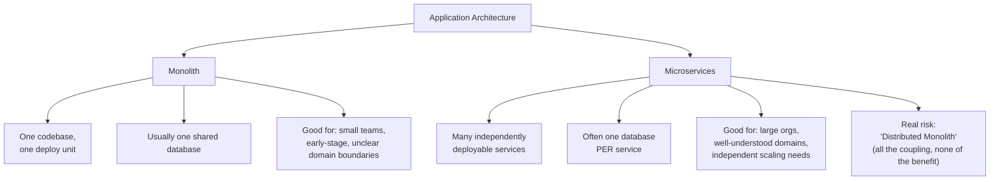
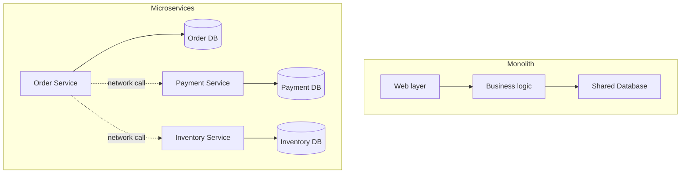

# Monolith vs. Microservices

> [!abstract] What you'll be able to do after this chapter
> Explain precisely what problem microservices solve (and don't), name the real, well-documented "distributed monolith" anti-pattern of adopting them too early, and recognize that almost every HLD chapter in this book has implicitly been teaching microservices-style thinking one service at a time.

---

## The big picture

## What is it, and why does it exist?

A **monolith** is a single deployable unit containing all of an application's functionality — one codebase, one build, one deploy. **Microservices** split that same functionality into many independently deployable services, each owning one focused business capability.

**The problem microservices solve:** as a codebase and the team working on it grow, a single deployable unit means every team's changes bundle into the same deploy — one team's bug can break the entire application, and any team wanting to ship a fix must coordinate with everyone else touching that same deploy. Scaling means scaling the *entire* application even if only one part is actually under load (a checkout service getting hammered during a sale forces you to scale the whole monolith, including parts with no extra traffic at all). Microservices exist specifically to let teams deploy and scale independently.

> [!example] Layman analogy
> A monolith is a single giant food truck making everything — burgers, drinks, desserts — from one kitchen. If the grill breaks, the *whole truck* stops serving anything, even drinks. Microservices is a food court: independent stalls, each run by a different team. If the dessert stall closes, burgers and drinks keep serving customers without interruption.

## Internal working — the real, structural differences

A monolith's components talk via **in-process function calls** — fast, and transactions across "modules" are just normal database transactions, since everything shares one database. Microservices' components talk over the **network** — every cross-service interaction is now a genuinely distributed operation, with all the tradeoffs [[CS Fundamentals/06 - Distributed Systems/CAP Theorem & PACELC|CAP theorem]] already covered generally.

## Tradeoffs, precisely

| | Monolith | Microservices |
|---|---|---|
| **Deploy** | One unit, all-or-nothing | Independent, per service |
| **Scaling** | Scale the whole app together | Scale only the hot service |
| **Team autonomy** | Low — shared codebase needs coordination | High — teams own their service end-to-end |
| **Operational complexity** | Low — one thing to run and monitor | High — N services, N deploy pipelines, network calls between them |
| **Data consistency** | Easy — one database, real ACID transactions | Hard — data spread across services; needs [[Glossary/Saga Pattern\|Saga]] or [[Glossary/Two-Phase Commit (2PC)\|2PC]] for cross-service consistency |
| **Debugging a request** | Straightforward — one process, one stack trace | Hard — a request spans multiple services; needs distributed tracing |
| **Best for** | Small teams, early-stage products, domain boundaries still unclear | Large orgs, well-understood domain boundaries, genuine independent-scaling needs |

## The real, common mistake: the "Distributed Monolith"

> [!bug] Adopting microservices before the domain is well-understood is a real, well-documented anti-pattern
> Splitting into services before you actually know where the natural boundaries in your domain lie produces the worst of both worlds: all of microservices' costs (network calls, operational overhead, harder debugging, eventual consistency) with **none** of its benefits — because if service boundaries are wrong, teams still end up needing to coordinate changes across multiple services for a single feature, just now paying network latency and deployment coordination overhead for the privilege. This is widely documented across the industry as the "distributed monolith" — a system that's *physically* distributed but still *logically* as tightly coupled as a monolith, having paid all the cost for none of the gain.

## Where this shows up later in this book

> [!success] You've already been doing microservices-style thinking, one chapter at a time
> Nearly every [[00 - Start Here/How This Handbook Works|HLD chapter]] in this handbook designs *one* focused service — a rate limiter, a notification service, a payment system — exactly the microservices decomposition mindset, without ever naming it explicitly until now. [[HLD/23 - Design an E-commerce System/Design an E-commerce System|The E-commerce chapter's]] checkout saga exists specifically *because* inventory, payment, and order data live in separate services/databases — a direct, concrete instance of the "data consistency is hard" row in the table above. [[CS Fundamentals/06 - Distributed Systems/Service Discovery|Service Discovery]] is infrastructure that only becomes necessary once you've split into microservices — a monolith never needs to "discover" itself.

---

## Interview Q&A

> [!question]- When would you recommend a company stay with a monolith rather than migrating to microservices?
> When the team is small enough that coordination overhead isn't yet a real problem, when the product's domain boundaries are still actively changing (splitting into services locks in boundaries that are expensive to redraw later), or when there's no genuine need to scale different parts of the system independently. Migrating early trades a real, present cost (network calls, operational complexity) for a benefit (independent team scaling) the org doesn't need yet.

> [!question]- How do you avoid ending up with a "distributed monolith"?
> Draw service boundaries around actual business capabilities that change independently of each other — not around technical layers (a "database service," a "validation service") which almost always need to change together for any single feature, forcing exactly the cross-service coordination microservices were meant to eliminate.

> [!question]- What's the single biggest new problem microservices introduces that a monolith never has?
> Distributed data consistency — a monolith gets ACID transactions across its entire dataset for free, since everything lives in one database. Microservices with a database-per-service split loses that for free; any operation spanning multiple services needs an explicit strategy ([[Glossary/Saga Pattern|Saga]], [[Glossary/Two-Phase Commit (2PC)|2PC]]) that a monolith never had to think about.

## Summary / Cheat Sheet

- **Monolith:** one deploy unit, one database, simple consistency, low operational overhead, low team autonomy.
- **Microservices:** many independent deploy units, database-per-service, hard consistency (needs Saga/2PC), high operational overhead, high team autonomy.
- **Distributed Monolith** = the real, common failure mode of splitting into services before domain boundaries are actually understood — all the cost, none of the benefit.
- Draw service boundaries around **business capabilities**, not technical layers.

---
*Related: [[CS Fundamentals/00 - Learning Path|CS Fundamentals Learning Path]] · [[CS Fundamentals/06 - Distributed Systems/Service Discovery|Service Discovery]] · [[Glossary/Saga Pattern|Saga Pattern]] · [[HLD/23 - Design an E-commerce System/Design an E-commerce System|Design an E-commerce System]]*
