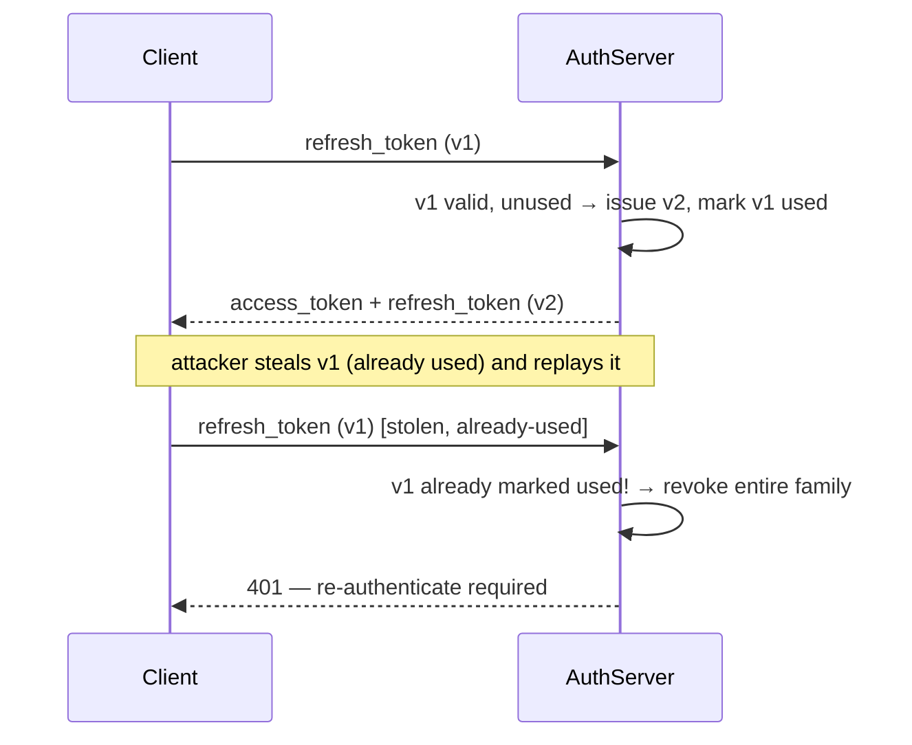

# Authentication & Authorization

> [!abstract] What you'll be able to do after this chapter
> Explain precisely why stateless JWTs can't be revoked early, design a refresh-token rotation scheme that detects theft, and choose correctly between session cookies, JWTs, OAuth2, and mTLS depending on who's calling whom.

---

## Why this exists

Every system in this book has silently assumed "the request is from who it claims to be, and they're allowed to do this." That assumption needs a real mechanism. **Authentication (AuthN)** answers *who are you*. **Authorization (AuthZ)** answers *what are you allowed to do*. They're independent — a system can authenticate someone perfectly and still deny them access to a specific resource.

## Session-based auth vs. token-based auth

| | Session (cookie + server-side store) | Token (JWT, stateless) |
|---|---|---|
| **Where state lives** | Server (Redis/DB session store), client holds only an opaque session ID | Entirely in the token itself, signed by the server |
| **Revocation** | Instant — delete the server-side session | Hard — see below |
| **Scaling** | Every server needs access to the shared session store | Any server can verify a token independently, no shared state needed |
| **Typical use** | Traditional web apps, first-party | APIs, microservices, mobile, cross-domain |

## JWT internals

A JWT is `base64(header).base64(payload).signature` — the header and payload are **encoded, not encrypted** (anyone can read them; use JWE if confidentiality is required). The signature (HMAC or RSA/ECDSA) is what prevents tampering — a server verifies the signature against its secret/public key before trusting any claim inside.

```go
// Verifying a JWT — the part that actually matters: never trust
// claims before the signature check passes.
func VerifyToken(tokenString string, secret []byte) (*Claims, error) {
    token, err := jwt.ParseWithClaims(tokenString, &Claims{}, func(t *jwt.Token) (interface{}, error) {
        if _, ok := t.Method.(*jwt.SigningMethodHMAC); !ok {
            return nil, fmt.Errorf("unexpected signing method: %v", t.Header["alg"])
        }
        return secret, nil
    })
    if err != nil || !token.Valid {
        return nil, errors.New("invalid token")
    }
    return token.Claims.(*Claims), nil
}
```

> [!bug] The "alg: none" attack — a real, historical JWT vulnerability
> Early JWT libraries trusted the `alg` field *inside the token itself* to decide how to verify it. An attacker could set `alg: none` and strip the signature entirely, and a naive verifier would accept it as valid. The fix (shown above): the server decides which algorithm to expect — it never lets the token dictate its own verification method.

## The revocation problem — the single most important thing to get right here

> [!warning] A stateless JWT cannot be revoked before it expires — say this precisely in an interview
> Since a JWT is self-contained and verified purely by signature, there's no server-side lookup to delete. If a token is stolen, it stays valid until its `exp` claim passes, no matter what the server does.
>
> **The real fix:** short-lived **access tokens** (5-15 minutes) plus a longer-lived **refresh token**, which *is* tracked server-side (in a database, revocable). The access token's blast radius from theft is bounded to its short lifetime; the refresh token — the thing that actually needs long-term trust — is the one piece of state the server can revoke instantly.

### Refresh token rotation, with theft detection

Every time a refresh token is used to get a new access token, issue a **new** refresh token and invalidate the old one — a refresh token is single-use. If an already-invalidated refresh token is ever presented again, that's a strong signal it was stolen and used by someone else after the legitimate client already rotated past it — the whole token *family* gets revoked immediately, forcing re-login.



## OAuth2 — delegated authorization, not authentication

OAuth2 solves a different problem: letting a **third-party app** act on a user's behalf without ever seeing the user's password. The standard flow for anything with a browser is **Authorization Code + PKCE**:

1. App redirects the user to the authorization server's login page.
2. User authenticates directly with the authorization server (the app never sees credentials).
3. Authorization server redirects back with a short-lived **authorization code**.
4. App exchanges the code (plus a PKCE `code_verifier`, proving it's the same client that started the flow) for an access token, server-to-server.

> [!info] PKCE exists because of a real attack
> Without PKCE, a malicious app on the same device could intercept the authorization code via a custom URL scheme and exchange it itself. PKCE ties the code exchange to a secret (`code_verifier`) only the original requester knows, generated before the redirect — the interceptor has the code but not the verifier.

**Client Credentials flow** (no user involved — service-to-service): the app authenticates directly with its own client ID/secret. **OIDC (OpenID Connect)** layers *authentication* on top of OAuth2's *authorization* machinery — it's why "Sign in with Google" both authenticates you and issues an ID token.

## Authorization models

**RBAC (Role-Based Access Control):** users are assigned roles, roles have permissions. Simple, coarse-grained, easy to reason about — but breaks down when access needs to depend on *context* (e.g., "can edit only documents they own").

**ABAC (Attribute-Based Access Control):** access decisions evaluate attributes of the user, resource, and environment (e.g., `user.department == resource.department AND time < 6pm`). More flexible, genuinely harder to audit — a real tradeoff, not a strict upgrade.

## Service-to-service auth

**API keys** — simple, but a single long-lived secret with no built-in rotation or scoping unless the system adds it. **mTLS** — both sides present certificates, common inside a service mesh where every hop is authenticated cryptographically without a shared secret at all. Worth knowing this exists as the answer to "how do internal services trust each other without OAuth."

---

## Interview Q&A

> [!question]- Why not just make JWTs short-lived enough that revocation doesn't matter?
> It reduces the blast radius but doesn't eliminate the problem — an account compromise (password reset, permission downgrade, employee offboarding) needs to take effect *immediately*, not in 15 minutes. That's exactly why the refresh token — not the access token — is the piece of state kept server-side and revocable.

> [!question]- Where should a JWT be stored on the client — localStorage or an httpOnly cookie?
> `localStorage` is readable by any JavaScript on the page, so it's vulnerable to XSS — a single injected script can exfiltrate the token. An `httpOnly` cookie can't be read by JavaScript at all, closing that hole, but cookies are automatically attached to every request, opening a CSRF risk instead (mitigated with `SameSite` cookie attributes and CSRF tokens). Neither is free — this is a real, named tradeoff, not a solved problem with one right answer.

> [!question]- How would you design authentication for the systems in this book (e.g. the Payment System, or an admin panel on the E-commerce chapter)?
> Short-lived JWT access tokens for the API layer (stateless verification, fits the horizontally-scaled service fleet already designed everywhere in this book), refresh-token rotation for session longevity, and — for anything sensitive like payments — layering mTLS or mutual auth for service-to-service calls between the checkout saga's own internal services, distinct from the user-facing OAuth2 flow.

---
*Related: [[00 - Start Here/How This Handbook Works|Book Map]] · [[Glossary/JWT|JWT]] · [[Glossary/OAuth2|OAuth2]] · [[HLD/17 - Design a Payment System/Design a Payment System|Design a Payment System]]*
