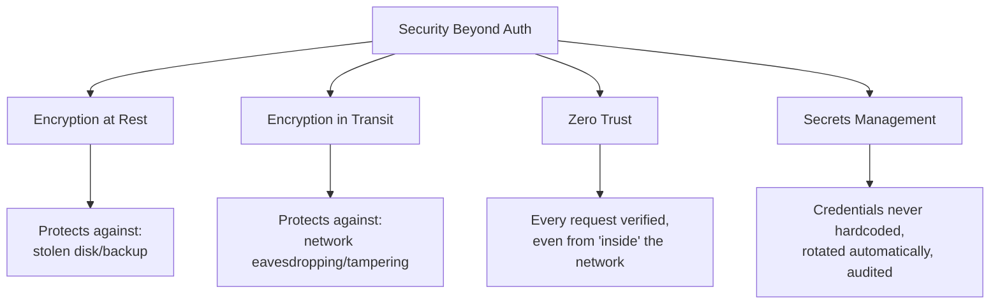
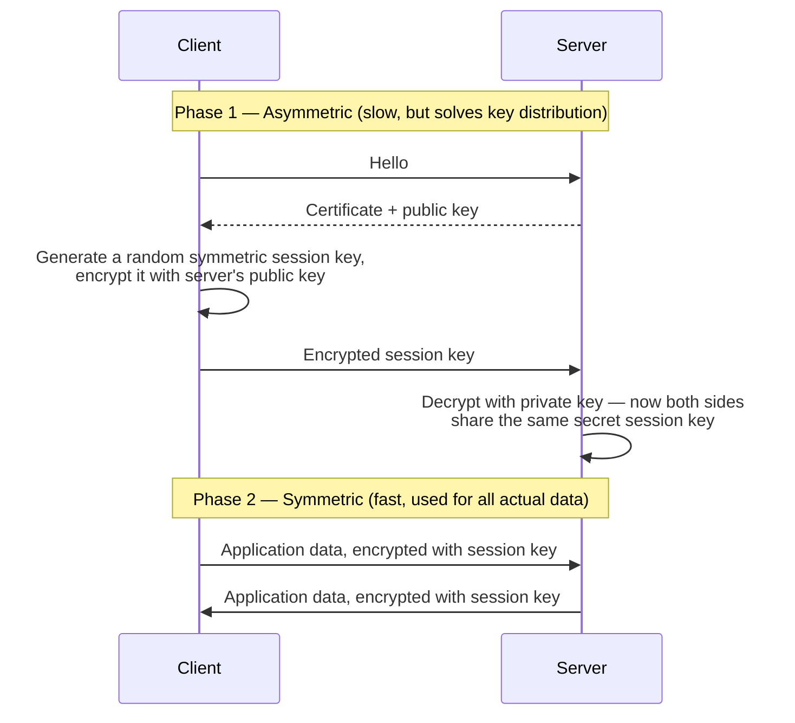
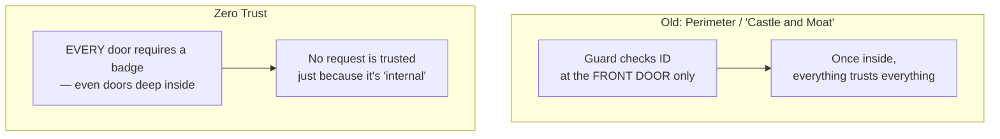

# Encryption, Zero Trust & Secrets Management

> [!abstract] What you'll be able to do after this chapter
> Explain precisely why TLS uses both asymmetric AND symmetric encryption in the same handshake (not one or the other), state the zero-trust model precisely against the old perimeter model it replaced, and name hardcoded credentials in source control as a real, extremely common production incident, not a hypothetical.

> [!info] Distinct from Authentication & Authorization
> [[CS Fundamentals/08 - Security/Authentication & Authorization|The Authentication & Authorization chapter]] covers verifying *who* is making a request. This chapter covers protecting the *data itself* (encryption) and the *trust model of the infrastructure* (zero trust, secrets) — a system can authenticate perfectly and still leak everything if these are missing.

---

## The big picture

## What is it, and why does it exist?

Even a system with perfect authentication leaks value if the underlying data and infrastructure aren't independently protected. **Encryption at rest** protects data sitting on disk. **Encryption in transit** protects data moving across a network. **Zero trust** protects against the assumption that "inside the network" means "safe." **Secrets management** protects the credentials that everything else depends on.

**The problem this solves:** a stolen disk or leaked backup exposes plaintext data instantly if it isn't encrypted at rest — authentication never even enters the picture, since the attacker isn't going through your API at all. A network eavesdropper can read or tamper with unencrypted traffic in transit, regardless of how well users authenticate. The old "castle and moat" security model — heavily guard the perimeter, trust everything once inside — fails badly the moment *any* internal service or credential is compromised, since that compromise then has free rein internally. And hardcoded credentials, sitting in a config file or committed to source control, are a real, extremely common way real breaches actually happen — not a hypothetical risk.

## Encryption at rest and in transit

> [!example] Layman analogy
> **Encryption at rest** is a locked safe — even if someone steals the safe itself, they can't open it without the combination. **Encryption in transit** is a sealed, tamper-evident envelope — even if someone intercepts the letter in the mail, they can't read or alter the contents without it being obvious.

### Why TLS uses both symmetric AND asymmetric encryption

> [!tip] The precise reason for this hybrid design
> Asymmetric encryption (public/private key pairs) solves the hard problem of exchanging a secret over an untrusted channel without ever transmitting the secret itself — but it's computationally expensive, far too slow for encrypting large volumes of ongoing traffic. Symmetric encryption (one shared key) is fast, but requires both sides to already share that key securely — the exact problem asymmetric encryption just solved. TLS uses asymmetric encryption *only* for the brief handshake to establish a shared secret, then switches to fast symmetric encryption for all the actual data — the practical, real-world hybrid every modern secure connection uses.

## Zero Trust — the precise model, against what it replaced

> [!warning] "Never trust, always verify" — say the principle exactly
> Zero trust means every request is authenticated and authorized regardless of where it originates — including requests between two services *inside* the same network. The old perimeter model's fatal flaw: once any single internal service or credential is compromised, an attacker with that foothold can move freely to anything else "inside," since internal traffic was implicitly trusted. In practice, zero trust is implemented via **mTLS (mutual TLS)** between internal services — each service proves its own identity with a certificate on every call, the same mTLS concept already named briefly in [[CS Fundamentals/08 - Security/Authentication & Authorization|the Authentication & Authorization chapter]] as the answer to "how do internal services trust each other without OAuth."

## Secrets management

> [!bug] Hardcoded credentials in source control is a real, common, well-documented incident category
> A database password or API key hardcoded in a config file — worse, committed to git history, which persists even after later "removing" it — is one of the most common real-world causes of production security incidents, not a hypothetical worst case. Dedicated secrets-management systems (HashiCorp Vault, AWS Secrets Manager) exist specifically to solve this: credentials are stored centrally, injected into applications at runtime (never written to disk or source control), **rotated automatically** on a schedule, and every access is **audited** — who fetched which secret, when.

> [!info] Same "blast radius" reasoning as short-lived JWTs
> Short-lived, automatically-rotated secrets bound the damage of a leak to a small time window, the exact same principle behind [[CS Fundamentals/08 - Security/Authentication & Authorization|short-lived JWT access tokens]] — a credential valid forever is a permanent liability the moment it leaks; a credential that rotates every few hours limits how long a leaked copy is even useful to an attacker.

## Tradeoffs

Encryption adds CPU overhead — though modern CPUs have dedicated instructions (AES-NI) making this often negligible in practice — and real key-management complexity: losing an encryption key means the data it protects is **permanently unrecoverable**, a genuine operational risk that key-management systems exist specifically to mitigate. Zero trust adds real complexity (every internal call needs its own auth) compared to the simpler perimeter model, but is now the industry-standard default given how common internal lateral-movement attacks actually are.

## Where this shows up later

> [!success] Direct connections
> [[CS Fundamentals/08 - Security/Authentication & Authorization|Authentication & Authorization]] — mTLS and short-lived credentials, both referenced above. [[CS Fundamentals/02 - Networking/HTTP Evolution & DNS Resolution|HTTP Evolution & DNS Resolution]] — the TLS handshake mentioned briefly there is the full mechanism explained here. [[CS Fundamentals/02 - Networking/API Gateway|API Gateway]] — the standard TLS termination point in most architectures.

---

## Interview Q&A

> [!question]- Why not just use asymmetric encryption for everything, since it's more secure?
> It isn't that asymmetric is "more secure" in a way that matters here — it's dramatically slower computationally for bulk data. TLS's hybrid approach gets asymmetric's key-distribution benefit (no shared secret needs to travel over the network) *and* symmetric's speed, by using each for the part of the problem it's actually good at.

> [!question]- What's the practical difference zero trust makes if a single internal service gets compromised?
> Under the old perimeter model, that compromised service could call any other internal service freely — lateral movement across the whole system. Under zero trust, that compromised service still needs to authenticate via mTLS (or equivalent) to call anything else, and its access can be scoped to only what it legitimately needs — containing the blast radius to that one service instead of the whole internal network.

> [!question]- How would you migrate a system with hardcoded credentials in config files to a secrets-management system?
> Rotate every exposed credential first (assume anything that was hardcoded is already compromised, regardless of whether there's evidence of misuse), move the new credentials into the secrets manager, update application startup to fetch them at runtime instead of reading from a static config file, and audit source control history for any lingering exposure — the migration itself needs the same "assume breach" mindset zero trust is built on.

## Summary / Cheat Sheet

- **Encryption at rest** = protects stored data. **Encryption in transit** = protects data on the network. Different threats, both needed.
- **TLS** = asymmetric handshake (solves key distribution) + symmetric session (fast, for actual data) — a deliberate hybrid, not a choice between the two.
- **Zero trust** = "never trust, always verify" — every request authenticated regardless of network location, implemented via mTLS between internal services.
- **Secrets management** = credentials stored centrally, injected at runtime, rotated automatically, audited — never hardcoded, never committed to source control.

---
*Related: [[CS Fundamentals/00 - Learning Path|CS Fundamentals Learning Path]] · [[CS Fundamentals/08 - Security/Authentication & Authorization|Authentication & Authorization]] · [[CS Fundamentals/02 - Networking/HTTP Evolution & DNS Resolution|HTTP Evolution & DNS Resolution]]*
