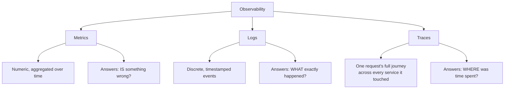
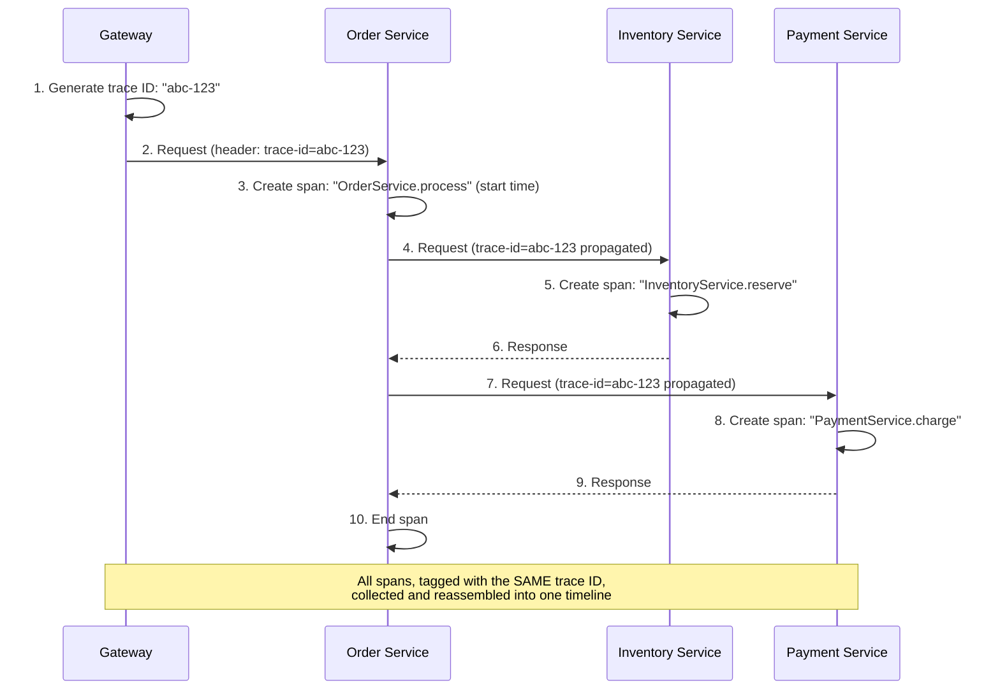
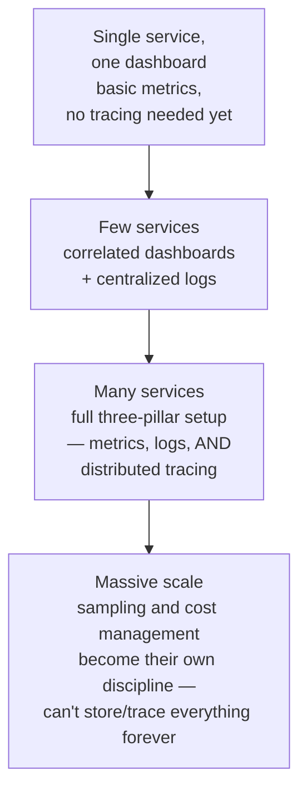

# Observability: Metrics, Logs & Traces

> [!abstract] What you'll be able to do after this chapter
> Explain precisely why metrics, logs, and traces each answer a genuinely different question (none is a substitute for the others), and describe exactly how a trace ID propagates across services to reconstruct one request's full journey.

> [!info] The general theory behind an existing applied chapter
> [[HLD/20 - Design a Log Aggregation and Monitoring System/Design a Log Aggregation and Monitoring System|The Log Aggregation / Monitoring System HLD chapter]] is the applied case study — building the infrastructure that ingests logs and metrics at scale. This chapter is the general theory underneath it, including the third pillar (traces) that chapter doesn't focus on.

---

## The big picture

## What is it, and why does it exist?

Observability is the ability to understand a system's internal behavior from its external outputs — instrumenting a system so it can be debugged and understood *after the fact*, without having predicted in advance exactly what question you'd need to ask.

**The problem this solves:** as systems became distributed across many services, understanding "why is this slow" or "what actually broke" became far harder — a single request might span ten services, and traditional debugging (attach a debugger, read one process's stack trace) simply doesn't work across process and machine boundaries. Observability emerged as a discipline specifically to answer questions about distributed system behavior that no single component's own logs could answer alone.

> [!example] Layman analogy
> A car, understood three different ways at once: **metrics** are the dashboard gauges — speed, fuel level, engine temperature, continuously updating numbers. **Logs** are the flight-recorder's detailed narrative of specific events ("11:03:12 — brake applied hard"). **Traces** are a mechanic's diagnostic tool that follows one specific trip end-to-end, showing exactly which parts of the car did what, in what order, and how long each took.

## The three pillars, precisely

| Pillar | What it is | Answers | Cost |
|---|---|---|---|
| **Metrics** | Numeric measurements aggregated over time (request rate, error rate, [[Glossary/Latency Percentiles (P50, P90, P99)\|latency percentiles]]) | "**Is** something wrong right now?" | Cheap — aggregated, not stored per-event |
| **Logs** | Discrete, timestamped records of specific events | "**What exactly** happened?" | Expensive at scale — [[HLD/20 - Design a Log Aggregation and Monitoring System/Design a Log Aggregation and Monitoring System\|per the Log Aggregation chapter's]] 1M-lines/sec ingestion problem |
| **Traces** | One request's full journey across every service it touched | "**Where** was time actually spent, across a multi-service call chain?" | Moderate — sampled in practice, not every request traced at high volume |

> [!warning] None of the three substitutes for the others
> A metric spike tells you error rate jumped — it doesn't tell you *which* requests failed or *why*. A log line tells you exactly what happened in one service — it doesn't tell you how that fits into the larger multi-service request it was part of. A trace shows you the full journey and where time went — but doesn't replace the aggregate trend visibility metrics give you for spotting a problem in the first place. A mature observability setup needs all three, each covering a gap the others structurally can't.

## Distributed tracing — the actual mechanism

> [!tip] The one mechanism that makes this all work
> A **trace ID** is generated once, at the very first entry point (usually the API gateway), and **propagated forward** through every subsequent service call — typically via an HTTP header. Each service that handles part of the request creates its own **span** (recording its own start time, end time, and any relevant details), tagged with that same trace ID. A tracing backend (Jaeger, Zipkin) later collects every span sharing a trace ID and reconstructs the full picture as a timeline — showing exactly which service was the slow one, and whether services ran sequentially or in parallel.

## Where this shows up later

> [!success] Direct connections
> [[HLD/20 - Design a Log Aggregation and Monitoring System/Design a Log Aggregation and Monitoring System|Log Aggregation / Monitoring System]] — the applied infrastructure for the logs and metrics pillars at scale. [[00 - Start Here/100 System Design Interview Questions|"How do you debug a sudden latency spike in production?"]] from the 100-questions file — a trace is the actual tool that answers this precisely, rather than guessing which service is slow. [[Glossary/Latency Percentiles (P50, P90, P99)|Latency Percentiles]] — exactly what the metrics pillar measures and alerts on.

## Scaling: one dashboard to a full observability platform

## Failure scenarios

> [!bug] What actually happens
> - **A trace ID isn't propagated across an async boundary** (a message queue hop, a fire-and-forget background job): the trace silently breaks into two disconnected traces instead of one continuous one — a real, common gap specifically at exactly the async boundaries [[CS Fundamentals/07 - Architecture and Deployment Patterns/Event-Driven Architecture|Event-Driven Architecture]] introduces, not a tracing-tool bug.
> - **Log ingestion volume outpaces the pipeline's capacity:** per [[HLD/20 - Design a Log Aggregation and Monitoring System/Design a Log Aggregation and Monitoring System|the Log Aggregation chapter's]] own back-pressure problem — logs queue up or get dropped, and the observability system itself becomes the thing that's failing during an incident, exactly when it's needed most.
> - **Alert fatigue from too many low-value metrics:** real, actionable alerts get lost in noise from alerts nobody actually acts on — a genuine, common cause of a real incident being missed despite technically being "monitored."

## Monitoring

> [!info] Monitoring the observability pipeline itself
> **Ingestion lag of the pipeline itself** — if metrics/logs/traces arrive minutes late, they're describing the past, not informing a live incident response. **Trace sampling rate vs. actual error-request coverage** — a low sampling rate that happens to under-sample exactly the failing requests defeats tracing's purpose; error requests are worth sampling at a much higher rate than healthy ones. **Metric cardinality** — unbounded label values (e.g., a metric labeled by raw user ID) can silently explode storage cost and query performance without any single change looking obviously wrong.

## Common mistakes

> [!warning] Real, recurring errors
> 1. **Not propagating trace ID across async/queue boundaries** — the Failure Scenarios entry above; the most common real gap in an otherwise-complete tracing setup.
> 2. **Treating logs as a substitute for metrics or traces** — the "none substitutes for the others" warning above, worth repeating as the chapter's central point.
> 3. **Unbounded metric cardinality** — adding a high-cardinality label (user ID, request ID) to a metric instead of a trace, where high-cardinality data actually belongs.

---

## Interview Q&A

> [!info] Leveled by seniority
> **Beginner:** "What's the difference between metrics, logs, and traces?" — the three-pillar table above; each answers a genuinely different question. **Intermediate:** "Why is a trace ID propagated via an HTTP header instead of looked up some other way?" — it needs to travel with the request itself across every service boundary, with no shared external state required to correlate spans later. **Senior:** "A distributed trace stops partway through a request that you know continues further — diagnose it." — expects checking for an unpropagated trace ID across an async/queue hop, per the Failure Scenarios above, the most common real cause of a broken trace. **Staff:** "Design a tracing sampling strategy for a system where 99% of requests are healthy but the 1% that fail matter most." — expects a much higher sampling rate for slow/error requests specifically (tail-based or error-biased sampling) rather than a flat percentage across all requests. **Architect:** "How would you control observability cost as a platform grows to thousands of services, without losing the ability to debug real incidents?" — expects a layered strategy: cheap, always-on aggregate metrics for detection; selectively higher-fidelity logging and trace sampling triggered specifically around detected anomalies, rather than uniformly high-fidelity collection everywhere at all times.

> [!question]- Why can't logs alone answer "why was this specific request slow" in a distributed system?
> Each service's logs only show that service's own view — without a shared trace ID linking them, there's no way to know which log lines across ten different services' log files actually belong to the *same* originating request, or to see the timing relationship between them. Tracing solves exactly this correlation problem, which logs alone structurally can't.

> [!question]- Why sample traces instead of tracing every single request at high scale?
> Full tracing of every request at high volume adds real overhead (creating and shipping spans for every hop of every request) and generates far more trace data than is practically useful to store or review. Sampling (tracing, say, 1% of requests, or specifically sampling slow/error requests at a higher rate) captures the useful signal at a fraction of the cost — a real, deliberate tradeoff, not a compromise nobody chose.

> [!question]- How does a metric spike lead you to the right trace to investigate?
> The metric (say, P99 latency jumping) tells you *when* the problem started and roughly *how bad* it is — you then look for traces from that time window with unusually high total duration, and the trace's span breakdown shows you exactly *which* service in the chain accounted for the extra time, turning "something's slow" into "this specific service call is slow" precisely.

## Summary / Cheat Sheet

- **Metrics** = aggregated numbers, answer "is something wrong." **Logs** = discrete events, answer "what exactly happened." **Traces** = one request's full journey, answer "where was time spent."
- None substitutes for the others — a mature setup needs all three.
- **Trace ID** generated at entry, propagated through every hop. Each service creates a **span**. A tracing backend reassembles spans sharing a trace ID into one timeline.
- Traces are usually **sampled**, not captured for every request, at real scale.

---
*Related: [[CS Fundamentals/00 - Learning Path|CS Fundamentals Learning Path]] · [[HLD/20 - Design a Log Aggregation and Monitoring System/Design a Log Aggregation and Monitoring System|Design a Log Aggregation / Monitoring System]] · [[Glossary/Latency Percentiles (P50, P90, P99)|Latency Percentiles]]*
