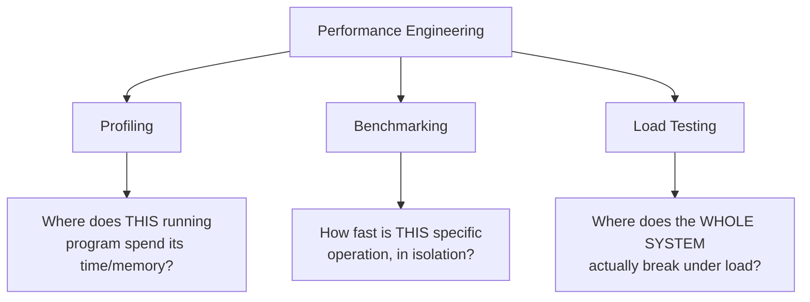
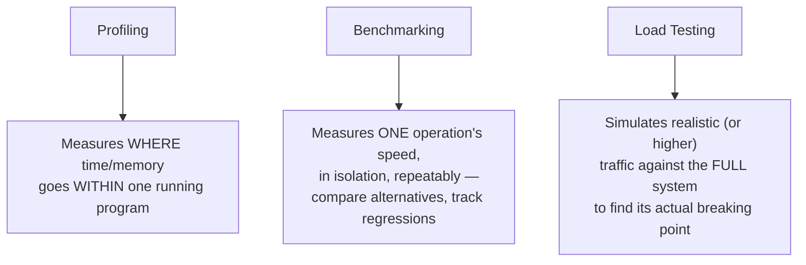
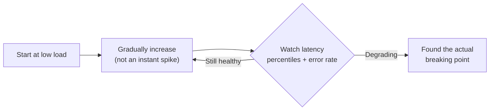
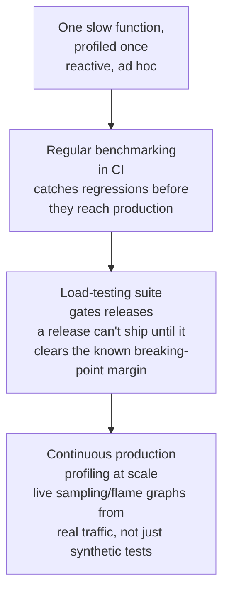

# Performance Engineering

> [!abstract] What you'll be able to do after this chapter
> Explain precisely why "optimize based on intuition" is a well-documented trap, name the difference between profiling/benchmarking/load testing (three genuinely different tools for three different questions), and describe how load testing methodology finds a system's real breaking point before production traffic does.

---

## The big picture

## What is it, and why does it exist?

Performance engineering is the discipline of systematically measuring, understanding, and improving a system's speed and resource efficiency — rather than guessing at what's slow and optimizing blindly.

**The problem this solves:** engineers routinely "optimize" based on intuition about what's slow, and that intuition is frequently wrong. Donald Knuth's famous observation — "premature optimization is the root of all evil" — captures exactly this: effort spent optimizing a part of the system that was never the real bottleneck is effort *wasted*, while the actual bottleneck goes unaddressed and unmeasured. Performance engineering exists to replace guessing with measurement.

> [!example] Layman analogy
> A doctor diagnosing an illness. You don't start prescribing random treatments based on a guess — you run tests (bloodwork, imaging) to find the *actual* cause first, then treat that specifically. Optimizing code without profiling first is treating symptoms you've guessed at, instead of the diagnosed disease.

## The three tools, and the different question each answers

### Profiling

Measures where a running program actually spends its time or memory. **CPU profiling** is usually sampling-based — periodically interrupt the program and record what it's currently doing, statistically approximating where time goes without the heavy overhead of tracing every single instruction. **Memory profiling** shows what's allocating the most memory, surfacing leaks or unexpectedly large allocations.

> [!info] Instrumentation vs. sampling — a real, worth-naming tradeoff
> Adding explicit timing code around specific sections (instrumentation) gives precise numbers but changes the program's own performance *while measuring it* — a genuine observer effect. Sampling-based profiling has much lower overhead but gives a statistical approximation rather than an exact count. Neither is free of tradeoffs; both are legitimate depending on how precise you need the answer to be.

### Benchmarking

Measures a specific operation's performance in isolation, under controlled, repeatable conditions — used to compare two implementations of the same thing, or to track whether a change regressed performance over time. A benchmark answers "is implementation A or B faster for this specific operation," not "is the whole system fast enough."

### Load testing

Simulates realistic — or deliberately higher-than-realistic — traffic against the *full* system to find where it actually degrades, before real production traffic finds that point for you. The methodology matters: ramp load up **gradually**, watching latency percentiles and error rate at each stage, rather than jumping straight to an assumed peak — gradual ramping reveals *exactly* where degradation starts, which an instant full-load test can't distinguish from "it was already going to fail at any load."

> [!tip] This is the empirical validation of the estimation reasoning already covered
> [[00 - Start Here/100 System Design Interview Questions|"Why does back-of-envelope estimation matter"]] establishes the *calculated* expectation for where a system should start struggling. Load testing is how you *empirically verify* that calculation against reality — the two practices are complementary, not redundant: estimation tells you roughly what to expect before you build anything; load testing tells you what's actually true once you have.

## The premature-optimization trap, precisely

> [!bug] A real, well-documented, avoidable mistake
> Optimizing code that *isn't* the actual bottleneck wastes engineering time and often makes the code more complex and fragile, for zero real-world benefit — the theoretically-slow-looking part of a system is frequently not where time is actually spent once you measure. [[CS Fundamentals/00 - Computer Architecture/CPU, Memory & Cache Hierarchy|The Computer Architecture chapter's]] array-vs-linked-list example is a concrete instance of this same lesson from the other direction: theoretical complexity analysis alone can point you at the wrong conclusion; only measurement (profiling, benchmarking) reveals what's actually true on real hardware. **Profile first, then optimize the bottleneck the data actually identifies** — never the one intuition suggested.

## Tradeoffs

Profiling and load testing both carry real overhead and require realistic-enough scenarios to be meaningful — a load test using an unrealistic traffic pattern (all identical requests, no realistic mix of read/write or hot/cold keys) can produce false confidence, passing a test that doesn't resemble what production traffic will actually look like. Worth naming as a genuine limitation rather than treating load testing as an automatically-trustworthy stamp of readiness.

## Where this shows up later

> [!success] Direct connections
> [[CS Fundamentals/00 - Computer Architecture/CPU, Memory & Cache Hierarchy|CPU, Memory & Cache Hierarchy]] — the array-vs-linked-list example is exactly the "measure, don't assume" lesson applied to a specific, concrete case. [[00 - Start Here/100 System Design Interview Questions|100 System Design Interview Questions]] — the back-of-envelope estimation entries this chapter's load testing empirically validates. [[CS Fundamentals/09 - Operational Excellence/Observability - Metrics, Logs and Traces|Observability]] — the P99 latency metrics load testing watches are the same metrics pillar covered there.

## Scaling: one-off profiling to continuous performance engineering

## Failure scenarios

> [!bug] What actually happens
> - **A load test uses an unrealistic traffic pattern:** already named in Tradeoffs above — it passes, produces false confidence, and the system still breaks under real production traffic's actual mix of hot keys and read/write ratios.
> - **Profiling itself distorts the measurement** (the observer effect from heavy instrumentation): the "fix" a team ships based on distorted numbers can target the wrong thing entirely — a real, specific risk from the instrumentation-vs-sampling tradeoff named above, not just a theoretical concern.
> - **A regression ships because no benchmark caught it:** without benchmarking gating CI, a slow-down in one specific operation goes unnoticed until it compounds with others into a genuinely slow release — by which point isolating *which* change caused it is far harder than catching it at the time.

## Monitoring

> [!info] What to watch
> **Production P50/P99 latency trend over time** — the metrics pillar from [[CS Fundamentals/09 - Operational Excellence/Observability - Metrics, Logs and Traces|Observability]], tracked specifically to catch gradual regressions a single load test can't. **Load-test breaking-point trend, release over release** — is the system's actual ceiling rising with capacity work, or quietly eroding as new code adds overhead. **Benchmark results in CI, tracked historically** — a single benchmark run in isolation doesn't reveal a regression; the trend across commits does.

## Common mistakes

> [!warning] Real, recurring errors
> 1. **Optimizing before profiling** — the premature-optimization trap above, the chapter's central warning.
> 2. **Load-testing with an unrealistic traffic pattern** — the Failure Scenarios entry above; a passing load test isn't meaningful if its traffic doesn't resemble production.
> 3. **Trusting theoretical complexity analysis alone, without measuring on real hardware** — the [[CS Fundamentals/00 - Computer Architecture/CPU, Memory & Cache Hierarchy|Computer Architecture chapter's]] array-vs-linked-list lesson, elevated here as a general discipline, not a one-off example.

---

## Interview Q&A

> [!info] Leveled by seniority
> **Beginner:** "What's the difference between profiling, benchmarking, and load testing?" — the three-tools table above; each answers a genuinely different scope of question. **Intermediate:** "Why profile before optimizing instead of trusting intuition about what's slow?" — intuition is frequently wrong about where time is actually spent; profiling replaces a guess with measurement. **Senior:** "A load test passed cleanly, but the system fell over in production under real traffic — diagnose it." — expects checking whether the load test's traffic pattern actually resembled production's real mix (hot keys, read/write ratio), per the Failure Scenarios above, rather than trusting a passing synthetic test as sufficient proof. **Staff:** "Design a performance-regression-prevention strategy for a team shipping multiple times a day." — expects benchmark gating in CI for known hot operations, plus a periodically-refreshed load test, so regressions are caught at commit time rather than discovered in production days or weeks later. **Architect:** "How would you build a culture where performance work happens proactively, not just after an incident?" — expects institutionalizing the Monitoring section's trend tracking (latency trend, breaking-point trend) as a visible, regularly-reviewed signal, so performance degradation is caught and addressed while gradual, rather than allowed to compound silently until it becomes an incident.

> [!question]- Why is "premature optimization is the root of all evil" not an argument against ever optimizing?
> The full point is sequencing, not avoidance — optimize *after* measuring identifies a real bottleneck, not *before*, based on a guess. Knuth's quote is routinely misquoted as "don't optimize," when the actual lesson is "don't optimize *blindly*" — measured, targeted optimization of an identified bottleneck is exactly what performance engineering is for.

> [!question]- How would you design a load test for a system estimated to handle 10,000 QPS at peak?
> Ramp traffic gradually well past 10,000 QPS (to find the actual ceiling, not just confirm the estimate), watching latency percentiles and error rate at each step rather than just throughput — the goal is finding exactly where degradation begins, and whether that point is comfortably above or uncomfortably close to the estimated peak, giving real margin data instead of a pass/fail answer alone.

> [!question]- What's the difference between what a benchmark and a load test each tell you?
> A benchmark isolates one specific operation's speed under controlled conditions — useful for comparing two implementations or catching a regression in that one operation. A load test exercises the *whole system* under realistic concurrent traffic, revealing emergent bottlenecks (contention, resource exhaustion, cascading slowdowns) that no single-operation benchmark could ever surface, since those only appear under real, simultaneous load.

## Summary / Cheat Sheet

- **Profiling** = where does *this running program* spend time/memory. **Benchmarking** = how fast is *this one operation*, in isolation. **Load testing** = where does the *whole system* actually break, under realistic traffic.
- Premature optimization = optimizing before measuring — wastes effort on the wrong target. Profile first, always.
- Load test by **ramping gradually**, watching latency percentiles + error rate, to find the real breaking point, not just confirm an assumed one.
- Estimation (back-of-envelope) predicts; load testing empirically validates. Complementary, not redundant.

---
*Related: [[CS Fundamentals/00 - Learning Path|CS Fundamentals Learning Path]] · [[CS Fundamentals/00 - Computer Architecture/CPU, Memory & Cache Hierarchy|CPU, Memory & Cache Hierarchy]] · [[CS Fundamentals/09 - Operational Excellence/Observability - Metrics, Logs and Traces|Observability]] · [[00 - Start Here/100 System Design Interview Questions|100 System Design Interview Questions]]*
