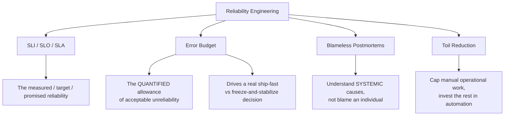
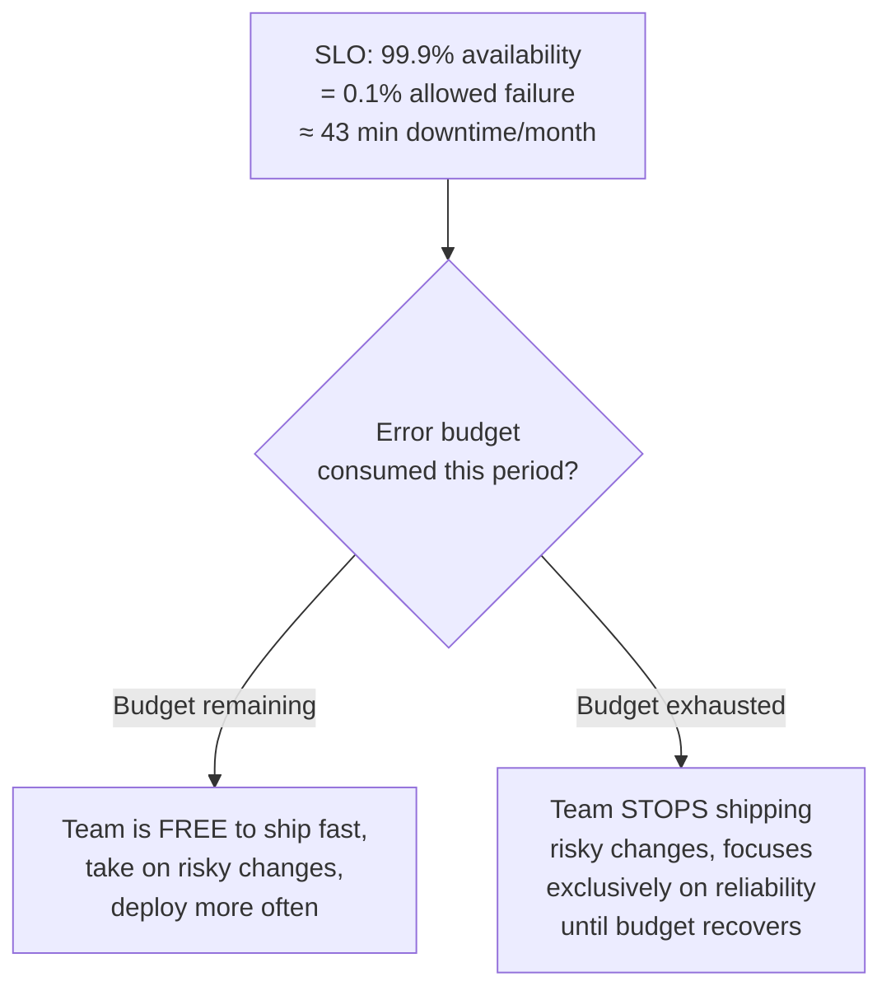

# Reliability Engineering

> [!abstract] What you'll be able to do after this chapter
> Explain the error budget mechanism precisely enough to describe how it resolves the "speed vs. stability" tension with a quantified policy instead of a political argument, and name blameless postmortems and toil reduction as deliberate, specific SRE practices rather than vague culture buzzwords.

> [!info] Distinct from Resilience Patterns
> [[CS Fundamentals/06 - Distributed Systems/Resilience Patterns|The Resilience Patterns chapter]] covers *code-level* tools (circuit breaker, retry, bulkhead) that help a system hit a reliability target. This chapter covers the *organizational practice* of defining that target, measuring against it, and deciding what to do when it's at risk — a genuinely different layer.

---

## The big picture

## What is it, and why does it exist?

Site Reliability Engineering (SRE), pioneered at Google, applies software-engineering approaches to operations problems — treating reliability itself as a feature to be engineered and measured, not just an outcome you hope for.

**The problem this solves:** without a shared, quantified definition of "reliable enough," engineering teams face an unbounded, unproductive tension — infinite additional reliability effort could always theoretically make a system more stable, at ever-increasing cost, while product teams want to ship features fast. Before SRE formalized this, it was typically an unstructured political argument ("ops wants stability, product wants speed") rather than a quantified, principled tradeoff either side could reason about together.

> [!example] Layman analogy
> A household risk budget. If your target is "99.9% of days go fine," you have a small, known allowance of bad days per year — spend that allowance wisely (on something that matters, like a genuinely valuable but slightly risky change) rather than being either recklessly unstable or so cautious you never take a worthwhile risk at all.

## Error budget — the mechanism, precisely

> [!success] This is the actual mechanism that resolves "speed vs. stability" — not a slogan
> An SLO directly implies an allowed amount of unreliability — a 99.9% SLO literally means ~43 minutes of downtime is an *acceptable, budgeted* amount per month, not a failure. That allowance is a real, spendable resource: as long as it isn't exhausted, teams are explicitly free to move fast and take risks, since they're still within the agreed reliability target. The moment it's exhausted, the policy is equally explicit: stop shipping new risk, and redirect effort to reliability work until the budget recovers. This turns a recurring political argument into a single, quantified, pre-agreed policy — decided once, applied automatically thereafter.

## Blameless postmortems

> [!warning] The specific, deliberate practice — not just "be nice after an incident"
> After an incident, the explicit goal is understanding **systemic** causes — what about the process, the tooling, or the system's design allowed this to happen — rather than identifying which individual to blame for pushing a bad change. This is a genuine, deliberate cultural practice: punishing individuals for honest mistakes teaches people to hide problems and avoid reporting near-misses, which makes the *next* incident more likely and less visible, not less. A blameless postmortem's real output is a set of systemic fixes (better testing, better alerting, a safer deploy process) — not a name.

## Toil reduction

**Toil** is manual, repetitive, automatable operational work — restarting a service by hand, manually running the same investigation script every time an alert fires, manually provisioning a new environment. SRE explicitly tracks and works to reduce it, on the philosophy that reliability engineers should spend a **minority** of their time on manual firefighting and a **majority** on engineering work (automation, tooling) that reduces future toil. Google's own SRE practice famously caps operational toil at roughly 50% of an SRE's time — a genuinely quantified target, not an aspiration.

## Where this shows up later

> [!success] Direct connections
> [[Glossary/SLA vs SLO vs SLI|SLA vs SLO vs SLI]] — the definitions this chapter's error-budget mechanism is built on top of. [[CS Fundamentals/06 - Distributed Systems/Resilience Patterns|Resilience Patterns]] — the code-level tools (circuit breakers, retries) that directly help protect the error budget from being consumed by preventable failures.

---

## Interview Q&A

> [!question]- What happens in practice when a team's error budget is exhausted mid-quarter?
> The team halts non-essential risky deploys (new features, large refactors) and reprioritizes toward fixing the underlying reliability issues consuming the budget — this is a real, enforced policy in mature SRE practices, not just guidance, precisely because an unenforced policy is no different from having no policy at all.

> [!question]- Why does a 100% reliability target not make sense as a goal?
> Because pursuing reliability past what users/business actually need has real, escalating cost with diminishing returns, and paradoxically makes a system *less* agile — every change becomes terrifying if there's zero tolerance for any failure at all. The error budget deliberately builds in an accepted, non-zero failure allowance specifically so the org can still move and take reasonable risks.

> [!question]- How is a blameless postmortem different from just "not firing anyone" after an incident?
> It's an active practice, not merely an absence of punishment — the postmortem explicitly documents the timeline, the systemic contributing factors, and concrete follow-up actions to prevent recurrence, treating the incident as a source of engineering data rather than a performance review event for whoever was on call.

## Summary / Cheat Sheet

- **SRE** = applying software-engineering discipline to reliability, not just "ops, but careful."
- **Error budget** = the quantified allowance of acceptable unreliability an SLO implies — spend it on shipping fast when unspent; freeze risky changes when exhausted.
- **Blameless postmortems** = find systemic causes, not individuals to blame — a deliberate practice, since blame teaches people to hide problems.
- **Toil reduction** = cap manual operational work, invest the majority of effort in automation that prevents future toil.

---
*Related: [[CS Fundamentals/00 - Learning Path|CS Fundamentals Learning Path]] · [[Glossary/SLA vs SLO vs SLI|SLA vs SLO vs SLI]] · [[CS Fundamentals/06 - Distributed Systems/Resilience Patterns|Resilience Patterns]]*
