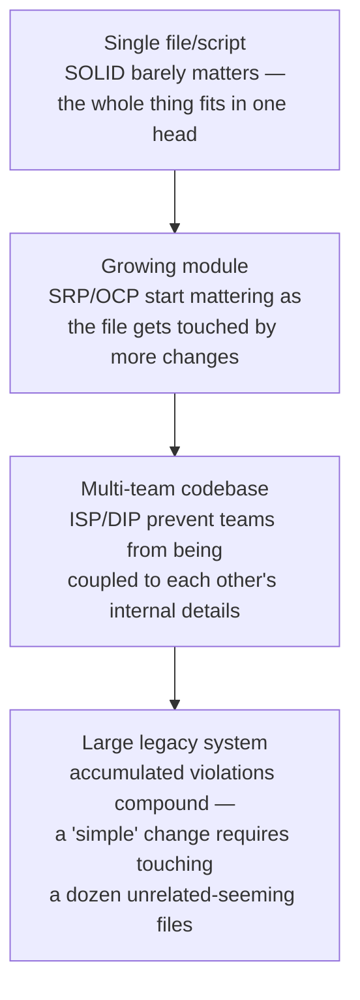

# SOLID Principles

> [!abstract] What you'll be able to do after this chapter
> Name all 5 principles precisely with a real code-level example of each, explain why they're pulling in the same direction, and know when over-applying one of them creates more problems than it solves.

> [!info] Where these already showed up
> Every LLD chapter in this handbook proves 2-3 SOLID principles inline as part of its bad-code-first-refactor — this chapter is the **consolidated reference**, pulling all 5 into one place with the specific line-of-code evidence for each, since a reader shouldn't have to hunt across 20 chapters to see them side by side.

---

## Why this exists

SOLID isn't five independent rules — it's five angles on the same underlying goal: code that can grow new requirements by **adding**, not by **rewriting**. Every principle below is really a specific, checkable way to catch the same disease early: a design that's cheap to write once and expensive to change twice.

## S — Single Responsibility Principle

> [!info] Definition
> A class/module should have exactly one reason to change.

> [!example] Layman
> A Swiss Army knife trying to be a chef's knife, a screwdriver, and a bottle opener all at once — fine in a pinch, bad the moment you need to sharpen just the blade without risking the screwdriver breaking in the same tool body.

**Violation, concretely:** a `ParkingLot` struct that's simultaneously responsible for spot allocation logic, fee calculation logic, *and* whatever gets bolted on next — a change meant for pricing risks regressing spot allocation, since they live in the same blast radius.

**Example:** [[LLD/01 - Design a Parking Lot/Design a Parking Lot|Design a Parking Lot]] names this violation explicitly, in the exact bad-draft code, before extracting pricing into its own `PricingStrategy`.

## O — Open/Closed Principle

> [!info] Definition
> Software entities should be open for extension, but closed for modification — add new behavior without editing existing, already-tested code.

> [!example] Layman
> A power strip — you add a new device by plugging into a new outlet, not by rewiring the strip's internal circuitry every single time.

**Violation, concretely:** adding a new vehicle type means editing `CalculateFee` — a function already handling three other vehicle types' pricing, all of which now risk regression from a change meant for one new case.

**Example:** [[LLD/01 - Design a Parking Lot/Design a Parking Lot|Design a Parking Lot]]'s fix — adding "EV chargers, first 2 hours free" becomes "write one new struct implementing `PricingStrategy`, register it in the factory" — zero lines changed in `ParkingLot` itself.

## L — Liskov Substitution Principle

> [!info] Definition
> A subtype must be substitutable for its base type without breaking the correctness of code that uses the base type.

> [!example] Layman
> If a toy is sold as a "duck" (implements a `Duck` interface promising `Quack()`), every toy sold as a duck had better actually quack convincingly when squeezed — a "duck" that meows when squeezed breaks the promise, even if it technically compiles and fits in the box.

**The classic violation:** a `Square` subclassing `Rectangle` — mathematically a square *is* a rectangle, but if `Rectangle` exposes independent `SetWidth`/`SetHeight`, a `Square` that forces both to stay equal silently breaks any code that assumed setting width alone wouldn't also change height. The type checks out; the *behavior contract* doesn't.

**Where this matters in this book:** any `Strategy` or `State` interface implementation that technically satisfies the method signature but violates the *behavioral* contract callers assume — e.g., a `PricingStrategy` implementation that returns a negative final amount would compile fine but violate every caller's implicit assumption that a price is non-negative. The interface's signature alone never fully captures the contract; LSP is the reminder that behavior matters as much as the type signature.

## I — Interface Segregation Principle

> [!info] Definition
> Many small, client-specific interfaces beat one large, general-purpose interface — no client should be forced to depend on methods it doesn't use.

> [!example] Layman
> A job application form asking every applicant — even a cashier candidate — to fill out a "pilot's license number" field. Force-fitting one giant form on everyone means most fields are irrelevant noise for most people.

**Violation, concretely:** a single fat `Notifier` interface with `SendEmail`, `SendSMS`, `SendPush`, `SendSlackMessage` — any implementation forced to satisfy all four even if it only ever sends one kind, and any caller depending on the interface now depends on methods it will never call.

**Example:** [[LLD/08 - Design a Notification System/Design a Notification System|the Notification System chapter's]] narrow, single-method `NotificationChannel` interface — each channel implementation only ever needs to satisfy the one method it actually does.

## D — Dependency Inversion Principle

> [!info] Definition
> High-level modules shouldn't depend on low-level modules — both should depend on abstractions. Abstractions shouldn't depend on details; details should depend on abstractions.

> [!example] Layman
> A lamp plugs into a standard wall socket (the abstraction), not hard-wired directly into one specific power plant's internal wiring — swap power providers freely without ever rewiring the lamp.

**Violation, concretely:** a `ParkingLot` struct directly instantiating a concrete `FlatRatePricing` struct inside its own constructor — the high-level parking-lot logic is now welded to one specific low-level pricing implementation, and testing `ParkingLot` in isolation means dragging the real pricing logic along with it.

**Example:** [[LLD/01 - Design a Parking Lot/Design a Parking Lot|Design a Parking Lot]]'s constructor accepts a `PricingStrategy` **interface** as a parameter rather than constructing one internally — the code comment there literally reads *"that's Dependency Inversion in one line."*

---

## How the five reinforce each other

> [!tip] They're not five separate checklist items — they're one habit viewed from five angles
> SRP keeps each piece small enough to reason about. OCP is what SRP *enables* — a well-separated piece can be extended without touching its neighbors. LSP is the guardrail that keeps OCP's extensions honest (a new implementation that technically compiles but breaks callers' assumptions defeats the whole point of extending safely). ISP keeps the *contracts* between pieces minimal, so OCP-driven extension doesn't drag in irrelevant obligations. DIP is what makes the wiring between all of them swappable and testable in the first place — accepting an interface instead of constructing a concrete type is the mechanical move that makes every principle above actually usable in practice.

## Where over-applying SOLID backfires

> [!warning] SOLID is a direction, not a target to maximize
> Splitting a class into ten single-method classes "for SRP" or an interface into ten one-method interfaces "for ISP" can produce code that's technically compliant and practically unreadable — more files to navigate, more indirection to trace, for a system too small to ever need that flexibility. The real skill being tested in an interview isn't reciting all 5 principles — it's recognizing *when a specific violation is actually going to cause pain* (a new requirement is clearly coming that the current design can't absorb without a rewrite) versus over-engineering flexibility nobody asked for.

## Scaling: one file to a large, multi-team codebase

## Failure scenarios — concrete consequences of each violation

> [!bug] What actually happens
> - **SRP violation:** merge conflicts spike, since unrelated changes (pricing vs. spot allocation) keep landing in the same file — one team's change to pricing risks silently regressing another team's spot-allocation logic sharing the same blast radius.
> - **OCP violation:** every new case (a new vehicle type, a new pricing tier) requires touching and re-testing existing, already-working code — regression risk compounds with every single addition instead of staying isolated to the new case.
> - **DIP violation:** unit testing a high-level module requires standing up its concrete low-level dependency for real — a fast, isolated unit test quietly becomes a slow, brittle integration test, and the team often doesn't notice until test suite runtime has crept up significantly.

## Monitoring — code-health signals

> [!info] What to watch
> **File/function size trend over time** — steady growth in a single file is a direct, visible signal of SRP erosion, worth flagging in review before it compounds. **Churn from unrelated features landing in the same file** — a strong, concrete signal of hidden coupling that a diagram alone wouldn't reveal. **Test setup complexity / mocking difficulty** — a unit test needing an increasingly elaborate setup to isolate the thing under test is a direct, practical signal of a DIP violation, not just an abstract code-smell.

## Common mistakes

> [!warning] Real, recurring errors
> 1. **Over-applying SOLID into unreadable over-abstraction** — the "over-applying SOLID backfires" section above, the chapter's own central warning.
> 2. **Applying full SOLID rigor to a one-off script or throwaway prototype** — pure overhead when the code will never be extended or maintained past its immediate use.
> 3. **Treating Liskov Substitution as purely about class inheritance** — the most commonly missed violation, per the Q&A below: interface implementations that technically satisfy a method signature but silently break an implicit behavioral contract are just as real a violation as a bad subclass.

---

## Interview Q&A

> [!info] Leveled by seniority
> **Beginner:** "What does the 'S' in SOLID stand for and what does it mean?" — Single Responsibility: a class/module should have exactly one reason to change. **Intermediate:** "How do OCP and SRP work together?" — SRP keeps a piece small enough to reason about; OCP is what that separation *enables* — a well-isolated piece can be extended without touching its neighbors. **Senior:** "A team's unit tests have become slow and brittle over the last year — diagnose it." — expects checking for a DIP violation, per the Failure Scenarios above: concrete dependencies baked directly into high-level modules force tests to drag in real, slow dependencies instead of substitutable fakes. **Staff:** "Design the interface boundaries for a payment system where 5 teams each own a different payment provider integration." — expects ISP-driven narrow, provider-specific interfaces plus DIP (each team's module depends on an abstraction, not on another team's concrete implementation), preventing any one team's internal changes from breaking another team's code. **Architect:** "How would you decide whether a SOLID violation in a legacy codebase is worth fixing now versus leaving alone?" — expects weighing the Failure Scenarios' concrete costs (merge-conflict frequency, regression rate, test brittleness) against the refactor's cost and risk — a genuine judgment call, not a reflexive "always refactor toward SOLID."

> [!question]- Give a violation of each principle and how you'd fix it.
> Walk through the [[LLD/01 - Design a Parking Lot/Design a Parking Lot|Parking Lot chapter's]] bad draft directly — it names and fixes an SRP violation, an OCP violation, and a DIP violation with the exact code responsible for each, in sequence, in one refactor.

> [!question]- How does SOLID relate to design patterns?
> Design patterns are largely *named, reusable solutions* that happen to satisfy SOLID — Strategy is OCP applied to "which algorithm runs"; Observer is ISP/DIP applied to "who gets notified." Recognizing SOLID first, and the pattern as the natural consequence of following it, is a stronger interview answer than memorizing the pattern name in isolation. See [[CS Fundamentals/10 - Design Principles/Design Patterns Cheat Sheet|the Design Patterns Cheat Sheet]] for the full pattern-by-pattern breakdown.

> [!question]- Which principle do people misunderstand most often?
> Liskov Substitution — most engineers correctly avoid obviously-wrong inheritance, but miss the subtler *behavioral* contract violations (an interface implementation that technically satisfies the method signature but breaks an implicit assumption every caller relies on, like a `PricingStrategy` that can return a negative price).

---
*Related: [[00 - Start Here/How This Handbook Works|Book Map]] · [[CS Fundamentals/10 - Design Principles/Design Patterns Cheat Sheet|Design Patterns Cheat Sheet]] · [[LLD/01 - Design a Parking Lot/Design a Parking Lot|Design a Parking Lot]]*
