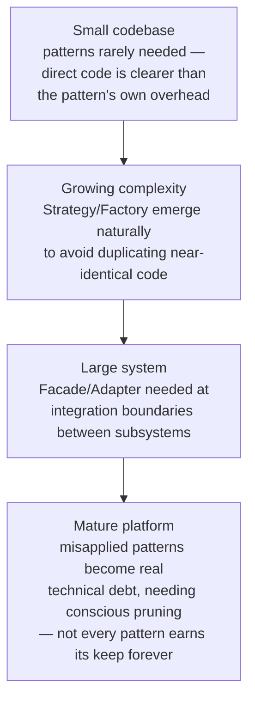

# Design Patterns Cheat Sheet

> [!abstract] What you'll be able to do after this chapter
> Recognize all 23 classic GoF patterns by their real-world shape, not their name — every single one now has real Go code (before *and* after) somewhere in this handbook, either as a full narrative LLD case study or in one of the 3 category deep-dive chapters this one indexes.

> [!info] How this chapter is organized
> 8 patterns get a **full LLD chapter** elsewhere in this book — built via bad-code-first-refactor, complete Go code, real interview Q&A. Those are linked, not re-taught here. The remaining 15 each get a **full before/after Go code pair** — real bad code, the exact refactor, tradeoffs — in one of 3 dedicated deep-dive chapters, grouped by category: [[CS Fundamentals/10 - Design Principles/03 - Creational Design Patterns - Full Code Deep Dive|Creational]], [[CS Fundamentals/10 - Design Principles/04 - Structural Design Patterns - Full Code Deep Dive|Structural]], [[CS Fundamentals/10 - Design Principles/05 - Behavioral Design Patterns - Full Code Deep Dive|Behavioral]]. The entries below stay at cheat-sheet depth (definition, layman analogy, when to reach for it) — go to the deep-dive chapters for the actual code.

> [!tip] Concurrency patterns aren't GoF, but they're just as real
> [[CS Fundamentals/10 - Design Principles/06 - Concurrency Patterns in Go|Concurrency Patterns in Go]] covers 5 patterns (Worker Pool, Pipeline, Fan-out/Fan-in, Context Cancellation, Pub-Sub) that don't appear in the classic 23 at all — GoF predates concurrency-first language design. Genuinely asked in Go-based system design interviews, and worth knowing as their own category, not squeezed into the GoF taxonomy.

> [!tip] Never memorize a pattern name — recognize the shape
> Every entry below states the **problem shape** first. In an interview, you rarely get asked "implement the Decorator pattern" — you get a requirement that *has* Decorator's shape, and the strongest answer names the pattern because you recognized the shape, not because you pattern-matched a keyword.

---

## Creational patterns — controlling how objects get created

> [!question]- Factory Method — *"pick which concrete type to build based on some input, without the caller knowing the concrete types"*
> **Layman:** ordering "a coffee" at a counter — you don't specify the exact machine or bean grind; the barista (factory) decides the concrete steps based on what you ordered.
> **When to use:** the exact concrete type needed isn't known until runtime, and you want callers depending only on the abstract type.
> **Full chapter:** [[LLD/01 - Design a Parking Lot/Design a Parking Lot|Design a Parking Lot]] — a `PricingStrategyFactory` selects the concrete pricing implementation per vehicle type.

> [!question]- Abstract Factory — *"produce a whole FAMILY of related objects that must stay consistent with each other"*
> **Layman:** ordering a full "meal combo" where the burger, fries, and drink are all picked to match one theme (the whole family swaps together, not piece by piece).
> **When to use:** you need to guarantee several related objects are created from the same consistent "family" — e.g. a UI toolkit's `LightThemeFactory` vs `DarkThemeFactory`, each producing a matching button, checkbox, and scrollbar.
> **Go note:** less common in idiomatic Go than in classic OOP languages — Go's composition-over-inheritance style often reaches for a simple `Config` struct or a set of constructor functions grouped by a shared prefix instead.

> [!question]- Builder — *"construct a complex object step by step, especially when it has many optional parameters"*
> **Layman:** ordering a custom sandwich by specifying each layer one at a time, rather than being forced to list all 15 possible ingredients (most left empty) in one giant order form.
> **Go idiom:** the **functional options pattern** *is* Go's idiomatic Builder — `NewServer(WithPort(8080), WithTLS(cert))` — each `With...` function is a builder step, avoiding both a bloated constructor signature and Go's lack of default parameters.
> **When to use:** a constructor would otherwise need many optional parameters, most of which are only occasionally set.

> [!question]- Singleton — *"exactly one instance of this type must ever exist, globally accessible"*
> **Layman:** a country having exactly one central bank — not "hard to make more of," but genuinely *shouldn't* have more than one, since two would issue conflicting currency decisions.
> **Go idiom:** `sync.Once` for thread-safe lazy initialization — `var once sync.Once; once.Do(func() { instance = &Config{} })` guarantees the initializer runs exactly once even under concurrent first-access.
> **Why it's controversial:** hidden global state makes unit testing hard (tests can't easily swap in a fake instance) and can hide a genuine concurrency bug if the "single" instance isn't actually thread-safe internally. A shared, stateless config or logger is a legitimate use; a mutable global "god object" usually isn't — worth naming this tension explicitly rather than presenting Singleton as an unqualified good.

> [!question]- Prototype — *"create a new object by cloning an existing one, instead of building from scratch"*
> **Layman:** photocopying a filled-out form instead of writing a blank one from memory each time, then just correcting the fields that differ.
> **When to use:** constructing an object from scratch is expensive (heavy initialization, deep config), but a similar object already exists to copy from.
> **Go note:** Go's value semantics (`newObj := *existingObj` for a shallow copy) make this pattern almost invisible compared to reference-heavy languages — an explicit `Clone()` method is needed only when deep-copying nested pointers/slices correctly matters.

## Structural patterns — composing objects into larger structures

> [!question]- Adapter — *"make an existing interface compatible with the interface your code expects, without modifying the original"*
> **Layman:** a physical travel plug adapter — it doesn't change your laptop charger or the foreign wall socket, it just sits between them so the two incompatible shapes can connect.
> **When to use:** integrating a third-party SDK or legacy code whose interface doesn't match what your code expects, and you can't (or shouldn't) modify the original.
> **Example:** wrapping a specific payment provider's SDK (Stripe, Razorpay) behind your own `PaymentGateway` interface — [[HLD/17 - Design a Payment System/Design a Payment System|the Payment System chapter's]] provider-agnostic design implies exactly this shape at the integration boundary.

> [!question]- Bridge — *"decouple an abstraction from its implementation so the two can vary independently"*
> **Layman:** a universal TV remote whose buttons (abstraction) work identically no matter which TV brand's internal signal protocol (implementation) is on the other end — change either side without touching the other.
> **When to use:** you have two independent dimensions of variation (e.g., "what kind of notification" × "which delivery provider") and don't want `N × M` concrete classes for every combination.

> [!question]- Composite — *"treat a single object and a group of objects through the exact same interface, uniformly"*
> **Layman:** a folder in a file system — asking "how big is this?" works identically whether it's a single file or a folder containing a thousand nested folders; the caller never needs to know which.
> **Full chapters:** [[LLD/09 - Design Chess/Design Chess|Design Chess]] (pieces sharing polymorphic move logic instead of a type switch) and [[LLD/16 - Design a File System/Design a File System|Design a File System]] (the canonical textbook use case — files and directories through one `FileSystemNode` interface).

> [!question]- Decorator — *"add behavior to an individual object dynamically, by wrapping it, without altering its class or affecting other instances"*
> **Layman:** stacking pizza toppings — each topping wraps the base pizza with an added layer, and you can stack as many or as few as you want, in any combination, without needing a separate pre-made pizza type for every possible topping combination.
> **When to use:** you need combinable, optional behavior layered on a base object — the alternative (subclassing every combination) explodes combinatorially.
> **Example:** [[LLD/13 - Design a Food Delivery System/Design a Food Delivery System|the Food Delivery chapter's]] interview Q&A names exactly this shape — a `ChainedPricingStrategy` wrapping a base pricing strategy to stack multiple promos, without the base `PricingStrategy` needing to know stacking exists.

> [!question]- Facade — *"provide one simple, unified interface in front of a complex subsystem of many moving parts"*
> **Layman:** a hotel concierge — you ask for "a nice dinner reservation," and the concierge handles calling the restaurant, arranging transport, and confirming the table, without you ever touching those individual systems yourself.
> **When to use:** a subsystem has many components with a complex internal protocol between them, and most callers only need a small, simple slice of that complexity exposed.
> **System-design-level example:** [[CS Fundamentals/02 - Networking/API Gateway|the API Gateway]] is architecturally a Facade applied at the whole-system level — one simple entry point in front of dozens of internal services' complexity.

> [!question]- Flyweight — *"share common, immutable state across many objects instead of duplicating it per instance, to save memory"*
> **Layman:** a print shop keeping one master stencil for a common design and reusing it to stamp thousands of copies, instead of hand-drawing the design fresh onto every single copy.
> **When to use:** a huge number of similar objects would otherwise each redundantly store identical data (e.g., the shared movement rules for every Bishop on a chess board don't need to be duplicated per-piece-instance).
> **Example:** a natural extension of [[LLD/09 - Design Chess/Design Chess|the Chess chapter's]] shared move-logic design, taken one step further by making that shared logic a single reused instance rather than merely a shared method implementation.

> [!question]- Proxy — *"a stand-in object that controls access to another object — lazy-loading it, caching its results, or checking permissions before forwarding the call"*
> **Layman:** a receptionist who screens calls before connecting you to the actual person — same eventual access, but with a controlled gate in front of it.
> **When to use:** you need to add access control, lazy initialization, logging, or caching around an object *without changing the object itself or its callers*.
> **System-design-level example:** a cache-aside layer is architecturally a **caching proxy**; [[HLD/02 - Design a Rate Limiter/Design a Rate Limiter|a rate limiter sitting in front of a service]] is architecturally a **protection proxy** — both control access to the real object rather than being the real object.

## Behavioral patterns — how objects communicate and share responsibility

> [!question]- Strategy — *"make an algorithm/behavior swappable at runtime, by extracting it behind a shared interface"*
> **Layman:** choosing a route on a GPS — walking, driving, and transit are three interchangeable strategies for the same "get me from A to B" goal, swapped based on context.
> **Full chapters:** the most-reused pattern in this book — [[LLD/01 - Design a Parking Lot/Design a Parking Lot|Parking Lot]] (pricing), [[LLD/04 - Design a Rate Limiter/Design a Rate Limiter|Rate Limiter]] (token bucket vs sliding window), [[LLD/03 - Design an Elevator System/Design an Elevator System|Elevator]] (dispatch), [[LLD/14 - Design an LRU Cache (pluggable eviction)/Design an LRU Cache (pluggable eviction)|LRU Cache]] (eviction policy), [[LLD/19 - Design a Stock Exchange/Design a Stock Exchange|Stock Exchange]] (order matching).

> [!question]- Observer — *"one-to-many: when a subject's state changes, automatically notify every registered subscriber, without the subject knowing what they'll do with it"*
> **Layman:** a newsletter — the publisher doesn't know or care who's subscribed or what they'll do with the email; it just broadcasts to whoever signed up.
> **Full chapters:** [[LLD/08 - Design a Notification System/Design a Notification System|Notification System]] (global `EventPublisher`) and [[LLD/22 - Design Google Meet/Design Google Meet|Google Meet]] (room-**scoped** Observer) — deliberately contrasted in that chapter for the different broadcast scope.

> [!question]- State — *"an object's behavior changes based on its internal state, modeled as a swappable object instead of a pile of if/else flags"*
> **Layman:** a traffic light — the exact same "signal change" event produces different behavior depending on whether the light is currently red, yellow, or green; the light doesn't recompute logic from scratch each time, it just knows what state it's in.
> **Full chapters:** [[LLD/02 - Design a Vending Machine/Design a Vending Machine|Vending Machine]], [[LLD/03 - Design an Elevator System/Design an Elevator System|Elevator]] (movement), [[LLD/11 - Design an ATM/Design an ATM|ATM]], [[LLD/13 - Design a Food Delivery System/Design a Food Delivery System|Food Delivery's]] order lifecycle.

> [!question]- Command — *"turn a request/action into a standalone object, so it can be queued, logged, undone, or passed around like data"*
> **Layman:** a restaurant order ticket — the waiter doesn't cook on the spot; they write the order as a discrete, passable object that the kitchen executes later, and a cancelled ticket can be pulled back out.
> **Full chapters:** [[LLD/11 - Design an ATM/Design an ATM|ATM]] (`WithdrawCommand.Undo()` for rare failure recovery) and [[LLD/15 - Design a Text Editor/Design a Text Editor|Text Editor]] (undo/redo as Command's *primary* feature, not a safety net) — the same pattern, deliberately contrasted for different emphasis.

> [!question]- Chain of Responsibility — *"pass a request along a chain of handlers, each deciding to act, pass it on, or stop it"*
> **Layman:** a customer complaint escalation line — the first-line agent tries to resolve it; if they can't, it passes to a supervisor, then a manager, each link deciding whether to handle it or forward it further.
> **Full chapters:** [[LLD/07 - Design a Logger Framework/Design a Logger Framework|Logger Framework]] ("all handlers act" variant) and [[LLD/08 - Design a Notification System/Design a Notification System|Notification System]] ("first rejection stops the chain" variant) — explicitly contrasted as two different variants of the same GoF pattern.

> [!question]- Mediator — *"centralize how a group of peer objects communicate, so they never need direct references to each other"*
> **Layman:** an air traffic controller — pilots never talk directly to every other plane in the sky; they all talk to the tower, which coordinates who does what.
> **Full chapter:** [[LLD/18 - Design a Chat Application/Design a Chat Application|Design a Chat Application]] — `ChatRoom` as Mediator, explicitly contrasted against Observer despite both involving a "room" coordinating multiple participants.

> [!question]- Memento — *"capture and externally store an object's internal state so it can be restored later, without violating its encapsulation"*
> **Layman:** a video game save file — a full snapshot of exactly where you were, restorable later, without the save file needing to understand *how* the game works internally.
> **Considered and deliberately rejected in this book:** [[LLD/15 - Design a Text Editor/Design a Text Editor|the Text Editor chapter]] explicitly considered Memento for undo/redo and chose Command-based delta storage instead — snapshotting the *entire* document on every keystroke is correct but wasteful; storing only the small delta each command needs to reverse itself is far cheaper. Worth being able to explain *why* a textbook-obvious pattern was the wrong fit here — a stronger interview answer than reaching for the "expected" pattern reflexively.

> [!question]- Template Method — *"define the fixed skeleton of an algorithm in a base method, letting subclasses/callers plug in only the specific varying steps"*
> **Layman:** a recipe card with fixed steps ("preheat, mix, bake, cool") where only the specific ingredients change per recipe — the *order and structure* stays identical every time.
> **When to use:** several algorithms share the same overall sequence of steps but differ in one or two specific steps — the shared skeleton lives in one place instead of being copy-pasted with small variations.
> **Where this shape appears implicitly:** a turn-based game loop (check win condition → get move → apply move → switch turn) shared across [[LLD/09 - Design Chess/Design Chess|Chess]] and [[LLD/10 - Design Tic-Tac-Toe with AI/Design Tic-Tac-Toe with AI|Tic-Tac-Toe]] — the loop's skeleton is identical; only "what counts as a valid move" and "what counts as a win" vary per game.

> [!question]- Visitor — *"add a new operation across a whole family of related types without modifying any of those types"*
> **Layman:** a museum tour guide who visits different exhibit types (paintings, sculptures, artifacts) and knows exactly what to say about each, without the exhibits themselves needing to know how to describe themselves to every possible kind of visitor.
> **Go-specific limitation, honestly stated:** Visitor leans heavily on method overloading (`Visit(Circle)`, `Visit(Square)`, dispatched by the compiler based on the argument's concrete type) — a feature Go doesn't have. Implementing Visitor in Go usually means a type switch or an interface with differently-named methods per type, which partially defeats the pattern's original elegance. Worth naming this as a real, honest limitation rather than forcing Visitor into Go unnaturally.

> [!question]- Iterator — *"provide sequential access to a collection's elements without exposing how the collection is actually structured internally"*
> **Layman:** flipping through a photo album page by page — you don't need to know whether the photos are stored by date, by album, or some other internal order; "next" always works the same way.
> **Go-native idiom:** Go's `range` keyword over slices/maps/channels, and the channel-based generator pattern (a goroutine pushing values onto a channel that callers `range` over), are essentially built-in Iterator implementations — worth naming this as Go having *baked the pattern into the language*, not requiring a hand-rolled `HasNext()`/`Next()` interface the way Java historically did.

> [!question]- Interpreter — *"define a grammar for a small language, plus a way to evaluate/interpret expressions written in it"*
> **Layman:** a translator who understands a specific set of grammar rules well enough to convert spoken sentences in that language into actions.
> **When to use:** rare in general application code, common when parsing a small domain-specific expression — recurrence rules, search query syntax, a rule engine's condition language.
> **Example:** [[HLD/21 - Design Google Calendar/Design Google Calendar|Google Calendar's]] RRULE-style recurrence strings (`"every Monday and Wednesday until..."`) are exactly the kind of small grammar Interpreter exists to parse and evaluate — the calendar chapter implements the *effect* of this (expanding recurrence rules) without building a general-purpose Interpreter framework around it, a reasonable scope choice for that chapter.

---

## Quick-reference table

| Pattern | Category | Full chapter / code? |
|---|---|---|
| Factory Method | Creational | ✅ [[LLD/01 - Design a Parking Lot/Design a Parking Lot\|Parking Lot]] (full LLD chapter) |
| Abstract Factory | Creational | ✅ [[CS Fundamentals/10 - Design Principles/03 - Creational Design Patterns - Full Code Deep Dive\|Creational Deep Dive]] (before/after code) |
| Builder | Creational | ✅ [[CS Fundamentals/10 - Design Principles/03 - Creational Design Patterns - Full Code Deep Dive\|Creational Deep Dive]] (Go functional options) |
| Singleton | Creational | ✅ [[CS Fundamentals/10 - Design Principles/03 - Creational Design Patterns - Full Code Deep Dive\|Creational Deep Dive]] (`sync.Once`) |
| Prototype | Creational | ✅ [[CS Fundamentals/10 - Design Principles/03 - Creational Design Patterns - Full Code Deep Dive\|Creational Deep Dive]] |
| Adapter | Structural | ✅ [[CS Fundamentals/10 - Design Principles/04 - Structural Design Patterns - Full Code Deep Dive\|Structural Deep Dive]] |
| Bridge | Structural | ✅ [[CS Fundamentals/10 - Design Principles/04 - Structural Design Patterns - Full Code Deep Dive\|Structural Deep Dive]] |
| Composite | Structural | ✅ [[LLD/09 - Design Chess/Design Chess\|Chess]], [[LLD/16 - Design a File System/Design a File System\|File System]] (full LLD chapters) |
| Decorator | Structural | ✅ [[CS Fundamentals/10 - Design Principles/04 - Structural Design Patterns - Full Code Deep Dive\|Structural Deep Dive]] (linked to Food Delivery follow-up) |
| Facade | Structural | ✅ [[CS Fundamentals/10 - Design Principles/04 - Structural Design Patterns - Full Code Deep Dive\|Structural Deep Dive]] (API Gateway parallel) |
| Flyweight | Structural | ✅ [[CS Fundamentals/10 - Design Principles/04 - Structural Design Patterns - Full Code Deep Dive\|Structural Deep Dive]] |
| Proxy | Structural | ✅ [[CS Fundamentals/10 - Design Principles/04 - Structural Design Patterns - Full Code Deep Dive\|Structural Deep Dive]] |
| Strategy | Behavioral | ✅ Parking Lot, Rate Limiter, Elevator, LRU Cache, Stock Exchange (full LLD chapters) |
| Observer | Behavioral | ✅ [[LLD/08 - Design a Notification System/Design a Notification System\|Notification System]], [[LLD/22 - Design Google Meet/Design Google Meet\|Google Meet]] (full LLD chapters) |
| State | Behavioral | ✅ Vending Machine, Elevator, ATM, Food Delivery (full LLD chapters) |
| Command | Behavioral | ✅ [[LLD/11 - Design an ATM/Design an ATM\|ATM]], [[LLD/15 - Design a Text Editor/Design a Text Editor\|Text Editor]] (full LLD chapters) |
| Chain of Responsibility | Behavioral | ✅ Logger Framework, Notification System (full LLD chapters) |
| Mediator | Behavioral | ✅ [[LLD/18 - Design a Chat Application/Design a Chat Application\|Chat Application]] (full LLD chapter) |
| Memento | Behavioral | ✅ [[CS Fundamentals/10 - Design Principles/05 - Behavioral Design Patterns - Full Code Deep Dive\|Behavioral Deep Dive]] (contrasted against Text Editor's Command choice) |
| Template Method | Behavioral | ✅ [[CS Fundamentals/10 - Design Principles/05 - Behavioral Design Patterns - Full Code Deep Dive\|Behavioral Deep Dive]] |
| Visitor | Behavioral | ✅ [[CS Fundamentals/10 - Design Principles/05 - Behavioral Design Patterns - Full Code Deep Dive\|Behavioral Deep Dive]] (Go limitation noted) |
| Iterator | Behavioral | ✅ [[CS Fundamentals/10 - Design Principles/05 - Behavioral Design Patterns - Full Code Deep Dive\|Behavioral Deep Dive]] (Go-native via `range`) |
| Interpreter | Behavioral | ✅ [[CS Fundamentals/10 - Design Principles/05 - Behavioral Design Patterns - Full Code Deep Dive\|Behavioral Deep Dive]] (Calendar RRULE parallel) |

## Scaling: recognizing pattern needs as a codebase grows

## Failure scenarios — misapplication in practice

> [!bug] What actually happens
> - **Reaching for a pattern name before identifying a real problem shape:** the exact anti-pattern this chapter's own opening tip warns against — a requirement gets forced into a pattern's shape rather than the pattern being recognized from the requirement's actual shape.
> - **Singleton hiding untestable global state:** already named in the Singleton entry above — a mutable global "god object" makes unit tests unable to swap in a fake instance, and can silently mask a real concurrency bug if the "single" instance isn't actually thread-safe.
> - **Memento-shaped snapshotting used where Command's cheaper delta storage would do:** exactly the tradeoff [[LLD/15 - Design a Text Editor/Design a Text Editor|the Text Editor chapter]] explicitly considered and rejected — a textbook-obvious pattern isn't automatically the right fit for a specific cost profile.

## Monitoring — code-review and maintainability signals

> [!info] What to watch (not runtime metrics — code-health signals)
> **Growing indirection depth** — a stack trace that takes longer to follow with each added layer is a real, noticeable maintainability cost from pattern layering, worth weighing against the flexibility gained. **"Just in case" abstractions with only one real implementation ever built** — a strong signal a pattern was applied for anticipated flexibility that never actually materialized. **Pattern names appearing in PR review comments without a concrete problem being cited** — a sign the pattern is being pattern-matched by keyword rather than by the actual problem shape it solves.

## Common mistakes

> [!warning] Real, recurring errors
> 1. **Pattern-name-first instead of problem-shape-first** — the chapter's own central, opening warning, worth repeating as the single most common mistake.
> 2. **Forcing a GoF pattern into Go where the language already has a native idiom** — Iterator via `range`, Builder via functional options, both named above; reaching for the classic hand-rolled version when Go's idiom already covers the need adds unnecessary ceremony.
> 3. **Confusing structurally similar patterns** — Decorator vs. Proxy, Strategy vs. State, both covered in the Interview Q&A below; genuinely easy to conflate without a precise distinguishing question in mind.

---

## Interview Q&A

> [!info] Leveled by seniority
> **Beginner:** "What's the difference between a creational, structural, and behavioral pattern?" — creational controls object creation, structural composes objects into larger structures, behavioral governs how objects communicate. **Intermediate:** "Why does this book emphasize recognizing a pattern's 'shape' over memorizing its name?" — real interview requirements rarely name a pattern directly; the strongest answer comes from recognizing the underlying problem shape and naming the pattern as a consequence. **Senior:** "A codebase has ten single-method classes, each implementing its own single-method interface, and the team says it's 'following SOLID and using patterns correctly' — assess it." — expects recognizing the over-application warning above: technically compliant, practically unreadable, added indirection for flexibility the system was never going to need. **Staff:** "Design the pattern usage for a payment system integrating 5 different payment providers with different APIs." — expects Adapter at the integration boundary (each provider wrapped behind one consistent interface) combined with Strategy if provider selection itself needs to vary at runtime — two patterns solving two genuinely different sub-problems, not one pattern stretched to cover both. **Architect:** "How would you audit a large, mature codebase for pattern misapplication accumulated over years?" — expects using the Monitoring section's signals (indirection depth, single-implementation abstractions, unjustified pattern references) as a concrete, non-subjective starting point, rather than a purely opinion-based architecture review.

> [!question]- How do you decide between Strategy and State when both involve swappable behavior objects?
> Strategy is chosen by the *caller* and typically stays fixed for an object's lifetime (which pricing rule applies to this parking lot). State is driven by the *object's own internal transitions* and changes itself over time in response to events (an order moving from PLACED to DELIVERED). If the "which implementation" decision is external and stable, it's Strategy; if it's internal and changes as a direct consequence of the object's own behavior, it's State.

> [!question]- Which patterns are most commonly confused with each other, and how do you tell them apart?
> Decorator vs. Proxy — both wrap an object behind the same interface, but Decorator *adds* new behavior/responsibility, while Proxy *controls access* to existing behavior without adding new responsibility. Strategy vs. State — covered above. Observer vs. Mediator — covered in depth in [[LLD/18 - Design a Chat Application/Design a Chat Application|the Chat Application chapter]] (broadcasting a change vs. centralizing communication).

> [!question]- Why does this book only build full narrative LLD chapters for 8 of the 23 patterns, if all 23 now have code?
> Those 8 are the ones that show up constantly in real interview questions across genuinely different domains (booking systems, notification pipelines, game logic, undo/redo, chat) — they earn a full, real requirement to design around, end to end. The other 15 get a real before/after code pair in the deep-dive chapters (not a snippet), but not a full narrative case study, because inventing an artificial problem just to justify a dedicated chapter around each would mean working backward from the solution instead of forward from a real requirement — exactly the anti-pattern this book's LLD teaching method is designed to avoid. The before/after pair still shows you the bad code, why it breaks, and the exact fix — just without a full system wrapped around it.

## Concurrency patterns — a different category entirely

> [!info] Not GoF, but genuinely important for this handbook's Go-based LLD chapters
> [[CS Fundamentals/10 - Design Principles/06 - Concurrency Patterns in Go|Concurrency Patterns in Go]] covers Worker Pool, Pipeline, Fan-out/Fan-in, Context Cancellation, and Pub-Sub — none of these appear in the classic 23, since GoF predates concurrency-first language design entirely. Real, commonly-asked, and worth knowing as their own category rather than forced into the GoF taxonomy.

---
*Related: [[00 - Start Here/How This Handbook Works|Book Map]] · [[CS Fundamentals/10 - Design Principles/01 - SOLID Principles|SOLID Principles]] · [[CS Fundamentals/10 - Design Principles/03 - Creational Design Patterns - Full Code Deep Dive|Creational Design Patterns]] · [[CS Fundamentals/10 - Design Principles/04 - Structural Design Patterns - Full Code Deep Dive|Structural Design Patterns]] · [[CS Fundamentals/10 - Design Principles/05 - Behavioral Design Patterns - Full Code Deep Dive|Behavioral Design Patterns]] · [[CS Fundamentals/10 - Design Principles/06 - Concurrency Patterns in Go|Concurrency Patterns in Go]]*
