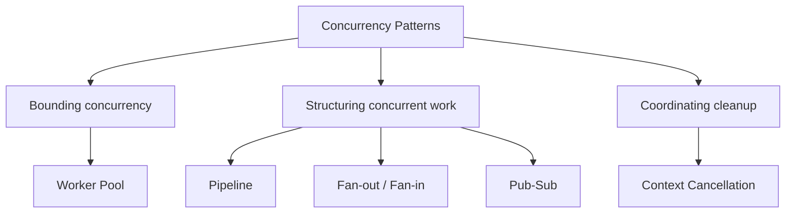

# Concurrency Patterns in Go

> [!abstract] What you'll be able to do after this chapter
> Name 5 patterns that don't appear anywhere in the GoF's 23 — because GoF predates concurrency-first language design — and know exactly which production problem each one fixes, with real before/after Go code for every one.

> [!info] Why this chapter exists, and why it wasn't in the original 23
> The GoF patterns model object composition and responsibility, not concurrent execution — Go's goroutines and channels create an entirely different, real category of recurring problems (unbounded goroutine spawning, sequential pipelines wasting overlap, cancellation that doesn't actually propagate) that every LLD chapter in this Go-based handbook implicitly assumes you already know how to avoid. This chapter makes that knowledge explicit, the same bad-code-first-refactor way the rest of this book teaches everything else.

---

## The big picture



## Worker Pool

> [!example] Layman
> A restaurant kitchen with 5 cooks, not 5,000 — orders queue up and get picked up as a cook frees up, instead of hiring a brand-new cook for every single order that walks in.

**When to use:** processing many items concurrently, but bounded — unbounded goroutine-per-item spawning risks exhausting memory or OS resources at real scale.

```go
// BEFORE — spawns one goroutine PER item, completely unbounded
func ProcessAllBad(items []Item) {
	for _, item := range items {
		go process(item) // 1 million items = 1 million goroutines, zero backpressure
	}
}
```

```go
// AFTER — Worker Pool: a fixed number of goroutines pull from a shared job channel
func WorkerPool(items []Item, numWorkers int) {
	jobs := make(chan Item, len(items))
	var wg sync.WaitGroup

	for w := 0; w < numWorkers; w++ { // exactly numWorkers goroutines, ever, regardless of len(items)
		wg.Add(1)
		go func() {
			defer wg.Done()
			for item := range jobs {
				process(item)
			}
		}()
	}

	for _, item := range items {
		jobs <- item
	}
	close(jobs)
	wg.Wait()
}
```

> [!warning] Tradeoffs
> Pool size needs real tuning — too few underutilizes available CPU, too many recreates the unbounded problem. A fixed pool also doesn't auto-scale with load the way a real dynamic thread-pool executor might; sizing it is a deliberate capacity decision, not a default value.

## Pipeline

> [!example] Layman
> A car assembly line — painting the second car starts while the first car is still being assembled downstream, instead of finishing every car completely before starting the next.

**When to use:** multi-stage processing where each stage's work can genuinely overlap with the next, instead of running fully sequentially.

```go
// BEFORE — fully sequential: read ALL, then transform ALL, then write ALL
func ProcessBad(items []Item) {
	read := readAll(items)
	transformed := transformAll(read)
	writeAll(transformed) // total time = sum of all 3 phases, nothing overlaps
}
```

```go
// AFTER — Pipeline: each stage streams through a channel, stages overlap in time
func generate(items []Item) <-chan Item {
	out := make(chan Item)
	go func() {
		defer close(out)
		for _, i := range items {
			out <- i
		}
	}()
	return out
}

func transform(in <-chan Item) <-chan Item {
	out := make(chan Item)
	go func() {
		defer close(out)
		for i := range in {
			out <- transformOne(i) // starts as soon as generate() produces ANYTHING
		}
	}()
	return out
}

func write(in <-chan Item) {
	for i := range in {
		writeOne(i) // starts as soon as transform() produces anything
	}
}

write(transform(generate(items))) // 3 stages run concurrently, not as 3 sequential phases
```

> [!warning] Tradeoffs
> An unbuffered channel makes a slow downstream stage block an upstream one — usually the desired **backpressure**, but it means debugging a stuck pipeline (which stage is actually blocked?) is genuinely harder than debugging a simple sequential function.

## Fan-out / Fan-in

> [!example] Layman
> A single cashier vs. opening 5 registers for the same line — fan-out is opening more registers to handle the same queue in parallel; fan-in is everyone's receipts landing in one shared till at the end.

**When to use:** CPU-heavy work on a stream of items, where a single goroutine draining the channel serially wastes available cores.

```go
// BEFORE — one goroutine drains the channel serially, wastes multi-core hardware
func ConsumeBad(in <-chan Item) {
	for item := range in {
		heavyCompute(item) // one at a time, regardless of how many CPU cores are idle
	}
}
```

```go
// AFTER — Fan-out: N goroutines read the SAME channel in parallel. Fan-in: merge results.
func fanOut(in <-chan Item, n int) []<-chan Result {
	outs := make([]<-chan Result, n)
	for i := 0; i < n; i++ {
		out := make(chan Result)
		outs[i] = out
		go func() {
			defer close(out)
			for item := range in { // N goroutines competing for the same channel — real parallelism
				out <- heavyCompute(item)
			}
		}()
	}
	return outs
}

func fanIn(chans []<-chan Result) <-chan Result {
	merged := make(chan Result)
	var wg sync.WaitGroup
	for _, c := range chans {
		wg.Add(1)
		go func(c <-chan Result) {
			defer wg.Done()
			for r := range c {
				merged <- r
			}
		}(c)
	}
	go func() { wg.Wait(); close(merged) }()
	return merged
}
```

> [!warning] Tradeoffs
> Fan-in loses input ordering — results arrive in **completion** order, not the order they entered the pipeline. A real, sometimes-unacceptable cost that needs an explicit re-ordering step (tagging each result with its original index) if order genuinely matters downstream.

## Context Cancellation

> [!example] Layman
> Hanging up a phone call — the person on the other end needs to actually notice the line went dead and stop talking; hanging up on your end doesn't physically silence them.

**When to use:** propagating a caller's timeout or cancellation into an in-flight goroutine, so a caller that gives up doesn't leave orphaned work running forever.

```go
// BEFORE — caller times out and moves on, but the goroutine keeps running forever — a leak
func FetchBad(url string) {
	go func() {
		resp := slowHTTPCall(url) // no way to stop this if the caller already gave up
		process(resp)
	}()
}
```

```go
// AFTER — ctx propagates cancellation; the caller isn't blocked once it fires
func Fetch(ctx context.Context, url string) error {
	resultCh := make(chan *http.Response, 1)
	go func() {
		resp, _ := slowHTTPCall(url)
		resultCh <- resp
	}()

	select {
	case resp := <-resultCh:
		process(resp)
		return nil
	case <-ctx.Done(): // caller's deadline/cancellation wins the race
		return ctx.Err()
	}
}

ctx, cancel := context.WithTimeout(context.Background(), 2*time.Second)
defer cancel()
Fetch(ctx, "https://slow-api.example.com")
```

> [!bug] The detail almost everyone misses
> `ctx.Done()` firing lets the **caller** stop waiting — it does **not** force the background goroutine above to actually stop. That goroutine is still blocked inside `slowHTTPCall`, still running, still consuming resources — a genuine leak, only half-fixed. Truly stopping the work requires the goroutine **itself** to check `ctx.Done()` internally (typically by passing `ctx` all the way down into `slowHTTPCall` so it can abort its own blocking I/O), not just the caller giving up on waiting for it.

## Pub-Sub (in-process)

> [!example] Layman
> A radio broadcast vs. individually phoning every listener — the broadcaster sends once; who's tuned in, and how many people, is invisible to the broadcaster.

**When to use:** one component needs to notify multiple, decoupled listeners within the same process — the concurrency-primitive-level version of what [[LLD/08 - Design a Notification System/Design a Notification System|Observer]] solves structurally.

```go
// BEFORE — publisher directly, tightly coupled to every subscriber it must know about
func PublishBad(event Event, subscribers []chan Event) {
	for _, sub := range subscribers { // publisher must enumerate every subscriber itself
		sub <- event // ONE slow subscriber blocks delivery to every other subscriber too
	}
}
```

```go
// AFTER — a Broker decouples publisher from subscribers, non-blocking per subscriber
type Broker struct {
	mu   sync.RWMutex
	subs map[chan Event]bool
}

func (b *Broker) Subscribe() chan Event {
	ch := make(chan Event, 10) // buffered — one slow subscriber doesn't block the others
	b.mu.Lock()
	b.subs[ch] = true
	b.mu.Unlock()
	return ch
}

func (b *Broker) Publish(event Event) {
	b.mu.RLock()
	defer b.mu.RUnlock()
	for ch := range b.subs {
		select {
		case ch <- event:
		default: // subscriber's buffer is full — drop rather than block the publisher
		}
	}
}
```

> [!warning] Tradeoffs — a real, important distinction
> This is lost entirely on process restart and never spans multiple machines — genuinely different from [[CS Fundamentals/05 - Messaging & Streaming/Kafka Internals|Kafka's]] durable, distributed pub-sub. Right tool only for a single process's own internal event fan-out; never a substitute for a real message broker across services.

## Where this shows up later

> [!success] Direct connections
> [[CS Fundamentals/06 - Distributed Systems/Resilience Patterns|Resilience Patterns]] — timeouts and retries both depend on correct context propagation, exactly as shown above. [[CS Fundamentals/05 - Messaging & Streaming/Kafka Internals|Kafka Internals]] — the durable, distributed, cross-machine version of what in-process Pub-Sub does for a single process. [[LLD/08 - Design a Notification System/Design a Notification System|Design a Notification System]] — Observer, the structural pattern Pub-Sub implements at the concurrency-primitive level.

---

## Interview Q&A

> [!info] Leveled by seniority
> **Beginner:** "Why not just spawn a goroutine per item instead of a worker pool?" — unbounded goroutine spawning can exhaust memory/OS resources at real scale; a worker pool bounds concurrency to a deliberate, tunable number. **Intermediate:** "What does a Pipeline actually buy you over a sequential function?" — stages overlap in time instead of running as fully separate phases, reducing total wall-clock time for multi-stage processing. **Senior:** "A service using `context.WithTimeout` still shows leaked goroutines under load — diagnose it." — expects recognizing the Context Cancellation section's central point: the caller stopped waiting, but the goroutine itself never checked `ctx.Done()` internally and kept running. **Staff:** "Design a system processing a high-volume stream where result ordering must be preserved, using Fan-out/Fan-in for CPU parallelism." — expects tagging each item with its original index before fan-out, then explicitly re-sorting by that index after fan-in, since fan-in alone only preserves completion order. **Architect:** "When would you choose in-process Pub-Sub over just using Kafka internally, even within a single service?" — expects recognizing that in-process Pub-Sub is appropriate when the fan-out never needs to survive a restart or cross a process boundary — using Kafka for purely intra-process signaling is real, unnecessary overhead.

## Summary / Cheat Sheet

- **Worker Pool:** bounds concurrency to N goroutines pulling from a shared channel — fixes unbounded per-item goroutine spawning.
- **Pipeline:** chains stages via channels so they overlap in time instead of running fully sequentially.
- **Fan-out/Fan-in:** N goroutines read one channel in parallel (fan-out), merged back into one (fan-in) — loses input ordering, needs an explicit fix if order matters.
- **Context Cancellation:** propagates a caller's timeout into a goroutine — but the goroutine must check `ctx.Done()` itself, or it only half-stops.
- **Pub-Sub (in-process):** a Broker decouples publisher from subscribers with per-subscriber buffering — not a substitute for a real, durable, distributed broker like Kafka.

---
*Related: [[CS Fundamentals/00 - Learning Path|CS Fundamentals Learning Path]] · [[CS Fundamentals/06 - Distributed Systems/Resilience Patterns|Resilience Patterns]] · [[CS Fundamentals/05 - Messaging & Streaming/Kafka Internals|Kafka Internals]] · [[CS Fundamentals/10 - Design Principles/Design Patterns Cheat Sheet|Design Patterns Cheat Sheet]]*
