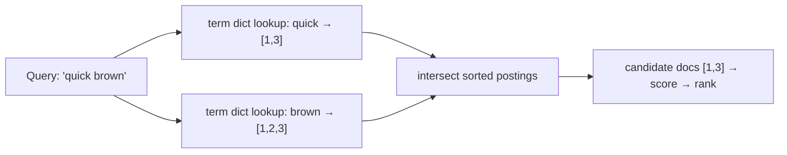
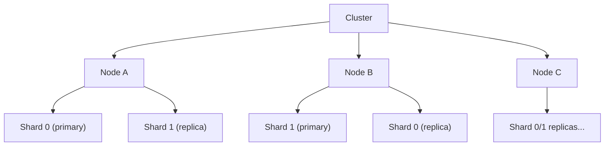
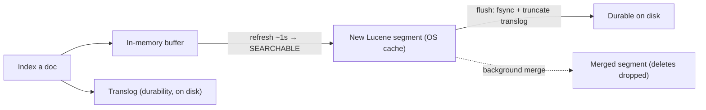
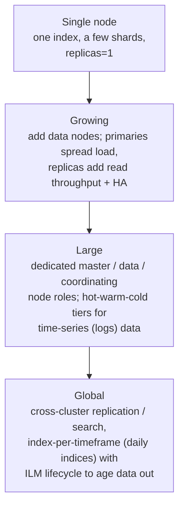

# Full-Text Search: Elasticsearch, OpenSearch & Solr

> [!abstract] What you'll be able to do after this chapter
> Explain *why* a relational `LIKE '%term%'` query cannot scale and what data structure replaces it (the **inverted index**), name **Lucene** as the engine all three products share, describe Elasticsearch's shard/replica/segment model and its **near-real-time** behavior precisely, articulate why **OpenSearch** forked from Elasticsearch, choose between Elasticsearch and Solr on real tradeoffs, and — most importantly for interviews — argue clearly why a search engine is a **secondary index, not a primary database**.

---

## 1. Why search engines exist — the problem a database can't solve

A relational database indexes on **exact-match and range** via [[CS Fundamentals/03 - Databases/Indexes & B+ Trees|B+ Trees]]. Ask it for `WHERE body LIKE '%distributed systems%'` and it must do a **full table scan**, reading every row and substring-matching — `O(n)` over the whole corpus, with no index able to help because a B+ Tree is sorted by the *whole* value, not by the *words inside* it. It also can't answer the questions that actually matter for search:

- **Relevance ranking** — which of 10,000 matching documents is the *best* match, not just *a* match.
- **Linguistic matching** — a search for `running` should match `run`, `ran`, `runs`; `USA` should match `U.S.A.`
- **Typo tolerance, phrase proximity, faceting, autocomplete** — none of which SQL expresses naturally.

> [!tip] The one-sentence framing
> A database answers *"give me the rows where this field equals X"*; a search engine answers *"give me the documents most relevant to these words, ranked."* Different question → different data structure.

## 2. The inverted index — the core data structure

The single idea underneath every search engine. Instead of mapping **document → words** (the "forward" direction), you **invert** it to map **word → list of documents containing it** (the "postings list").

```
Docs:
  1: "the quick brown fox"
  2: "the lazy brown dog"
  3: "quick brown foxes run"

Inverted index (term → postings):
  brown  → [1, 2, 3]
  fox    → [1]
  quick  → [1, 3]
  lazy   → [2]
  dog    → [2]
  run    → [3]
```

Now a search for `quick brown` is not a scan — it's two `O(1)` dictionary lookups (`quick → [1,3]`, `brown → [1,2,3]`) followed by an **intersection/union** of sorted postings lists (`[1,3]`), the same cheap merge-of-sorted-lists primitive that makes this fast at any corpus size. Postings also store **term frequency** and **positions** (for phrase queries) per document — the raw material for scoring in Section 5.



## 3. Lucene — the engine all three share

Here's the fact that collapses the whole topic: **Elasticsearch, OpenSearch, and Solr are all built on Apache Lucene** — a Java library that implements the inverted index, analysis, and scoring. None of the three reimplements search; they wrap Lucene with a distributed layer, a REST API, and operational tooling.

- **Lucene** = the single-machine search library (index + query one JVM's worth of data).
- **Solr** = Lucene + a server + distribution (SolrCloud), released 2004–2008, Apache-governed.
- **Elasticsearch** = Lucene + a distributed system + a JSON/REST API + aggregations, released 2010, designed distributed-first.
- **OpenSearch** = a 2021 fork of Elasticsearch 7.10 (Section 8).

> [!info] Why this matters
> Because they share Lucene, the *core relevance behavior* (inverted index, BM25 scoring, analyzers) is nearly identical across all three. The differences are in the **distribution model, API ergonomics, licensing, and operational tooling** — which is exactly where the interview tradeoffs live.

Lucene stores its index as immutable **segments** — an append-only design directly analogous to the [[CS Fundamentals/03 - Databases/Storage Engines - B-Tree vs LSM-Tree|LSM-Tree]]'s immutable SSTables: writes create new small segments, a background **merge** consolidates them, and deletes are just *marks* (a doc is flagged deleted and only physically removed at merge time — the same tombstone-style pattern seen in [[CS Fundamentals/03 - Databases/Cassandra Internals|Cassandra]]).

## 4. Analysis — turning text into index terms

Before text enters the inverted index it passes through an **analyzer**, a pipeline of three stages. This is *why* search feels "smart":

1. **Character filters** — strip HTML, normalize characters.
2. **Tokenizer** — split text into tokens (usually on whitespace/punctuation).
3. **Token filters** — lowercase, remove **stop words** (`the`, `a`, `is`), apply **stemming** (`running`/`ran` → `run` via an algorithm like Porter), add **synonyms**.

> [!warning] The rule that trips everyone up: index-time and query-time analysis must match
> If you index `running` as the stem `run` but search for the literal `running` **without** applying the same analyzer, you get zero results. The query text must go through the *same* analysis as the indexed text. Mismatched analyzers are the single most common "why does search return nothing?" bug.

The stemmed, lowercased, stop-word-removed tokens are what actually become terms in the Section 2 index — so the index for `"The Quick Brown Foxes"` holds `quick`, `brown`, `fox`, not the original words.

## 5. Relevance scoring — TF-IDF, then BM25

Matching gives *candidates*; **scoring** orders them. The classic intuition is **TF-IDF**:

- **TF (term frequency)** — a document mentioning `kafka` 10 times is more about Kafka than one mentioning it once. Score rises with in-document frequency.
- **IDF (inverse document frequency)** — a term appearing in *every* document (`the`) carries almost no signal; a rare term (`raft`) is highly discriminating. Score rises for rarer terms.

Modern Lucene (and thus all three engines, since ES 5 / Solr 6) defaults to **BM25**, a refinement of TF-IDF that fixes two real problems:

- **TF saturation** — raw TF-IDF rewards keyword stuffing linearly; BM25 makes term frequency's contribution *saturate* (the 20th occurrence adds far less than the 2nd).
- **Length normalization** — a term in a short title is more significant than the same term buried in a long article; BM25 penalizes length in a tunable way (`b` parameter).

> [!info] Interview-ready summary
> "Matching is a set operation on postings lists; **ranking** is BM25 — TF-IDF's successor that adds term-frequency saturation and document-length normalization. It's the default in Lucene, so Elasticsearch, OpenSearch, and Solr all score essentially the same out of the box."

## 6. Elasticsearch internals — the distributed layer

Elasticsearch (ES) is the market-dominant choice, so know it in depth.

### 6.1 The hierarchy

- **Cluster** — a set of nodes.
- **Index** — a logical collection of documents (loosely, a "table"). *Not* to be confused with the Section-2 inverted index.
- **Shard** — an index is split into **primary shards**, each a self-contained Lucene index living on one node. Sharding is how ES scales horizontally — the same [[CS Fundamentals/06 - Distributed Systems/Sharding & Partitioning|sharding & partitioning]] idea, with a document's shard chosen by `hash(routing_key) % number_of_primary_shards`.
- **Replica shard** — a copy of a primary on a *different* node, serving two purposes: **high availability** (survive a node loss) and **read throughput** (searches hit primary *or* replica).

> [!bug] The shard count you can't change later
> `number_of_primary_shards` is **fixed at index creation** — because the routing formula `hash % N` would remap every document if `N` changed. Changing it requires **reindexing** into a new index. Replica count *is* changeable live. Under-sharding (too few, can't scale) and over-sharding (too many tiny shards, each carrying fixed overhead) are both classic capacity-planning mistakes.



### 6.2 Near-real-time (NRT) — the most-tested ES behavior

Elasticsearch is **near-real-time, not real-time**: a newly indexed document is **not immediately searchable** — by default there's a ~1-second delay. The mechanics explain exactly why:

1. A write lands in an **in-memory buffer** *and* is appended to the **translog** (transaction log) on disk — durability, the same commit-log idea as [[CS Fundamentals/03 - Databases/Cassandra Internals|Cassandra]]'s commit log.
2. A **refresh** (default every 1s) flushes the in-memory buffer into a new **Lucene segment** that lives in the OS file cache — *this* is the moment the document becomes searchable. Refresh is cheap; it does **not** fsync.
3. A **flush** (less frequent) fsyncs segments to disk durably and truncates the translog.
4. Background **segment merges** consolidate many small segments into fewer large ones (and physically drop deleted docs), keeping search fast.



> [!tip] The interview answer to "is Elasticsearch real-time?"
> No — it's *near*-real-time. Writes are durable immediately (translog) but only *searchable* after the next refresh (~1s), because search runs over immutable segments and a segment is only created at refresh. You can force a refresh, but doing it per-write destroys throughput.

### 6.3 More than search — aggregations & the ELK stack

ES isn't only full-text: its **aggregations** framework does analytics (bucketing, metrics, histograms) over the same indexed data, which is why it became the storage core of the **ELK / Elastic Stack** — **E**lasticsearch + **L**ogstash (ingest) + **K**ibana (visualize), the de-facto standard for **log and observability data** (ties directly to [[CS Fundamentals/09 - Operational Excellence/Observability - Metrics, Logs and Traces|Observability]]). "Store logs in Elasticsearch, dashboard them in Kibana" is one of the most common real-world uses — often bigger than its text-search use.

## 7. Keeping the index in sync — search is a secondary store

> [!warning] The most important architectural point in this chapter
> A search engine is a **denormalized, secondary index built from your source-of-truth database — never the primary store.** The database owns the data; the search cluster is a queryable *projection* of it. Two standard ways to keep them in sync:
> - **Dual write / application-driven:** the app writes to the DB, then indexes into ES. Simple, but risks inconsistency if the second write fails.
> - **Change Data Capture (CDC):** stream the DB's change log (e.g. via [[CS Fundamentals/05 - Messaging & Streaming/Kafka Internals|Kafka]] + Debezium) into an indexer that updates ES. Decoupled and reliable — the preferred pattern at scale, and a direct application of the [[CS Fundamentals/07 - Architecture and Deployment Patterns/Event-Driven Architecture|event-driven architecture]] tier.

This is why "can I use Elasticsearch as my main database?" is a **no** (Section 10): it has no ACID transactions, its NRT visibility and eventual-consistency model make it unsafe as a system of record, and rebuilding an index from the source DB must always be possible.

## 8. OpenSearch — the fork, and why it exists

A licensing story worth knowing precisely because it comes up constantly in cloud contexts:

- Elasticsearch was open-source under **Apache 2.0**. AWS offered a managed "Amazon Elasticsearch Service" built on it — profiting from Elastic's open-source work without contributing commensurately, in Elastic's view.
- In **2021**, Elastic **relicensed** Elasticsearch from Apache 2.0 to the **SSPL / Elastic License** — a source-available license specifically designed to prevent cloud providers from offering it as a managed service.
- In response, **AWS forked** the last Apache-2.0 version (Elasticsearch 7.10) into **OpenSearch**, keeping it truly open-source (Apache 2.0), and rebranded its managed service to "Amazon OpenSearch Service."

> [!info] What this means practically
> OpenSearch and Elasticsearch were **API-compatible at the 7.10 fork point** and have **diverged** since — both add features independently, so newer client libraries and features are not cross-compatible. Choose **OpenSearch** when you want a fully open-source license or you're on AWS's managed service; choose **Elasticsearch** for the latest Elastic features, ML capabilities, and official Elastic support. Functionally, for standard full-text search, they remain near-identical because both still ride Lucene.
>
> (Note: Elastic added Apache-2.0-compatible **AGPL** licensing back as an option in 2024, easing — but not erasing — the original split.)

## 9. Solr — the older sibling

**Apache Solr** predates Elasticsearch and shares Lucene, so its *search quality* is comparable. The differences:

| Dimension | Elasticsearch / OpenSearch | Solr |
|---|---|---|
| **Age / design** | 2010, distributed-first | 2004, server-on-Lucene; distribution (SolrCloud) added later |
| **API** | JSON over REST, ergonomic | XML/JSON; historically clunkier |
| **Governance** | Elastic company (ES) / AWS (OpenSearch) | Apache Software Foundation, community-driven |
| **Analytics / logs** | Strong aggregations, ELK ecosystem | Weaker for log analytics |
| **Sweet spot** | Log analytics, observability, modern app search | Traditional enterprise/text search, faceted catalog search, when you want vendor-neutral ASF governance |

> [!info] The honest interview take
> "For a *greenfield* system, especially log analytics or anything needing rich aggregations, Elasticsearch/OpenSearch is the default because of its ecosystem and API. Solr is a fully capable, mature choice — often preferred for traditional faceted enterprise search or when Apache governance (no single-vendor control) matters. The underlying **relevance is the same — it's Lucene in both**."

## 10. When NOT to use a search engine

> [!bug] The anti-patterns that signal a design mistake
> - **As your primary database** — no real ACID transactions, eventual/NRT consistency, no referential integrity. It's a projection, not a system of record (Section 7).
> - **For exact-key lookups** — if you only ever fetch by primary key, a database or a [[CS Fundamentals/04 - Caching/Redis Internals|key-value cache]] is simpler and faster; a search engine is overkill.
> - **For frequent, tiny updates to individual documents** — updating a doc means marking the old one deleted and indexing a new one into a new segment (immutable segments, Section 3), which is far heavier than a B-Tree in-place update; high-churn point updates are a poor fit.
> - **As a queue or transactional store** — same reasoning as the [[CS Fundamentals/03 - Databases/Cassandra Internals|Cassandra]] anti-pattern; wrong tool.

## 11. Scaling: small app to global



For **time-series / log** workloads the standard trick is **one index per day** (e.g. `logs-2026-07-19`) managed by **Index Lifecycle Management (ILM)**: fresh data on fast **hot** nodes, older data rolled to cheaper **warm/cold** nodes, and eventually deleted — so you drop a whole index instead of deleting billions of individual documents (which, per Section 10, is expensive).

## 12. Failure scenarios

> [!bug] What actually happens, precisely
> - **A data node dies:** the cluster promotes that node's **replica shards** to primaries on surviving nodes; searches and writes continue. This is the entire point of `replicas >= 1` — a cluster with `replicas: 0` loses data on any node failure.
> - **Split brain (why dedicated master nodes exist):** if the network partitions and two halves each elect a master, you get divergent state. ES prevents this with a **quorum of master-eligible nodes** ([[CS Fundamentals/06 - Distributed Systems/Consensus (Raft & Paxos)|consensus]]) — a majority must agree on the master, so a minority partition cannot elect its own. Running an even number of master-eligibles (e.g. 2) is a classic misconfiguration that defeats the quorum.
> - **A shard's translog survives a crash:** on restart, the node replays the translog to recover writes that were refreshed-but-not-yet-flushed — the durability guarantee from Section 6.2.
> - **Cluster goes "red":** at least one *primary* shard is unassigned (data unavailable); "yellow" means all primaries are assigned but some *replicas* aren't (HA degraded, data intact). Knowing red-vs-yellow precisely is a common ops interview check.

## 13. Monitoring

> [!info] What to watch
> **Cluster health (green/yellow/red)** — the first-glance signal from Section 12. **JVM heap pressure & GC pauses** — ES is JVM-based; heap exhaustion and long garbage-collection pauses are the classic cause of a cluster falling over (keep heap ≤ ~50% of RAM and under ~32 GB to preserve compressed object pointers). **Search & indexing latency/throughput.** **Segment count & merge activity** — too many unmerged segments slows search (Section 3). **Pending tasks & unassigned shards** — early warning of a struggling cluster. **Disk watermarks** — ES stops allocating shards to nodes crossing disk thresholds, so a full disk silently degrades the cluster.

## 14. Common mistakes

> [!warning] Real, recurring errors
> 1. **Treating Elasticsearch as the source of truth** — Section 7; it's a rebuildable secondary index, always.
> 2. **Mismatched index-time vs query-time analyzers** — Section 4; the #1 "search returns nothing" bug.
> 3. **Wrong primary-shard count** — fixed at creation (Section 6.1); under-sharding caps scale, over-sharding wastes overhead on many tiny shards. Rule of thumb: keep shards in the tens-of-GB range.
> 4. **`replicas: 0` in production** — no HA; any node loss = data loss.
> 5. **Even number of master-eligible nodes** — breaks the split-brain quorum (Section 12).
> 6. **Giving the JVM too much heap** — over ~32 GB loses compressed pointers and hurts GC; more RAM should go to the OS file cache that segments live in.
> 7. **Deleting individual old documents instead of dropping whole time-based indices** — Section 11; immutable segments make per-doc deletes expensive.

---

## 🎯 Interview follow-up Q&A

> [!info] Leveled by seniority
> **Beginner:** "Why not just use `LIKE` in SQL for search?" — full table scan, no relevance ranking, no linguistic matching (Section 1). **Intermediate:** "What data structure makes search fast?" — the inverted index: term → postings list, turning search into set operations on sorted lists (Section 2). **Senior:** "Is Elasticsearch real-time? Walk me through a write." — no, near-real-time; buffer + translog for durability, searchable only after the ~1s refresh creates a segment (Section 6.2). **Staff:** "How do you keep Elasticsearch consistent with your primary database?" — CDC (Kafka + Debezium) streaming the DB change log into an indexer; ES as a rebuildable projection, never the source of truth (Section 7). **Architect:** "Elasticsearch vs OpenSearch vs Solr for a new platform — decide." — all Lucene, so relevance is equivalent; decision is licensing (OpenSearch = Apache-2.0/AWS-managed, ES = latest Elastic features), ecosystem (ELK for logs), and governance (Solr = vendor-neutral ASF) — Sections 8-9.

> [!quote]- "What actually is an inverted index?"
> A map from each **term** to the **list of documents** that contain it (its postings list), the inverse of the natural document→words mapping. It turns a full-text query into cheap dictionary lookups plus intersections/unions of sorted postings lists, instead of scanning every document. Postings also carry term frequency and positions, which feed relevance scoring and phrase queries.

> [!quote]- "Elasticsearch, OpenSearch, and Solr — how are they related?"
> All three are distributed wrappers around the **same** Apache Lucene search library, so their core matching and relevance (BM25) behavior is nearly identical. They differ in distribution model, API, licensing, and tooling — not in fundamental search quality. OpenSearch is a 2021 AWS fork of Elasticsearch 7.10, created after Elastic relicensed away from Apache 2.0.

> [!quote]- "Why can't Elasticsearch be my primary database?"
> It's a denormalized secondary index: no real multi-document ACID transactions, near-real-time (not immediate) visibility, and an eventual-consistency model unsuitable for a system of record. The durable source of truth stays in a database; Elasticsearch is a queryable, rebuildable projection kept in sync via dual writes or CDC.

> [!quote]- "Why is Elasticsearch only near-real-time?"
> Search runs over immutable Lucene segments, and a new document only enters a segment at the next **refresh** (default ~1s). The write is durable immediately via the translog, but not *searchable* until that refresh — forcing a refresh per write would create a segment each time and destroy indexing throughput.

---
*Related: [[00 - Start Here/How This Handbook Works|Book Map]] · [[CS Fundamentals/03 - Databases/Indexes & B+ Trees|Indexes & B+ Trees]] · [[CS Fundamentals/03 - Databases/Storage Engines - B-Tree vs LSM-Tree|Storage Engines: B-Tree vs. LSM-Tree]] · [[CS Fundamentals/06 - Distributed Systems/Sharding & Partitioning|Sharding & Partitioning]] · [[CS Fundamentals/06 - Distributed Systems/Consensus (Raft & Paxos)|Consensus (Raft & Paxos)]] · [[CS Fundamentals/05 - Messaging & Streaming/Kafka Internals|Kafka Internals]] · [[CS Fundamentals/09 - Operational Excellence/Observability - Metrics, Logs and Traces|Observability]]*
