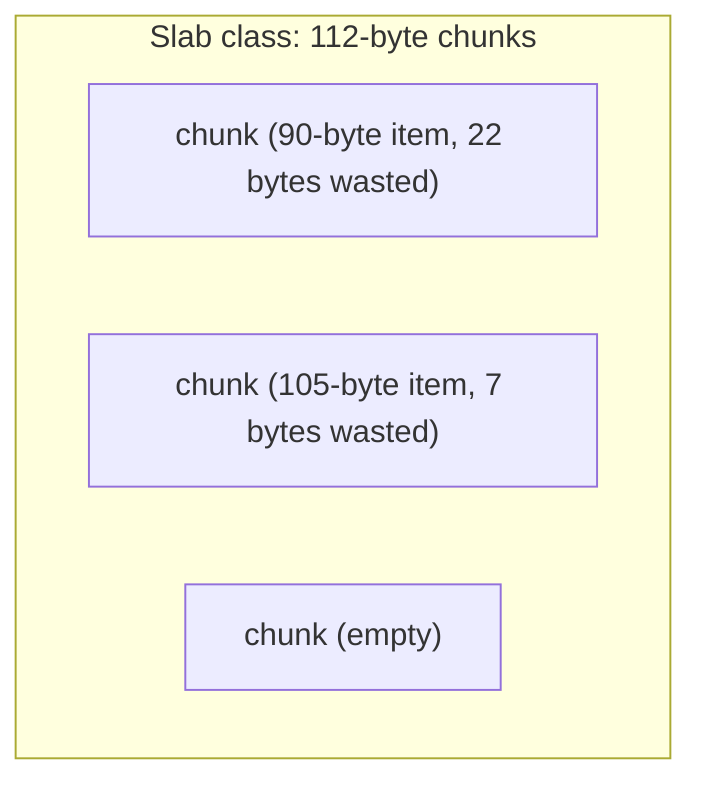

# Memcached Internals

> [!abstract] What you'll be able to do after this chapter
> Explain the slab allocator precisely (the actual interview-favorite Memcached detail), contrast its multi-threaded model against [[CS Fundamentals/Caching/Redis Internals|Redis's single-threaded one]] with real justification for both, and give a genuine Memcached-vs-Redis decision framework.

---

## 1. Why Memcached exists, and its deliberately narrow scope

Memcached (2003, originally built for LiveJournal) does **one thing**: cache arbitrary blobs of data in memory, fast. No persistence, no rich data structures, no replication built in — a deliberately narrow scope, not a missing feature list. That narrowness is exactly what lets it be extremely simple and extremely fast at the one job it does.

## 2. Multi-threaded — and why that's the *right* call here, unlike Redis

> [!tip] Contrast this directly with Redis
> [[CS Fundamentals/Caching/Redis Internals|Redis]] is deliberately single-threaded for command execution, because its rich data structures (sorted sets, etc.) make safe concurrent access to shared structures genuinely hard to reason about without heavy locking. Memcached's operations are much simpler — get/set/delete on **opaque blobs**, no internal structure to protect beyond a hash table entry. That simplicity is *why* Memcached can safely use multiple threads (each handling a subset of connections, built on `libevent` for I/O) to scale across CPU cores, where the same move would cost Redis more than it gains.

## 3. The slab allocator — the actual interview-favorite detail

> [!warning] This is the single most commonly asked "how does Memcached avoid fragmentation" question
> Naively calling `malloc`/`free` for every arbitrarily-sized cached item, constantly, leads to classic C memory **fragmentation** — free memory scattered in unusable small gaps. Memcached avoids this with a **slab allocator**: memory is pre-allocated into large **slabs**, each slab divided into fixed-size **chunks**, grouped into **size classes** that grow by a fixed growth factor (e.g. 88 bytes, 112 bytes, 144 bytes, ...). Storing an item finds the **smallest chunk size class that fits it** and stores it there.

This trades external fragmentation (the classic scattered-free-memory problem) for **internal fragmentation** — a 90-byte item stored in a 112-byte chunk wastes 22 bytes. A real, deliberate, named tradeoff, not a flaw nobody noticed.

## 4. Per-slab-class LRU — and the "slab calcification" problem it causes

Eviction is **LRU per size class**, not one global LRU across the whole cache — when a slab class is full, it evicts *its own* least-recently-used item.

> [!bug] The real, named limitation this creates
> Because slabs are pre-partitioned by size class, an item can't "steal" space from a different, underused size class even under memory pressure. A workload whose item-size distribution shifts over time (heavy use of one size, then a shift to another) can leave one slab class starved while another sits with spare, unused chunks — a known Memcached issue called **slab calcification**. Naming this specifically is a strong depth signal.

## 5. No persistence, no server-side clustering — sharding lives on the client

A Memcached instance knows **nothing** about any other Memcached instance — unlike [[CS Fundamentals/Caching/Redis Internals|Redis Cluster's]] server-side hash-slot awareness, scaling Memcached across multiple instances is typically done via **client-side hashing** ([[Glossary/Consistent Hashing|consistent hashing]], almost always) — the client library decides which of several independent, mutually-unaware Memcached instances owns a given key. A genuinely different architecture philosophy from Redis Cluster, worth stating explicitly if compared.

## 6. Memcached vs Redis — a real decision framework

| | **Memcached** | **Redis** |
|---|---|---|
| Best fit | Pure, simple, maximum-throughput caching across many cores | Anything needing rich data structures, persistence, pub/sub, or built-in cluster-aware sharding/replication |
| Concurrency model | Multi-threaded | Single-threaded execution (multi-threaded I/O since v6+) |
| Persistence | None | RDB/AOF |
| Clustering | Client-side only | Server-side (hash slots) |

## 7. When NOT to use Memcached

Needing **persistence** — a restart loses everything, with no RDB/AOF equivalent at all. Needing **atomic operations beyond simple incr/decr** or any structure richer than a blob. Needing **built-in replication** for cache-layer fault tolerance.

---

## 🎯 Interview follow-up Q&A

> [!quote]- "How does Memcached avoid memory fragmentation?"
> Via a slab allocator — memory pre-divided into fixed size-class chunks, with each stored item placed into the smallest chunk class that fits it, avoiding the constant malloc/free churn that causes classic fragmentation.
>
> **Follow-up: "Does this approach have a downside?"**
> Yes, two: internal fragmentation (an item smaller than its chunk class wastes the remainder), and slab calcification (a shifting item-size distribution over time can starve one size class while another sits underused, since chunks can't be reallocated between classes on the fly).

> [!quote]- "Why is Memcached multi-threaded while Redis is famously single-threaded — isn't that inconsistent?"
> Not really — the two have fundamentally different operation complexity. Memcached's get/set/delete on opaque blobs are simple enough that multi-threading doesn't introduce the kind of shared-structure concurrency hazards Redis's richer data structures (sorted sets, etc.) would face under the same approach. Each system's threading model matches the actual complexity of what it's protecting.

> [!quote]- "When would you pick Memcached over Redis?"
> Pure, high-throughput blob caching across many CPU cores with no need for persistence, rich types, or server-side cluster awareness — situations where Redis's extra capabilities would just be unused overhead.

---
*Related: [[00 - Start Here/How This Handbook Works|Book Map]] · [[CS Fundamentals/Caching/Redis Internals|Redis Internals]] · [[CS Fundamentals/Caching/Caching Strategies|Caching Strategies]] · [[Glossary/Consistent Hashing|Consistent Hashing]]*
