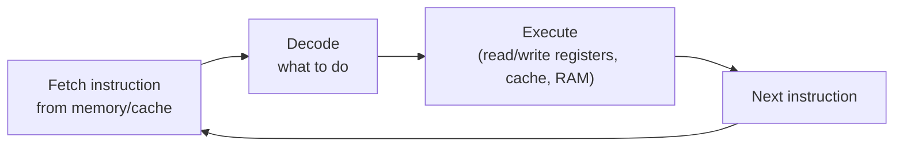
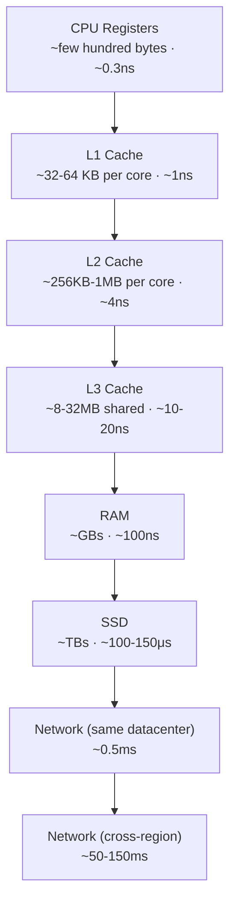

# CPU, Memory & Cache Hierarchy

> [!abstract] What you'll be able to do after this chapter
> Explain precisely why a network call is ~100,000x slower than a memory access and derive that number instead of memorizing it, explain why array-of-structs beats a linked list for most real workloads despite "equal" Big-O, and recognize cache-hierarchy reasoning every time it resurfaces later in this book (why Redis is fast, why B+ Tree page sizes match disk blocks, why P99 latency spikes under memory pressure).

> [!info] Why this chapter exists, and why it comes first
> Every other chapter in this handbook — databases, caching, networking, distributed systems — silently assumes you already have a mental model of "how a computer actually does work." Most engineers never get taught this explicitly; they absorb fragments from experience. This chapter makes that model explicit, once, so every later chapter can build on it instead of re-deriving it.

---

## 1. What is it?

Computer architecture is the set of hardware components — CPU, registers, caches, RAM, disk — and the rules for how they move and operate on data. Every piece of software you've ever run, no matter how abstract, eventually gets translated into this hardware reality: instructions the CPU executes, and data that has to physically travel between storage locations of wildly different speed and size.

## 2. Why does this matter for system design specifically?

You don't need to design a CPU. You need to understand **why some operations are fast and others are catastrophically slow**, because every system-design decision in this handbook is, underneath, a decision about where data lives and how far it has to travel. "Add a cache" is a decision to keep data closer to where it's used. "Shard a database" is partly a decision to keep working sets small enough to fit in fast memory. "Network round-trip" is expensive specifically because it's far down this hierarchy. Without this chapter, those decisions look like folklore ("caching is good," "network calls are slow") instead of *derived consequences* of physical reality.

## 3. Layman analogy

Think of a chef cooking in a kitchen:
- **CPU registers** are the ingredients already in the chef's hands — instant access, but only room for a few items.
- **L1/L2/L3 cache** is the counter directly in front of the chef — reaching for something there takes a beat, but it's fast.
- **RAM** is the walk-in fridge in the kitchen — still fast, but takes a real trip.
- **Disk (even SSD)** is the storage warehouse across town — you can get anything from there, but it takes actual travel time, and you'd never want to make a warehouse trip for every single ingredient in a recipe.
- **A network call to another server** is calling a *different restaurant* and asking them to fetch something for you, cook part of the dish, and mail it back.

Every "optimization" in this book is some version of: *keep the ingredients you use often as close to the chef's hands as possible.*

## 4. Technical explanation

- **CPU (Central Processing Unit):** executes instructions, one (or a few, on multi-core) at a time per core, at a fixed clock rate (billions of cycles/second).
- **Registers:** the CPU's own tiny, immediate-access storage — a handful of values, directly wired into the CPU's execution units.
- **Cache (L1/L2/L3):** small, fast memory physically close to (or on) the CPU die, holding recently/frequently used data so the CPU doesn't have to wait on slower RAM every time.
- **RAM (main memory):** larger, slower than cache, volatile (cleared on power loss), holds the working set of currently-running programs.
- **Disk (HDD/SSD):** much larger, much slower, persistent (survives power loss).
- **Bus:** the physical wiring/channel data moves across between these components — itself a bandwidth-limited resource.

## 5. Internal working

### The fetch-decode-execute cycle

Every instruction a CPU runs goes through the same basic cycle: **fetch** the instruction from memory, **decode** what it means, **execute** it (possibly reading/writing data), and move to the next instruction. This happens billions of times per second per core. The critical insight for system design: *fetching data is usually the bottleneck, not computing on it* — modern CPUs can execute an operation far faster than they can wait for the data that operation needs, if that data isn't already close by.

### The memory hierarchy, and why it's shaped like a pyramid

Every level of storage trades **capacity** for **speed**. You cannot have a memory technology that is simultaneously huge, permanent, AND as fast as a CPU register — this isn't an engineering failure to be fixed, it's a physical tradeoff (smaller/closer = faster but more expensive per byte; bigger/farther = cheaper per byte but slower).

> [!bug] Memorize the RATIOS, not just the numbers
> Each step down this pyramid is roughly **1-2 orders of magnitude slower** than the one above it. RAM is ~100x slower than L1 cache. SSD is ~1,000x slower than RAM. A cross-region network call is ~1,000x slower again. Chained together: a single cross-region network round-trip costs roughly **the same time as ~500,000 RAM accesses**, or **hundreds of millions of CPU cycles**. This is the actual, derivable reason "minimize network calls" and "cache aggressively" are load-bearing principles throughout this entire handbook, not folklore.

### Cache hits, cache misses, and locality

A **cache hit** means the CPU found the data it needed already sitting in a fast cache level — near-instant. A **cache miss** means it wasn't there, forcing a trip to the next (slower) level. Caches work because of two real, exploitable patterns in how programs access memory:

- **Temporal locality:** if you accessed a piece of data recently, you're likely to access it again soon (a loop counter, a hot function's local variables).
- **Spatial locality:** if you accessed a memory address, you're likely to access *nearby* addresses soon (the next element of an array). This is why caches don't fetch a single byte on a miss — they fetch an entire **cache line** (typically 64 bytes) at once, betting that the surrounding bytes will be needed next.

> [!tip] This is precisely why array-of-structs beats a linked list for iteration
> Iterating an array walks through **contiguous memory** — each cache-line fetch pulls in several array elements at once, and most subsequent accesses are cache hits. Iterating a linked list jumps to **scattered, pointer-chased memory locations** — each node access is likely a fresh cache miss, even though both structures are "O(n) to iterate." This is a real, measurable performance difference that pure algorithmic complexity analysis completely misses — and it's a legitimate, common follow-up in performance-focused interviews.

### Virtual memory and pointers (the bridge to the OS chapter)

A running program doesn't see physical RAM addresses directly — it sees **virtual addresses**, translated to physical addresses by the CPU's memory management unit (MMU) using page tables the OS maintains. A **pointer** in your code is a virtual address. This translation is itself cached (in a structure called the TLB — Translation Lookaside Buffer) for the same reason everything else is cached: doing the full translation on every single memory access would be far too slow. Full depth on paging, page faults, and virtual memory lives in [[CS Fundamentals/Operating Systems/Processes, Threads & Context Switching|the Operating Systems chapter]] — this chapter only establishes that the translation step exists and costs something.

---

## 6. Complexity analysis — the numbers that matter

| Operation | Approximate latency | Relative to L1 cache |
|---|---|---|
| L1 cache reference | ~1 ns | 1x |
| L2 cache reference | ~4 ns | 4x |
| L3 cache reference | ~10-20 ns | 10-20x |
| Main memory (RAM) reference | ~100 ns | ~100x |
| SSD random read | ~100-150 μs | ~100,000x |
| HDD seek | ~10 ms | ~10,000,000x |
| Network round trip, same datacenter | ~0.5 ms | ~500,000x |
| Network round trip, cross-region | ~50-150 ms | ~50,000,000-150,000,000x |

> [!info] Cross-link
> This exact table is what [[00 - Start Here/100 System Design Interview Questions|the 100-questions file's]] "latency numbers every engineer should know" entry expects you to be able to reproduce — this chapter is where those numbers actually come from, derived from hardware, not memorized as trivia.

## 7. Tradeoffs

Every level of the hierarchy is a deliberate tradeoff, not an accident:

| Level | Faster because | Costs |
|---|---|---|
| Cache | Small, physically close to CPU | Expensive per byte, tiny capacity |
| RAM | Larger, still fast | More expensive than disk, volatile (lost on power-off) |
| SSD/Disk | Cheap per byte, huge capacity, persistent | Orders of magnitude slower than RAM |

There is no version of this hierarchy that isn't a tradeoff — a system with "infinite fast memory" isn't an engineering possibility being withheld, it's not physically achievable at any reasonable cost.

## 8. Where this shows up later in this book

> [!success] This isn't abstract — you'll see this exact reasoning reused constantly
> - **Why Redis is fast:** keeps everything in RAM, entirely skipping the disk tier for reads — [[CS Fundamentals/Caching/Redis Internals|Redis Internals]].
> - **Why B+ Tree page sizes are chosen to match disk block sizes:** minimizes the number of slow disk seeks needed to traverse the tree — [[CS Fundamentals/Databases/Indexes & B+ Trees|Indexes & B+ Trees]].
> - **Why the "latency numbers every engineer should know" question exists:** it's testing whether you have this chapter's mental model, not whether you memorized a table — [[00 - Start Here/100 System Design Interview Questions|100 System Design Interview Questions]].
> - **Why minimizing network hops is a recurring theme across every HLD chapter:** a network call is the single slowest, most variable operation in the entire hierarchy — everything from caching strategy to service-mesh design is partly about avoiding unnecessary trips down to that tier.

---

## Interview Q&A

> [!question]- Why is a network call to another data center roughly a million times slower than a memory access, not just "a bit slower"?
> Because it's not one slow step — it's the compounding of physical distance (speed-of-light propagation delay, unavoidable no matter how good the engineering), multiple hops through routers/switches, and OS-level networking stack overhead, stacked on top of an already-100x-slower-than-cache RAM access at each endpoint. The gap is multiplicative across several genuinely different bottlenecks, not additive over one.

> [!question]- Two algorithms are both O(n) — why would one run measurably faster in practice?
> Big-O counts *operations*, not their real-world cost, and treats every memory access as equally cheap — which physical hardware does not. An O(n) algorithm with excellent spatial locality (sequential array access, mostly cache hits) can run an order of magnitude faster than an O(n) algorithm that cache-misses on every step (pointer-chasing through a linked list or scattered heap allocations), even though both are "the same complexity" on paper.

> [!question]- Why do interviewers care about this for a *system design* interview, not just a low-level coding one?
> Because every system-design lever — caching, sharding, replica placement, CDN edge nodes — is a decision about *where data physically lives relative to where it's needed*. Understanding the hierarchy is what lets you reason about WHY a given design choice actually helps, instead of pattern-matching "add a cache here" without being able to defend the reasoning under follow-up questions.

---

## Summary / Cheat Sheet

- Memory hierarchy, fast-to-slow: **Registers → L1 → L2 → L3 → RAM → SSD/Disk → Network**.
- Each tier is roughly **10-1000x** slower than the one above it — the gaps compound.
- **Cache hit** = fast. **Cache miss** = pay the cost of the next tier down.
- **Spatial locality** (nearby memory) and **temporal locality** (recently used memory) are what make caching work at all — they're real, exploitable patterns, not assumptions.
- Contiguous memory (arrays) beats pointer-chased memory (linked lists) for most real iteration workloads, despite equal Big-O.
- A cross-region network round trip costs roughly the same time as **hundreds of millions of CPU cycles** — this single fact justifies most of the caching/sharding/CDN reasoning in the rest of this handbook.

---
*Related: [[CS Fundamentals/00 - Learning Path|CS Fundamentals Learning Path]] · [[CS Fundamentals/Operating Systems/Processes, Threads & Context Switching|Operating Systems]] · [[CS Fundamentals/Caching/Redis Internals|Redis Internals]] · [[CS Fundamentals/Databases/Indexes & B+ Trees|Indexes & B+ Trees]]*
