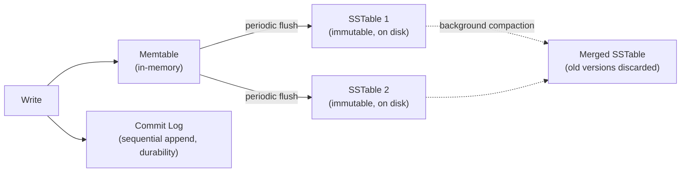

# Cassandra Internals

> [!abstract] What you'll be able to do after this chapter
> Explain Cassandra's write path precisely (why it's so write-optimized), deliver the LSM-Tree depth [[CS Fundamentals/Databases/Indexes & B+ Trees|the B+ Tree chapter]] promised as the "when B+ Trees are wrong" answer, and name the tombstone problem as the concrete reason "Cassandra as a queue" is a well-known anti-pattern.

---

## 1. Why Cassandra exists

Built at Facebook (for inbox search) by combining two ideas: **Amazon Dynamo's** distributed architecture (peer-to-peer, no single leader, tunable consistency) with **Google Bigtable's** data model (wide-column, sparse, sorted). The goal: a database that stays available and keeps accepting writes across multiple data centers, with no single point of failure, at a scale where node failures are a routine, expected event rather than an exception.

## 2. The data model — wide-column, not relational

A Cassandra "row" is identified by a **partition key**; within a partition, data is organized into columns that can genuinely vary row-to-row (sparse), sorted by **clustering columns**. The partition key determines **which node(s)** own the data — via [[Glossary/Consistent Hashing|consistent hashing]] of the key onto the cluster ring (with virtual nodes/"vnodes" for even load distribution). Clustering columns determine the **physical sort order within that partition on disk** — meaning a well-chosen clustering key makes range queries within a partition genuinely fast, a design decision made at schema time, not query time.

## 3. The write path — LSM-Trees, and the depth the B+ Tree chapter promised

> [!tip] This delivers on [[CS Fundamentals/Databases/Indexes & B+ Trees|Indexes & B+ Trees]]'s "when B+ Trees are the wrong choice" pointer
> Cassandra is built on an **LSM-Tree** (Log-Structured Merge-Tree), the write-optimized counterpart to the B+ Tree's read/range-optimized design.

The mechanics: a write goes to an in-memory **memtable**, plus a **commit log** on disk (a pure sequential append, for durability — if the process crashes, the commit log replays to rebuild the memtable). **No read-before-write, no random disk I/O on the write path at all** — this is the entire reason Cassandra is so write-optimized. Periodically, a full memtable is flushed to disk as an immutable **SSTable** (Sorted String Table). A background **compaction** process merges multiple SSTables over time, discarding data that's been overwritten or deleted (see tombstones, below).

**The read-side cost of this tradeoff:** a read might need to check the memtable *and* multiple SSTables to find the latest value for a key. Mitigated by a **[[Glossary/Bloom Filter|Bloom filter]] per SSTable** — a cheap, no-false-negative check to quickly rule out SSTables that definitely don't contain the key, avoiding unnecessary disk reads.

## 4. Tunable consistency — delivering on [[CS Fundamentals/Distributed Systems/CAP Theorem & PACELC|the CAP/PACELC chapter's]] promise

Cassandra's signature feature: **per-query consistency level** (`ONE`, `QUORUM`, `ALL`, `LOCAL_QUORUM` for multi-datacenter setups). This is [[Glossary/Quorum (R + W over N)|the quorum mechanism]], made directly configurable — a single application can read with `ONE` (fast, weaker) for a low-stakes lookup and `QUORUM` (stronger, slower) for a critical read, on the same cluster, chosen per query rather than fixed system-wide.

## 5. No leader — gossip and consensus for cluster coordination

Cassandra is **peer-to-peer / leaderless** — no single node coordinates the cluster. Cluster membership and failure detection run via the [[Glossary/Gossip Protocol|gossip protocol]] — nodes periodically exchange state with random peers, propagating liveness information epidemic-style without any central coordinator.

## 6. Tombstones — the deletion problem, and why "Cassandra as a queue" is a known anti-pattern

> [!bug] The genuinely famous Cassandra gotcha
> A delete doesn't remove data immediately — it writes a **tombstone** marker, which must persist for a configured grace period (long enough to propagate to all replicas) before compaction can permanently remove it. A workload with **frequent deletes** — a queue-like access pattern being the classic example — accumulates large numbers of tombstones, and reads must scan **past** them to find live data, causing real, measurable read latency degradation. This specific mechanism is *why* "don't use Cassandra as a queue" is such a widely-repeated piece of advice — it's not folklore, it's a direct consequence of how deletion actually works internally.

## 7. When NOT to use Cassandra

Needing traditional **multi-row ACID transactions or joins** — Cassandra has no native support for either in the relational sense (lightweight transactions via Paxos exist, but only for narrow compare-and-swap use cases, not general multi-statement transactions). Needing **strong consistency by default** rather than opted into per-query. Workloads with **frequent deletes** (the tombstone problem above). Small scale, where the operational complexity of running and tuning a Cassandra cluster isn't justified by the workload.

---

## 🎯 Interview follow-up Q&A

> [!quote]- "Why is Cassandra so much faster at writes than a typical relational database?"
> Writes never touch the read path at all — they go to an in-memory memtable plus a purely sequential commit-log append. No read-before-write, no random disk I/O, no index maintenance blocking the write.
>
> **Follow-up: "What's the cost of that design on the read side?"**
> A read may need to check the memtable and multiple on-disk SSTables to assemble the latest value for a key — mitigated, but not eliminated, by per-SSTable Bloom filters that cheaply skip SSTables known not to contain the key.

> [!quote]- "How does Cassandra's tunable consistency actually work?"
> Each query specifies a consistency level (`ONE`, `QUORUM`, `ALL`, etc.) that determines how many replicas must respond before the operation is considered successful — directly implementing the `R + W > N` quorum math, chosen per-query rather than fixed for the whole system.

> [!quote]- "Why is Cassandra known to be a bad fit for queue-like workloads?"
> Deletes create tombstones that must persist for a grace period before being compacted away — a workload with frequent deletes (exactly what a queue does constantly) accumulates tombstones faster than compaction can clean them up, and reads have to scan past them, causing real, measurable latency degradation over time.

---
*Related: [[00 - Start Here/How This Handbook Works|Book Map]] · [[CS Fundamentals/Databases/Indexes & B+ Trees|Indexes & B+ Trees]] · [[CS Fundamentals/Distributed Systems/CAP Theorem & PACELC|CAP Theorem & PACELC]] · [[Glossary/Bloom Filter|Bloom Filter]] · [[Glossary/Gossip Protocol|Gossip Protocol]] · [[Glossary/Quorum (R + W over N)|Quorum]]*
