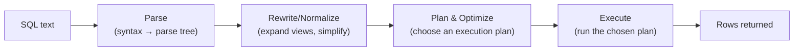

# SQL Query Execution Deep Dive

> [!abstract] What you'll be able to do after this chapter
> Trace exactly what happens between hitting Enter on a SQL query and getting rows back, explain *why* an index actually makes things fast (not just "it's a lookup structure"), read `EXPLAIN ANALYZE` output, and name a real, concrete difference between MySQL/InnoDB and PostgreSQL internals.

---

## 1. The execution pipeline

The step that actually determines performance is **Plan & Optimize** — the **query optimizer** considers multiple possible ways to execute the *same* logically-correct query (different join orders, different access methods per table) and picks the one with the lowest **estimated cost**, based on statistics the database maintains: table sizes, value distributions (histograms), index selectivity.

> [!bug] Why stale statistics cause real production slowdowns
> If those statistics are out of date (a table grew 100x since the last `ANALYZE`), the optimizer's cost estimates are wrong, and it can pick a genuinely bad plan — this is one of the most common, least-obvious causes of "this query used to be fast and now it's slow" in production. Keeping statistics fresh (`ANALYZE`, or autovacuum's automatic version in Postgres) is a real operational responsibility, not a one-time setup step.

Execution itself typically runs as a tree of operators (scan, join, sort, aggregate) pulling rows from their children on demand — the classic **iterator/Volcano model** — worth naming if asked how execution is actually structured internally.

## 2. Why an index makes a query fast — the actual mechanism

A **sequential scan** reads every row (every page) of a table in physical storage order, checking each against the query's filter — cost scales with **table size**, regardless of how selective the filter is.

An **index scan** uses a [[CS Fundamentals/Databases/Indexes & B+ Trees|B+ Tree]] to navigate directly to matching rows via the index's sorted structure — cost scales with the **number of matching rows**, not total table size. The database never even reads the pages that don't match at all.

> [!tip] This is the actual answer to "why are indexes fast," not just "it's a lookup structure"
> An index doesn't make filtering cheaper per row — it lets the engine **skip reading irrelevant data entirely**, instead of reading everything and discarding what doesn't match. That's the real mechanism, and it's exactly why an index only helps when a query is **selective** (matches a small fraction of the table) — explained further below.

## 3. When the optimizer correctly *avoids* an available index — not a bug

> [!warning] The classic junior mistake this section prevents
> "Why isn't my index being used?!" is very often not a bug at all.

If a query needs to touch roughly **15-20%+** of a table's rows (a rule of thumb, not an exact threshold), a sequential scan can genuinely be **cheaper** than an index scan — because an index scan involves extra **random I/O** (jumping between index and table pages), while a sequential scan is pure, cheap sequential I/O. The optimizer choosing a seq scan here is the *correct* call, not a missed optimization — understanding this prevents wasted effort "fixing" a plan that was already right.

## 4. `EXPLAIN` vs `EXPLAIN ANALYZE` — the actual production debugging tool

- **`EXPLAIN`** shows the **planned** execution tree with the optimizer's cost *estimates* — it doesn't run the query.
- **`EXPLAIN ANALYZE`** actually **executes** the query and shows *real* costs, real row counts, and real timing per step — letting you directly compare estimated vs actual row counts. A large divergence between the two is a strong, concrete signal of stale statistics or a correlated-column problem the optimizer's cost model can't capture (it generally assumes column values are independent, which is often false in practice — e.g. `city='NYC' AND zip_code='10001'` are highly correlated, and the optimizer may badly overestimate how selective that combined filter really is).

## 5. Buffer pool / `shared_buffers` — why a "warm" database is dramatically faster

Databases keep a large in-memory cache of recently-used disk pages — InnoDB's **buffer pool**, Postgres's **`shared_buffers`** — so repeated access to hot data/index pages avoids disk I/O entirely. This is the database-engine-managed analog of what [[CS Fundamentals/Messaging & Streaming/Kafka Internals|Kafka]] gets "for free" by relying on the OS page cache — same underlying idea (keep hot data in RAM), but explicitly managed by the DB engine itself here rather than left to the OS.

## 6. MVCC, briefly — why readers don't block writers

**MVCC (Multi-Version Concurrency Control)** keeps **multiple versions** of a row instead of using locks to serialize readers against writers. A read sees a consistent snapshot as of when its transaction started; a concurrent write creates a *new* version rather than mutating the existing one in place. The practical result: in both Postgres and InnoDB, a long-running read generally does **not** block concurrent writes — a genuinely useful, interview-relevant fact (full transaction-isolation-level depth is a dedicated future chapter).

> [!bug] The real production issue MVCC introduces
> Old row versions can't be cleaned up (**vacuumed**, in Postgres terms) while a long-running transaction might still need to see them — a transaction left open for hours can cause serious **table bloat** as dead row versions pile up unreclaimed. "Why is this table so much bigger on disk than the actual data would suggest" is very often an answer involving a forgotten long-running transaction, not a data-volume problem at all.

## 7. MySQL/InnoDB vs PostgreSQL — a genuine, interview-worthy contrast

> [!info] This is a real architectural difference, not trivia
> **InnoDB** (MySQL's modern default storage engine) uses a **clustered index by default** — the table's data is physically stored in primary-key order, meaning the primary key *is* the table's actual leaf structure (see [[CS Fundamentals/Databases/Indexes & B+ Trees|Indexes & B+ Trees]], Section 6).
>
> **PostgreSQL** has no comparable clustering-by-default — table rows live in a **heap**, in roughly insertion order, unless you explicitly run `CLUSTER` (a one-time, non-maintained physical reorganization, not an ongoing property). Every Postgres index — including the primary key's — is a **secondary** index pointing to a heap location (a tuple ID), meaning **every** index lookup requires an extra fetch into the heap to get the full row, *unless* the query can be satisfied entirely from the index itself (an **index-only scan**, which additionally requires Postgres's visibility map to confirm no relevant dead tuples exist, since MVCC old-versions bookkeeping intersects with this optimization directly).

---

## 🎯 Interview follow-up Q&A

> [!quote]- "Why would a database choose NOT to use an available index for a query?"
> If the query's filter isn't selective enough — matching a large fraction of the table — a sequential scan's cheap, pure sequential I/O can beat an index scan's extra random I/O overhead. The optimizer picking a seq scan in that case is correct, not a missed opportunity.
>
> **Follow-up: "Give a concrete example."**
> `SELECT * FROM users WHERE is_active = true` where 95% of users are active — even with an index on `is_active`, a full table scan is likely cheaper, since the index would still end up pointing at nearly the entire table anyway.

> [!quote]- "What's the difference between `EXPLAIN` and `EXPLAIN ANALYZE`, and how would you use this to debug a slow query in production?"
> `EXPLAIN` shows the planned execution and cost *estimates* without running the query; `EXPLAIN ANALYZE` actually executes it and reports real timings and row counts alongside the estimates. In production debugging, running `EXPLAIN ANALYZE` and comparing estimated vs actual row counts at each step is the direct way to spot whether the optimizer's statistics are stale or a correlated-predicate assumption is wrong — that divergence is usually exactly where the real problem is.

> [!quote]- "How does MVCC let readers and writers avoid blocking each other?"
> Rather than requiring a read to wait for a write (or vice versa) via locking, MVCC keeps multiple versions of each row — a read operates against a consistent snapshot from when its transaction began, while writes create new versions instead of overwriting existing ones in place.
>
> **Follow-up: "What real production problem can still occur despite MVCC?"**
> Table bloat from a long-running transaction — old row versions can't be reclaimed (vacuumed) while any active transaction might still need to see them, so a transaction left open unexpectedly long causes dead versions to accumulate unbounded, inflating table size on disk well beyond the actual live data volume.

---
*Related: [[00 - Start Here/How This Handbook Works|Book Map]] · [[CS Fundamentals/Databases/Indexes & B+ Trees|Indexes & B+ Trees]] · [[HLD/01 - Design TinyURL (URL Shortener)/Design TinyURL|Design TinyURL]]*
