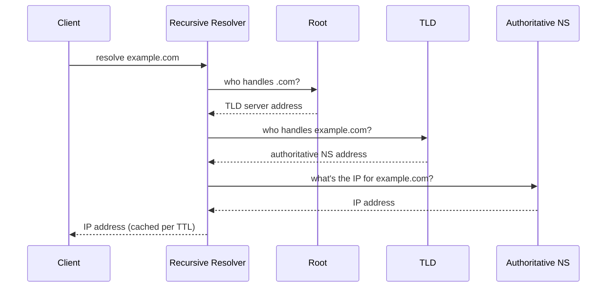

# HTTP Evolution & DNS Resolution

> [!abstract] What you'll be able to do after this chapter
> Explain exactly what problem each HTTP version fixed over the last, why HTTP/3 moved off TCP entirely, and trace a DNS lookup through every caching layer between browser and authoritative server.

> [!info] Builds on TCP Deep Dive
> [[CS Fundamentals/Networking/TCP Deep Dive|The TCP chapter]] covers the transport layer these protocols run on (or, for HTTP/3, deliberately don't run on). This chapter doesn't re-derive TCP mechanics — it's about what HTTP and DNS build on top.

---

## HTTP/1.1 — the baseline problem

Each request needed its own connection unless `Keep-Alive` reused one — and even with a reused connection, requests on it were **head-of-line blocked**: request 2 couldn't start until request 1's *response* fully finished, single-file. Browsers worked around this by opening multiple parallel TCP connections per host (typically 6) — a real workaround, but each connection pays its own TCP handshake and (for HTTPS) TLS handshake cost.

## HTTP/2 — multiplexing over one connection

HTTP/2 fixes the head-of-line blocking at the **HTTP layer** by multiplexing multiple request/response streams over a **single** TCP connection — requests no longer need to wait for prior ones to finish. It also adds **HPACK header compression** (headers repeat heavily across requests to the same host; compressing them across the connection's lifetime, not per-request, cuts real overhead) and **server push** (the server can proactively send resources it knows the client will need, e.g. pushing a CSS file alongside the HTML that references it — though push saw limited real-world adoption since it's hard to predict correctly and can waste bandwidth on already-cached resources).

> [!bug] HTTP/2 solved head-of-line blocking at the HTTP layer, but not underneath it
> Multiplexing streams over **one TCP connection** means TCP itself doesn't know about the separate streams — if a single packet is lost, TCP's in-order delivery guarantee blocks **all** multiplexed streams behind that one lost packet, not just the stream it belonged to. HTTP/2 moved the head-of-line blocking problem down a layer; it didn't eliminate it.

## HTTP/3 & QUIC — moving off TCP entirely

HTTP/3 runs over **QUIC**, built on **UDP** instead of TCP, specifically to fix the problem HTTP/2 couldn't reach. QUIC implements its own reliability and multiplexing **above** UDP, but critically, it tracks loss and retransmission **per stream** — a lost packet only blocks the one stream it belonged to, not every multiplexed stream sharing the connection.

QUIC also folds the transport and TLS handshakes together, enabling **0-RTT** connection resumption for a client that has connected before — it can send actual request data in its very first packet to a known server, rather than paying separate round-trips for TCP handshake, then TLS handshake, then the request.

| | HTTP/1.1 | HTTP/2 | HTTP/3 (QUIC) |
|---|---|---|---|
| Transport | TCP | TCP | UDP (QUIC) |
| Head-of-line blocking | Yes (per connection) | Fixed at HTTP layer, still present at TCP layer | Fixed — per-stream loss handling |
| Handshake cost | TCP + TLS, separate | TCP + TLS, separate | Combined, 0-RTT on resumption |

## DNS resolution — the chain before any HTTP request even starts

A domain lookup passes through several layers, each with its own cache:

1. **Browser cache** — checks if it already resolved this hostname recently.
2. **OS resolver cache** — the operating system's own cache.
3. **Recursive resolver** (typically the ISP's or a public one like `8.8.8.8`) — if not cached, it does the actual multi-step lookup on the client's behalf.
4. **Root nameserver** — tells the resolver which TLD server handles `.com`/`.org`/etc.
5. **TLD nameserver** — tells the resolver which authoritative nameserver handles the specific domain.
6. **Authoritative nameserver** — returns the actual IP address for the domain.

> [!tip] Every layer caches by TTL — this is the actual lever for "how fast does a DNS change propagate"
> Each response carries a **TTL** dictating how long it may be cached at every layer above it. Lowering a record's TTL *before* a planned change (e.g., migrating to a new IP) is the standard operational practice — it shrinks the window during which stale, cached answers keep routing to the old IP after the record is updated.

---

## Interview Q&A

> [!question]- Why didn't HTTP/3 just fix TCP instead of switching to UDP?
> TCP's in-order, reliable-delivery guarantees are implemented in kernels and middleboxes across the entire internet — changing TCP's fundamental behavior isn't practically deployable at internet scale. Building fresh on UDP (which has no built-in ordering/reliability guarantees to work around) let QUIC implement exactly the semantics it needs — per-stream loss handling, integrated TLS — without fighting decades of entrenched TCP behavior.

> [!question]- What's the practical impact of DNS TTL being too high during an incident?
> If a server's IP needs to change urgently (failover, decommission) but the DNS TTL was set high, clients and resolvers keep routing to the old, now-wrong IP until their cached TTL expires — a real, avoidable extension of downtime. It's why critical records are often kept at low TTLs, or lowered proactively ahead of a planned migration.

> [!question]- Where does a CDN fit into this chain?
> A CDN typically returns *different* IPs to clients in different geographic locations for the *same* hostname (via DNS-based geo-routing or anycast) — see [[CS Fundamentals/Networking/CDN Internals|CDN Internals]] for the full mechanism.

---
*Related: [[00 - Start Here/How This Handbook Works|Book Map]] · [[CS Fundamentals/Networking/TCP Deep Dive|TCP Deep Dive]] · [[CS Fundamentals/Networking/CDN Internals|CDN Internals]]*
