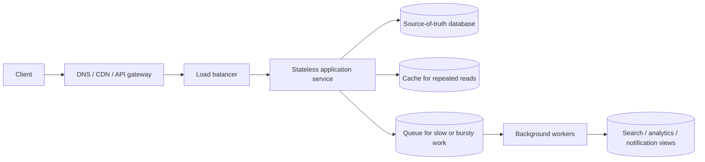

# HLD Interview Playbook

> [!abstract] The goal
> This is the map for the 25 HLD case studies in this folder. It teaches a repeatable way to think, estimate, draw, explain, and defend a large-scale system. You do not need to memorize one “perfect architecture.” You need to show that you can turn unclear requirements into sensible trade-offs.

> [!tip] If you are new to system design
> Imagine a small app becoming popular. One server is no longer enough, the database is overloaded, a dependency is slow, and two users can perform the same action at the same time. HLD is the discipline of deciding **which parts to separate, where data lives, how work is shared, and what happens when something fails**.

---

## 1. What an HLD interview is really testing

HLD means **high-level design**. You discuss the large building blocks and the rules between them:

- clients, APIs, services, databases, caches, queues, workers, and external providers;
- how a request travels through those components;
- what data is authoritative and what data is only a copy or a derived view;
- how the system scales when traffic, data, or geography grows;
- what happens during retries, crashes, overload, network partitions, and partial success;
- why one trade-off is appropriate for the stated product requirements.

The interviewer is usually not grading the brand names on your diagram. “Redis” is not a design. The design is: **what state is stored there, why it belongs there, how it expires, and what happens when Redis is unavailable**.

### The beginner mental model

Every system has five questions hiding underneath it:

1. **Who uses it?** Users, services, devices, admins, or external systems.
2. **What do they do?** The important read and write operations.
3. **Where is the source of truth?** The durable record that can rebuild derived data.
4. **What can be made cheaper?** Cache, precompute, batch, queue, CDN, or index.
5. **What breaks?** Decide whether to retry, queue, degrade, reject, or recover.

If you can answer those five questions clearly, the boxes on the diagram become much easier to choose.

---

## 2. How to study this folder

Read the case studies in layers. Do not try to memorize all 25 designs in one pass.

### Pass 1 — Learn the vocabulary

Read the beginner-friendly explanations in this playbook, then use the [[CS Fundamentals/00 - Learning Path|CS Fundamentals Learning Path]] when a case study links to a building block. In particular, understand:

| Building block | The question it answers |
|---|---|
| Database | Where does durable business data live? |
| Cache | How do I serve repeated reads faster and protect the database? |
| Queue/stream | How do I absorb bursts and do slow work later? |
| Partition/shard | How do I split data or traffic across machines? |
| Replication | How do I survive a machine or zone failure? |
| Search index | How do I search by words, filters, or relevance? |
| Object storage | How do I store large blobs cheaply and durably? |
| Rate limiter | How do I protect a service from too much traffic? |
| Consensus/lock | How do several machines agree on one decision? |
| Observability | How do I know the system is healthy or failing? |

### Pass 2 — Learn the recurring patterns

Start with these anchors:

1. [[HLD/01 - Design TinyURL (URL Shortener)/Design TinyURL|TinyURL]] — APIs, IDs, storage, caching, read-heavy systems.
2. [[HLD/02 - Design a Rate Limiter/Design a Rate Limiter|Rate Limiter]] — shared state and atomic operations.
3. [[HLD/03 - Design a Distributed Cache (build Redis)/Design a Distributed Cache|Distributed Cache]] — hashing, replication, hot keys.
4. [[HLD/04 - Design a Notification Service/Design a Notification Service|Notification Service]] — queues, retries, fan-out, provider limits.
5. [[HLD/05 - Design a Distributed Message Queue (build Kafka)/Design a Distributed Message Queue|Message Queue]] — partitions, ordering, durability, consumers.
6. [[HLD/06 - Design Twitter - News Feed/Design Twitter - News Feed|News Feed]] — fan-out-on-write versus fan-out-on-read.
7. [[HLD/07 - Design WhatsApp - Chat System/Design WhatsApp - Chat System|Chat]] — persistent connections, ordering, offline sync.

### Pass 3 — Apply the patterns to special systems

| Family | Case studies | Main lesson |
|---|---|---|
| Storage and media | [[HLD/08 - Design Google Drive - Dropbox/Design Google Drive - Dropbox|Drive]], [[HLD/09 - Design YouTube - Netflix/Design YouTube - Netflix|Video]], [[HLD/13 - Design Distributed File Storage/Design Distributed File Storage|Distributed file storage]] | Chunking, object storage, durability, CDN, asynchronous processing |
| Location and marketplace | [[HLD/10 - Design Uber/Design Uber|Uber]], [[HLD/16 - Design a Food Delivery System/Design a Food Delivery System|Food delivery]] | Geospatial indexing, matching, hot regions, supply/demand |
| Search and discovery | [[HLD/11 - Design Search Autocomplete - Typeahead/Design Search Autocomplete|Autocomplete]], [[HLD/12 - Design a Web Crawler/Design a Web Crawler|Crawler]], [[HLD/25 - Design a Search Engine/Design a Search Engine|Search engine]] | Precomputation, politeness, inverted indexes, ranking |
| Correctness-critical workflows | [[HLD/15 - Design a Ticket Booking System/Design a Ticket Booking System|Ticket booking]], [[HLD/17 - Design a Payment System/Design a Payment System|Payments]], [[HLD/23 - Design an E-commerce System/Design an E-commerce System|E-commerce]] | Atomic check-and-act, idempotency, reservations, Sagas |
| Coordination and time | [[HLD/14 - Design a Multi-Region Rate Limiter/Design a Multi-Region Rate Limiter|Multi-region limits]], [[HLD/18 - Design a Distributed Lock Service/Design a Distributed Lock Service|Locks]], [[HLD/21 - Design Google Calendar/Design Google Calendar|Calendar]] | Consistency, leases, fencing, time zones, conflict handling |
| Real-time and analytics | [[HLD/19 - Design a Real-Time Leaderboard/Design a Real-Time Leaderboard|Leaderboard]], [[HLD/20 - Design a Log Aggregation and Monitoring System/Design a Log Aggregation and Monitoring System|Observability]], [[HLD/22 - Design Google Meet/Design Google Meet|Video conferencing]], [[HLD/24 - Design an Analytics Aggregation System/Design an Analytics Aggregation System|Analytics]] | Specialized data structures, media planes, time series, approximation |

### Pass 4 — Practice from a blank page

For each chapter, close the note and redraw the design in 10–15 minutes. Then answer the follow-ups without looking. Finally, change one requirement:

- traffic becomes 10× larger;
- one region becomes unavailable;
- the primary database is slow;
- the same request is retried;
- one key, tenant, celebrity, product, or room becomes extremely hot;
- the product now needs stronger consistency or lower latency.

If you can adapt the design instead of reciting it, you know it.

---

## 3. A reliable 45-minute interview structure

Use the exact sequence below. It keeps the conversation collaborative and prevents jumping into boxes too early.

| Time | What to do | What the interviewer should hear |
|---|---|---|
| 0–5 min | Clarify scope and users | “I’ll design the core path first and call out extensions.” |
| 5–8 min | Functional and non-functional requirements | Latency, availability, durability, consistency, ordering, privacy. |
| 8–12 min | Back-of-the-envelope estimates | Users → requests → peak QPS → storage → bandwidth. |
| 12–17 min | APIs and core data model | Concrete reads/writes and the source of truth. |
| 17–27 min | Main architecture and request flow | One simple end-to-end path before optimization. |
| 27–37 min | Deep dive into the hardest bottleneck | The decision that makes this problem special. |
| 37–42 min | Failure, scale, and consistency | Retries, duplicates, hot keys, partitions, recovery. |
| 42–45 min | Recap trade-offs and next steps | What is strong, what is eventual, and what you would improve next. |

### A sentence template you can reuse

> “I’ll first clarify the core use case and its scale. Then I’ll estimate traffic and storage, define the main APIs and source of truth, draw the simplest correct architecture, and deep-dive on the bottleneck. I’ll finish with failure handling, consistency, security, observability, and the trade-offs I made.”

That opening demonstrates structure without sounding memorized.

---

## 4. Requirements: turn vague words into design rules

Start with the product, not technology. Ask a few high-value questions:

### Functional questions

- Who are the users and are there multiple roles or tenants?
- What is the most important write?
- What is the most frequent read?
- Does the user need real-time behavior or is a delay acceptable?
- What happens when a request is repeated?
- Do we need history, deletion, search, sharing, notifications, or admin operations?

### Non-functional questions

| Requirement | Convert it into |
|---|---|
| “Fast” | A target such as p95 < 200 ms for the read path. |
| “Reliable” | Availability target plus what must never be lost. |
| “Real-time” | Maximum acceptable propagation delay, such as < 2 seconds. |
| “Consistent” | Strong, read-your-own-writes, session, or eventual consistency. |
| “Secure” | Who may read, write, share, delete, or administer each object? |
| “At scale” | Users, DAU, peak QPS, payload size, retention, and regions. |
| “No duplicates” | An idempotency key, unique constraint, deduplication store, or client cursor. |

### Separate “must not happen” from “nice to have”

Write these down explicitly:

- **Correctness invariant:** e.g. one seat cannot be confirmed for two users.
- **Availability goal:** e.g. browsing still works if recommendations are down.
- **Data-loss rule:** e.g. a payment event cannot be silently lost; a GPS ping may be dropped.
- **Freshness rule:** e.g. a feed may be five seconds stale; a payment status may not be guessed.

This is how a design becomes testable. Without an invariant, “correct” is only a feeling.

---

## 5. Estimation toolbox

Estimation is not about guessing the interviewer’s exact numbers. It proves that your architecture is in the right category.

### The standard formulas

```text
seconds/day       = 86,400
average QPS       = requests/day ÷ 86,400
peak QPS          = average QPS × peak factor (often 2–5× unless the prompt says otherwise)
storage           = records × average record size × retention × replication factor
bandwidth         = QPS × bytes/request
concurrent users  ≈ requests/sec × average request latency in seconds
```

Use powers of ten in conversation. “About 10,000 requests/sec” is more useful than pretending to know 9,843.

### A worked example

Suppose a URL shortener creates 500M links/month, has a 100:1 read-to-write ratio, stores 500 bytes per link, and retains five years:

```text
writes/sec       ≈ 500M ÷ 2.59M seconds/month ≈ 193
reads/sec        ≈ 193 × 100 ≈ 19,300 average
peak reads/sec   ≈ 19,300 × 3 ≈ 58,000
records          = 500M × 12 × 5 = 30B
logical storage  ≈ 30B × 500B = 15TB
```

The conclusion matters more than the arithmetic: storage is large but manageable; the redirect path is read-heavy, so caching and horizontal read capacity are central.

### What people commonly forget

- Replication multiplies physical storage.
- JSON, indexes, metadata, and database overhead make records larger than the payload alone.
- Peak traffic is often local: one celebrity, show, product, region, or partition can be hot while the global average looks fine.
- Fan-out changes work: one event may become millions of downstream writes.
- A queue needs enough disk for the burst it must absorb: `arrival rate − processing rate` over the burst duration.
- A scatter-gather read pays the slowest shard’s latency, not the average shard’s latency.

---

## 6. Start with one request, then add scale

Draw one end-to-end path before drawing every optimization:



Then ask what each new component fixes:

1. **Multiple app servers** remove the compute single point of failure.
2. **A load balancer** spreads requests and removes unhealthy instances.
3. **A database** makes state durable.
4. **A cache** protects the database from repeated reads.
5. **A queue** separates the user’s fast request from slow or bursty work.
6. **Workers** scale independently for that background work.
7. **Partitioning** removes a single data or throughput bottleneck.
8. **Replication** improves availability and read capacity.
9. **A search/index/analytics store** serves a different query shape without abusing the source of truth.

### Synchronous versus asynchronous work

Keep work synchronous when the caller needs the answer before proceeding and the operation is short and bounded. Queue work when it is slow, retryable, bursty, or not required to finish before returning.

Do not return success before the required durable fact exists. For example, an order service can queue “send confirmation email” after the order is committed, but it should not claim an order exists if the order record was never durably written.

---

## 7. APIs and data models: enough detail to prove the design

You do not need to design every endpoint. Show the important reads and writes, their keys, and the response semantics.

### API checklist

For each important operation, state:

- method and path or RPC name;
- request identity and authorization;
- partition/shard key;
- whether it is idempotent;
- consistency expected by the caller;
- synchronous response versus asynchronous job status;
- pagination/cursor behavior for large results;
- error and retry behavior.

Example:

```text
POST /payments
Headers: Idempotency-Key: purchase-8f2...
Body: { order_id, amount, currency, payment_method }
Response: 202 { payment_id, status: "processing" }
Partition key: payment_id or account_id
Retry rule: reuse the same key; never generate a new key for the same purchase
```

### Data model checklist

For each important entity, identify:

- its stable ID and uniqueness constraint;
- the fields read together most often;
- the partition key and whether it can become hot;
- lifecycle states and legal transitions;
- timestamps, version numbers, or cursors;
- retention, deletion, and audit requirements.

Example payment states:

```text
Created → Processing → Succeeded
                    ↘ Failed
Succeeded → Refunded
```

When a state transition matters, make it atomic. A unique constraint, compare-and-set update, transaction, or idempotency record is usually more important than a long schema.

---

## 8. Choosing the right storage

Pick storage from the access pattern, not from habit.

| Store | Good fit | Be careful about |
|---|---|---|
| Relational database | Relationships, transactions, constraints, reporting joins | One primary write bottleneck, cross-shard transactions |
| Key-value / wide-column | Known-key lookups, very high horizontal scale | Limited ad-hoc queries, careful partition-key design |
| Document store | Aggregate-shaped records and flexible fields | Large hot documents, cross-document transactions |
| Cache | Repeated, disposable, low-latency reads | Staleness, eviction, stampedes, treating copies as truth |
| Object storage | Large files, media, backups, immutable blobs | Metadata lookup, small random updates, listing semantics |
| Search index | Full-text, filters, relevance, autocomplete | Eventual indexing, rebuilds, source-of-truth confusion |
| Time-series database | Time-range metrics and aggregations | High-cardinality labels, retention cost |
| Queue/stream | Durable ordering, buffering, independent consumers | Duplicates, replay, lag, partition ordering limits |

### The source-of-truth rule

Every derived copy needs a rebuild story. If a cache, search index, feed, materialized view, or analytics table disappears, which durable data and events recreate it? If the answer is “we cannot,” that copy is secretly the source of truth and must be designed with the durability and correctness of a primary store.

---

## 9. Scaling patterns you should recognize instantly

### Stateless services

Keep request handling instances interchangeable. Put sessions, uploads, locks, and user state in shared stores or signed tokens. Stateless services scale horizontally behind a load balancer.

### Cache-aside

Read cache → on miss read database → populate cache. On writes, invalidate or update the cache according to the required freshness. Protect against a cache stampede with request coalescing, jittered TTLs, or refresh-ahead.

### Partitioning

Choose a key that matches the dominant query. A good key spreads load and keeps common reads on one partition. A bad key creates scatter-gather queries, uneven data, or a single hot partition.

### Fan-out

- **Fan-out-on-read:** store one source copy and combine it when a user reads. Cheap writes, potentially expensive reads.
- **Fan-out-on-write:** precompute each reader’s view. Expensive writes, fast reads.
- **Hybrid:** precompute for normal cases and pull exceptional high-fan-out items at read time.

### Queues and backpressure

A queue absorbs a mismatch between arrival and processing rates. It does not create infinite capacity. Monitor queue age and consumer lag, cap retries, apply backpressure, and isolate priority traffic so bulk work cannot delay urgent work.

### Precompute and materialize

Move expensive work off a latency-sensitive read path when stale results are acceptable. News feeds, autocomplete, free/busy indexes, search indexes, and dashboards all use this idea.

### Replication and failure domains

Copies in the same machine, rack, or availability zone can fail together. Always say what failure domain the design survives: process, node, rack, zone, region, or provider.

### Hot keys and hot partitions

Hashing balances different keys; it cannot split one key’s traffic. For a hot key, use local caching, request coalescing, replicated read copies, sharded counters, batching, or a special queue for that key.

---

## 10. Correctness, consistency, and concurrency

### Choose consistency per operation

| Operation | Typical choice |
|---|---|
| Browse a feed or product list | Eventual consistency is usually fine |
| Show a just-created item to its creator | Read-your-own-writes |
| Confirm a seat, payment, inventory unit, or lock | Strong consistency / atomic check-and-act |
| Search index | Eventual, with a freshness SLO |
| Audit or financial ledger | Durable, ordered, strongly controlled writes |

Do not say “the whole system is strongly consistent.” Different paths need different guarantees.

### The reusable race-condition fix

This is unsafe:

```text
1. Read: is the seat available?
2. Another request reads the same answer.
3. Both requests write “reserved.”
```

Collapse check and act into one atomic operation:

```sql
UPDATE seats
SET status = 'held', held_by = :user, hold_expires_at = :expiry
WHERE show_id = :show AND seat_id = :seat AND status = 'available';
```

Success means one row changed. Zero rows means someone else won the race. The same pattern appears in seats, inventory, drivers, balances, and leases.

### Retries require idempotency

A timeout does not tell you whether the server performed the operation. Every retryable side effect needs one of:

- a client-supplied idempotency key;
- a unique event/message ID recorded by the consumer;
- a conditional write/version check;
- a naturally idempotent operation such as `PUT /resource/{id}`.

“Exactly once delivery” is usually an overclaim. A safer interview answer is: **at-least-once delivery plus idempotent processing gives exactly-once effect for the business operation**.

### Distributed locks are not magic

A lease can expire while a client is paused. A stale client may wake up and still write. For a correctness-critical protected resource, use a monotonically increasing **fencing token** and make the resource reject older tokens. See [[HLD/18 - Design a Distributed Lock Service/Design a Distributed Lock Service|Distributed Lock Service]].

### Multi-service workflows

Use a **Saga** when services own separate data and the workflow can be compensated. Use [[Glossary/Two-Phase Commit (2PC)|2PC]] only when the strict atomicity and blocking trade-off is acceptable. Always name the compensating action for each failure, not just the word “Saga.”

---

## 11. Resilience: make failure behavior explicit

For each dependency, answer what happens when it is slow, unavailable, returning errors, or returning an ambiguous result.

| Failure | Good default response |
|---|---|
| Slow dependency | Deadline/timeout; do not hold resources forever |
| Transient error | Bounded retry with exponential backoff and jitter |
| Repeated failure | Circuit breaker and fast failure |
| Bursty producer | Queue and backpressure |
| Poison message | Bounded retries then dead-letter queue |
| Cache outage | Read source of truth if safe; otherwise degrade or fail deliberately |
| Search outage | Fall back to browse or a simpler database query if acceptable |
| Region outage | Route to another region; state the data-loss/freshness trade-off |
| Ambiguous payment/external call | Reconcile with the external source of truth; never blindly retry a charge |

### Retry math and the retry storm

If 1,000 callers each retry a slow dependency three times, the dependency may receive 4,000 calls instead of 1,000 precisely when it is least healthy. Use timeouts, jitter, a retry budget, circuit breakers, and queue-based recovery.

### Disaster recovery vocabulary

- **RPO:** how much acknowledged data the business can afford to lose.
- **RTO:** how long the business can tolerate the service being unavailable.
- **Backup:** a recoverable copy, not automatically a tested recovery process.
- **Failover:** moving traffic to a healthy replica or region.
- **Rebuild:** recreating derived data from the source of truth and event history.

Mention restore drills. A backup that has never been restored is an assumption, not evidence.

---

## 12. Security and privacy are part of the design

Even when the prompt does not emphasize security, add a short pass:

- authenticate users or services with a clear identity mechanism;
- authorize every object access using ownership, role, tenant, or relationship checks;
- use TLS in transit and encryption at rest for sensitive data;
- keep secrets in a secret manager, never in code or logs;
- redact tokens, payment data, and personal information from logs;
- protect public endpoints with rate limits, quotas, abuse detection, and payload limits;
- separate tenants and validate object IDs to prevent insecure direct object references;
- define retention and deletion behavior for personal data;
- audit sensitive actions such as payment, permission changes, exports, and deletion.

For a crawler, add `robots.txt`, SSRF protection, DNS/IP blocklists, maximum response sizes, and malware handling. For media and file systems, add malware/content scanning, signed URLs, and access checks before issuing downloads.

---

## 13. Observability and operations

### The three signals

- **Metrics:** rates, errors, latency percentiles, saturation, queue age, replication lag.
- **Logs:** structured events with request IDs, entity IDs, and safe context.
- **Traces:** one request’s path across services and queues.

Use [[Glossary/Latency Percentiles (P50, P90, P99)|p50/p95/p99]] instead of only averages. A fan-out request is often limited by its slowest dependency.

### What to monitor for every design

1. User-facing success rate and latency.
2. Dependency error rate and latency.
3. Saturation: CPU, memory, disk, network, connection count.
4. Queue depth, age, consumer lag, and retry/DLQ volume.
5. Data freshness, replication lag, or index lag.
6. Correctness/business metrics: duplicate charges, double bookings, lost events, stale reads, conflict rate.
7. Cost: storage growth, egress, cache hit rate, replica overhead, compute-heavy workers.

### A useful debugging sequence

```text
User symptom → request ID → trace → slow/error component
             → dependency health → queue/replication lag
             → recent deploy/config change → mitigation and recovery
```

Always separate detection, mitigation, root cause, and prevention.

---

## 14. Draw three diagrams, not one crowded diagram

### 1. Logical architecture

Show clients, edge, services, source of truth, derived stores, queues, and external systems.

### 2. Happy-path sequence

Show the important calls and where the response returns. This proves which work is synchronous and which is asynchronous.

### 3. Failure or scale diagram

Show one of the design’s defining problems: a retry after timeout, a node failure, a hot key, a consumer lagging, a payment webhook arriving twice, or a region becoming unavailable.

Keep labels meaningful. “Database” is weaker than “orders: source of truth” or “Redis: expiring seat holds.”

---

## 15. Common mistakes and their better replacements

| Mistake | Better answer |
|---|---|
| Start with “I’ll use Kafka, Redis, and Cassandra” | Start with the request, data, scale, and invariant. |
| Give no numbers | Make explicit assumptions and calculate average/peak QPS. |
| Put everything in one database | Separate transactional, cache, search, object, and analytics workloads when their access patterns differ. |
| Treat cache as the source of truth | Explain the durable source and rebuild/invalidation story. |
| Say “exactly once” without mechanics | Use at-least-once delivery plus idempotent effects. |
| Retry every failure | Retry only bounded transient failures with timeouts, backoff, jitter, and budgets. |
| Ignore one hot key | Compare per-key/per-partition load to cluster averages. |
| Say “eventual consistency” and stop | State the freshness bound and why stale data is safe. |
| Draw a single global database | Discuss partitioning, replication, failure domains, and cross-region behavior. |
| Forget security | Add identity, authorization, encryption, abuse controls, and auditability. |
| Explain only the happy path | Walk through a timeout, duplicate, crash, overload, and recovery path. |
| Over-design every extension | Solve the core path first; add only the extension the interviewer asks for. |

---

## 16. A compact pattern dictionary

Use these links as a refresher, not as words to sprinkle into a diagram:

| Pattern | Plain-English explanation | Best-known case here |
|---|---|---|
| Cache-aside | Keep a fast copy; refill it on a miss. | TinyURL, rate limiter |
| Consistent hashing | Add/remove nodes without remapping everything. | Distributed cache |
| Token bucket | Allow a steady rate while permitting controlled bursts. | Rate limiter |
| Backpressure | Slow or queue producers when consumers cannot keep up. | Notifications, logs |
| Fan-out-on-write | Pay the work once when publishing to make reads cheap. | News feed |
| Fan-out-on-read | Keep one copy and combine it when requested. | Celebrity feed path |
| Idempotency | Repeating an operation has the same business effect. | Payments, webhooks |
| Saga | Complete a workflow with compensating actions. | E-commerce checkout |
| Fencing token | Make a stale lock holder harmless at the resource. | Distributed lock |
| Quorum | Require overlapping replica sets for a decision. | Replicated stores |
| Bloom filter | Quickly say “definitely not present” or “possibly present.” | Web crawler |
| HyperLogLog | Approximate distinct counts with fixed memory. | Analytics |
| Inverted index | Map terms to documents for fast search. | Search engine |
| SFU | Relay encoded media without mixing it. | Google Meet |

---

## 17. Worked mini-answer: TinyURL in five minutes

This is the shape of a strong concise answer after you know the full chapter.

### Scope and requirements

Create a short code from a long URL and redirect quickly. Redirects are read-heavy and highly available. Links may expire. Analytics must not delay redirects.

### Estimate

Assume 500M creates/month and 100:1 reads: roughly 200 write QPS, 20K average read QPS, and 50–60K peak read QPS. A 7-character base62 code provides about 3.5T combinations.

### API and data

```text
POST /urls       → { short_code, expires_at }
GET  /{code}     → 302 Location: long_url
```

The source-of-truth record is keyed by `short_code`: `{short_code, long_url, owner, created_at, expires_at}`. A unique constraint prevents collisions.

### Architecture

The redirect service checks a cache first, reads the database on a miss, and returns a 302. Create requests use a range-allocated counter encoded in base62, or random codes with a database uniqueness check when enumeration resistance is more important. Click analytics are published asynchronously to a queue.

### Failure and trade-off

Cache loss increases database reads but does not lose URLs. Analytics can lag without breaking redirects. A 302 keeps redirect analytics observable; a 301 reduces repeat traffic but may be cached by browsers. The key invariant is that no two different URLs share a committed short code.

That answer is intentionally small. Expand only the part the interviewer asks about.

---

## 18. Case-study revision checklist

Before calling a chapter “ready,” verify it contains:

- a clear beginner explanation of the product and its hardest constraint;
- functional and non-functional requirements with explicit assumptions;
- average and peak estimates, storage/bandwidth, and a per-key/per-partition warning;
- the primary API/read/write path and source-of-truth data;
- an incremental build-up from one server to a distributed design;
- the key trade-off and at least one rejected alternative;
- consistency, ordering, idempotency, retries, and failure-domain behavior;
- a security/privacy pass;
- a happy-path diagram and a failure/scale diagram;
- follow-ups with concrete answers, not placeholders;
- production metrics, alerts, recovery, and cost concerns;
- working Obsidian links to prerequisite and related notes.

If a requirement is intentionally out of scope, say so and name what would change if it became in scope.

---

## 19. Final five-minute answer checklist

Before you stop speaking, make sure you have said:

```text
[ ] Scope and assumptions
[ ] Functional requirements
[ ] Latency / availability / durability / consistency targets
[ ] Average and peak QPS, storage, and bandwidth
[ ] APIs and source of truth
[ ] Main request flow
[ ] Cache / queue / index / worker reasoning
[ ] Partition key and hot-key plan
[ ] Replication and failure domains
[ ] Retry, timeout, idempotency, and DLQ behavior
[ ] Security and authorization
[ ] Metrics, SLOs, and recovery
[ ] One explicit trade-off and one alternative
```

> [!success] The standard to aim for
> A beginner should be able to follow your diagram. An experienced engineer should be able to see your assumptions, invariants, failure handling, and trade-offs. That combination is what makes an HLD answer convincing.

---
*Related: [[00 - Start Here/How This Handbook Works|How This Handbook Works]] · [[CS Fundamentals/00 - Learning Path|CS Fundamentals Learning Path]] · [[00 - Start Here/100 System Design Interview Questions|100 System Design Interview Questions]]*
