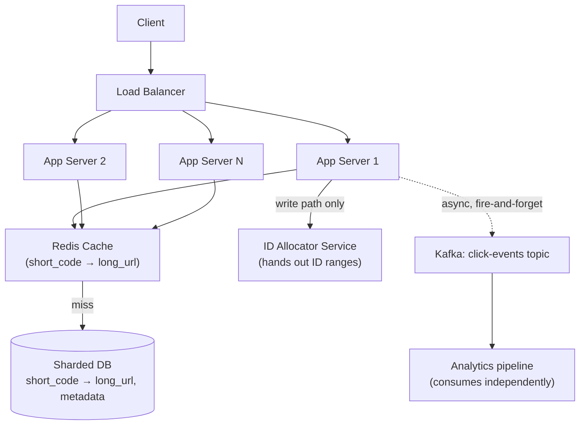
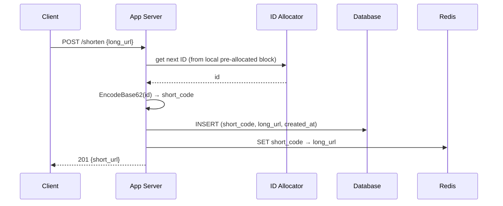
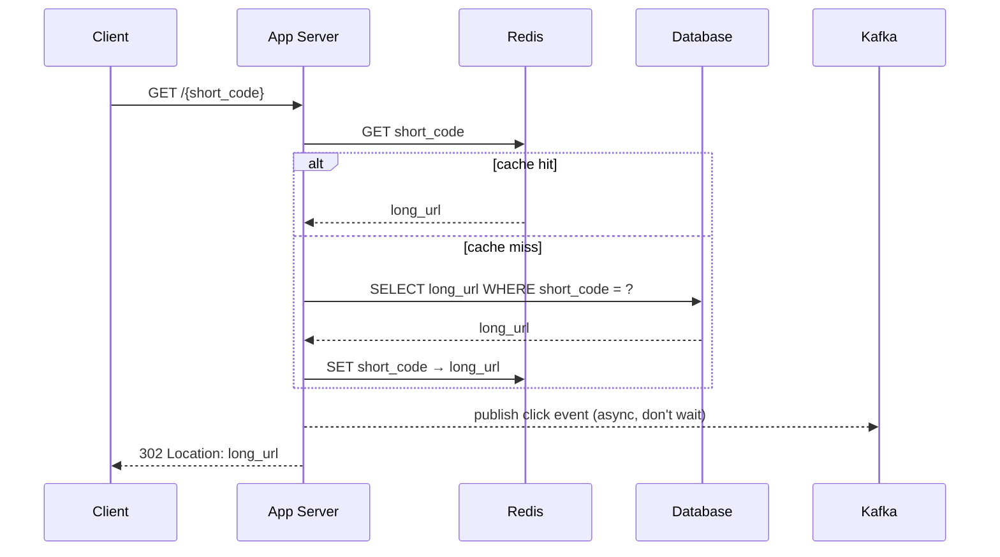

# Design TinyURL (URL Shortener)

> [!abstract] What you'll be able to do after this chapter
> Run the full 8-step HLD template on a real question, derive a collision-free ID generation scheme from first principles (not just "hash it"), justify a SQL-vs-NoSQL choice with the actual access pattern instead of a reflex, and defend every design decision against realistic interviewer pushback.

---

## Step 1 — The interview question

> [!question] As an interviewer would ask it
> "Design a URL shortening service like TinyURL or bit.ly. A user submits a long URL and gets back a short one; visiting the short URL redirects to the original."

---

## Step 2 — Requirements

**Functional**
- Given a long URL, generate a unique short URL.
- Given a short URL, redirect to the original long URL.
- (Extension) Users can request a **custom alias** instead of a system-generated one.
- (Extension) Links can **expire** after a set time or on demand.
- (Extension) Basic click **analytics**.

**Non-functional — and why each one actually matters**
| Requirement | Why it matters here specifically |
|---|---|
| **High availability on redirect** | The redirect is the critical path — it fires every time anyone clicks the link, anywhere it was shared (chat, email, social). If redirect is down, every previously-shared link looks broken to someone who has no relationship with your system at all. |
| **Low redirect latency** | A visible delay on a redirect reads as "broken link" to a user — this needs to feel instant. |
| **Guaranteed uniqueness** | Two long URLs can never collide on the same short code — a collision silently sends someone to the wrong site, a correctness bug, not a performance one. |
| **Read-heavy skew** | Every URL is shortened once but redirected through potentially thousands of times — the system is designed almost entirely around optimizing the *read* path. |

**Assumptions worth stating out loud in the interview**
- Short code length: aim for 7 characters. Base62 (`0-9`, `a-z`, `A-Z`) gives `62^7 ≈ 3.5 trillion` combinations — comfortably enough for a service running for decades.
- Redirect type: **HTTP 302** (temporary redirect), not 301. This is a real, non-obvious tradeoff — covered in Step 5.

---

## Step 3 — Back-of-envelope estimation

> [!example] Assumptions (state these explicitly before calculating)
> 500M new URLs shortened per month. Read:write ratio of 100:1 (redirects vastly outnumber shortens). Average record size ~500 bytes. Data retained for 5 years.

**Write QPS:**
`500,000,000 / (30 days × 86,400 sec/day) ≈ 500,000,000 / 2,592,000 ≈ 193 writes/sec average.`

**Read QPS** (100:1 ratio): `193 × 100 ≈ 19,300 reads/sec average`. Peak traffic is typically 2–3× average — budget for **~50,000 reads/sec at peak**.

**Storage over 5 years:**
`500M/month × 60 months = 30 billion records.`
`30,000,000,000 × 500 bytes ≈ 15 TB total.`
15TB is trivial by modern standards for either a sharded relational DB or a NoSQL cluster — storage is not the bottleneck here; **read QPS is**.

**Bandwidth at peak:** `50,000 reads/sec × ~500 bytes ≈ 25 MB/sec` — negligible, won't drive any architectural decision on its own.

**Cache sizing:** Real-world link popularity follows a power law — a small fraction of links account for most traffic. Caching the hottest ~20% of daily-active short codes typically captures ~80% of read traffic (a Pareto-shaped hot set). At 500-byte records, even caching millions of hot entries is a few GB — comfortably fits in a modest Redis cluster.

---

## Step 4 — Building it incrementally

**v0 — the naive version.** A single server holding an in-memory `map[string]string` from short code to long URL. Works for a demo. Breaks on the first restart (no persistence) and can't run more than one instance (no shared state). Every real requirement from here on is "what does v0 lack, and what do we add to fix that."

**Need persistence → need a database.** The access pattern here is almost embarrassingly simple: **always look up by the short code (the primary key)**. No joins, no complex queries, no secondary access patterns beyond that (analytics, if built, is a separate concern). This access pattern is exactly what key-value/NoSQL stores are built for — but it's *also* trivially servable by a SQL database with the short code as primary key.

> [!tip] SQL vs NoSQL — the actual reasoning, not the reflex
> **NoSQL (DynamoDB/Cassandra-style)** is the more natural default here: horizontal scaling is built in, the data model has no relationships to model, and the access pattern is pure key lookup. **SQL (sharded Postgres/MySQL)** is an equally valid answer *if you can show the sharding strategy* — shard by a hash of the short code, and a relational DB handles 30B rows across enough shards without difficulty. Either answer is correct in an interview; picking one and being unable to explain how it scales is the actual failure mode.

**Need to generate the short code itself.** This is the part of TinyURL interviewers actually care about — three real approaches, each with a real tradeoff:

| Approach | How it works | Tradeoff |
|---|---|---|
| **Random + collision check** | Generate a random 7-char base62 string, check the DB for existing use, retry on collision. | Simple to reason about, but collision probability rises as the keyspace fills, and a naive check-then-insert has a race condition unless backed by a DB unique constraint. |
| **Counter + base62 encode** | A monotonically increasing global counter; encode each new integer value into base62 to get the code. | Zero collisions by construction — no check needed at all. The counter itself can become a bottleneck/single point of failure at very high write volume (mitigated below). |
| **Hash-based (MD5/SHA of the long URL)** | Take the first 7 chars of a hash of the long URL. | Deterministic — the same long URL always maps to the same short code, which gives free deduplication. But hash collisions are real at 7 chars and need a fallback (append a salt and retry), and dedup requires an index on the long URL column too. |

**The counter-based approach is the strongest default answer** — it's the only one that guarantees uniqueness *without* a check-then-write race condition. The base62 encoding itself is worth writing out precisely:

```go
const base62Alphabet = "0123456789abcdefghijklmnopqrstuvwxyzABCDEFGHIJKLMNOPQRSTUVWXYZ"

// EncodeBase62 converts a non-negative integer ID into a base62 short code.
func EncodeBase62(id uint64) string {
	if id == 0 {
		return string(base62Alphabet[0])
	}
	var result []byte
	for id > 0 {
		remainder := id % 62
		result = append([]byte{base62Alphabet[remainder]}, result...)
		id /= 62
	}
	return string(result)
}

// DecodeBase62 converts a base62 short code back into its integer ID —
// needed if you ever want to derive the record's ID directly from its code
// (e.g. for a range-partitioned datastore keyed by ID).
func DecodeBase62(code string) uint64 {
	var id uint64
	for _, char := range code {
		id = id*62 + uint64(strings.IndexRune(base62Alphabet, char))
	}
	return id
}
```

**The single-counter bottleneck, solved.** A naive `SELECT counter + 1` shared by every app server serializes all writes through one row — a real bottleneck at 200+ writes/sec and a single point of failure. The standard fix: **range allocation**. A small, highly-available ID-allocator service hands each app server a *block* of, say, 1,000 IDs at a time (e.g. via an atomic increment in Redis/ZooKeeper). Each app server then generates codes from its local block without contacting the allocator again until the block is exhausted — turning "one contended counter per write" into "one contended counter per 1,000 writes," while still guaranteeing global uniqueness. This is the same underlying idea behind **Twitter's Snowflake ID scheme**, worth naming directly if asked for a well-known real-world precedent.

**Need to protect the DB from the read-heavy redirect path → add a cache.** Redirect lookups are read-heavy, keyed by short code, and the mapping is (mostly) immutable once created — a textbook fit for **cache-aside**: on redirect, check Redis first; on a miss, read from the DB and populate the cache; on a write (new short URL created), populate the cache proactively rather than waiting for the first read to miss.

---

## Step 5 — Deep dive: 301 vs 302, the tradeoff most candidates miss

| | **301 (Permanent Redirect)** | **302 (Temporary Redirect)** |
|---|---|---|
| Browser behavior | Caches the redirect target locally | Does **not** cache — hits your server every time |
| Server load | Lower — repeat visits skip your server entirely after the first | Higher — every click hits your redirect service |
| Analytics | Broken after the first visit per browser — you never see the repeat clicks | Accurate — every single click is observable server-side |
| SEO signal | Tells search engines the short URL *is* the permanent canonical location | No such signal |

> [!bug] Why most real systems (bit.ly included) use 302, not 301
> A 301 looks like the "correct" HTTP-semantics answer, and it is *lower load* — but it silently makes click analytics impossible for any browser that's visited the link before, since the browser never asks your server again. Real link-shortening products care about click analytics as a core product feature, so **302 is the actual production answer** despite the extra server load — this is a genuine product-requirements tradeoff, not a technical mistake either way, and stating it as a deliberate tradeoff (not just picking 301 because it "sounds more correct") is the signal interviewers are listening for.

---

## Step 6 — Full architecture



**Write path (shorten a URL):**



**Read path (redirect), the hot path:**



**Failure flow:** if a Redis node dies, requests fall through to the DB (higher latency, not an outage) and the cache re-warms naturally as reads repopulate it. If a DB shard's primary dies, a replica is promoted ([[Glossary/Consistent Hashing|shard routing]] and replica promotion are covered in depth in the Databases fundamentals chapter). App servers are stateless behind the load balancer, so any individual app server dying is a non-event — the LB simply stops routing to it.

**Scaling strategy:** app tier scales horizontally (stateless, just add more instances behind the LB). Cache scales via a Redis Cluster, sharded by key. DB scales by sharding on a hash of the short code — evenly distributing both storage and read load across shards.

---

## Step 7 — Interviewer follow-ups, answered

> [!quote]- "How would you support custom aliases?"
> Custom aliases break the counter-based generation scheme — a user-chosen string isn't derived from the counter, so it needs its own uniqueness check. Solution: a **unique constraint on the short_code column** at the database level, and an insert that relies on that constraint to atomically reject a duplicate (returning "alias taken" to the user) rather than a racy check-then-insert in application code.

> [!quote]- "How do you track click analytics without slowing down the hot redirect path?"
> Never make the redirect wait on an analytics write. Fire-and-forget publish a click event to a Kafka topic (see [[CS Fundamentals/Messaging & Streaming/Kafka Internals|Kafka Internals]]) and return the 302 immediately — the analytics pipeline consumes from Kafka completely independently, on its own time, with zero impact on redirect latency even if the analytics pipeline is slow or briefly down.

> [!quote]- "What happens if the ID allocator service goes down?"
> Because app servers pre-fetch a *block* of IDs (Step 4) rather than requesting one ID per write, they can keep generating short codes locally for as long as their current block lasts, even with the allocator fully down. The allocator itself should also run as a small HA cluster (2-3 nodes) rather than a single instance, since it's a shared dependency for every app server.

> [!quote]- "How would you support link expiration?"
> Add an `expires_at` column. Check it on read (a cache hit for an expired link still needs the app server to validate the timestamp before redirecting — cache the record, but not the "is it still valid" decision, or cache with a TTL matching the expiry). A background job periodically purges expired rows from the DB and evicts them from the cache proactively rather than waiting for a read to catch it.

> [!quote]- "How would you scale this 10x?"
> Read path scales further with more cache capacity and more Redis shards — reads dominate, so that's where 10x load actually lands. Consider a **CDN in front of the redirect endpoint itself** for extremely popular links (a redirect response is small and cacheable). Write path scales by simply widening the ID-block size handed out per allocator request, reducing allocator round-trips further.

> [!quote]- "Why not just hash the long URL (MD5, first 7 chars) instead of a counter?"
> It's deterministic (free dedup) but real collisions occur at 7 characters of a 128-bit hash space truncated that aggressively, requiring a retry-with-salt fallback anyway — at which point you've reintroduced a check-then-write step the counter-based approach never needed in the first place. The counter approach is strictly simpler to reason about for guaranteed uniqueness.

---

## Step 8 — Production experience

> [!info] What to monitor
> Redirect latency (p50/p99 — see [[Glossary/Latency Percentiles (P50, P90, P99)|latency percentiles]]), cache hit ratio (a sudden drop signals either a cache outage or a shift in traffic pattern away from the cached hot set), DB replication lag, ID-allocator availability and block-exhaustion rate, 4xx/5xx rate on the redirect endpoint.

> [!bug] Common production issues
> **Hot-key skew** — a single link goes viral and its short code receives disproportionate traffic, potentially overwhelming the one cache shard/DB partition that owns it. Mitigation: a short-TTL **local in-process cache** on each app server in front of the distributed cache absorbs extreme hot-key traffic without adding load to Redis at all, or push very hot redirects to a CDN edge layer entirely.
> **Allocator block exhaustion under bursty write traffic** — if writes spike faster than expected, an app server can burn through its ID block quickly and stall waiting on the allocator; mitigate by pre-fetching the *next* block proactively before the current one is fully exhausted, not reactively after it runs out.

> [!success] Debugging a slow redirect
> Check cache hit/miss for the specific short code first. If it's a cache miss, check DB query latency for that shard specifically — an unusually slow single-shard query often points to that shard being disproportionately loaded (a hot-key or hot-shard symptom, not a general DB problem).

> [!tip] Cost optimization
> Most short URLs stop receiving traffic entirely after some period. A background job identifying long-unused codes and moving their records to cheaper cold storage (or purging entirely, per a stated retention policy) keeps the active, cache-warmed dataset small relative to total historical volume — directly reducing both DB and cache footprint costs at scale.

---
*Related: [[00 - Start Here/How This Handbook Works|Book Map]] · [[CS Fundamentals/Messaging & Streaming/Kafka Internals|Kafka Internals]] · [[Glossary/Consistent Hashing|Consistent Hashing]] · [[Glossary/QPS|QPS]]*
