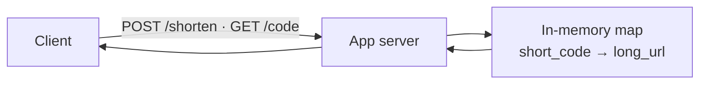
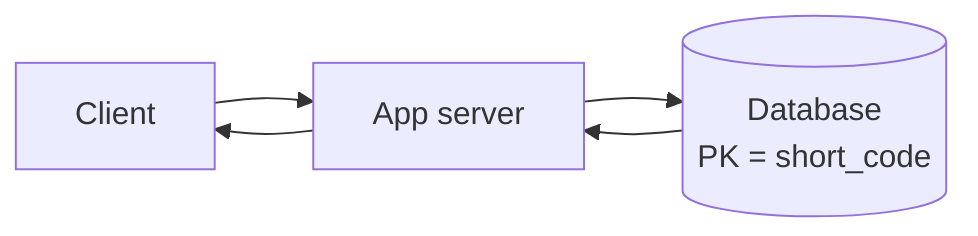
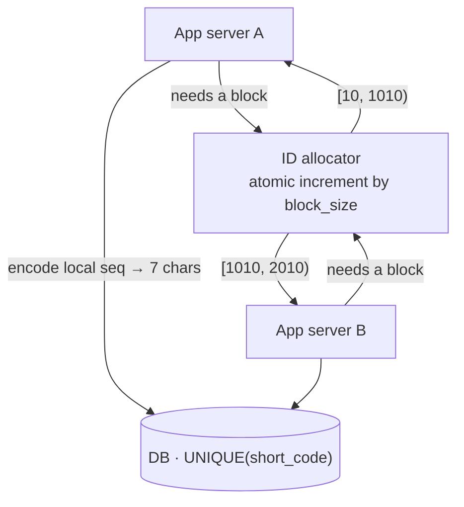
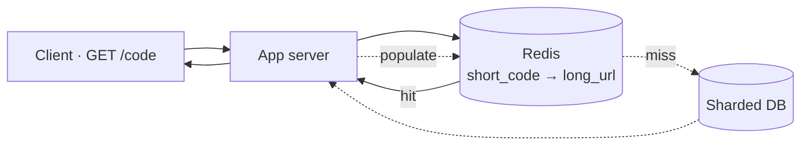
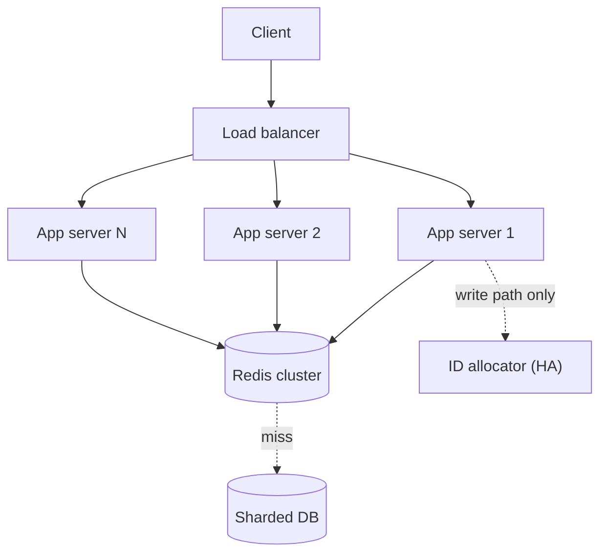
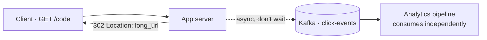
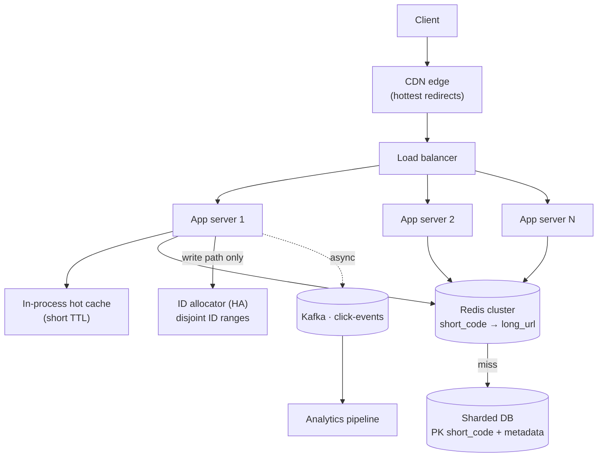
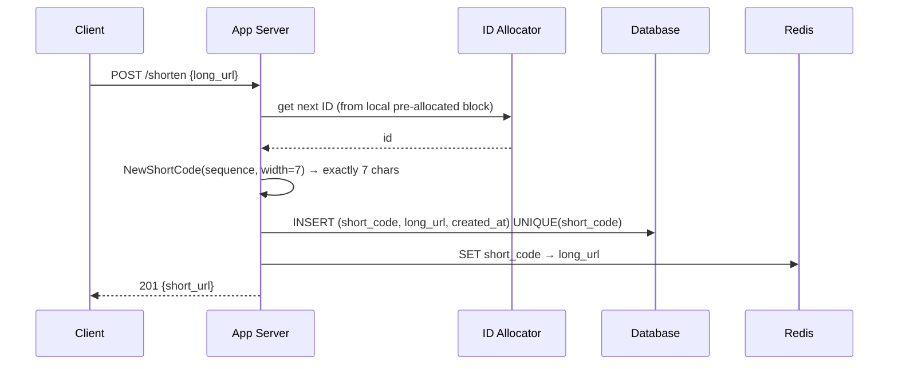
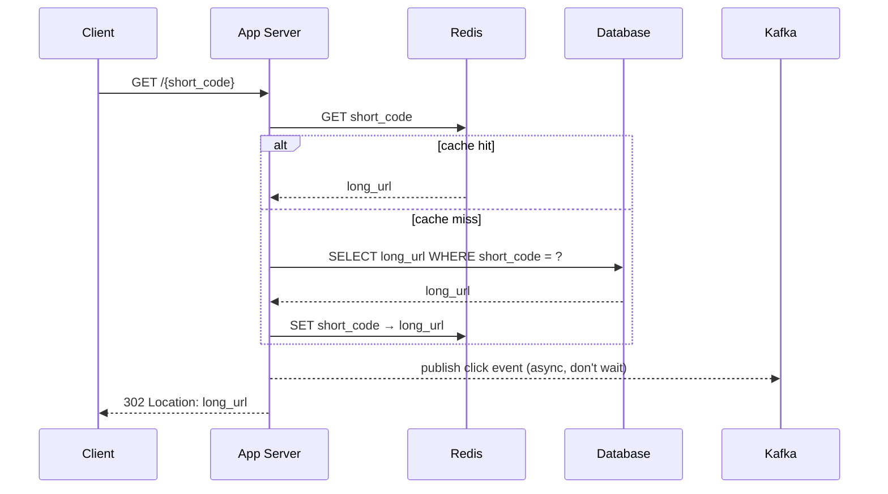

# Design TinyURL (URL Shortener)

> [!abstract] How to read this chapter
> Built the way you should narrate it on a whiteboard: start embarrassingly simple, then each **phase** adds one idea, exposes the next bottleneck, and fixes it. A URL shortener looks like a two-column table — the interview is entirely about the two hard corners hiding inside it: minting a globally unique 7-character code with **no coordination bottleneck**, and serving a redirect that feels instant to strangers who never signed up for your product.

> [!question] The interview question
> "Design a URL shortening service like TinyURL or bit.ly. A user submits a long URL and gets back a short one; visiting the short URL redirects to the original."

---

## Requirements

**Functional**
- Given a long URL, generate a unique short URL.
- Given a short URL, redirect to the original long URL.
- *(Extension)* **Custom alias** — user picks the code; shares the same namespace and uniqueness constraint.
- *(Extension)* **Expiry** — links die on a timer or on demand.
- *(Extension)* Basic click **analytics**.

**Non-functional — and why each one actually matters here**

| Requirement | Why it matters here specifically |
|---|---|
| **High availability on redirect** | The redirect is the critical path — it fires every time anyone clicks the link, anywhere it was shared. If redirect is down, every previously-shared link looks broken to someone who has no relationship with your system at all. |
| **Low redirect latency** | A visible delay on a redirect reads as "broken link". This must feel instant. |
| **Guaranteed uniqueness** | Two long URLs can never collide on the same short code — a collision silently sends someone to the wrong site. A correctness bug, not a performance one. |
| **Read-heavy skew (100:1)** | Every URL is shortened once but redirected thousands of times — the whole system is designed around optimizing the *read* path. |

**Assumptions worth stating out loud**
- Short code length: **exactly 7 characters**. Base62 (`0-9`, `a-z`, `A-Z`) gives `62⁷ ≈ 3.5 trillion` combinations — decades of headroom. Case-sensitive, treated as an opaque string; leading zeroes, if used, are meaningful.
- Redirect type: **HTTP 302** (temporary), not 301 — a real tradeoff, covered in Phase 08.

---

## Phase 00 — Capacity math you can defend

> [!example] State the assumptions before calculating
> 500M new URLs/month · read:write ratio 100:1 · avg record ~500 bytes · retained 5 years.

| Quantity | Derivation | Result |
|---|---|---|
| Write QPS (avg) | 500M/month ÷ (30 × 86,400 s) | **~193 writes/s** |
| Read QPS (avg) | 193 × 100 | ~19,300 reads/s |
| Read QPS (peak) | 2–3× average | **~50,000 reads/s** |
| Rows over 5 years | 500M/month × 60 | ~30 billion records |
| Storage | 30B × ~500 B | ~15 TB — trivial for a sharded store |
| Peak bandwidth | 50k/s × ~500 B | ~25 MB/s — negligible |
| Hot-set cache | power-law: ~20% of links ≈ 80% of traffic | a few GB → modest Redis |

> [!example] In plain words
> 15 TB is nothing and 193 writes/s is nothing. The only big number is **50k reads/s at peak**, and it's cache-friendly because the same viral links repeat. The entire architecture below is that one sentence, drawn out. The bottleneck is **read QPS**, not storage.

### How many characters must the code be? Derive it from write volume

The code length is **not** a magic constant — it's set by the **total number of URLs you will ever mint** (cumulative writes over the service's lifetime), because every mint consumes one code from the keyspace. Base62 with length `L` holds `62^L` distinct codes. So: project cumulative writes forward, then pick the smallest `L` with `62^L ≥ that total`.

At 500M/month = **6 billion codes/year**:

| Horizon | Cumulative codes needed | Smallest length that fits | Why |
|---|---|---|---|
| 1 year | 6 B | **6 chars** | `62⁵ = 916 M` ✗ · `62⁶ = 56.8 B` ✓ |
| 5 years | 30 B | **6 chars** | 30 B < `62⁶ = 56.8 B` ✓ |
| 10 years | 60 B | **7 chars** | 60 B > `62⁶ = 56.8 B` ✗ · `62⁷ = 3.52 T` ✓ |
| 100 years | 600 B | **7 chars** | 600 B ≪ `62⁷ = 3.52 T` ✓ |

**The formula:** `L = ⌈ log₆₂(total codes needed) ⌉`. Base62 sizes by length:

| L | `62^L` | Enough for (at 6 B/yr) |
|---|---|---|
| 4 | ~14.8 M | ~1 day — only a tiny/internal service |
| 5 | ~916 M | ~2 months |
| 6 | ~56.8 B | ~9.5 years |
| **7** | **~3.52 T** | **~590 years** |
| 8 | ~218 T | millennia |

> [!success] Why 7 is the defensible default here
> 5 years needs 6 chars, 10 years needs 7. Choosing **7 from day one** covers 10+ years with `62⁷ ≈ 3.52 T` capacity — ~590 years of headroom at this write rate — so you never face a mid-life length migration. If the projection were smaller you'd pick smaller: **≤14 M links ever → 4 chars; ≤900 M → 5; ≤57 B → 6.** Length is a function of projected lifetime volume, plus headroom — state that derivation out loud, don't assert "7 because bit.ly."

---

## Phase 01 — A client and one server

*Start embarrassingly simple so every later box exists for a stated reason.*



A single server holds a `map[string]string`. On shorten it invents a code and stores the pair; on redirect it looks the code up. Perfect for a demo.

| 🔴 Bottleneck | 🟢 Next fix |
|---|---|
| Nothing survives a restart (no persistence); can't run a second instance (state lives in one process's RAM); one box can't take 50k reads/s. | Durable storage first (Phase 2), then figure out where the code actually comes from (Phase 3). |

> [!example] Layman
> One clerk with a notebook. Fast until the notebook fills, the clerk sleeps, or a second clerk is hired and the two notebooks disagree.

---

## Phase 02 — Add a persistent database

*Mappings must survive restarts and be shared across every app instance.*



The access pattern is almost insultingly simple: **always look up by short code, the primary key.** No joins, no secondary queries, no relationships. That shape is the native home of a key-value / NoSQL store — but it is *also* trivially served by SQL with the short code as PK.

| Option | Why it fits | Cost to defend |
|---|---|---|
| **NoSQL** (DynamoDB / Cassandra) | Horizontal scaling built in; no relations to model; pure key lookup | The natural default here |
| **SQL** (sharded Postgres / MySQL) | PK = short_code; 30B rows across enough shards is routine | Equally correct *if* you can state the sharding strategy |

> [!quote] Interview line
> "Either store is right. The failure mode isn't picking SQL or NoSQL — it's picking one and being unable to explain how it scales to 30 billion rows. I'll take NoSQL for the built-in horizontal scaling, sharding by a hash of the short code either way."

| 🔴 Bottleneck | 🟢 Next fix |
|---|---|
| We hand-waved "invents a code." *How* the code is generated — uniquely, across many servers, with no bottleneck — is the actual interview. | Enumerate the real ID-generation approaches (Phase 3). |

---

## Phase 03 — Where the 7-character code comes from: four real approaches

*The part interviewers actually care about. "Just hash it" is a trap.*

> [!example] Layman framing first
> Picture a hotel with hundreds of front desks (app servers) checking guests in at once, every guest needing a *unique room number* (short code). Two bad options: make every desk phone one central operator for every guest (too slow — the operator is a bottleneck), or let every desk invent numbers and pray nobody clashes (works until it doesn't, and checking for clashes forever is real work). Everything below is a different **real** way hotels — and distributed systems — solve this.

| Approach | How it works | Right for… |
|---|---|---|
| **Counter + range allocation**, base62-encoded | A shared counter hands out ID *blocks* to servers; each server encodes its own local integers to base62 | The textbook-correct answer here — zero collisions by construction, simplest to defend |
| **Random 7-char** + collision check | Draw 7 random base62 chars; Bloom pre-check, then let an atomic `UNIQUE` insert decide | What many production shorteners prefer — avoids a guessable, enumerable sequence (see 05B) |
| **Hash-based** (SHA-256, truncated) | Hash the long URL, base62-encode, keep first 7 chars | Systems wanting *free dedup* — same URL → same code. Git short hashes are the same idea |
| **Snowflake-style** local ID | Each server builds an ID from timestamp + machine ID + sequence, zero coordination | Internal, time-sortable numeric IDs at fleet scale (Twitter/Instagram/Discord) — *not* a compact public code |

**Bottlenecks & tradeoffs, side by side** — this is the table interviewers actually probe:

| Approach | Main bottleneck / cost | Collision handling | Length behaviour | Enumerable? (security) | Pick when |
|---|---|---|---|---|---|
| **Counter + range alloc** | The shared counter — a single hot row *if* done naively; solved by handing out **blocks** (Phase 5) so a server hits it once per few thousand writes | **None** — disjoint ranges are unique by construction | Deterministic: length = `⌈log₆₂(counter)⌉`, grows predictably | **Yes** — sequential codes are guessable/scrapable unless obfuscated | Default. You own the namespace, want zero collisions, don't mind (or will shuffle) sequential codes |
| **Random N-char** | **Retry rate**, which rises as the keyspace fills (fill-ratio, Phase 5B) — negligible early, ~1-in-118 even at max load | DB `UNIQUE` insert decides; Bloom filter pre-check trims wasted attempts | Fixed `N` by construction (you draw `N` symbols) | **No** — unguessable, the main reason to choose it | Links may be sensitive; you want them hard to enumerate |
| **Hash of URL** (SHA-256, truncated) | **Truncation collisions** (throwing away most hash bits) + a salt-and-retry fallback that reintroduces a check-then-write | DB `UNIQUE` + salted re-hash on conflict | Fixed `N` (you keep first `N` chars) | No (looks random) | You want **free dedup** — same long URL always yields the same code, no separate index |
| **Snowflake** | ID is **63 bits → up to 11 base62 chars** — too long for a compact code; wrong tool | None (unique by machine+time+seq) | Fixed but **too long** (≈11 chars) | Yes (time-sortable) | Internal, time-sortable numeric IDs at fleet scale — *not* a public short code |

> [!danger] Sequential IDs are a named security bug, not a style preference
> A plain incrementing counter, base62-encoded, lets anyone enumerate **every URL you've ever shortened** by requesting code `1`, `2`, `3`… The long URL behind a link may itself be sensitive (a private doc, an unlisted video, a password-reset flow). This is the concrete reason many real systems choose random over a raw counter — expanded in Phase 05B.

| 🔴 Bottleneck | 🟢 Next fix |
|---|---|
| Length was set in Phase 00 (7 chars for 10 years) — but is the code a *fixed* 7 chars, or does it *grow* 1→2→3…? That's a real design choice with tradeoffs. | Fixed vs growing width, done precisely (Phase 4). |

---

## Phase 04 — Fixed length vs a code that grows as you scale

*Two independent decisions once you've picked the algorithm: **how long** the code is (Phase 00 gave the formula) and whether that length is **fixed from day one** or **grows over time** as you consume the keyspace.*

### Option A — Variable width: start at 1 character, grow automatically

This directly answers "*start with a single character for the first users, then move to 2, then 3…*". You get it **for free** from natural base62 encoding: a counter uses only as many characters as its value needs — exactly like decimal (`9` → 1 digit, `10` → 2 digits). The first 62 links are 1 char, the next 3,844 are 2 chars, and the code lengthens automatically as the counter climbs.

| Counter crosses | Code length becomes | Reached after (at 6 B/yr) |
|---|---|---|
| 62 | 2 chars | ~1 second |
| 3,844 | 3 chars | ~20 seconds |
| 238,328 | 4 chars | ~21 minutes |
| 14.8 M | 5 chars | ~1 day |
| 916 M | 6 chars | ~2 months |
| 56.8 B | 7 chars | ~9.5 years |
| 3.52 T | 8 chars | ~590 years |

> [!warning] The catch at this write volume: the short-code era is over in *days*
> "Start small and grow" wastes **zero** keyspace and gives early users cute short codes — but at 6 B writes/year the counter blows past 5 chars within a day and sits at **6–7 chars for essentially the entire service life**. Only the first ~15 M links (the first day) are ≤5 chars. So the strategy is elegant and correct, but its benefit is tiny *at this scale*. It genuinely shines for a **low-volume or internal service** — a few thousand links a day — where you might legitimately stay at 4–5 characters for years, and never pay for length you aren't using.

### Option B — Fixed width: every code is exactly `L` characters from day one

Pad the number up to `L` characters so even the first code is full length. Uniform, opaque, predictable-length codes — what a public product like bit.ly ships. Two ways to hit a fixed `L`:

- **Allow leading zeroes:** sequence `0` → `0000000`. Uses the whole `62^L` keyspace.
- **Avoid a leading zero:** start the numeric range at `62^(L-1)`. Sequence `0` → `1000000`. Cleaner for a human-facing URL; still ~`62^L − 62^(L-1)` codes.

In both cases the code is a **string**. Never parse it as a number or strip leading zeroes.

### The tradeoff, side by side

| | **Variable width (natural)** | **Fixed width (padded to `L`)** |
|---|---|---|
| Early codes | Short (1–5 chars) — nice for early users | Full `L` from the very first link |
| Keyspace waste | None — uses exactly what's needed | Tiny (the padding), irrelevant in practice |
| Length predictable? | No — clients/UI can't assume a length | **Yes** — URLs align, validation/QR/layout are trivial |
| Enumerable? | Yes (sequential) — same security note as Phase 03 | Yes unless random/obfuscated |
| Best when | Low-volume / internal; want short early codes | High-volume public product; want uniform opaque codes |

> [!success] Recommendation for *this* problem
> Ship **fixed 7-char** codes. At 6 B/yr you'd be on 6–7 chars within days anyway, so variable width buys almost nothing, and a fixed length makes every URL uniform, opaque, and trivially validated. Reach for variable width only if the service is genuinely low-volume and short early codes matter.

### The generalized encoder — works for any `L` (4, 7, whatever Phase 00 says)

```go
const base62Alphabet = "0123456789abcdefghijklmnopqrstuvwxyzABCDEFGHIJKLMNOPQRSTUVWXYZ"

// EncodeBase62Fixed always returns exactly `width` characters. Caller ensures id < 62^width.
// width comes straight from the Phase 00 length calc: 4 for a small service, 7 here.
func EncodeBase62Fixed(id uint64, width int) string {
	out := make([]byte, width)
	for i := width - 1; i >= 0; i-- {
		out[i] = base62Alphabet[id%62]
		id /= 62
	}
	return string(out)
}

// pow62(w) = 62^w. For width 7, firstID = 62^6 avoids a leading zero.
func NewShortCode(sequence uint64, width int) string {
	firstID := pow62(width - 1) // start past the leading-zero range
	return EncodeBase62Fixed(firstID+sequence, width)
}
```

> [!warning] Fix · guard the capacity ceiling for whatever `L` you chose
> A fixed-`L` range is hard-bounded: `0 ≤ encoded_id < 62^L`. With the no-leading-zero start, usable capacity is `62^L − 62^(L-1)`. The allocator must **reject or migrate before exhaustion** — silently emitting an `(L+1)`-th character breaks the URL contract for every link already issued. This is exactly why Phase 00 sizes `L` for lifetime volume *plus headroom*: at 7 chars you have ~590 years of runway, so the ceiling is a guard, not a live worry.

---

## Phase 05 — The single-counter bottleneck, solved by range allocation

*A shared `SELECT counter+1` serializes every write through one row — a real choke point at 200 writes/s and a single point of failure.*



```text
start = atomic_increment(global_next_id, block_size)
range = [start - block_size, start)
```

Server A gets `[10, 1010)`, Server B gets `[1010, 2010)` — they can **never** produce the same sequence value. Each server burns its local range and calls the allocator only when it needs another. A crashed server abandons unused IDs; gaps are harmless, reuse would be dangerous. Every value goes through `NewShortCode` and inserts under a `UNIQUE(short_code)` constraint — disjoint ranges give uniqueness by construction; the constraint is the last line of defense against allocator bugs and alias conflicts.

> [!quote] Interview line
> "The allocator is not on the per-write path — a server touches it once per *block*, maybe once every few thousand writes. Widen the block to reduce round-trips; run the allocator as a 2–3 node HA cluster so a shared dependency isn't a single point of failure."

| 🔴 Bottleneck | 🟢 Next fix |
|---|---|
| Counter codes are sequential → enumerable. For a service whose long URLs can be private, that's a data-leak vector, not a style nit. | The random-code alternative and its collision math (Phase 05B). |

---

## Phase 05B — Random codes, and the collision math worked precisely

*When links must be un-guessable, random beats the counter — but only with the right collision handling, and the numbers are smaller than most candidates fear.*

Random generation draws 7 symbols independently from the alphabet — no integer, no encoding step, always exactly 7 characters. The correctness algorithm is *not* "generate and hope":

```text
repeat:
    candidate = cryptographically_random_base62(7)
    INSERT (candidate, long_url) with UNIQUE(candidate)
    if insert succeeds:            return candidate
    if unique-constraint conflict: try again
```

The database uniqueness constraint is authoritative. A Bloom filter reduces needless DB attempts but is only a performance optimization — it never replaces the atomic insert.

> [!info] The real collision math, worked precisely
> Two different questions get conflated. **"Blindly generate all 30B codes with zero checking — collision?"** Yes, essentially guaranteed (birthday paradox over `62⁷ ≈ 3.5×10¹²`). That's why blind random is never used *alone*. **The question that actually matters — "retry rate when you check before committing?"** — is just the keyspace *fill ratio*: at full 5-year capacity, `30×10⁹ / 3.5×10¹² ≈ 0.85%` — roughly 1 draw in 118 retries, even at *maximum* lifetime load. Early on (1B codes) it's `≈ 0.028%` — a non-issue.

A [[CS Fundamentals/06 - Distributed Systems/Bloom Filter and Probabilistic Membership|Bloom filter]] in front of the DB absorbs the ~99%+ of draws that are genuinely new. Its false positives cost an occasional needless retry (cheap); it never returns a false negative, so a real collision can't slip past — the `UNIQUE` constraint stays the final authority regardless.

**The hash-based cousin, and why Snowflake doesn't fit:**
- **Hash-based:** SHA-256 the long URL, keep first 7 base62 chars. Truncation collapses the effective space back to the same `62⁷`, so the retry math is identical — but hashing is *deterministic*, giving free dedup (same URL → same code, no separate index). A genuine hash collision needs the same salt-and-retry fallback.
- **Snowflake doesn't fit 7 chars:** 7 base62 chars ≈ `41.68 bits` of entropy; a Snowflake ID uses **63 usable bits** and base62-encodes to *up to 11 characters*. Right tool for internal time-sortable IDs, wrong tool for a compact public code. At ~193 writes/s we never needed its precision anyway. Full bit-layout and code: [[LLD/20 - Design a Distributed ID Generator/Design a Distributed ID Generator|Design a Distributed ID Generator]].

> [!success] Which one is best — the honest, defensible recommendation
> **Lead with counter + range allocation + fixed-width base62:** exactly seven chars, uniqueness by construction, no per-write allocator round-trip. If links must be hard to enumerate, switch to cryptographically-random seven-char codes with `INSERT … ON CONFLICT RETRY` — the DB, not the RNG, guarantees uniqueness. Hash-based only when deterministic dedup is a real requirement. Snowflake is a fine internal generator but not needed for a seven-character public code.

---

## Phase 06 — Cache the read path

*Redirects are read-heavy, keyed by short code, and the mapping is effectively immutable once created — a textbook [[Glossary/Cache-Aside|cache-aside]] fit.*



- **On redirect:** check Redis first; on miss, read the DB and populate the cache.
- **On write:** populate the cache proactively rather than waiting for the first read to miss.
- The hot set is power-law (Phase 00), so a few GB of cache captures ~80% of reads — the DB only ever sees the misses.

> [!example] Layman
> The clerk keeps the few hundred most-asked links on a sticky note by the desk. The big filing cabinet (DB) is only opened for the rare link nobody's asked about lately.

| 🔴 Bottleneck | 🟢 Next fix |
|---|---|
| The app server is still one box, and one box can't survive a crash or take 50k reads/s. | Stateless app tier behind a load balancer (Phase 7). |

---

## Phase 07 — Load balancer + stateless app tier

*Horizontal scale and fault tolerance for the tier that takes 50k reads/s.*



**Stateless** is the load-bearing word: no session data on the server, so the pre-allocated ID block is the *only* local state — and even that is disposable (abandon it on crash). Instances can be added, killed and autoscaled freely; the LB ejects any instance that fails a health check, so a dying app server is a non-event.

| 🔴 Bottleneck | 🟢 Next fix |
|---|---|
| We've said "redirect" without choosing the HTTP status — and that choice quietly trades server load against click analytics. | 301 vs 302, the tradeoff most candidates miss (Phase 8). |

---

## Phase 08 — Deep dive: 301 vs 302

*Both are "correct" HTTP. The choice is a product decision about analytics — stating it as a deliberate tradeoff is the signal interviewers listen for.*

| | **301 Permanent** | **302 Temporary** |
|---|---|---|
| Browser behavior | Caches the target locally | Does **not** cache — hits your server every time |
| Server load | Lower — repeat visits skip you | Higher — every click hits redirect |
| Analytics | Broken after first visit per browser | Accurate — every click observable |
| SEO signal | Short URL = canonical location | No such signal |

> [!bug] Why bit.ly and friends use 302, not 301
> 301 looks like the "correct HTTP-semantics" answer and it *is* lower load — but it silently makes click analytics impossible for any returning browser, because the browser never asks you again. Link shorteners treat click analytics as a **core product feature**, so **302 is the production answer** despite the extra load. Picking 302 as a deliberate product tradeoff — not defaulting to 301 because it "sounds more correct" — is what scores.

---

## Phase 09 — Click analytics without touching the hot path

*We chose 302 precisely to see every click. Now record them without adding a millisecond to the redirect.*



**Never make the redirect wait on an analytics write.** The app server publishes a click event to [[CS Fundamentals/05 - Messaging & Streaming/Kafka Internals|Kafka]] fire-and-forget and returns the 302 in the same breath. The analytics pipeline consumes on its own time — even if it is slow or briefly down, redirect latency is unaffected and no click that reached the server is lost (Kafka is the durable buffer).

> [!example] Layman
> The clerk points the visitor to the right door instantly, then drops a tally-mark in a box on the way past. Someone else empties the box later. The visitor never waits for the tally.

---

## Phase 10 — Custom aliases & link expiry

*Two extension features that each stress a different assumption baked into the core.*

**Custom aliases — the DB constraint does the hard work.** A user-chosen alias isn't derived from the counter, so it breaks "unique by construction." Lean on the same `UNIQUE(short_code)` constraint: the insert atomically rejects a duplicate (return "alias taken") rather than a racy check-then-insert in app code. Aliases share the one namespace, so a custom alias and a generated code can never collide.

**Expiry — cache the record, not the verdict.**
- Add an `expires_at` column; check it on read.
- A cache hit for an expired link still needs the app server to validate the timestamp before redirecting — cache the *record*, not the "is it still valid" decision (or set a cache TTL matching expiry).
- A background job purges expired rows from the DB and proactively evicts them from the cache rather than waiting for a read to catch it.

> [!danger] The classic expiry bug
> Caching the redirect *decision* instead of the *record* means an expired link keeps redirecting from cache long after it "died." Cache the mapping; re-evaluate validity on every hit.

---

## Phase 11 — Sharding, scaling 10×, and hot keys

*30B rows and 50k reads/s already need sharding; a viral link then concentrates load on one shard.*

- **App tier:** stateless — scale by adding instances behind the LB.
- **Cache:** Redis Cluster, sharded by key.
- **DB:** shard on a hash of the short code — spreads both storage and read load evenly, since lookups are pure key lookups anyway.
- **10× reads:** reads dominate, so 10× load lands on the read path — add cache capacity and Redis shards, and put a **CDN in front of the redirect endpoint itself** for extremely popular links (a redirect response is tiny and cacheable).
- **10× writes:** widen the ID block handed out per allocator request — fewer round-trips, no other change.

> [!danger] Hot-key skew
> One link goes viral and its short code hammers the single cache shard / DB partition that owns it. Mitigation: a short-TTL **in-process cache** on each app server in front of Redis absorbs extreme hot-key traffic without adding any Redis load, or push the very hottest redirects to a CDN edge entirely.

---

## Phase 12 — Failure modes & graceful degradation

*What does a stranger clicking a shared link actually experience when a component dies?*

| Failure | User sees | Mechanism |
|---|---|---|
| Redis node dies | Slightly slower redirects | Fall through to DB; cache re-warms as reads repopulate |
| DB shard primary dies | Nothing (brief blip) | Replica promoted; [[Glossary/Consistent Hashing\|shard routing]] handles failover |
| App server crashes | Nothing | Stateless; LB health check ejects it |
| ID allocator down | Nothing, for a while | Servers keep minting from their pre-fetched block; allocator is a 2–3 node HA cluster |
| Analytics pipeline down | Nothing | Clicks buffer in Kafka; redirect never waits on analytics |

> [!warning] Fix · pre-fetch the next block
> Allocator block exhaustion under a write burst can stall a server waiting for a new range. Pre-fetch the *next* block before the current one runs dry, not reactively after it's empty.

Design principle: *redirect availability is the one SLO that must never bend — everything else degrades quality (staler analytics, slower reads), never the redirect itself.*

---

## Phase 13 — The final combined architecture

*Every box below was forced into existence by a specific bottleneck in Phases 1–12.*



**Write path (shorten):**



**Read path (redirect), the hot path:**



**Six principles to close with:**
1. The system is read-heavy 100:1 — every decision optimizes the redirect, not the shorten.
2. Uniqueness is correctness: disjoint ID ranges give it by construction, a DB `UNIQUE` is the final guard.
3. The code is a fixed-width *string* — never a number, never strip leading zeroes, never let it grow to 8 chars.
4. Random over counter when links must be un-guessable; the retry rate is ~1-in-118 even at max capacity.
5. Cache IDs by short code, CDN the hottest, in-process cache the viral outliers.
6. Analytics is fire-and-forget through Kafka; the redirect never blocks on anything but the lookup.

---

## Interviewer follow-ups, answered

> [!quote]- "How would you support custom aliases?"
> Same namespace, same `UNIQUE(short_code)` constraint. The insert atomically rejects a duplicate — return "alias taken" — instead of a racy check-then-insert in app code. A custom alias and a generated code can't collide because they share the constraint.

> [!quote]- "Track clicks without slowing the hot redirect path?"
> Fire-and-forget a click event to a Kafka topic and return the 302 immediately. The analytics pipeline consumes independently — zero impact on redirect latency even if analytics is slow or down.

> [!quote]- "What if the ID allocator service goes down?"
> Servers pre-fetch a *block* of IDs, so they keep generating locally until the block empties, even with the allocator fully down. Run the allocator as a 2–3 node HA cluster since it's a shared dependency, and pre-fetch the next block before the current one is exhausted.

> [!quote]- "How would you support link expiration?"
> Add `expires_at`, check on read. A cache hit for an expired link still validates the timestamp — cache the record, not the redirect verdict (or TTL the cache to the expiry). Background job purges expired rows and evicts them proactively.

> [!quote]- "How would you scale this 10x?"
> 10× load lands on reads — add cache capacity and Redis shards, CDN the redirect endpoint for popular links. Writes scale by widening the ID block per allocator request, cutting allocator round-trips.

> [!quote]- "Why not just hash the long URL (MD5, first 7)?"
> Deterministic (free dedup) but real collisions occur at 7 chars of an aggressively truncated hash, needing a retry-with-salt fallback — at which point you've reintroduced a check-then-write step the counter approach never needed. Counter is strictly simpler to reason about for guaranteed uniqueness.

> [!quote]- "How did you decide on 7 characters — why not 4, or 8?"
> From projected lifetime volume, not habit. `L = ⌈log₆₂(total codes ever)⌉`. At 6 B/yr: 5 years = 30 B needs 6 chars (`62⁶ = 56.8 B`), 10 years = 60 B tips over into 7 chars (`62⁷ = 3.52 T`). I pick **7** so 10+ years fits with ~590 years of headroom and no mid-life migration. 4 chars (`62⁴ ≈ 14.8 M`) would exhaust in about a day at this rate — fine only for a small/internal service.

> [!quote]- "Could you start with 1-character codes for early users and grow the length later?"
> Yes — natural (variable-width) base62 does exactly that automatically: the counter uses only as many chars as its value needs, so early links are short and the code lengthens as volume grows. But at 6 B/yr the counter passes 5 chars within a day and sits at 6–7 for the whole service life, so the short-code benefit lasts hours. It's the right call for a genuinely low-volume/internal service; for a high-volume public product I'd ship fixed-width for uniform, opaque, predictable-length codes.

---

## Production experience

> [!info] What to monitor
> Redirect latency (p50/p99 — see [[Glossary/Latency Percentiles (P50, P90, P99)|latency percentiles]]), cache hit ratio (a sudden drop signals a cache outage or a traffic-pattern shift away from the cached hot set), DB replication lag, ID-allocator availability and block-exhaustion rate, 4xx/5xx rate on the redirect endpoint.

> [!bug] Common production issues
> **Hot-key skew** — a single link goes viral and overwhelms the one cache shard / DB partition that owns it. Mitigation: a short-TTL in-process cache per app server in front of the distributed cache, or push very hot redirects to a CDN edge.
> **Allocator block exhaustion under bursty writes** — a server can burn through its block and stall waiting on the allocator; pre-fetch the *next* block before the current one runs out.

> [!success] Debugging a slow redirect
> Check cache hit/miss for the specific short code first. If it's a cache miss, check DB query latency for that shard specifically — an unusually slow single-shard query often points to a hot-key / hot-shard symptom, not a general DB problem.

> [!tip] Cost optimization
> Most short URLs stop receiving traffic after a while. A background job that moves long-unused codes to cheaper cold storage (or purges per a retention policy) keeps the active, cache-warmed dataset small relative to total history — reducing both DB and cache footprint at scale.

---

## Cheat sheet — if you remember nothing else

1. Read-heavy 100:1 — 50k reads/s at peak is the only big number, and it's cache-friendly because viral links repeat.
2. Access pattern is pure key lookup by short code — NoSQL is the natural default, sharded SQL equally valid if you can state the sharding.
3. Lead with counter + range allocation + fixed-width base62: exactly 7 chars, uniqueness by construction, no per-write allocator round-trip.
4. Switch to cryptographically-random codes when links must be un-guessable; retry rate ~1-in-118 even at max capacity, DB `UNIQUE` is the final authority.
5. Derive code length from lifetime volume: `L = ⌈log₆₂(total codes)⌉` → 6 chars for 5 years, **7 for 10+** (`62⁷ ≈ 3.52 T`, ~590 yrs headroom). Ship fixed-width; guard the `62^L` ceiling.
6. Cache-aside on Redis, CDN + in-process cache for hot keys; use **302** so click analytics works, fire clicks to Kafka off the hot path.
7. Redirect availability is the one unbendable SLO — everything else degrades quality, never the redirect.

---
*Related: [[00 - Start Here/How This Handbook Works|Book Map]] · [[CS Fundamentals/05 - Messaging & Streaming/Kafka Internals|Kafka Internals]] · [[Glossary/Consistent Hashing|Consistent Hashing]] · [[Glossary/QPS|QPS]] · [[LLD/20 - Design a Distributed ID Generator/Design a Distributed ID Generator|Design a Distributed ID Generator]]*
