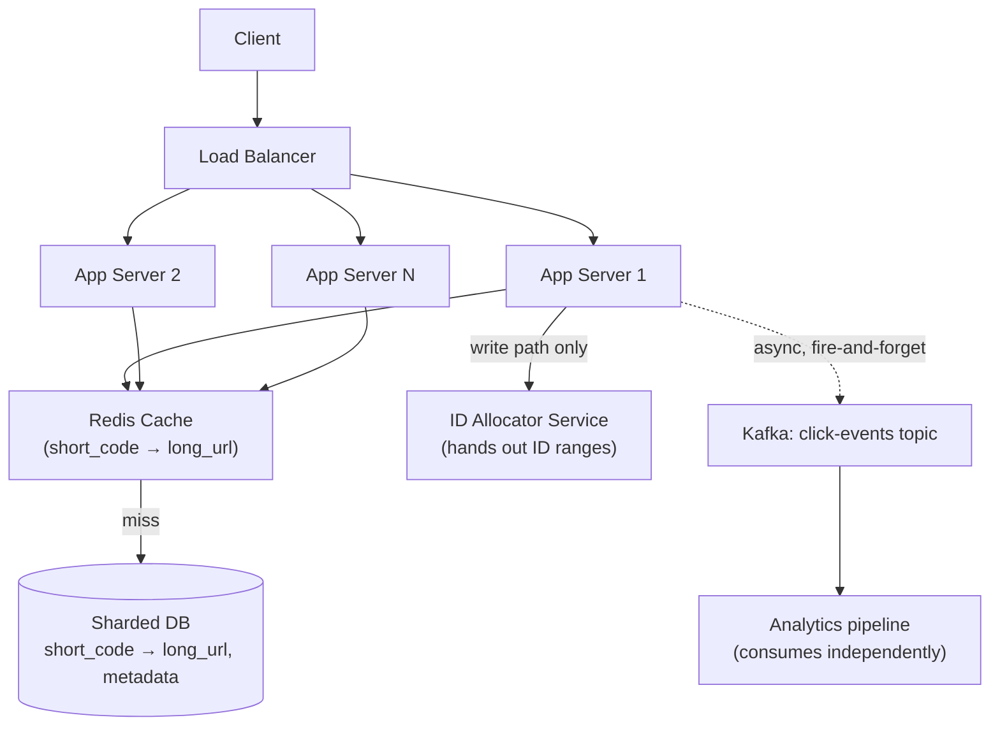
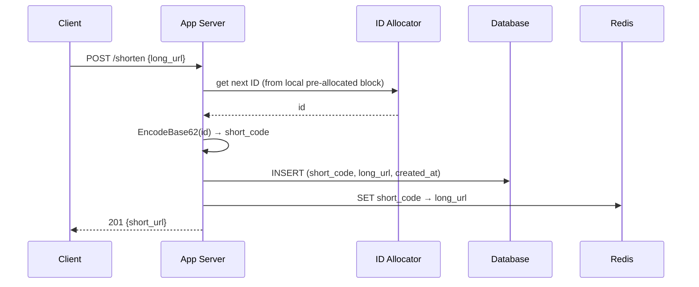
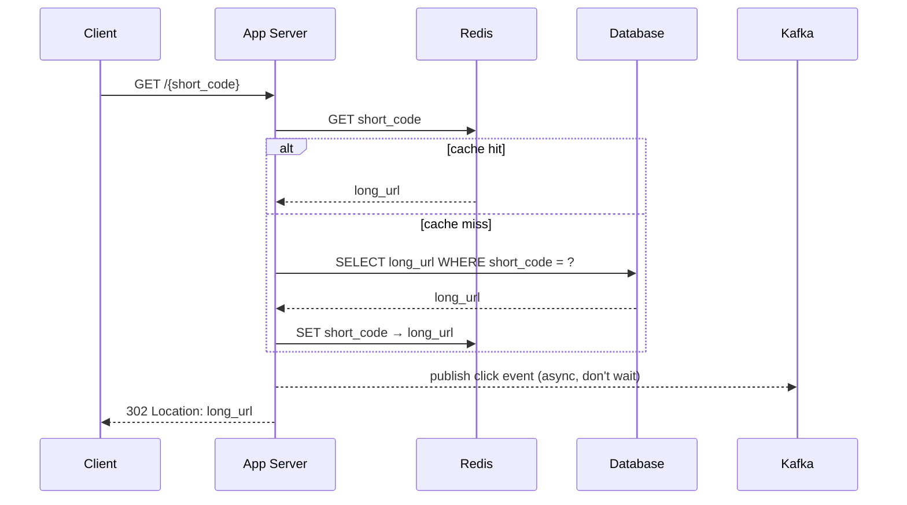

# Design TinyURL (URL Shortener)

> [!abstract] What you'll be able to do after this chapter
> Run the full 8-step HLD template on a real question, derive a collision-free ID generation scheme from first principles (not just "hash it"), justify a SQL-vs-NoSQL choice with the actual access pattern instead of a reflex, and defend every design decision against realistic interviewer pushback.

---

## Step 1 — The interview question

> [!question] As an interviewer would ask it
> "Design a URL shortening service like TinyURL or bit.ly. A user submits a long URL and gets back a short one; visiting the short URL redirects to the original."

---

## Step 2 — Requirements

**Functional**
- Given a long URL, generate a unique short URL.
- Given a short URL, redirect to the original long URL.
- (Extension) Users can request a **custom alias** instead of a system-generated one.
- (Extension) Links can **expire** after a set time or on demand.
- (Extension) Basic click **analytics**.

**Non-functional — and why each one actually matters**
| Requirement | Why it matters here specifically |
|---|---|
| **High availability on redirect** | The redirect is the critical path — it fires every time anyone clicks the link, anywhere it was shared (chat, email, social). If redirect is down, every previously-shared link looks broken to someone who has no relationship with your system at all. |
| **Low redirect latency** | A visible delay on a redirect reads as "broken link" to a user — this needs to feel instant. |
| **Guaranteed uniqueness** | Two long URLs can never collide on the same short code — a collision silently sends someone to the wrong site, a correctness bug, not a performance one. |
| **Read-heavy skew** | Every URL is shortened once but redirected through potentially thousands of times — the system is designed almost entirely around optimizing the *read* path. |

**Assumptions worth stating out loud in the interview**
- Short code length: aim for 7 characters. Base62 (`0-9`, `a-z`, `A-Z`) gives `62^7 ≈ 3.5 trillion` combinations — comfortably enough for a service running for decades.
- Redirect type: **HTTP 302** (temporary redirect), not 301. This is a real, non-obvious tradeoff — covered in Step 5.

---

## Step 3 — Back-of-envelope estimation

> [!example] Assumptions (state these explicitly before calculating)
> 500M new URLs shortened per month. Read:write ratio of 100:1 (redirects vastly outnumber shortens). Average record size ~500 bytes. Data retained for 5 years.

**Write QPS:**
`500,000,000 / (30 days × 86,400 sec/day) ≈ 500,000,000 / 2,592,000 ≈ 193 writes/sec average.`

**Read QPS** (100:1 ratio): `193 × 100 ≈ 19,300 reads/sec average`. Peak traffic is typically 2–3× average — budget for **~50,000 reads/sec at peak**.

**Storage over 5 years:**
`500M/month × 60 months = 30 billion records.`
`30,000,000,000 × 500 bytes ≈ 15 TB total.`
15TB is trivial by modern standards for either a sharded relational DB or a NoSQL cluster — storage is not the bottleneck here; **read QPS is**.

**Bandwidth at peak:** `50,000 reads/sec × ~500 bytes ≈ 25 MB/sec` — negligible, won't drive any architectural decision on its own.

**Cache sizing:** Real-world link popularity follows a power law — a small fraction of links account for most traffic. Caching the hottest ~20% of daily-active short codes typically captures ~80% of read traffic (a Pareto-shaped hot set). At 500-byte records, even caching millions of hot entries is a few GB — comfortably fits in a modest Redis cluster.

---

## Step 4 — Building it incrementally

**v0 — the naive version.** A single server holding an in-memory `map[string]string` from short code to long URL. Works for a demo. Breaks on the first restart (no persistence) and can't run more than one instance (no shared state). Every real requirement from here on is "what does v0 lack, and what do we add to fix that."

**Need persistence → need a database.** The access pattern here is almost embarrassingly simple: **always look up by the short code (the primary key)**. No joins, no complex queries, no secondary access patterns beyond that (analytics, if built, is a separate concern). This access pattern is exactly what key-value/NoSQL stores are built for — but it's *also* trivially servable by a SQL database with the short code as primary key.

> [!tip] SQL vs NoSQL — the actual reasoning, not the reflex
> **NoSQL (DynamoDB/Cassandra-style)** is the more natural default here: horizontal scaling is built in, the data model has no relationships to model, and the access pattern is pure key lookup. **SQL (sharded Postgres/MySQL)** is an equally valid answer *if you can show the sharding strategy* — shard by a hash of the short code, and a relational DB handles 30B rows across enough shards without difficulty. Either answer is correct in an interview; picking one and being unable to explain how it scales is the actual failure mode.

**Need to generate the short code itself — the part interviewers actually care about.**

> [!example] Layman framing first
> Picture a hotel with hundreds of front desks (app servers) all checking guests in at once, and every guest needs a **unique room number** (short code) — nobody can be handed a room number someone else already holds. The hotel has two bad options and a few good ones: making every desk phone a single central operator for *every* guest (too slow, one operator becomes the bottleneck), or letting every desk just make up numbers freely and hope nobody clashes (works until it doesn't, and checking for a clash after the fact is real, ongoing work). Everything below is different, real ways hotels — and real distributed systems — actually solve this.

### The real-world landscape — 4 named approaches, what actually uses each

| Approach | How it works | Who this is actually right for |
|---|---|---|
| **Counter + range allocation, base62-encoded** | A shared counter hands out ID *blocks* to servers; each server encodes its own local integers to base62. | The standard, textbook-correct answer for a URL shortener specifically — zero collisions by construction, simplest to reason about and defend in an interview. |
| **Random 7-char generation + collision check** | Draw 7 random base62 characters directly; check for a clash (cheaply, via a Bloom filter) before committing. | What many real production link shorteners actually prefer — critically, it avoids ever exposing a **guessable, enumerable sequence** (see the security note below), a real reason to pick this over a plain counter. |
| **Hash-based (SHA-256 of the long URL, truncated)** | Hash the long URL, base62-encode the hash, take the first 7 characters. | Real systems that want **free deduplication** — the same long URL always produces the same short code, without a separate dedup index. Git's short commit hashes are the same underlying idea, publicly well-known. |
| **Snowflake-style local ID generation** | Every server builds its own ID locally from timestamp + machine ID + sequence, with zero coordination. | Real, and used at real companies (Twitter's Tweet IDs, Instagram's photo IDs, Discord's message/user IDs are all public, well-documented examples) — but for **internal, time-sortable numeric IDs at massive fleet scale**, not for handing a user a compact public code. Explained in full below, including exactly why it doesn't fit 7 characters without modification.

> [!warning] Sequential IDs are a real, named security concern — not just a style preference
> A plain incrementing counter, base62-encoded, means anyone can enumerate **every URL your service has ever shortened** just by requesting code `1`, `2`, `3`, ... in order — a genuine data-leak vector for a service where the "long URL" behind a short link might itself be sensitive (a private document link, an unlisted video, a password-reset flow). This is the concrete, real reason many production systems choose random generation over a raw counter, even though the counter is simpler to build and defend on paper.

### How each approach actually produces exactly 7 characters

**1. Counter + base62 — the code length grows on its own, it's never padded.** A base62 encoding's length is simply however many base62 "digits" the number needs — the same way `9` is one decimal digit and `10` needs two. Watching the actual growth makes this concrete:

| Counter value | Base62 code | Length |
|---|---|---|
| `0` | `0` | 1 |
| `61` | `Z` | 1 |
| `62` | `10` | 2 |
| `3,843` | `ZZ` | 2 |
| `3,844` | `100` | 3 |
| `238,327` | `ZZZ` | 3 |
| `3,521,614,606,207` (= `62⁷ − 1`) | `ZZZZZZZ` | **7** |

The code only reaches 7 characters once the counter genuinely approaches `62⁷ ≈ 3.5 trillion` — which is *exactly* why "aim for 7 characters" (Step 2) and "counter capped near `62⁷`" are the same design decision, not two separate ones. This is the encoder already shown above:

```go
const base62Alphabet = "0123456789abcdefghijklmnopqrstuvwxyzABCDEFGHIJKLMNOPQRSTUVWXYZ"

// EncodeBase62 converts a non-negative integer ID into a base62 short code.
func EncodeBase62(id uint64) string {
	if id == 0 {
		return string(base62Alphabet[0])
	}
	var result []byte
	for id > 0 {
		remainder := id % 62
		result = append([]byte{base62Alphabet[remainder]}, result...)
		id /= 62
	}
	return string(result)
}

// DecodeBase62 converts a base62 short code back into its integer ID —
// needed if you ever want to derive the record's ID directly from its code
// (e.g. for a range-partitioned datastore keyed by ID).
func DecodeBase62(code string) uint64 {
	var id uint64
	for _, char := range code {
		id = id*62 + uint64(strings.IndexRune(base62Alphabet, char))
	}
	return id
}
```

**The single-counter bottleneck, solved.** A naive `SELECT counter + 1` shared by every app server serializes all writes through one row — a real bottleneck at 200+ writes/sec and a single point of failure. The standard fix: **range allocation**. A small, highly-available ID-allocator service hands each app server a *block* of, say, 1,000 IDs at a time (e.g. via an atomic increment in Redis/ZooKeeper). Each app server then generates codes from its local block without contacting the allocator again until the block is exhausted — turning "one contended counter per write" into "one contended counter per 1,000 writes," while still guaranteeing global uniqueness, and every generated ID still base62-encodes exactly as the table above shows.

**2. Random generation — draw 7 characters directly, no encoding step at all.** Unlike the counter, there's no integer to encode — just pick 7 symbols independently from the 62-character alphabet (`code[i] = base62Alphabet[rand.Intn(62)]`, 7 times). This always produces exactly 7 characters, every time, with no growth curve to reason about — the tradeoff moves entirely into collision handling instead.

> [!info] The real collision math, worked precisely
> Two different questions get conflated here, and only one of them matters in practice. **"If I generated all 30 billion of this system's 5-year total blindly, with zero checking, would any two coincide?"** — yes, virtually certainly (the keyspace is `62⁷ ≈ 3.52 × 10¹²`; the birthday-paradox math for 30 billion draws into that space makes a collision essentially guaranteed). This is exactly why blind random generation is never used *alone*. **The question that actually matters — "what's the retry rate for a system that checks before committing?"** — is just the keyspace's **fill ratio**: at the system's full 5-year capacity of 30 billion codes, fill ratio is `30×10⁹ / 3.52×10¹² ≈ 0.85%` — meaning roughly 1 in 118 random draws needs a retry, even at *maximum* lifetime capacity. Early in the system's life (say, 1 billion codes issued), it's `≈ 0.028%` — a retry is rare enough to be a non-issue.
>
> Checking this cheaply is exactly what [[CS Fundamentals/06 - Distributed Systems/Bloom Filter and Probabilistic Membership|a Bloom Filter]] is for: keep an in-memory, space-efficient "have I probably issued this code already" check in front of the database, so the ~99%+ of draws that are genuinely new never even touch the DB. A Bloom filter's false positives just cost an occasional needless retry (cheap); it never produces a false negative, so a real collision can never silently slip through — the database's `UNIQUE` constraint on the short-code column remains the final, authoritative guarantee regardless of what the Bloom filter says.

**3. Hash-based — same 7-character truncation, same collision math, plus a real dedup benefit.** Take a cryptographic hash (SHA-256) of the long URL, base62-encode the hash bytes, and keep only the first 7 characters. Truncating to 7 characters throws away almost all of SHA-256's 256 bits, collapsing the *effective* collision space down to the identical `62⁷` keyspace random generation has — so the retry math above applies unchanged. The genuine upside over random generation: hashing is **deterministic** — the same long URL always produces the same short code, which means shortening the same URL twice for free returns the existing code instead of minting a wasteful duplicate, with no separate "have I seen this URL before" index needed. The real cost: a genuine hash collision (two *different* long URLs landing on the same truncated 7 characters) needs the same salt-and-retry fallback random generation needs, so the "free dedup" benefit is real but doesn't remove the collision-handling work — it just adds a nice side effect on top of it.

**4. Snowflake — the right tool for a different, related problem, explained precisely.** Twitter's **Snowflake** scheme generates every ID **locally, with zero network calls, zero shared counter** — the property that makes it genuinely attractive at massive scale. Each 64-bit ID packs three fields: **41 bits of timestamp** (milliseconds since a custom epoch, ~69 years of range), **10 bits of machine ID** (up to 1,024 distinct machines, assigned at startup), and **12 bits of sequence number** (up to 4,096 IDs per machine per millisecond). Two different machines can never collide, since their machine-ID bits differ; the same machine can never collide with itself, since the sequence number increments within a millisecond and the timestamp advances between them. This exact scheme (or a close variant) is real and confirmed in production at Twitter (Tweet IDs), Instagram (photo IDs — publicly documented in Instagram's own 2012 engineering blog), and Discord (message/user/channel IDs) — but in every one of those cases, the ID is an **internal, numeric, roughly-time-sortable identifier**, never handed to a user as a short public code. Full bit-layout diagram and a complete, compilable Go implementation live in [[LLD/20 - Design a Distributed ID Generator/Design a Distributed ID Generator|Design a Distributed ID Generator]].

> [!bug] Why a raw Snowflake ID does NOT fit into 7 base62 characters — the exact math
> 7 base62 characters represent `62⁷ ≈ 3.52 × 10¹²` distinct values — `log₂(62⁷) ≈ 41.68 bits` of entropy. A Snowflake ID uses **63 usable bits** (64 total, minus 1 unused sign bit) — nowhere close to fitting in 41.68 bits. Base62-encoding a full Snowflake ID actually produces **up to 11 characters** (`62¹⁰ ≈ 8.4 × 10¹⁷` still falls short of `2⁶⁴`; `62¹¹ ≈ 5.2 × 10¹⁹` covers it) — a real, common mistake if "Snowflake" gets reached for without checking it against the 7-character requirement fixed back in Step 2.
>
> **Two honest ways to resolve this, if Snowflake's zero-coordination property is specifically wanted for this system anyway:**
> 1. **Recognize it isn't actually needed here.** `62⁷ ≈ 3.5 trillion` capacity already covers decades at this system's real `~193 writes/sec` average — there was never a genuine need for Snowflake's full 63-bit precision. Options 1-3 above already solve the *real* problem this system has.
> 2. **Shrink the bit layout to fit a 41-bit budget instead of 63:**
>
> ```mermaid
> graph LR
>     subgraph "41-bit mini-Snowflake — fits in 7 base62 chars"
>     A["30 bits<br/>timestamp (seconds since<br/>custom epoch, ~34 years)"] --> B["6 bits<br/>machine ID<br/>(64 machines)"]
>     B --> C["5 bits<br/>sequence<br/>(32 IDs/machine/sec)"]
>     end
> ```
>
> The real cost of this shrinkage, stated precisely: dropping from **milliseconds to seconds** of timestamp granularity, from **1,024 to 64 machines**, and from **4,096 to 32 IDs per machine per tick** — each halving of a field is a genuine tradeoff, not free. At this system's peak write load, 32 IDs/sec on a single machine is workable but leaves little headroom if traffic concentrates on one instance — a real reason a team might instead accept option 1 and skip Snowflake entirely for a system at this scale.

### The actual answer to "which one is best"

> [!success] No single universal winner — the honest, defensible recommendation
> **For this specific system (a URL shortener), lead with counter + range allocation** in an interview — it's the simplest to build, defend, and reason about, and it's what this chapter's own architecture (Step 5 onward) is built around. **Name random generation + Bloom filter as the real production alternative** the moment enumeration/security comes up as a follow-up — many real link shorteners prefer it for exactly that reason. **Name hash-based** if free deduplication of identical long URLs is a stated requirement. **Name Snowflake accurately** — a real, confirmed production technique, genuinely excellent for internal high-throughput ID generation across huge fleets, and *not* the standard tool for handing a user a compact 7-character code, with the exact reason (the bit-math above) ready to state if asked.

**Need to protect the DB from the read-heavy redirect path → add a cache.** Redirect lookups are read-heavy, keyed by short code, and the mapping is (mostly) immutable once created — a textbook fit for **cache-aside**: on redirect, check Redis first; on a miss, read from the DB and populate the cache; on a write (new short URL created), populate the cache proactively rather than waiting for the first read to miss.

---

## Step 5 — Deep dive: 301 vs 302, the tradeoff most candidates miss

| | **301 (Permanent Redirect)** | **302 (Temporary Redirect)** |
|---|---|---|
| Browser behavior | Caches the redirect target locally | Does **not** cache — hits your server every time |
| Server load | Lower — repeat visits skip your server entirely after the first | Higher — every click hits your redirect service |
| Analytics | Broken after the first visit per browser — you never see the repeat clicks | Accurate — every single click is observable server-side |
| SEO signal | Tells search engines the short URL *is* the permanent canonical location | No such signal |

> [!bug] Why most real systems (bit.ly included) use 302, not 301
> A 301 looks like the "correct" HTTP-semantics answer, and it is *lower load* — but it silently makes click analytics impossible for any browser that's visited the link before, since the browser never asks your server again. Real link-shortening products care about click analytics as a core product feature, so **302 is the actual production answer** despite the extra server load — this is a genuine product-requirements tradeoff, not a technical mistake either way, and stating it as a deliberate tradeoff (not just picking 301 because it "sounds more correct") is the signal interviewers are listening for.

---

## Step 6 — Full architecture



**Write path (shorten a URL):**



**Read path (redirect), the hot path:**



**Failure flow:** if a Redis node dies, requests fall through to the DB (higher latency, not an outage) and the cache re-warms naturally as reads repopulate it. If a DB shard's primary dies, a replica is promoted ([[Glossary/Consistent Hashing|shard routing]] and replica promotion are covered in depth in the Databases fundamentals chapter). App servers are stateless behind the load balancer, so any individual app server dying is a non-event — the LB simply stops routing to it.

**Scaling strategy:** app tier scales horizontally (stateless, just add more instances behind the LB). Cache scales via a Redis Cluster, sharded by key. DB scales by sharding on a hash of the short code — evenly distributing both storage and read load across shards.

---

## Step 7 — Interviewer follow-ups, answered

> [!quote]- "How would you support custom aliases?"
> Custom aliases break the counter-based generation scheme — a user-chosen string isn't derived from the counter, so it needs its own uniqueness check. Solution: a **unique constraint on the short_code column** at the database level, and an insert that relies on that constraint to atomically reject a duplicate (returning "alias taken" to the user) rather than a racy check-then-insert in application code.

> [!quote]- "How do you track click analytics without slowing down the hot redirect path?"
> Never make the redirect wait on an analytics write. Fire-and-forget publish a click event to a Kafka topic (see [[CS Fundamentals/05 - Messaging & Streaming/Kafka Internals|Kafka Internals]]) and return the 302 immediately — the analytics pipeline consumes from Kafka completely independently, on its own time, with zero impact on redirect latency even if the analytics pipeline is slow or briefly down.

> [!quote]- "What happens if the ID allocator service goes down?"
> Because app servers pre-fetch a *block* of IDs (Step 4) rather than requesting one ID per write, they can keep generating short codes locally for as long as their current block lasts, even with the allocator fully down. The allocator itself should also run as a small HA cluster (2-3 nodes) rather than a single instance, since it's a shared dependency for every app server.

> [!quote]- "How would you support link expiration?"
> Add an `expires_at` column. Check it on read (a cache hit for an expired link still needs the app server to validate the timestamp before redirecting — cache the record, but not the "is it still valid" decision, or cache with a TTL matching the expiry). A background job periodically purges expired rows from the DB and evicts them from the cache proactively rather than waiting for a read to catch it.

> [!quote]- "How would you scale this 10x?"
> Read path scales further with more cache capacity and more Redis shards — reads dominate, so that's where 10x load actually lands. Consider a **CDN in front of the redirect endpoint itself** for extremely popular links (a redirect response is small and cacheable). Write path scales by simply widening the ID-block size handed out per allocator request, reducing allocator round-trips further.

> [!quote]- "Why not just hash the long URL (MD5, first 7 chars) instead of a counter?"
> It's deterministic (free dedup) but real collisions occur at 7 characters of a 128-bit hash space truncated that aggressively, requiring a retry-with-salt fallback anyway — at which point you've reintroduced a check-then-write step the counter-based approach never needed in the first place. The counter approach is strictly simpler to reason about for guaranteed uniqueness.

---

## Step 8 — Production experience

> [!info] What to monitor
> Redirect latency (p50/p99 — see [[Glossary/Latency Percentiles (P50, P90, P99)|latency percentiles]]), cache hit ratio (a sudden drop signals either a cache outage or a shift in traffic pattern away from the cached hot set), DB replication lag, ID-allocator availability and block-exhaustion rate, 4xx/5xx rate on the redirect endpoint.

> [!bug] Common production issues
> **Hot-key skew** — a single link goes viral and its short code receives disproportionate traffic, potentially overwhelming the one cache shard/DB partition that owns it. Mitigation: a short-TTL **local in-process cache** on each app server in front of the distributed cache absorbs extreme hot-key traffic without adding load to Redis at all, or push very hot redirects to a CDN edge layer entirely.
> **Allocator block exhaustion under bursty write traffic** — if writes spike faster than expected, an app server can burn through its ID block quickly and stall waiting on the allocator; mitigate by pre-fetching the *next* block proactively before the current one is fully exhausted, not reactively after it runs out.

> [!success] Debugging a slow redirect
> Check cache hit/miss for the specific short code first. If it's a cache miss, check DB query latency for that shard specifically — an unusually slow single-shard query often points to that shard being disproportionately loaded (a hot-key or hot-shard symptom, not a general DB problem).

> [!tip] Cost optimization
> Most short URLs stop receiving traffic entirely after some period. A background job identifying long-unused codes and moving their records to cheaper cold storage (or purging entirely, per a stated retention policy) keeps the active, cache-warmed dataset small relative to total historical volume — directly reducing both DB and cache footprint costs at scale.

---
*Related: [[00 - Start Here/How This Handbook Works|Book Map]] · [[CS Fundamentals/05 - Messaging & Streaming/Kafka Internals|Kafka Internals]] · [[Glossary/Consistent Hashing|Consistent Hashing]] · [[Glossary/QPS|QPS]] · [[LLD/20 - Design a Distributed ID Generator/Design a Distributed ID Generator|Design a Distributed ID Generator]]*
