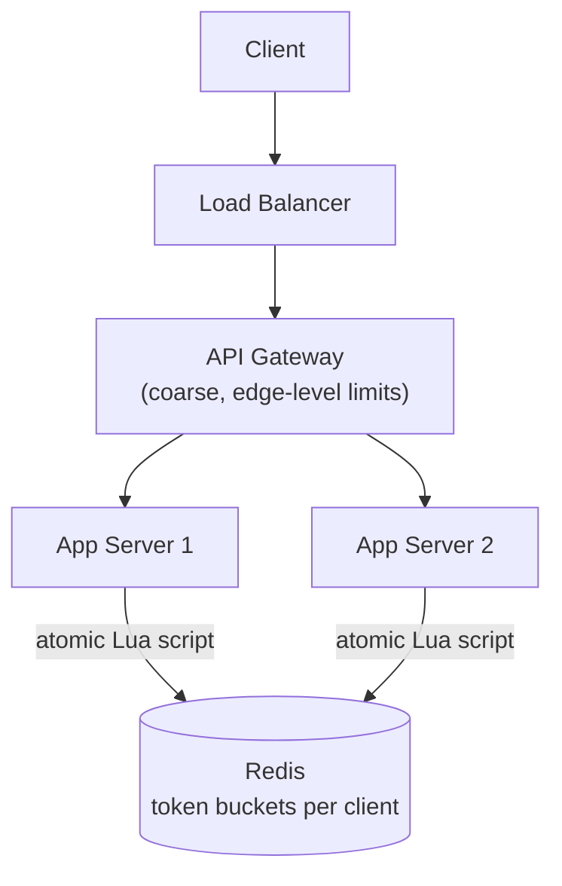
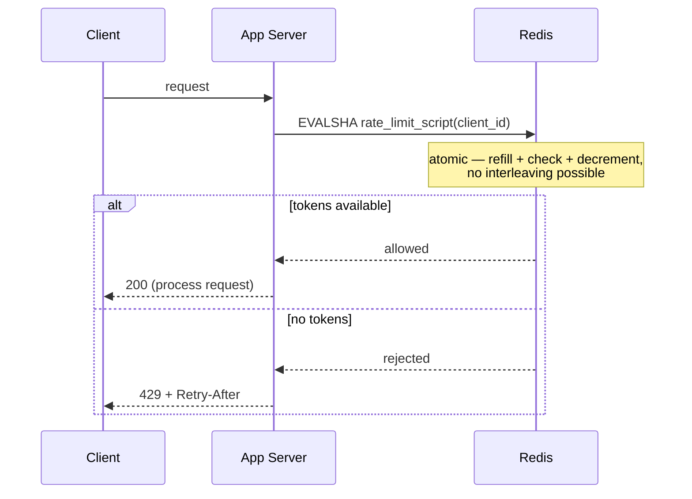

# Design a Rate Limiter

> [!abstract] What you'll be able to do after this chapter
> Explain why a rate limiter is fundamentally a *distributed state* problem, not just an algorithm problem, compare all four major algorithms with their real failure modes, and name the exact atomicity bug most candidates miss when implementing this against Redis.

---

## Step 1 — The interview question

> [!question] As an interviewer would ask it
> "Design a rate limiter that throttles requests per user, per IP, or per API key, applied consistently across a fleet of many application servers."

## Step 2 — Requirements

**Functional:** limit requests to `N` per time window per client identifier. Support different limits per client tier (free vs paid). Return `429 Too Many Requests` with a `Retry-After` header when limited.

**Non-functional — and the one that actually defines this problem:**
- **Must work correctly across multiple servers**, not just one machine — this is what separates the HLD version of this question from its [[LLD/04 - Design a Rate Limiter/Design a Rate Limiter|LLD counterpart]]: a naive per-server counter is trivially defeated the moment a client's requests get load-balanced across different backend instances.
- **Must add negligible latency** — it sits on the hot path of *every single request* in the system.
- **Accuracy vs performance is a real, explicit tradeoff**, not a solved problem — covered in depth below.

## Step 3 — Back-of-envelope estimation

Assume 1M active users, with a realistic peak of ~100,000–500,000 rate-limit checks/sec across the fleet (not every user hitting simultaneously, but planning for real peak load). Each check must complete in **sub-millisecond** time, since it's added latency on top of every request. Storage: a small counter (or short structure) per client identifier — even at 1M distinct clients, this is tens of MB, trivial for an in-memory store — but that state must be **shared** across every app server, which is the actual crux of the design.

## Step 4 — Building it incrementally

**v0 — the naive version.** A counter in each app server's local memory. This **breaks the instant there's more than one server**: a client's requests get load-balanced across instances, and each instance has its own independent, wrong view of "how many requests has this client made recently." This isn't a scaling nuance — it's the entire problem this chapter exists to solve.

**Fix: shared, fast, centralized counter state.** [[CS Fundamentals/04 - Caching/Redis Internals|Redis]] is the natural fit — in-memory (sub-millisecond ops), supports atomic increments natively, and is purpose-built for exactly this kind of hot-path shared counter.

### The algorithm choice — four real options, four real tradeoffs

| Algorithm | Mechanism | Strength | Real flaw |
|---|---|---|---|
| **Fixed window counter** | `INCR` a key like `rate:{client}:{window_start}` with a TTL; reject if over limit. | `O(1)`, dead simple. | **Boundary burst**: a client can send `N` requests at `11:59:59` and another `N` at `12:00:00` — `2N` requests in roughly one real second, despite the "limit" being `N` per minute. |
| **Sliding window log** | Store every request timestamp in a Redis sorted set (`ZADD`); trim entries outside the window (`ZREMRANGEBYSCORE`); count what remains (`ZCARD`). | Fully accurate — no boundary burst. | `O(log n)` per operation, and real memory cost — storing every individual timestamp, not just a count. |
| **Sliding window counter (approximation)** | Weight the previous fixed window's count proportionally: `count = current_window_count + previous_window_count × (fraction of current window remaining)`. | Much cheaper than the log approach — just two counters — and a good approximation of the true sliding window. | Still an approximation, not exact — acceptable for the vast majority of real rate-limiting use cases. |
| **Token bucket** | Tokens refill at a fixed rate up to a cap; each request consumes one. | Naturally allows **bursts** up to the bucket size while still enforcing the long-run average rate — the algorithm real APIs (Stripe, GitHub) actually expose to users as documented behavior. | Needs care to implement *atomically* against shared state — see Step 5. |

---

## Step 5 — Deep dive: the atomicity bug most candidates miss

> [!bug] "Read tokens, check, decrement" as three separate Redis calls is a real race condition
> If a rate limiter reads the current token count, checks it against the limit, and decrements it as **three separate round-trips** to Redis, two concurrent requests from *different app servers* hitting the *same client's* key can both read the same "tokens remaining" value before either one's decrement lands — both get approved, and the limit is silently violated under real concurrent load.

The fix: perform the entire check-and-decrement as **one atomic Redis Lua script**. This works precisely because of [[CS Fundamentals/04 - Caching/Redis Internals|Redis's single-threaded command execution]] — a Lua script runs to completion as one indivisible unit, with no other client's command able to interleave partway through it. This is the exact payoff of that architectural fact from the Redis Internals chapter, applied directly: it's *why* this atomicity guarantee is even possible without a separate distributed lock.

```lua
-- Simplified token bucket check-and-consume, run atomically in Redis
local tokens_key = KEYS[1]
local rate = tonumber(ARGV[1])
local capacity = tonumber(ARGV[2])
local now = tonumber(ARGV[3])

local bucket = redis.call("HMGET", tokens_key, "tokens", "last_refill")
local tokens = tonumber(bucket[1]) or capacity
local last_refill = tonumber(bucket[2]) or now

local elapsed = now - last_refill
tokens = math.min(capacity, tokens + elapsed * rate)

if tokens < 1 then
    return 0 -- rejected
else
    tokens = tokens - 1
    redis.call("HMSET", tokens_key, "tokens", tokens, "last_refill", now)
    return 1 -- allowed
end
```

### Where does the limiter actually sit?

**At the API Gateway / edge:** rejects traffic before it ever reaches an app server — saves backend resources, but limits are necessarily coarser (harder to express rich per-endpoint logic at the edge). **Embedded per app server, calling out to Redis:** more flexible (different limits per endpoint, per user tier, computed with full application context), at the cost of a network round-trip to Redis added to every request.

---

## Step 6 — Full architecture





---

## Step 7 — Interviewer follow-ups, answered

> [!quote]- "How do you rate limit by IP when many legitimate users share one IP (corporate NAT, mobile carrier NAT)?"
> Naive pure-IP limiting punishes every user behind that shared IP for one bad actor's traffic. Combine IP with additional signals where available (authenticated user ID, API key, session token) and reserve pure-IP limiting for genuinely anonymous/unauthenticated traffic, where it's an accepted, explicit tradeoff rather than an oversight.

> [!quote]- "What happens if Redis goes down?"
> This is a real **fail-open vs fail-closed** decision, and it should be a stated, deliberate choice. **Fail open** (allow all traffic through while the limiter is unreachable) risks abuse during the outage but preserves overall service availability. **Fail closed** (block everything) is safe from abuse but turns a Redis outage into a full service outage. Most systems **fail open** for a rate limiter specifically — the limiter's job is to protect against abuse, and it shouldn't itself become a single point of failure that denies *legitimate* traffic.

> [!quote]- "How would you support different limits for different API endpoints simultaneously?"
> Key the Redis state by `{client_id}:{endpoint}` rather than just `{client_id}` — each endpoint gets its own independent bucket/window, with per-endpoint rate/capacity configuration looked up (and cached) by the app server before invoking the Lua script.

> [!quote]- "How would you scale the rate limiter itself to 10x traffic?"
> Shard the Redis layer — either by hashing client ID across multiple Redis instances directly, or via [[CS Fundamentals/04 - Caching/Redis Internals|Redis Cluster's hash-slot sharding]], so no single Redis node is the bottleneck for the entire fleet's rate-limit checks.

---

## Step 8 — Production experience

> [!info] What to monitor
> Rejection rate (`429`s) per client and per endpoint — a sudden spike often signals either an abuse attempt or a misconfigured limit. Redis latency added to the request path specifically (p99, not just average). Alerting on Redis unavailability, since that should trigger the fail-open path deliberately, not silently.

> [!bug] A subtle production gotcha
> If window-boundary calculations are computed using **each app server's own local clock** rather than a centralized source, clock skew between servers can cause inconsistent fixed-window boundaries for the same client depending on which server handled the request. Keeping all time-sensitive logic inside the Lua script (using Redis's own `TIME` command, or passing a consistently-sourced timestamp) avoids this entirely.

---
*Related: [[00 - Start Here/How This Handbook Works|Book Map]] · [[CS Fundamentals/04 - Caching/Redis Internals|Redis Internals]] · [[LLD/04 - Design a Rate Limiter/Design a Rate Limiter|LLD version — Design a Rate Limiter]]*
