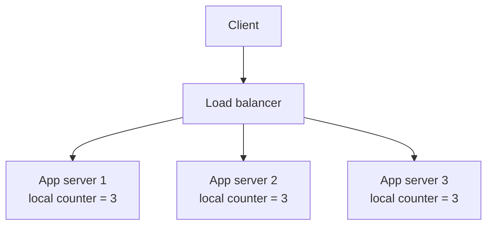
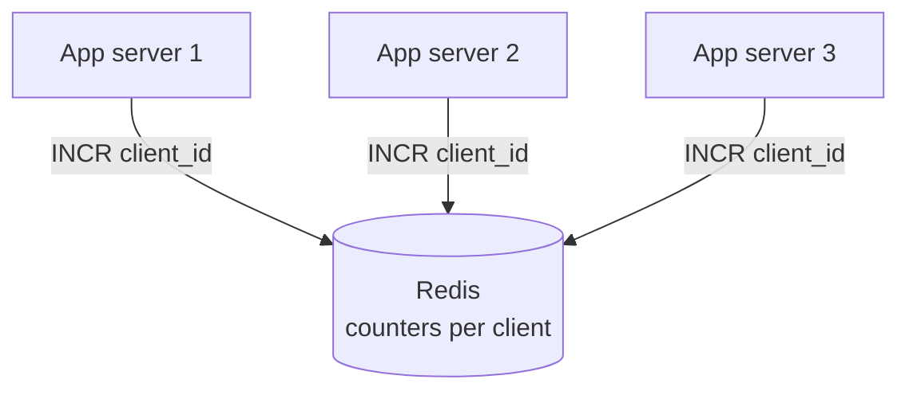
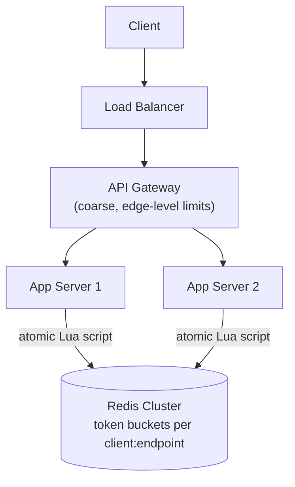
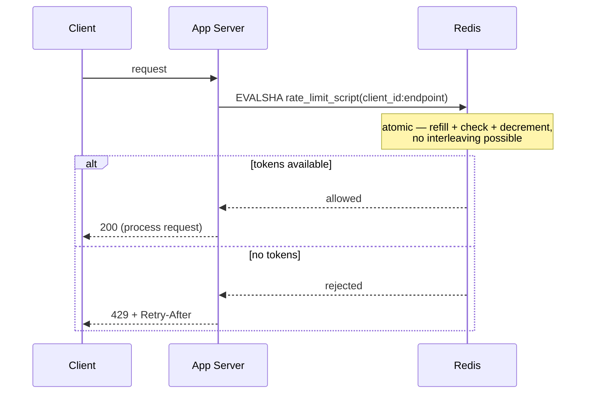

# Design a Rate Limiter

> [!abstract] How to read this chapter
> Built phase by phase the way you'd narrate it on a whiteboard. The one idea that reframes everything: a rate limiter is fundamentally a **distributed state** problem, not an algorithm problem. Each phase adds one piece, exposes the next bottleneck, and fixes it — ending on the exact atomicity bug most candidates miss.

> [!question] The interview question
> "Design a rate limiter that throttles requests per user, per IP, or per API key, applied consistently across a fleet of many application servers."

---

## Requirements

**Functional**
- Limit requests to `N` per time window per client identifier (user / IP / API key).
- Support different limits per client **tier** (free vs paid) and per **endpoint**.
- Return `429 Too Many Requests` with a `Retry-After` header when limited.

**Non-functional — and the one that actually defines this problem**

| Requirement | Why it matters here specifically |
|---|---|
| **Correct across many servers** | This is what separates the HLD version from the [[LLD/04 - Design a Rate Limiter/Design a Rate Limiter\|LLD one]]: a naive per-server counter is trivially defeated the moment a client's requests load-balance across instances. |
| **Negligible added latency** | It sits on the hot path of *every single request* — sub-millisecond, or it's a tax on the whole system. |
| **Accuracy vs performance is explicit** | Not a solved problem — a real tradeoff between exact and approximate limiting, stated deliberately. |
| **Must not become a SPOF** | A limiter that takes the whole service down when *it* fails is worse than the abuse it prevents (fail-open, Phase 06). |

---

## Phase 00 — Capacity math you can defend

| Quantity | Derivation | Result |
|---|---|---|
| Checks/sec (peak) | 1M active users, realistic peak | ~100k–500k checks/s across the fleet |
| Per-check budget | on top of every request | **sub-millisecond** |
| State size | one small counter/struct per client | tens of MB at 1M clients — trivial |
| The real constraint | that state must be **shared** across every app server | the actual crux of the design |

> [!example] In plain words
> The data is tiny and the ops are cheap. The entire difficulty is that the count must be **one shared truth** seen identically by every server, updated on the hot path, without races. That sentence is the whole design.

---

## Phase 01 — The naive local counter (and why it's dead on arrival)

*Start with what everyone writes first, so its failure names the real problem.*



A counter in each app server's local memory. **Breaks the instant there's more than one server:** a client's requests load-balance across instances, and each instance has its own independent, *wrong* view of "how many requests has this client made recently." A client with a limit of `N` can send `N` to *each* of 3 servers and get `3N` through.

| 🔴 Bottleneck | 🟢 Next fix |
|---|---|
| Local counters give each server a partial, wrong count — the limit is silently `N × server_count`. This isn't a scaling nuance, it's the whole problem. | Move the counter into shared, fast, centralized state (Phase 2). |

> [!example] Layman
> Three bouncers at three doors, each with their own clipboard, none talking. A guest turned away at one door walks to the next. The club needs *one* guest list all three read from.

---

## Phase 02 — Shared centralized counter state (Redis)

*The count must live in one place every server can read and write atomically.*



[[CS Fundamentals/04 - Caching/Redis Internals|Redis]] is the natural fit — in-memory (sub-millisecond ops), atomic increments native, purpose-built for exactly this hot-path shared counter.

| 🔴 Bottleneck | 🟢 Next fix |
|---|---|
| "Just `INCR` a counter" leaves the *algorithm* unspecified — and the naive fixed-window version has a real burst bug. | Choose the counting algorithm deliberately (Phase 3). |

---

## Phase 03 — The algorithm choice: four real options, four real tradeoffs

*Each is a different point on the accuracy-vs-cost curve. Know all four; recommend one.*

| Algorithm | Mechanism | Strength | Real flaw |
|---|---|---|---|
| **Fixed window counter** | `INCR rate:{client}:{window_start}` with TTL; reject if over limit | `O(1)`, dead simple | **Boundary burst**: `N` requests at `11:59:59` + `N` at `12:00:00` = `2N` in ~1 real second |
| **Sliding window log** | Store every request timestamp in a sorted set (`ZADD`); trim (`ZREMRANGEBYSCORE`); count (`ZCARD`) | Fully accurate — no boundary burst | `O(log n)` per op, real memory cost — every timestamp, not a count |
| **Sliding window counter** *(approx)* | Weight the previous window: `count = current + prev × (fraction of current window remaining)` | Much cheaper — two counters — good approximation | Still approximate; fine for the vast majority of real uses |
| **Token bucket** | Tokens refill at a fixed rate up to a cap; each request consumes one | Naturally allows **bursts** up to bucket size while enforcing long-run average — what Stripe/GitHub expose | Needs care to implement *atomically* (Phase 4) |

> [!tip] Recommendation
> **Token bucket** for public APIs — bursts are a feature users expect, and the long-run rate stays capped. **Sliding window counter** when you want tighter fairness without storing every timestamp. Fixed window only when the boundary burst genuinely doesn't matter.

| 🔴 Bottleneck | 🟢 Next fix |
|---|---|
| Token bucket needs "read tokens → check → decrement." Done as three round-trips, that's a race condition under real concurrency. | Make check-and-decrement one atomic operation (Phase 4). |

---

## Phase 04 — Deep dive: the atomicity bug most candidates miss

> [!bug] "Read tokens, check, decrement" as three separate Redis calls is a real race
> If the limiter reads the token count, checks it, and decrements as **three round-trips**, two concurrent requests from *different app servers* hitting the *same client's* key can both read the same "tokens remaining" before either decrement lands — both get approved, limit silently violated under real load.

The fix: do the entire check-and-decrement as **one atomic Redis Lua script**. This works precisely because of [[CS Fundamentals/04 - Caching/Redis Internals|Redis's single-threaded command execution]] — a Lua script runs to completion as one indivisible unit, no other client's command interleaving. That's *why* the atomicity guarantee exists without a separate distributed lock.

```lua
-- Simplified token bucket check-and-consume, run atomically in Redis
local tokens_key = KEYS[1]
local rate = tonumber(ARGV[1])
local capacity = tonumber(ARGV[2])
local now = tonumber(ARGV[3])

local bucket = redis.call("HMGET", tokens_key, "tokens", "last_refill")
local tokens = tonumber(bucket[1]) or capacity
local last_refill = tonumber(bucket[2]) or now

local elapsed = now - last_refill
tokens = math.min(capacity, tokens + elapsed * rate)

if tokens < 1 then
    return 0 -- rejected
else
    tokens = tokens - 1
    redis.call("HMSET", tokens_key, "tokens", tokens, "last_refill", now)
    return 1 -- allowed
end
```

> [!example] Layman
> One shared guest list, but two bouncers reading it at the same millisecond both see "1 spot left" and both admit a guest. The Lua script is a rule that only one bouncer may touch the list at a time, and must finish reading *and* crossing off before the other looks.

| 🔴 Bottleneck | 🟢 Next fix |
|---|---|
| Correct now — but *where* the check runs (edge vs app server) changes flexibility and latency. | Decide placement (Phase 5). |

---

## Phase 05 — Where the limiter actually sits

*A placement tradeoff, not a right answer — state both.*

| Placement | Wins | Costs |
|---|---|---|
| **API Gateway / edge** | Rejects traffic before it reaches an app server — saves backend resources | Limits are coarser — hard to express rich per-endpoint/per-context logic at the edge |
| **Embedded per app server → Redis** | Flexible — per-endpoint, per-tier limits computed with full app context | A network round-trip to Redis added to every request |

> [!tip] Common real answer
> Both, layered: coarse abuse limits at the edge (cheap, protects the fleet), fine-grained per-endpoint/per-tier limits at the app server (rich, contextual). Defense in depth.

| 🔴 Bottleneck | 🟢 Next fix |
|---|---|
| Correct and placed — but what happens when Redis itself dies, or traffic 10×'s, or one IP hides many users? | Failure modes and scaling (Phase 6). |

---

## Phase 06 — Failure modes, scaling, per-endpoint limits

**Redis down — a deliberate fail-open vs fail-closed choice.**

> [!warning] Fail open vs fail closed
> **Fail open** (allow all traffic while the limiter is unreachable): risks abuse during the outage but preserves service availability. **Fail closed** (block everything): safe from abuse but turns a Redis blip into a full outage. Most systems **fail open** for a rate limiter specifically — its job is to protect against abuse, and it must not itself become the SPOF that denies *legitimate* traffic.

**Shared-IP fairness.** Pure-IP limiting punishes every user behind a corporate/mobile NAT for one bad actor. Combine IP with stronger signals (authenticated user ID, API key, session) where available; reserve pure-IP for genuinely anonymous traffic as an accepted, explicit tradeoff.

**Per-endpoint limits.** Key the Redis state by `{client_id}:{endpoint}` rather than just `{client_id}` — each endpoint gets its own bucket, with per-endpoint rate/capacity config looked up (and cached) before invoking the Lua script.

**Scaling 10×.** Shard the Redis layer — hash client ID across instances, or use [[CS Fundamentals/04 - Caching/Redis Internals|Redis Cluster's hash-slot sharding]] — so no single Redis node is the bottleneck for the whole fleet's checks.

| 🔴 Bottleneck | 🟢 Next fix |
|---|---|
| Individual concerns handled — assemble them into one picture. | Final architecture (Phase 7). |

---

## Phase 07 — The final combined architecture





**Five principles to close with:**
1. Rate limiting is distributed *state*, not an algorithm — the count must be one shared truth.
2. Local counters are silently `N × server_count` — never ship them past a demo.
3. Check-and-decrement must be atomic; a Lua script leverages Redis's single-threaded execution instead of a lock.
4. Pick the algorithm on the accuracy-vs-cost curve; token bucket for public APIs because bursts are expected.
5. Fail **open** — a limiter must never become the SPOF that blocks legitimate traffic.

---

## Interviewer follow-ups, answered

> [!quote]- "Rate limit by IP when many users share one IP (NAT)?"
> Pure-IP limiting punishes everyone behind the shared IP for one bad actor. Combine IP with authenticated user ID / API key / session where available; reserve pure-IP for genuinely anonymous traffic as an accepted, explicit tradeoff.

> [!quote]- "What happens if Redis goes down?"
> A deliberate **fail-open vs fail-closed** choice. Most systems fail open for a rate limiter — its job is to protect against abuse, and it shouldn't become a SPOF denying legitimate traffic. Alert on Redis unavailability so fail-open triggers knowingly, not silently.

> [!quote]- "Different limits for different endpoints simultaneously?"
> Key state by `{client_id}:{endpoint}` — each endpoint gets an independent bucket, with per-endpoint rate/capacity config looked up and cached before the Lua script runs.

> [!quote]- "Scale the limiter itself 10×?"
> Shard the Redis layer — hash client ID across instances or use Redis Cluster hash-slot sharding — so no single node is the bottleneck for the fleet's checks.

---

## Production experience

> [!info] What to monitor
> Rejection rate (`429`s) per client and per endpoint — a sudden spike signals abuse or a misconfigured limit. Redis latency added to the request path specifically (p99, not just average). Alert on Redis unavailability so the fail-open path triggers deliberately.

> [!bug] A subtle production gotcha
> If window-boundary calculations use each app server's **local clock** rather than a centralized source, clock skew causes inconsistent fixed-window boundaries for the same client depending on which server handled the request. Keep all time-sensitive logic inside the Lua script (use Redis's `TIME`, or pass a consistently-sourced timestamp) to avoid it entirely.

---

## Cheat sheet — if you remember nothing else

1. A rate limiter is distributed *state*: the count is one shared truth every server reads, not a per-server counter.
2. Four algorithms — fixed window (boundary burst), sliding log (exact, costly), sliding counter (cheap approx), token bucket (bursts + average). Recommend token bucket for public APIs.
3. Check-and-decrement must be **atomic** — a single Redis Lua script, riding Redis's single-threaded execution, no separate lock.
4. Place coarse limits at the edge, fine-grained per-endpoint/per-tier limits at the app server; key by `{client}:{endpoint}`.
5. Fail **open** on Redis outage; shard Redis to scale; combine IP with stronger signals for NAT fairness.

---
*Related: [[00 - Start Here/How This Handbook Works|Book Map]] · [[CS Fundamentals/04 - Caching/Redis Internals|Redis Internals]] · [[LLD/04 - Design a Rate Limiter/Design a Rate Limiter|LLD version — Design a Rate Limiter]]*
