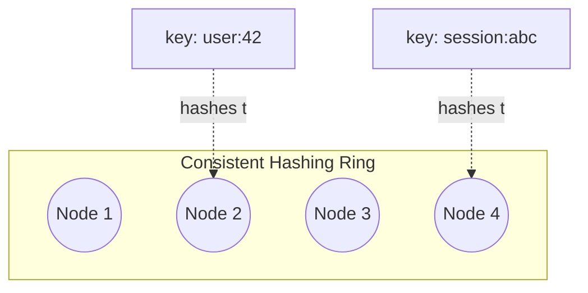
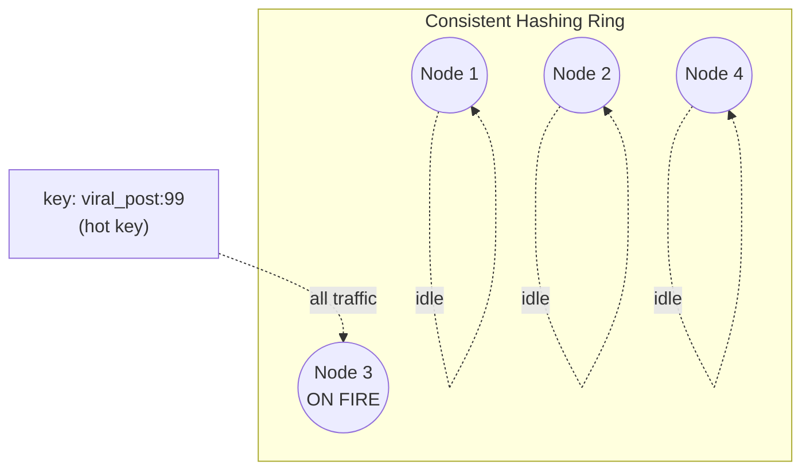
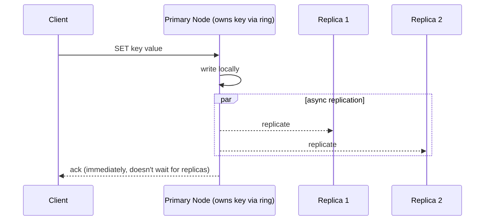

# Design a Distributed Cache (build Redis)

> [!abstract] How to read this chapter
> Built phase by phase from a single hash map to a fault-tolerant cluster. Each phase adds one idea, exposes the next bottleneck, and fixes it. The payoffs: exactly how a key routes to the right node, sync vs async replication as a *live* PACELC tradeoff, and a hot-key failure a "plenty of capacity" dashboard completely hides.

> [!question] The interview question
> "Design a distributed, in-memory caching system like Redis or Memcached — support `GET`/`SET`/`DELETE` at sub-millisecond latency, horizontally scalable, tolerant of individual node failures."

---

## Requirements

**Functional**
- `GET` / `SET` / `DELETE` by key.
- **TTL** support (keys expire).
- **Eviction** under memory pressure (LRU/LFU).

**Non-functional**

| Requirement | Why it matters here specifically |
|---|---|
| **Horizontal scalability** | Add nodes to grow capacity/throughput *without downtime* — the dataset or op rate outgrows any one machine. |
| **High availability** | A single node dying must not lose the data it held — a replica can be promoted. |
| **Sub-millisecond latency at scale** | The whole point of a cache; a slow cache is worse than none. |
| **Graceful hot-key handling** | A real, *distinct* failure mode from general overload — one key can melt one node while the cluster looks idle (Phase 5). |

---

## Phase 00 — Capacity math you can defend

| Quantity | Derivation | Result |
|---|---|---|
| Logical data | 10M keys × ~1 KB | ~10 GB |
| Physical data | × replication factor 2 | ~20 GB across the cluster |
| Target throughput | cluster-wide | ~1M ops/s |
| Per-node load | 1M ÷ 10 nodes | ~100k ops/s/node — within one in-memory node |

> [!example] In plain words
> The cluster scales roughly linearly with node count **as long as key distribution stays even.** That caveat — even distribution — is the whole story of Phases 2 and 5.

---

## Phase 01 — A single node

*Start with one box so every distributed feature earns its place.*

A hash map in memory — exactly one Redis instance (its own internals: [[CS Fundamentals/04 - Caching/Redis Internals|Redis Internals]]). `GET`/`SET`/`DELETE` at sub-millisecond latency. Works perfectly until the dataset exceeds one machine's RAM, or throughput exceeds one machine's ceiling.

| 🔴 Bottleneck | 🟢 Next fix |
|---|---|
| One machine caps both capacity (RAM) and throughput; its death loses everything it held. | Partition the keyspace across many nodes (Phase 2). |

---

## Phase 02 — Partition the keyspace with consistent hashing

*Spread keys across nodes — but choose the partitioning scheme carefully, because the naive one is catastrophic.*

The naive approach, `hash(key) % N`, **breaks the moment `N` changes**: adding or removing a single node remaps *almost every key* to a different node, causing a cache-wide miss storm — every client suddenly misses, all traffic slams the backing DB at once.

The fix is [[Glossary/Consistent Hashing|consistent hashing]]: map both keys and nodes onto a conceptual ring; a key belongs to the next node clockwise from its hash position. Adding a node only takes over the keys between it and its counterclockwise neighbor — a small, **bounded** fraction of the keyspace, not "everything."

> [!example] Layman
> Modulo hashing is seating guests by "total guests mod tables" — add one table and everyone must stand up and move. Consistent hashing seats each guest at the next table clockwise from where their name lands — add a table and only the guests nearest *it* shuffle.

| 🔴 Bottleneck | 🟢 Next fix |
|---|---|
| Keys are spread, but a node dying still loses the keys it owned outright. | Replicate each key to `R` nodes (Phase 3). |

---

## Phase 03 — Replicate for fault tolerance, and route clients to the owner

*Losing one node must not lose its data — and clients need to find the owning node.*

Replicate each key's data to `R` nodes (commonly `R=2` or `3`), so losing any single node doesn't lose that data — a replica can be promoted. Two real ways for clients to know which node owns a key:

| Approach | How it works | Tradeoff |
|---|---|---|
| **Client-side routing** | The client library embeds the hash ring (Redis Cluster's hash-slot mapping) and computes the target node directly | Lowest latency (no extra hop) — but every client needs current topology and must handle `MOVED` redirects during a rebalance. Redis Cluster's actual approach |
| **Proxy-based routing** | Clients talk to a stateless proxy; the proxy looks up and forwards | Simpler clients (no topology awareness) — at the cost of an extra hop per request and a proxy layer that must itself scale and stay available |

| 🔴 Bottleneck | 🟢 Next fix |
|---|---|
| Replication raises a real question: does a write wait for replicas (safe, slow) or not (fast, lossy)? And one key can still be a hotspot regardless of cluster capacity. | Sync vs async replication + the hot-key problem (Phase 5). |

---

## Phase 05 — Deep dive: replication tradeoff & the hot-key problem

### Synchronous vs asynchronous — a live PACELC decision

**Synchronous:** a write is acknowledged only once the replica(s) confirm — safer (no data-loss window on primary failure) but adds latency to *every* write. **Asynchronous:** the primary acks immediately, replicating in the background — much faster writes, but a replica can lag, and a primary crash between "ack sent" and "replicated" genuinely loses that write.

> [!tip] This is PACELC's "Else" branch, concretely
> No partition is happening — this is purely the everyday latency-vs-consistency choice [[CS Fundamentals/06 - Distributed Systems/CAP Theorem & PACELC|PACELC]] describes as the *normal-operation* tradeoff. Most caches default to **asynchronous** replication precisely because a cache rarely needs to be the durable source of truth — the database already is — so trading a small data-loss window for lower write latency is usually right *for this use case*, even though the identical tradeoff resolves differently for a primary datastore.

### The hot-key problem — capacity that "should be enough" isn't

A viral post, a trending product, a celebrity profile — one key can receive **wildly disproportionate** traffic. Even with ample *aggregate* cluster capacity, that one key lives on **one specific node** (or its small replica set), which can be overwhelmed while every other node sits idle. A cluster-wide "plenty of capacity" dashboard looks healthy while one node is on fire — which is exactly why hot-key detection must be first-class, not inferred from aggregate metrics.

**Mitigations:**
- A short-TTL **local, in-process cache** on the calling app servers absorbs extreme read traffic for the hottest keys without ever reaching the distributed cache.
- For genuinely extreme cases, **explicitly replicate a single hot key's value across multiple nodes** (beyond the normal replication factor) and have the app layer randomly pick among them on read — deliberately spreading one key's load across several nodes.

> [!danger] The mitigation's own trap
> Replicating a hot key beyond the normal factor means writes must invalidate or **version all copies**. Never let the mitigation create stale data that violates the product's consistency requirement.

| 🔴 Bottleneck | 🟢 Next fix |
|---|---|
| Individual mechanisms handled — assemble the write/replication/failover picture. | Final architecture (Phase 6). |

---

## Phase 06 — The final combined architecture

- **Node addition:** only the keys between the new node's ring position and its counterclockwise neighbor migrate — a bounded, predictable fraction, not a full remap.
- **Node failure:** a replica is promoted to primary for the affected key range (detected via [[Glossary/Heartbeat (Health Check)|heartbeat]] failure, coordinated by a cluster manager or gossip failure detection) — the same pattern as database leader-follower failover, applied to cache shards.

**Five principles to close with:**
1. Consistent hashing over modulo hashing — bounded remap on scale events, not a cache-wide miss storm.
2. Replicate each key to `R` nodes so a node death is a failover, not a data loss.
3. Async replication by default for a *cache* — the DB is the durable truth, so trade a tiny loss window for write latency.
4. Hot keys are a distinct failure mode — one melting node behind a healthy-looking cluster dashboard.
5. Absorb hot keys with in-process caches / request coalescing; replicate-and-spread only for extreme read-only keys, always versioning copies.

---

## Interviewer follow-ups, answered

> [!quote]- "Walk me through exactly what happens when you add a node."
> The new node claims a ring position. Only keys whose ring position falls between it and its counterclockwise neighbor move — every other key's owning node is unaffected. This bounded-remap property is the entire reason consistent hashing exists over naive modulo.

> [!quote]- "How do you handle a node failure?"
> A replica holding that node's data is promoted to primary for its key range (detected via heartbeat failure, coordinated by a cluster manager or gossip-based failure detection) — the same conceptual pattern as DB leader-follower failover, applied to cache shards.

> [!quote]- "A single key suddenly gets 10× traffic?"
> First confirm it's a hot key, not general node overload. Then add a short-TTL local cache or request coalescing at the app layer. For an extreme read-only key, replicate beyond the normal factor and randomly read replicas. Writes must invalidate or version all copies — never create stale data that violates the consistency requirement.

> [!quote]- "Synchronous or asynchronous replication — which and why?"
> Asynchronous by default for a cache — the underlying DB remains the durable truth, so a small data-loss window for lower write latency is the right trade. Data where the *cache itself* is the only copy (expensive-to-recompute derived values) might justify synchronous for that data specifically — name it as the exception, don't treat the default as universal.

---

## Production experience

> [!info] What to monitor
> Per-node memory usage and eviction rate (a node evicting far more than peers signals uneven key distribution). Replication lag per replica. **Hot-key detection** specifically — approximate, low-overhead techniques like a Count-Min Sketch flag disproportionately-accessed keys in near-real-time without exact per-key counting at scale.

> [!bug] A real operational gotcha
> Rebalancing during scale-up/down causes a **temporary latency blip** for keys mid-migration — monitor it during planned scaling events, and design the migration to happen gradually/throttled rather than all at once, to avoid a self-inflicted spike right when you're adding capacity to handle load.

---

## Cheat sheet — if you remember nothing else

1. Single node → partition with **consistent hashing** (never `hash % N`, which remaps everything) → replicate to `R` nodes → promote a replica on failure.
2. Route clients either client-side (embed the ring, handle `MOVED`) or via a stateless proxy (extra hop, simpler clients).
3. Sync vs async replication is PACELC's normal-operation branch — async by default because the DB, not the cache, is the durable truth.
4. Hot keys melt one node behind a healthy-looking cluster — detect them first-class, absorb with local caches, spread only for read-only keys (versioning all copies).
5. Scale events cause bounded key migration; throttle it so adding capacity doesn't cause the spike you're fixing.

---
*Related: [[00 - Start Here/How This Handbook Works|Book Map]] · [[CS Fundamentals/04 - Caching/Redis Internals|Redis Internals]] · [[CS Fundamentals/06 - Distributed Systems/CAP Theorem & PACELC|CAP Theorem & PACELC]] · [[Glossary/Consistent Hashing|Consistent Hashing]]*
