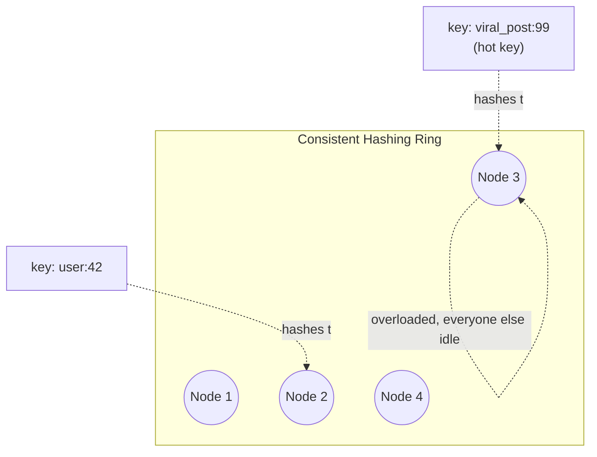
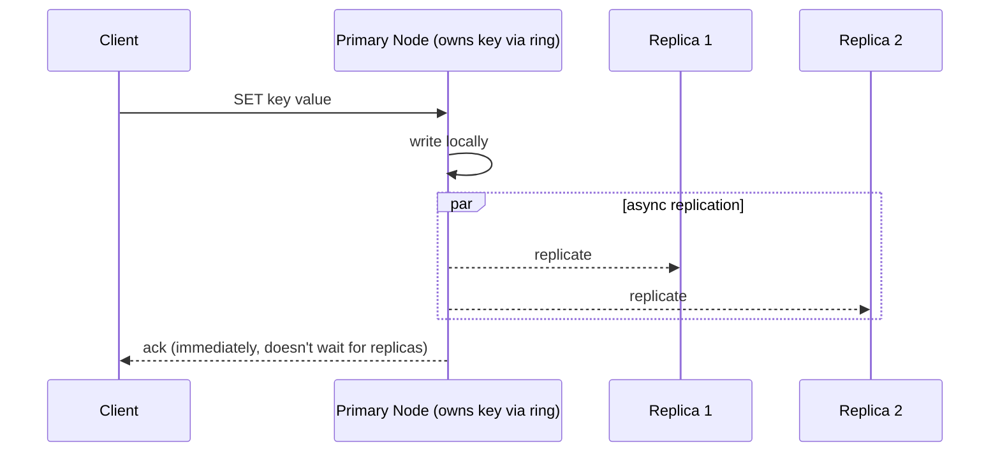

# Design a Distributed Cache (build Redis)

> [!abstract] What you'll be able to do after this chapter
> Explain exactly how a key gets routed to the right node in a real distributed cache, justify sync vs async replication as a live PACELC tradeoff (not an abstract theorem), and diagnose a hot-key problem that a "the cluster has plenty of capacity" mental model completely misses.

---

## Step 1 — The interview question

> [!question] As an interviewer would ask it
> "Design a distributed, in-memory caching system like Redis or Memcached — support `GET`/`SET`/`DELETE` at sub-millisecond latency, horizontally scalable, tolerant of individual node failures."

## Step 2 — Requirements

**Functional:** `GET`/`SET`/`DELETE` by key, TTL support, eviction under memory pressure.

**Non-functional:** horizontal scalability (add nodes to grow capacity without downtime), high availability (a single node dying shouldn't lose the data it held), sub-millisecond latency at scale, graceful handling of **hot keys** — a real and distinct failure mode from general overload, covered in Step 5.

## Step 3 — Back-of-envelope estimation

Assume 10M keys, ~1KB average value → **10GB** of logical data. With replication factor 2 for fault tolerance, that's ~20GB physical storage across the cluster — comfortably split across a modest number of nodes. Target throughput: 1M ops/sec cluster-wide. Across 10 nodes, that's ~100K ops/sec per node — well within what a single in-memory node can sustain, confirming the design should scale roughly linearly with node count as long as **key distribution across nodes stays even.**

## Step 4 — Building it incrementally

**v0 — a single node.** A hash map in memory, exactly like a single Redis instance (see [[CS Fundamentals/04 - Caching/Redis Internals|Redis Internals]] for that node's own internal mechanics). Works until the dataset exceeds one machine's RAM, or throughput exceeds one machine's ceiling.

**Need to scale beyond one node → partition the keyspace.** The naive approach, `hash(key) % N`, breaks the moment `N` changes: adding or removing a single node remaps *almost every key* to a different node, causing a massive, unnecessary cache-wide miss storm. The fix is [[Glossary/Consistent Hashing|consistent hashing]]: map both keys and nodes onto a conceptual ring; a key belongs to the next node clockwise from its hash position. Adding a node only takes over the keys between it and its counterclockwise neighbor — a small, bounded fraction of the total keyspace, not "everything."

**Need fault tolerance → replicate each key's data to `R` nodes** (commonly `R=2` or `3`), so losing any single node doesn't lose that data outright — a replica can be promoted.

**Need clients to know which node owns a key.** Two real options:

| Approach | How it works | Tradeoff |
|---|---|---|
| **Client-side routing** | The client library embeds the hash ring (or, Redis Cluster's specific approach, the hash-slot mapping) and computes the target node directly. | Lowest latency (no extra hop) — but every client needs the current topology, and must handle `MOVED` redirects gracefully during a rebalance. This is Redis Cluster's actual approach. |
| **Proxy-based routing** | Clients always talk to a stateless proxy layer; the proxy looks up and forwards to the correct node. | Simpler clients (no topology awareness needed) — at the cost of an extra network hop on every request, and the proxy layer itself needing to scale and stay available. |

---

## Step 5 — Deep dive: replication, and the hot-key problem overload metrics hide

### Synchronous vs asynchronous replication — a live PACELC decision, not an abstract one

**Synchronous replication:** a write is only acknowledged to the client once the replica(s) confirm receipt too. Safer (no data loss window on primary failure), but adds real latency to every write. **Asynchronous replication:** the primary acknowledges immediately, replicating in the background — much faster writes, but a replica can lag, and a primary crash between "ack sent" and "replicated" genuinely loses that write.

> [!tip] This is [[CS Fundamentals/06 - Distributed Systems/CAP Theorem & PACELC|PACELC's "Else" branch]], concretely, not in the abstract
> There's no partition happening here at all — this is purely the everyday latency-vs-consistency choice PACELC describes as the *normal-operation* tradeoff. Most distributed caches default to **asynchronous** replication specifically because a *cache* rarely needs to be the durable source of truth — the underlying database already is — so trading a small data-loss window for meaningfully lower write latency is usually the right call for this specific use case, even though the identical tradeoff might resolve differently for a primary datastore.

### The hot-key problem — capacity that "should be enough" isn't

A viral piece of content, a trending product, a single celebrity's profile — one key can receive **wildly disproportionate** traffic. Even if the *cluster* has ample aggregate capacity, that one key still lives on **one specific node** (or its small replica set), which can be overwhelmed while every other node in the cluster sits idle. A cluster-wide "we have plenty of capacity" dashboard can look perfectly healthy while one node is on fire — this is exactly why hot-key detection needs to be a first-class concern, not something inferred from aggregate metrics.

**Mitigations:** a short-TTL **local, in-process cache** on the calling application servers absorbs extreme read traffic for the hottest keys without ever reaching the distributed cache layer at all. For genuinely extreme cases, **explicitly replicate a single hot key's value across multiple nodes** (beyond the normal replication factor) and have the application layer randomly pick among them on read — deliberately spreading one key's load across several nodes instead of one.

---

## Step 6 — Full architecture

**Node addition:** only the keys between the new node's ring position and its counterclockwise neighbor migrate — a bounded, predictable fraction of total keys, not a full remap. **Node failure:** a replica is promoted to primary for the affected key range, mirroring standard database leader-follower failover.

---

## Step 7 — Interviewer follow-ups, answered

> [!quote]- "Walk me through exactly what happens when you add a node to the cluster."
> The new node claims a position on the consistent-hashing ring. Only keys whose ring position falls between the new node and its counterclockwise neighbor need to move — every other key's owning node is completely unaffected. This bounded-remap property is the entire reason consistent hashing exists over naive modulo hashing.

> [!quote]- "How do you handle a node failure?"
> A replica holding that node's data is promoted to primary for its key range (detected via [[Glossary/Heartbeat (Health Check)|heartbeat]] failure and coordinated by a cluster manager or gossip-based failure detection) — the same conceptual pattern as database leader-follower failover, applied to cache shards instead of DB shards.

> [!quote]- "How would you handle a single key suddenly getting 10x normal traffic?"
> [Use the hot-key mitigations from Step 5 — local app-server caching for the hottest keys, or deliberate over-replication of that specific key across multiple nodes with client-side random selection among replicas on read.]

> [!quote]- "Synchronous or asynchronous replication — which would you choose, and why?"
> Asynchronous, by default, for a cache specifically — the underlying database remains the durable source of truth, so trading a small data-loss window for lower write latency is the right tradeoff here. A system where the *cache itself* is the only copy of some data (rare, but possible for derived/computed values that are expensive to recompute) might justify synchronous replication for that specific data instead — worth naming as the exception, not treating the default as universal.

## Step 8 — Production experience

> [!info] What to monitor
> Per-node memory usage and eviction rate (a node evicting far more than its peers signals uneven key distribution). Replication lag per replica. **Hot-key detection** specifically — approximate, low-overhead techniques like a Count-Min Sketch can flag disproportionately-accessed keys in near-real-time without the overhead of exact per-key counting at scale.

> [!bug] A real operational gotcha
> Rebalancing during scale-up/down (migrating keys to/from a newly added or removed node) causes a **temporary latency blip** for keys mid-migration — worth explicitly monitoring during planned scaling events, and worth designing the migration to happen gradually/throttled rather than all at once, to avoid a self-inflicted spike right when you're trying to add capacity to handle load.

---
*Related: [[00 - Start Here/How This Handbook Works|Book Map]] · [[CS Fundamentals/04 - Caching/Redis Internals|Redis Internals]] · [[CS Fundamentals/06 - Distributed Systems/CAP Theorem & PACELC|CAP Theorem & PACELC]] · [[Glossary/Consistent Hashing|Consistent Hashing]]*
