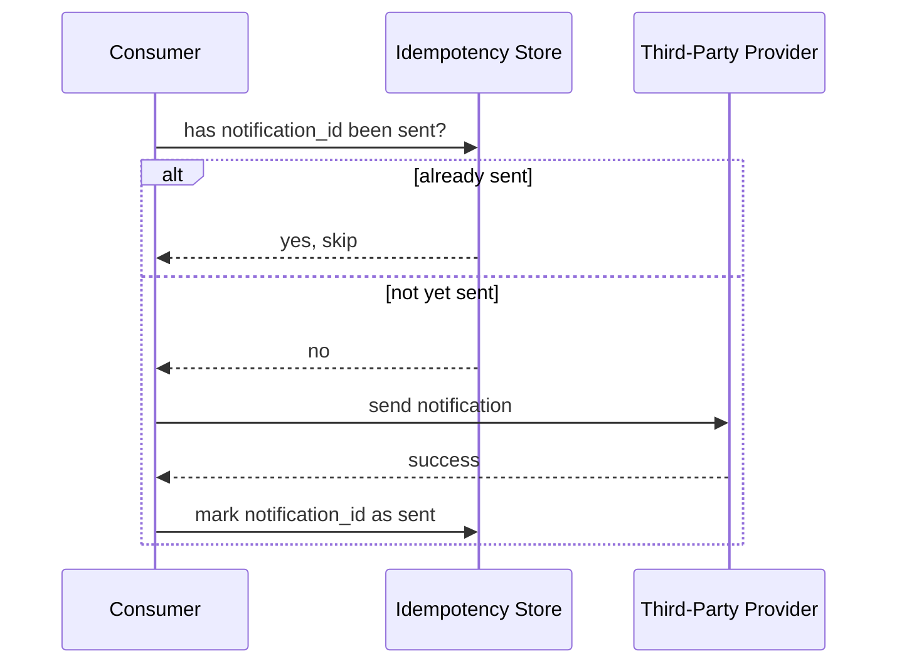

# Design a Notification Service

> [!abstract] What you'll be able to do after this chapter
> Explain why notification delivery must be decoupled from the triggering request, design fan-out at scale, and reason precisely about head-of-line blocking between urgent and bulk notifications — pulling together Kafka, rate limiting, idempotency, and circuit breakers into one coherent design.

---

## Step 1 — The interview question

> [!question] As an interviewer would ask it
> "Design a notification service that sends push notifications, SMS, and email to users at scale, triggered by application events like 'order shipped' or 'new follower,' as well as scheduled notifications like a daily digest."

## Step 2 — Requirements

**Functional:** multi-channel delivery (push/SMS/email/in-app). Event-triggered and scheduled notifications. Per-user preferences (opt-out per channel/type). Personalized templating. Delivery status tracking.

**Non-functional:** high burst throughput (a flash sale can trigger millions of notifications in minutes). Latency-differentiated — an OTP code needs near-instant delivery; a daily digest email can tolerate minutes of delay. **Reliable, exactly-once-feeling delivery** — never silently drop a notification, never double-send one either. Must not overwhelm third-party providers, who have **their own** rate limits.

## Step 3 — Back-of-envelope estimation

Assume 50M users, ~5 notifications/user/day → **250M notifications/day**, ~2,900/sec average. A flash-sale-style event can spike this **50x briefly** → ~150,000/sec peak burst. That gap between average and peak is the entire reason **queue-based buffering isn't optional** here — it's the core design requirement, not an optimization layered on afterward.

## Step 4 — Building it incrementally

**v0 — the naive version.** The triggering application code calls the SMS/push/email provider's API **synchronously**, inline, as part of handling the original request (e.g. the "order placed" handler directly calls a Twilio-like API). This breaks in three concrete ways: a slow or down provider blocks the *primary* request flow (a user placing an order shouldn't wait on an SMS call to complete); burst traffic hits the downstream provider directly, likely exceeding *its* rate limits and getting the whole account throttled; there's no retry story at all if the call fails.

**Fix: decouple via async messaging.** The triggering service publishes a notification-request event to [[CS Fundamentals/05 - Messaging & Streaming/Kafka Internals|Kafka]] and returns immediately — a separate notification-processing pipeline handles actual delivery, completely off the critical path of the original request.

**Need per-channel routing.** A dispatch layer decides which channel(s) apply (based on notification type and user preferences), then publishes to **per-channel topics** (`push-notifications`, `sms-notifications`, `email-notifications`) — letting each channel's consumers scale and rate-limit independently, matched to *that specific provider's* constraints.

**Need to respect preferences and avoid spam.** A preferences lookup happens *before* dispatch — checked at the fan-out stage, not after a message is already queued. A per-user frequency cap (e.g. "no more than one marketing push per day regardless of how many trigger events fire") is a real, common product requirement worth stating explicitly.

**Need reliable, non-duplicate delivery.** Every logical notification gets a unique ID, used as an [[Glossary/Idempotency|idempotency]] key — a consumer that crashes mid-send and gets the message redelivered checks "have I already sent this ID?" before calling the provider again, rather than risking a duplicate send.

---

## Step 5 — Deep dive: fan-out, provider-side rate limiting, and priority isolation

### Fan-out at scale

One triggering event ("flash sale started") can expand into **millions** of individual per-user notifications — see [[Glossary/Fan-out vs Fan-in|Fan-out vs Fan-in]]. This expansion itself must happen asynchronously and at scale: the trigger publishes **one** event; a dedicated fan-out worker (or set of workers, parallelized) expands it into per-user notification tasks and publishes *those* onto the channel queues — never looping over millions of users synchronously inside the original triggering request.

### Provider-side rate limiting — the same algorithm, the opposite direction

[[HLD/02 - Design a Rate Limiter/Design a Rate Limiter|The rate limiter chapter]] covered limiting *inbound* traffic from clients. Here, the exact same token-bucket mechanics apply in the **opposite direction**: each channel's consumer must rate-limit its **outbound** calls to stay under *that specific provider's* ceiling (Twilio, FCM, APNs, SES all impose their own limits) — worth naming explicitly as the same algorithm serving a different purpose, not a new concept.

### Priority isolation — avoiding head-of-line blocking

> [!bug] The mistake this section exists to prevent
> If OTP/security-code notifications share the **same queue** as bulk marketing notifications, a burst of low-priority marketing traffic can sit *ahead* of a time-critical OTP in that queue, delaying it — the exact same **head-of-line blocking** concept from [[CS Fundamentals/02 - Networking/TCP Deep Dive|TCP]] (one blocked/slow item stalling everything queued behind it), just showing up at the application-messaging layer instead of the transport layer.

The fix: **separate topics/queues per priority tier**, each with its own dedicated consumers — a flood of marketing notifications never shares a queue with OTP traffic, so it physically cannot delay it.

### Retry & dead-letter handling

Provider failures get exponential-backoff retries, then route to a dead-letter queue after a bounded number of attempts — the same pattern [[CS Fundamentals/05 - Messaging & Streaming/RabbitMQ Internals|RabbitMQ's dead-letter exchanges]] formalize, generalizable here even on a Kafka-based pipeline as a dedicated "failed notifications" topic for follow-up/alerting.

---

## Step 6 — Full architecture

---

## Step 7 — Interviewer follow-ups, answered

> [!quote]- "How do you prevent a user getting the same notification twice if a consumer crashes and reprocesses the message?"
> Every notification carries a unique ID checked against an idempotency store *before* the provider call is made — a redelivered message that was already successfully sent is detected and skipped, rather than sent again.

> [!quote]- "How do you prevent OTP notifications from being delayed behind a flash-sale marketing blast?"
> Dedicated, separate queues per priority tier with their own consumers — OTP traffic never shares infrastructure with bulk marketing traffic, which physically prevents the head-of-line blocking that a shared queue would cause.

> [!quote]- "How do you handle a downstream provider being down entirely?"
> Retry with exponential backoff, then a [[Glossary/Circuit Breaker|circuit breaker]] trips once failures cross a threshold — stop hammering a clearly-down provider, fail fast, and route affected notifications to a dead-letter queue for later reprocessing once the circuit closes again, rather than piling up retries against a dependency that isn't recovering.

> [!quote]- "How would you support a user muting one specific notification type without affecting others?"
> Preferences keyed by `(notification_type, channel)`, checked at the fan-out stage before a per-channel message is ever queued — a muted combination simply never gets dispatched, with zero impact on that user's other notification types or channels.

## Step 8 — Production experience

> [!info] What to monitor
> Delivery success rate **per channel and per provider** (a silent degradation on one provider shouldn't be masked by healthy aggregate numbers across all channels). Provider latency and error rate. **Queue depth / consumer lag per channel** (see [[CS Fundamentals/05 - Messaging & Streaming/Kafka Internals|Kafka's consumer lag]] as the direct monitoring primitive). Dead-letter queue size — a *growing* DLQ signals a systemic problem, not isolated one-off failures.

> [!bug] A real production gotcha
> A provider **degrading** (meaningfully higher latency, not an outright failure) doesn't trip error-rate alerts the same way an outage does — it shows up first as *gradually building consumer lag*. Alerting on lag **trend**, not just an absolute threshold, catches this well before it becomes a full backlog.

---
*Related: [[00 - Start Here/How This Handbook Works|Book Map]] · [[CS Fundamentals/05 - Messaging & Streaming/Kafka Internals|Kafka Internals]] · [[HLD/02 - Design a Rate Limiter/Design a Rate Limiter|Design a Rate Limiter]] · [[Glossary/Idempotency|Idempotency]] · [[Glossary/Circuit Breaker|Circuit Breaker]] · [[Glossary/Fan-out vs Fan-in|Fan-out vs Fan-in]]*
