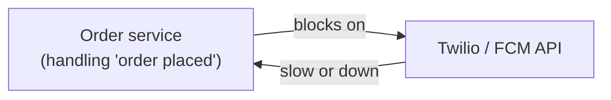
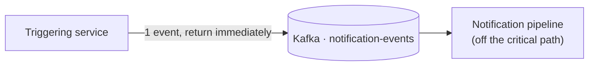
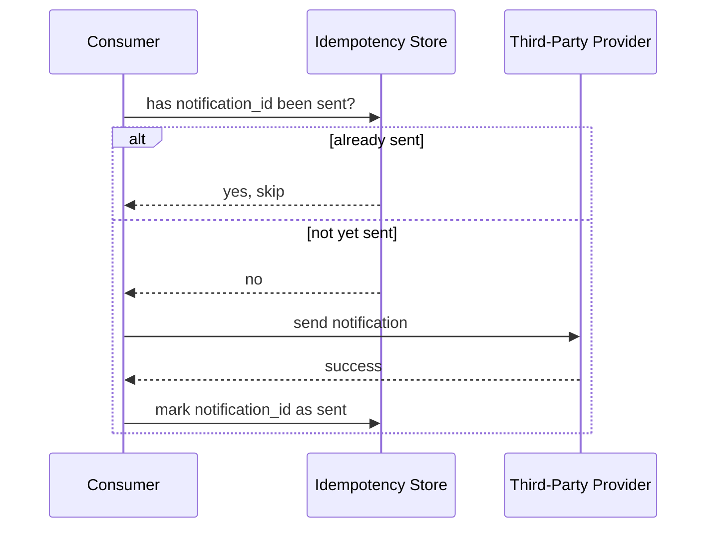
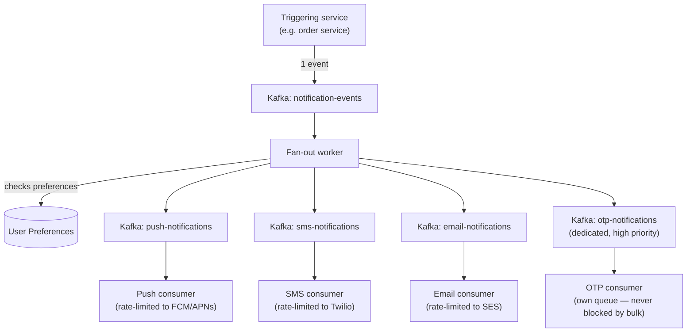

# Design a Notification Service

> [!abstract] How to read this chapter
> Built phase by phase from a synchronous inline call to a decoupled, priority-isolated pipeline. Each phase adds one idea, exposes the next bottleneck, and fixes it — pulling Kafka, rate limiting, idempotency, and circuit breakers into one coherent design.

> [!question] The interview question
> "Design a notification service that sends push, SMS, and email to users at scale, triggered by application events like 'order shipped' or 'new follower', as well as scheduled notifications like a daily digest."

---

## Requirements

**Functional**
- Multi-channel delivery: push / SMS / email / in-app.
- Event-triggered *and* scheduled notifications.
- Per-user **preferences** (opt-out per channel and per type).
- Personalized **templating**.
- Delivery **status tracking**.

**Non-functional**

| Requirement | Why it matters here specifically |
|---|---|
| **High burst throughput** | A flash sale triggers millions of notifications in minutes — the average-to-peak gap is the whole design. |
| **Latency-differentiated** | An OTP needs near-instant delivery; a daily digest tolerates minutes. One pipeline can't treat them the same. |
| **Reliable, exactly-once-*feeling*** | Never silently drop a notification, never double-send one either. |
| **Respect provider limits** | Twilio/FCM/APNs/SES have *their own* rate limits — overwhelm them and the whole account gets throttled. |

---

## Phase 00 — Capacity math you can defend

| Quantity | Derivation | Result |
|---|---|---|
| Volume | 50M users × ~5/day | 250M/day → ~2,900/s average |
| Burst | flash-sale spike ~50× | **~150,000/s peak** |

> [!example] In plain words
> The 50× gap between average and peak is *why queue-based buffering isn't optional* — it's the core requirement, not an optimization layered on afterward. The whole design exists to absorb that burst without dropping messages or melting a provider.

---

## Phase 01 — The naive version: synchronous inline send

*Start with what the order-service code does first, so its failures name the design.*

The triggering code calls the provider's API **synchronously**, inline, as part of the original request. Breaks three ways:

- A slow or down provider **blocks the primary request** — a user placing an order shouldn't wait on an SMS call.
- Burst traffic hits the provider directly, likely **exceeding its rate limit** and throttling the whole account.
- **No retry story** if the call fails — the notification is just lost.

| 🔴 Bottleneck | 🟢 Next fix |
|---|---|
| Delivery is coupled to the request path, unbuffered, and unretried. | Decouple with async messaging (Phase 2). |

> [!example] Layman
> A cashier who personally phones every customer's carrier before finishing the sale. One slow call and the checkout line stops. Hand the messages to a back room instead.

---

## Phase 02 — Decouple via async messaging

*The trigger's job is to *record intent* and return; delivery happens elsewhere.*

The triggering service publishes a notification-request event to [[CS Fundamentals/05 - Messaging & Streaming/Kafka Internals|Kafka]] and returns immediately. A separate pipeline handles actual delivery, completely off the critical path — a slow provider no longer blocks orders, and Kafka buffers the burst.

| 🔴 Bottleneck | 🟢 Next fix |
|---|---|
| One pipeline for all channels means each provider's very different rate limits and retry behaviors collide. | Per-channel routing (Phase 3). |

---

## Phase 03 — Per-channel routing + preferences

*Different channels have different providers, limits, and consumers — split them.*

A dispatch layer decides which channel(s) apply (by notification type and user preferences), then publishes to **per-channel topics** (`push`, `sms`, `email`) — letting each channel's consumers scale and rate-limit independently, matched to *that provider's* constraints.

**Preferences are checked *before* dispatch**, at the fan-out stage — not after a message is already queued. A per-user **frequency cap** ("no more than one marketing push/day regardless of trigger count") is a real, common product requirement worth stating.

| 🔴 Bottleneck | 🟢 Next fix |
|---|---|
| A consumer that crashes mid-send and gets the message redelivered could double-send; and one trigger for millions of users can't be expanded synchronously. | Idempotency + async fan-out (Phase 4). |

---

## Phase 04 — Reliable, non-duplicate delivery + fan-out at scale

**Idempotency.** Every logical notification gets a unique ID used as an [[Glossary/Idempotency|idempotency]] key — a consumer that crashes mid-send and gets the message redelivered checks "have I already sent this ID?" before calling the provider again.

**Fan-out at scale.** One triggering event ("flash sale started") expands into **millions** of per-user notifications (see [[Glossary/Fan-out vs Fan-in|Fan-out vs Fan-in]]). The trigger publishes **one** event; a dedicated fan-out worker (parallelized) expands it into per-user tasks and publishes *those* onto the channel queues — never looping over millions of users synchronously inside the original request.

| 🔴 Bottleneck | 🟢 Next fix |
|---|---|
| A burst of bulk marketing traffic can sit *ahead* of a time-critical OTP in a shared queue, delaying it; and outbound provider limits still need enforcing. | Priority isolation + outbound rate limiting (Phase 5). |

---

## Phase 05 — Deep dive: priority isolation, outbound limiting, retries

### Priority isolation — avoiding head-of-line blocking

> [!bug] The mistake this section exists to prevent
> If OTP/security-code notifications share the **same queue** as bulk marketing, a burst of low-priority traffic can sit *ahead* of a time-critical OTP, delaying it — the exact **head-of-line blocking** from [[CS Fundamentals/02 - Networking/TCP Deep Dive|TCP]] (one slow item stalling everything behind it), at the application-messaging layer instead of transport.

The fix: **separate topics/queues per priority tier**, each with dedicated consumers — a marketing flood never shares a queue with OTP traffic, so it physically *cannot* delay it.

### Provider-side rate limiting — same algorithm, opposite direction

[[HLD/02 - Design a Rate Limiter/Design a Rate Limiter|The rate limiter chapter]] limited *inbound* client traffic. Here the same token-bucket mechanics apply in the **opposite direction**: each channel's consumer rate-limits its **outbound** calls to stay under *that provider's* ceiling — the same algorithm serving a different purpose, not a new concept.

### Retry & dead-letter handling

Provider failures get exponential-backoff retries, then route to a **dead-letter queue** after a bounded number of attempts — the pattern [[CS Fundamentals/05 - Messaging & Streaming/RabbitMQ Internals|RabbitMQ's dead-letter exchanges]] formalize, done on Kafka as a dedicated "failed notifications" topic for follow-up and alerting.

| 🔴 Bottleneck | 🟢 Next fix |
|---|---|
| Individual mechanisms handled — assemble them. | Final architecture (Phase 6). |

---

## Phase 06 — The final combined architecture

**Five principles to close with:**
1. Delivery must be decoupled from the triggering request — publish intent, return, deliver elsewhere.
2. The average-to-peak gap makes queue buffering the core requirement, not an add-on.
3. Per-channel topics let each provider's very different limits and retries live independently.
4. Idempotency keys make redelivery safe — check "already sent?" before every provider call.
5. Separate queues per priority tier physically prevent head-of-line blocking of OTPs behind bulk traffic.

---

## Interviewer follow-ups, answered

> [!quote]- "Prevent the same notification twice if a consumer crashes and reprocesses?"
> Every notification carries a unique ID checked against an idempotency store *before* the provider call — a redelivered message that was already sent is detected and skipped, not re-sent.

> [!quote]- "Prevent OTPs being delayed behind a flash-sale marketing blast?"
> Dedicated, separate queues per priority tier with their own consumers — OTP traffic never shares infrastructure with bulk marketing, which physically prevents the head-of-line blocking a shared queue would cause.

> [!quote]- "Downstream provider down entirely?"
> Retry with exponential backoff, then a [[Glossary/Circuit Breaker|circuit breaker]] trips once failures cross a threshold — stop hammering a clearly-down provider, fail fast, route affected notifications to a DLQ for later reprocessing once the circuit closes, rather than piling retries against a dependency that isn't recovering.

> [!quote]- "User mutes one notification type without affecting others?"
> Preferences keyed by `(notification_type, channel)`, checked at fan-out before a per-channel message is ever queued — a muted combination simply never gets dispatched, zero impact on that user's other types or channels.

---

## Production experience

> [!info] What to monitor
> Delivery success rate **per channel and per provider** (a silent degradation on one provider shouldn't hide behind healthy aggregate numbers). Provider latency and error rate. **Queue depth / consumer lag per channel** ([[CS Fundamentals/05 - Messaging & Streaming/Kafka Internals|Kafka consumer lag]] is the direct primitive). Dead-letter queue size — a *growing* DLQ signals a systemic problem, not one-offs.

> [!bug] A real production gotcha
> A provider *degrading* (higher latency, not an outright failure) doesn't trip error-rate alerts the way an outage does — it shows up first as *gradually building consumer lag*. Alert on lag **trend**, not just an absolute threshold, to catch it before a full backlog.

---

## Cheat sheet — if you remember nothing else

1. Decouple delivery from the trigger — publish one event to Kafka, return, deliver off the critical path.
2. The 50× burst gap makes queue buffering mandatory, not optional.
3. Per-channel topics so each provider's limits/retries scale independently; rate-limit *outbound* calls (token bucket, opposite direction).
4. Idempotency key per notification — check "already sent?" before every provider call to survive redelivery.
5. Separate priority queues (OTP vs bulk) prevent head-of-line blocking; retries → backoff → circuit breaker → DLQ.

---
*Related: [[00 - Start Here/How This Handbook Works|Book Map]] · [[CS Fundamentals/05 - Messaging & Streaming/Kafka Internals|Kafka Internals]] · [[HLD/02 - Design a Rate Limiter/Design a Rate Limiter|Design a Rate Limiter]] · [[Glossary/Idempotency|Idempotency]] · [[Glossary/Circuit Breaker|Circuit Breaker]] · [[Glossary/Fan-out vs Fan-in|Fan-out vs Fan-in]]*
