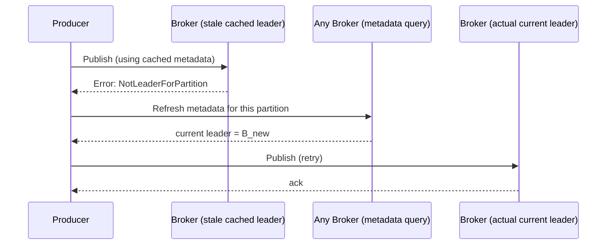
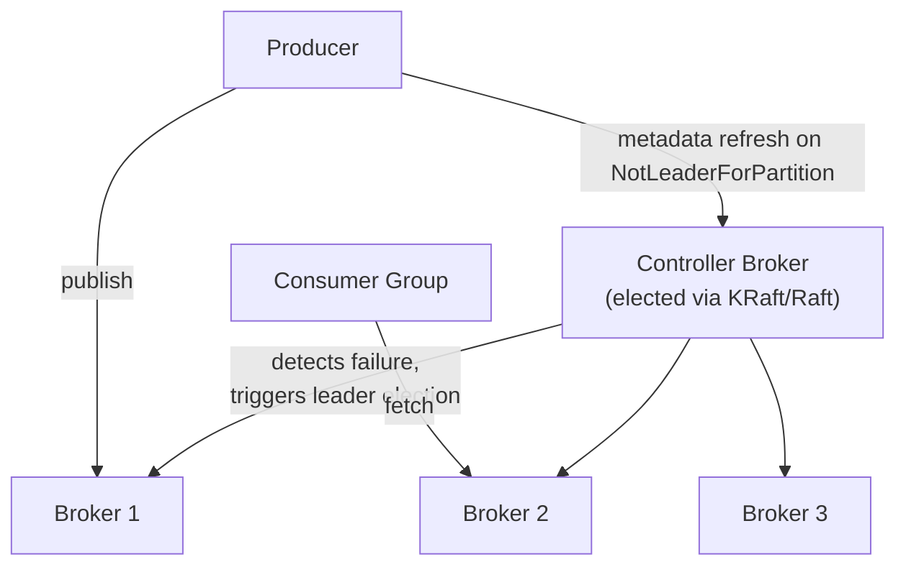

# Design a Distributed Message Queue (build Kafka)

> [!abstract] What you'll be able to do after this chapter
> Build the *system-design* framing around Kafka's internals (already covered in full elsewhere) — capacity planning for partition count, the metadata/discovery problem new clients face, and controller election at the cluster level.

> [!info] This chapter assumes you've read the internals chapter
> Broker/partition/segment/ISR/leader-election/delivery-guarantees/log-compaction mechanics are covered in full in [[CS Fundamentals/Messaging & Streaming/Kafka Internals|Kafka Internals]] — this chapter doesn't re-derive any of that. It answers the *system-design* question: "design a system like this from scratch," focused on what that internals chapter doesn't cover — estimation, discovery, and cluster-level coordination.

---

## Step 1 — The interview question

> [!question] As an interviewer would ask it
> "Design a distributed, partitioned, replicated message queue supporting high-throughput publish-subscribe with independent consumer groups and configurable durability — essentially, build Kafka."

## Step 2 — Requirements

**Functional:** publish to a topic, consume in order *within a partition*, multiple independent consumer groups reading the same topic, configurable retention.

**Non-functional:** millions of messages/sec throughput. Durability — no data loss for acknowledged writes. Horizontal scalability. Fault tolerance — a broker failure must not stop the system or lose data.

## Step 3 — Back-of-envelope estimation

Assume 1M messages/sec average, ~1KB average message size → **~1GB/sec** aggregate throughput — far beyond any single machine's disk/network ceiling, confirming partitioning across many brokers isn't optional. Assume 7-day retention: `1GB/sec × 7 × 86,400 sec ≈ 600TB` before replication, **~1.8PB** with a replication factor of 3 — this scale is exactly why the design must shard both storage *and* throughput across a large, horizontally-scaled cluster from day one, not as a later optimization.

## Step 4 — Building it incrementally (the parts unique to this chapter)

**v0 — single-server append-only log.** The simplest possible durable queue. Breaks past one machine's throughput/storage ceiling, and is a single point of failure — the exact motivation for everything [[CS Fundamentals/Messaging & Streaming/Kafka Internals|the internals chapter]] describes (partitioning, replication, ISR).

**The new problem this HLD framing surfaces: how does a client find the right broker?** A producer publishing to topic `orders`, partition 3, needs to know **which specific broker currently holds the leader** for that partition — and that can change at any time (broker failure, rebalancing). This is the **metadata / discovery problem**, and it's the piece worth deep-diving here specifically because the internals chapter treats it as a given rather than explaining the mechanism.

---

## Step 5 — Deep dive: metadata discovery, controller election, and partition-count planning

### Metadata discovery — the actual mechanism

Any broker in the cluster can answer a metadata request: "who currently leads partition P of topic T?" Clients **cache** this mapping locally rather than querying on every single publish/fetch. When a client's cached mapping goes stale (the leader moved, e.g. after a failure), its request to the old leader fails with a `NotLeaderForPartition`-style error — the client then **refreshes its metadata** and retries against the correct, current leader. This request-fail-refresh-retry loop is the actual mechanism, not magic auto-discovery — worth being able to state precisely.

### Controller election — cluster-level coordination

One broker is elected **controller** of the entire cluster — responsible for detecting broker failures and triggering leader election *for every affected partition* on that broker, and propagating the resulting metadata changes to the rest of the cluster. This election itself is a consensus problem — historically coordinated through ZooKeeper, in modern Kafka handled by **KRaft** (Kafka's own Raft-based controller quorum), directly the same [[Glossary/Raft (Consensus)|Raft mechanics]] already covered generally.

### Partition-count planning — a real, easy-to-get-wrong tuning decision

> [!bug] A genuine operational constraint worth naming
> Partition count for a topic can be **increased later but not decreased** — under-provisioning limits both write throughput (parallelism ceiling) and consumer-side parallelism (a consumer group can never have more *active* consumers than partitions), while over-provisioning increases per-broker overhead (more open file handles, more replication traffic) for no benefit. Capacity planning here means sizing for target throughput **and** desired maximum consumer parallelism, with room to grow — since growing later is possible, but shrinking isn't.

---

## Step 6 — Full architecture

---

## Step 7 — Interviewer follow-ups, answered

> [!quote]- "How does a client know which broker to publish to?"
> [Use the metadata caching + `NotLeaderForPartition`-triggered refresh mechanism from Step 5 — this is the specific, concrete answer, not "it just knows."]

> [!quote]- "What happens to in-flight publishes during a leader election — do they fail?"
> Yes, briefly — publishes targeting a partition mid-election fail (or block, depending on client configuration) until the new leader is elected and metadata propagates. This is a genuine, bounded unavailability window — a live **CP choice**: the system favors correctness (never accepting a write that could be lost or conflict with the new leader's state) over availability during that specific window, consistent with [[CS Fundamentals/Distributed Systems/CAP Theorem & PACELC|CAP's]] framing.

> [!quote]- "How would you decide on partition count for a new topic?"
> Divide target throughput by the realistic per-partition throughput ceiling (bounded by a single leader's disk/network capacity), and separately ensure the count meets the desired maximum consumer-group parallelism — then round up with headroom, since partition count can be increased later but never decreased.

## Step 8 — Production experience

> [!info] What to monitor
> Under-replicated partitions / ISR shrinkage (from [[CS Fundamentals/Messaging & Streaming/Kafka Internals|Kafka Internals]], applied at the cluster level here). **Controller election frequency** — frequent re-elections are a strong signal of cluster instability (flapping brokers, network issues), not routine operation. Partition-to-broker assignment skew — an unevenly distributed partition count creates a hot broker even when the cluster's aggregate capacity looks fine on a dashboard.

---
*Related: [[00 - Start Here/How This Handbook Works|Book Map]] · [[CS Fundamentals/Messaging & Streaming/Kafka Internals|Kafka Internals]] · [[Glossary/Raft (Consensus)|Raft]] · [[CS Fundamentals/Distributed Systems/CAP Theorem & PACELC|CAP Theorem & PACELC]]*
