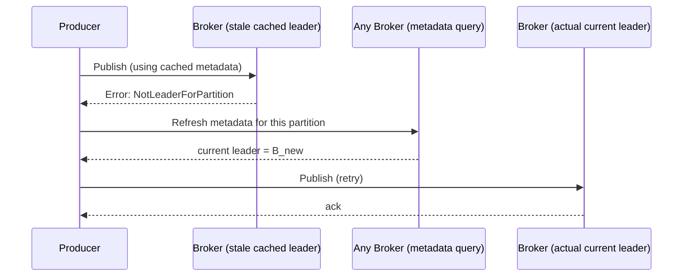
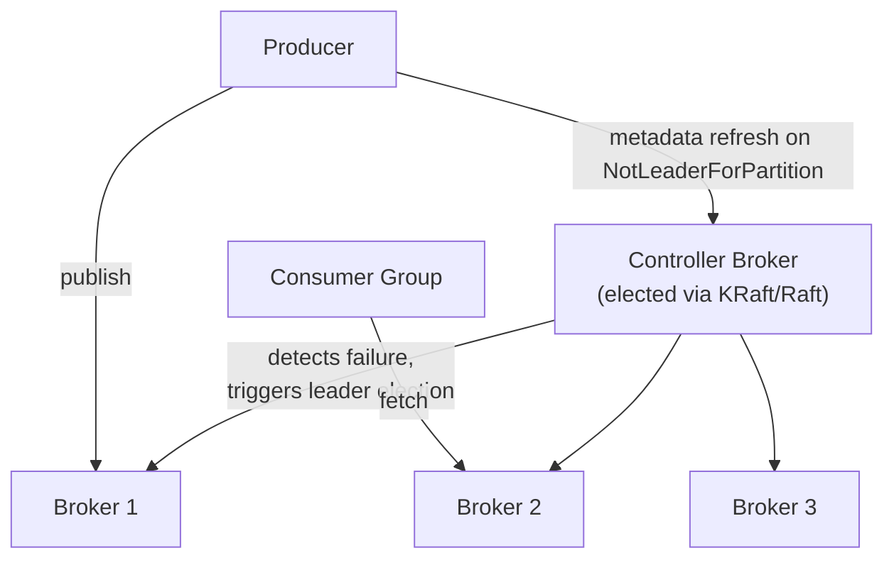

# Design a Distributed Message Queue (build Kafka)

> [!abstract] How to read this chapter
> Built phase by phase, but scoped to the *system-design* framing around Kafka's internals — the internals themselves live elsewhere. Each phase adds one idea, exposes the next bottleneck, and fixes it: capacity planning for partition count, the metadata/discovery problem new clients face, and controller election at the cluster level.

> [!info] This chapter assumes you've read the internals chapter
> Broker/partition/segment/ISR/leader-election/delivery-guarantee/log-compaction mechanics are covered in full in [[CS Fundamentals/05 - Messaging & Streaming/Kafka Internals|Kafka Internals]] — this chapter doesn't re-derive any of that. It answers "design a system like this from scratch," focused on what internals doesn't cover: **estimation, discovery, and cluster-level coordination.**

> [!question] The interview question
> "Design a distributed, partitioned, replicated message queue supporting high-throughput publish-subscribe with independent consumer groups and configurable durability — essentially, build Kafka."

---

## Requirements

**Functional**
- Publish to a topic.
- Consume **in order within a partition**.
- Multiple **independent consumer groups** read the same topic.
- Configurable **retention**.

**Non-functional**

| Requirement | Why it matters here specifically |
|---|---|
| **Millions of msgs/sec** | ~1 GB/s aggregate — far beyond one machine, so partitioning across brokers isn't optional. |
| **Durability** | No data loss for acknowledged writes — the whole promise of a queue. |
| **Horizontal scalability** | Shard both storage *and* throughput across a large cluster from day one. |
| **Fault tolerance** | A broker failure must neither stop the system nor lose data. |

---

## Phase 00 — Capacity math you can defend

| Quantity | Derivation | Result |
|---|---|---|
| Aggregate throughput | 1M msgs/s × ~1 KB | ~1 GB/s — beyond any single disk/NIC |
| 7-day retention | 1 GB/s × 7 × 86,400 s | ~600 TB before replication |
| With RF=3 | × 3 | **~1.8 PB** |

> [!example] In plain words
> Both throughput *and* storage blow past one machine by orders of magnitude. That's why the design shards across a horizontally-scaled cluster from day one — partitioning is the premise, not a later optimization.

---

## Phase 01 — A single-server append-only log

*The simplest possible durable queue, so the cluster features earn their place.*

One append-only log on disk: producers append, consumers read by offset. Durable, ordered, dead simple. Breaks past one machine's throughput/storage ceiling, and is a single point of failure.

| 🔴 Bottleneck | 🟢 Next fix |
|---|---|
| One machine caps throughput and storage, and its death loses everything. | Partition + replicate across brokers (the internals chapter) — then face the *new* problem: clients finding the right broker. |

> [!info] Where internals takes over
> Partitioning (split a topic into ordered logs), replication (RF copies), and ISR/leader-election are the internals chapter's domain. This chapter picks up at the question those raise: **once partitions live on many brokers and leaders move, how does a client find the current leader?**

---

## Phase 02 — The metadata / discovery problem

*A producer for topic `orders`, partition 3 needs the broker that currently **leads** that partition — and leadership can change at any time.*

Any broker can answer a metadata request: "who currently leads partition P of topic T?" Clients **cache** this mapping locally rather than querying on every publish/fetch. When a cached mapping goes stale (leader moved after a failure), the request to the old leader fails with a `NotLeaderForPartition`-style error — the client **refreshes metadata** and retries against the current leader.

> [!tip] Say this precisely
> This request-fail-refresh-retry loop is the *actual* mechanism — not magic auto-discovery. Caching keeps metadata lookups off the hot path; the error-driven refresh recovers from broker movement.

| 🔴 Bottleneck | 🟢 Next fix |
|---|---|
| When a broker dies, *someone* must detect it and trigger leader election for every partition it led — and tell everyone the new mapping. | Cluster-level coordination: the controller (Phase 3). |

---

## Phase 03 — Controller election: cluster-level coordination

*One broker is elected **controller** of the whole cluster.*

The controller detects broker failures and triggers leader election *for every affected partition* on the failed broker, then propagates the resulting metadata changes to the rest of the cluster. This election is itself a consensus problem — historically via ZooKeeper, in modern Kafka via **KRaft** (Kafka's own [[Glossary/Raft (Consensus)|Raft]]-based controller quorum).

| 🔴 Bottleneck | 🟢 Next fix |
|---|---|
| Partition count is a tuning decision that's easy to get wrong — and one you can't fully undo. | Partition-count planning (Phase 4). |

---

## Phase 04 — Partition-count planning

*A real, easy-to-get-wrong capacity decision.*

> [!bug] A genuine operational constraint
> Partition count for a topic can be **increased later but not decreased.** Under-provisioning limits both write throughput (parallelism ceiling) and consumer parallelism (a group can never have more *active* consumers than partitions); over-provisioning increases per-broker overhead (more open file handles, more replication traffic) for no benefit. Size for **target throughput** *and* **desired maximum consumer parallelism**, with headroom — because growing later is possible, shrinking isn't.

| 🔴 Bottleneck | 🟢 Next fix |
|---|---|
| Individual mechanisms handled — assemble the cluster picture. | Final architecture (Phase 5). |

---

## Phase 05 — The final combined architecture

**Four principles to close with:**
1. Both throughput and storage exceed one machine by orders of magnitude — partitioning is the premise.
2. Discovery is request-fail-refresh-retry over cached metadata, not auto-magic — state the exact loop.
3. One elected controller detects failures and drives leader election; the election is Raft/KRaft consensus.
4. Partition count grows but never shrinks — size for throughput *and* consumer parallelism with headroom.

---

## Interviewer follow-ups, answered

> [!quote]- "How does a client know which broker to publish to?"
> It bootstraps from one or more known brokers, asks for topic/partition metadata, and caches the partition-to-leader mapping. It publishes to the cached leader; if leadership changes, the broker returns a `NotLeaderForPartition`-style error, and the client refreshes metadata and retries with bounded backoff. Metadata lookups stay off the hot path while still recovering from broker movement.

> [!quote]- "What happens to in-flight publishes during a leader election — do they fail?"
> Yes, briefly — publishes targeting a partition mid-election fail (or block, per client config) until the new leader is elected and metadata propagates. A genuine, bounded unavailability window — a live **CP choice**: favor correctness (never accept a write that could be lost or conflict) over availability during that window, consistent with [[CS Fundamentals/06 - Distributed Systems/CAP Theorem & PACELC|CAP]].

> [!quote]- "How would you decide partition count for a new topic?"
> Divide target throughput by realistic per-partition throughput (bounded by one leader's disk/network), and separately ensure the count meets desired maximum consumer-group parallelism — then round up with headroom, since count can increase later but never decrease.

---

## Production experience

> [!info] What to monitor
> Under-replicated partitions / ISR shrinkage (from [[CS Fundamentals/05 - Messaging & Streaming/Kafka Internals|Kafka Internals]], at cluster level here). **Controller election frequency** — frequent re-elections signal cluster instability (flapping brokers, network issues), not routine operation. Partition-to-broker assignment skew — an uneven partition count creates a hot broker even when aggregate capacity looks fine on a dashboard.

---

## Cheat sheet — if you remember nothing else

1. ~1 GB/s and ~1.8 PB (RF=3, 7-day) both exceed one machine — partitioning across brokers is the premise.
2. Discovery = cached partition→leader map + `NotLeaderForPartition` error → metadata refresh → retry. Not magic.
3. One elected controller (KRaft/Raft) detects failures, drives per-partition leader election, propagates metadata.
4. Partition count only grows — size for throughput AND max consumer parallelism, with headroom.
5. Watch under-replicated partitions and controller-election frequency; the latter spiking means an unstable cluster.

---
*Related: [[00 - Start Here/How This Handbook Works|Book Map]] · [[CS Fundamentals/05 - Messaging & Streaming/Kafka Internals|Kafka Internals]] · [[Glossary/Raft (Consensus)|Raft]] · [[CS Fundamentals/06 - Distributed Systems/CAP Theorem & PACELC|CAP Theorem & PACELC]]*
