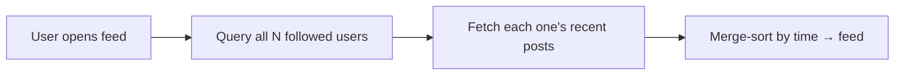
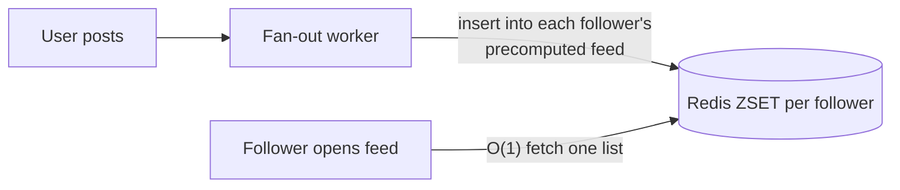
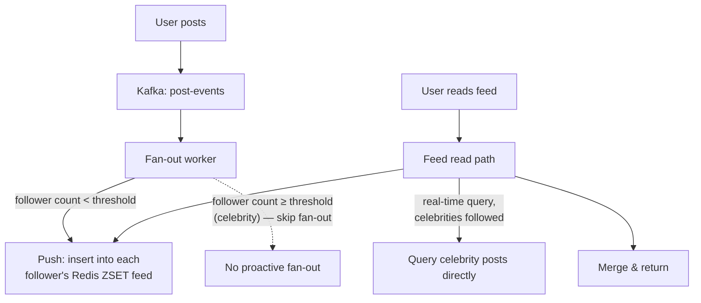

# Design Twitter / News Feed

> [!abstract] How to read this chapter
> Built phase by phase around one insight — *make the common operation cheap* — and the one detail that breaks it. Each phase adds one idea, exposes the next bottleneck, and fixes it: fan-out-on-write, why it fails catastrophically for celebrities, and the real hybrid production answer.

> [!question] The interview question
> "Design a system where users post short messages, follow other users, and see a feed aggregating posts from everyone they follow."

---

## Requirements

**Functional**
- Post a message.
- Follow / unfollow.
- View a **home timeline** aggregating followed users' posts.
- View a user's own **profile timeline**.

**Non-functional**

| Requirement | Why it matters here specifically |
|---|---|
| **Very low feed-read latency** | The home feed is the most-viewed page in the product — every design choice optimizes it. |
| **Writes stay available** | Posting must not fail under load, even when fan-out is heavy. |
| **Eventual consistency OK for freshness** | A few seconds' delay before a post appears in followers' feeds is fine… |
| **…but a post is never lost** | Durability is non-negotiable even though freshness is relaxed. |

---

## Phase 00 — Capacity math you can defend

| Quantity | Derivation | Result |
|---|---|---|
| Posts/day | 50M DAU × ~2 posts | 100M/day → ~1,150 writes/s avg |
| Feed reads/day | 50M DAU × ~10 views | ~500M/day → ~5,800 reads/s avg |
| Follower distribution | — | **highly skewed** — most tiny, a few in the millions |

> [!example] In plain words
> The follower skew is the single detail that drives the hardest decision in this chapter. And the real asymmetry isn't the raw read:write ratio — it's **fan-out**: one post read by millions over its lifetime is far more read amplification than the raw numbers suggest.

---

## Phase 01 — The pull model (fan-out on read)

*Start with the trivially-correct version so its cost names the problem.*

Building a feed queries everyone the user follows, fetches recent posts, merge-sorts by time — on **every single feed view**. Correctness is trivial.

| 🔴 Bottleneck | 🟢 Next fix |
|---|---|
| Feed views are the most frequent operation in the product, and this makes every one do `N` queries — expensive exactly where it can least afford to be. | Invert the cost: precompute feeds at write time (Phase 2). |

> [!example] Layman
> Every time you open the paper, a clerk runs to every author you follow, collects their latest, and collates it on the spot — while a million other readers ask for the same thing. Precompute the paper instead.

---

## Phase 02 — The push model (fan-out on write)

*Move the work from the frequent read to the rare write.*

When a user posts, proactively insert that post into a **precomputed feed** (a list/sorted-set per follower) for every follower. Reading becomes `O(1)` — fetch one precomputed list. This **inverts the cost**: writes get more expensive (`N` inserts per post), reads — the overwhelmingly common operation — become cheap. That inversion is the entire insight.

| 🔴 Bottleneck | 🟢 Next fix |
|---|---|
| An account with 50M followers posting once = 50M feed-insert writes — a write storm that overwhelms fan-out and delays the very feeds this design should make fast. | A hybrid that special-cases celebrities (Phase 3). |

---

## Phase 03 — The celebrity problem and the hybrid answer

> [!bug] Where fan-out-on-write catastrophically fails
> An account with 50M followers posting once means **50M feed-insert writes** for one post — a massive spike that can overwhelm fan-out and meaningfully delay feed visibility for followers, precisely the case this design is supposed to make fast. Fan-out-on-write's core assumption — follower counts small enough that `N` inserts is cheap — simply doesn't hold for celebrities.

**The real production answer: a hybrid.**
- **Fan-out-on-write** for the vast majority of normal accounts.
- For accounts above a follower-count threshold ("celebrities"), **skip proactive fan-out entirely.** At feed-read time, fetch the follower's precomputed (pushed) feed **and separately query any celebrities they follow in real time**, merging both.

Cheap reads stay cheap for the common case; celebrity posts never trigger a catastrophic write storm.

| 🔴 Bottleneck | 🟢 Next fix |
|---|---|
| The hybrid needs the right storage for feeds and an async path so posting stays fast regardless of follower count. | Fan-out mechanics: storage + queue (Phase 4). |

---

## Phase 04 — Deep dive: fan-out mechanics and where each piece lives

**Storage for the precomputed feed.** A [[CS Fundamentals/04 - Caching/Redis Internals|Redis sorted set]] per user, scored by post timestamp, is a near-perfect fit — literally the exact use case Redis Internals names for **ZSETs**: `O(log n)` insertion, `O(log n)` range queries by score, giving both fast fan-out writes and fast feed reads from one structure.

**Async fan-out via a queue.** Posting publishes an event to [[CS Fundamentals/05 - Messaging & Streaming/Kafka Internals|Kafka]]; a dedicated **fan-out worker** consumes it and performs the `N` insertions — the same async-fan-out shape from [[HLD/04 - Design a Notification Service/Design a Notification Service|the Notification Service chapter]], reused. The original "post a tweet" request stays fast regardless of how many followers fan-out eventually touches.

**Ranking (named, not deep-dived).** Beyond chronological order, a ranking model can reorder the feed for engagement — a real production concern, but its own ML-systems domain. Name it as existing.

| 🔴 Bottleneck | 🟢 Next fix |
|---|---|
| Individual pieces handled — assemble the two-path picture. | Final architecture (Phase 5). |

---

## Phase 05 — The final combined architecture

**Five principles to close with:**
1. Make the common operation cheap — reads dominate, so precompute feeds at write time.
2. Fan-out-on-write inverts cost: cheap `O(1)` reads at the price of `N` writes per post.
3. Celebrities break that assumption — hybrid: push for normal accounts, pull-at-read for celebrities.
4. Redis ZSETs are the feed store; Kafka + fan-out workers keep posting fast regardless of follower count.
5. Feed freshness is eventually consistent by spec — a post briefly appearing/disappearing on unfollow isn't a bug.

---

## Interviewer follow-ups, answered

> [!quote]- "How do you define the celebrity threshold?"
> A configurable follower-count cutoff (e.g. >100K), checked at post-time to decide which fan-out strategy applies to that post — not a hardcoded constant, since the right threshold depends on the fan-out system's actual write capacity.

> [!quote]- "A normal user's post goes viral mid-fan-out?"
> The fan-out is already in progress under the "normal" strategy by the time virality is detected — accepted as an edge case: it just completes as planned, a rare brief latency effect for late followers, not a correctness problem.

> [!quote]- "User unfollows someone right as a post is fanned out to them?"
> Accepted as eventually consistent, matching the stated requirement — the post might briefly appear before disappearing on the next refresh. The spec explicitly allows feed-freshness eventual consistency, so this is within spec, not a bug.

> [!quote]- "Scale this 10×?"
> Shard the feed storage (Redis ZSETs) across more nodes via [[Glossary/Consistent Hashing|consistent hashing]] on user ID — the same sharding from [[HLD/03 - Design a Distributed Cache (build Redis)/Design a Distributed Cache|the Distributed Cache chapter]], applied to feed storage.

---

## Production experience

> [!info] What to monitor
> Fan-out worker lag ([[CS Fundamentals/05 - Messaging & Streaming/Kafka Internals|Kafka consumer lag]], reused as the primitive). Redis memory usage for feed lists. **Celebrity-path read latency specifically** — it does real live query work unlike the `O(1)` normal path, so it deserves its own SLO, not lumped into aggregate feed latency.

> [!tip] A real production technique worth naming
> Cap each user's precomputed feed length (e.g. most recent 1,000 posts) — bounding Redis memory. A user scrolling further falls back to a direct query for older posts, trading a slightly slower "load more" deep in the feed for bounded memory on the hot, common case.

---

## Cheat sheet — if you remember nothing else

1. Reads dominate — precompute feeds at write time (fan-out-on-write) so a read is `O(1)`.
2. That inverts cost: `N` writes per post buys cheap reads — great until `N` is 50M.
3. Celebrities break it — hybrid: push for normal accounts, pull-at-read-time for celebrities, merge.
4. Redis ZSETs per user (scored by timestamp); Kafka + fan-out workers keep posting fast.
5. Freshness is eventually consistent by spec; cap feed length and shard ZSETs by user ID to scale.

---
*Related: [[00 - Start Here/How This Handbook Works|Book Map]] · [[CS Fundamentals/04 - Caching/Redis Internals|Redis Internals]] · [[HLD/04 - Design a Notification Service/Design a Notification Service|Design a Notification Service]] · [[Glossary/Fan-out vs Fan-in|Fan-out vs Fan-in]]*
