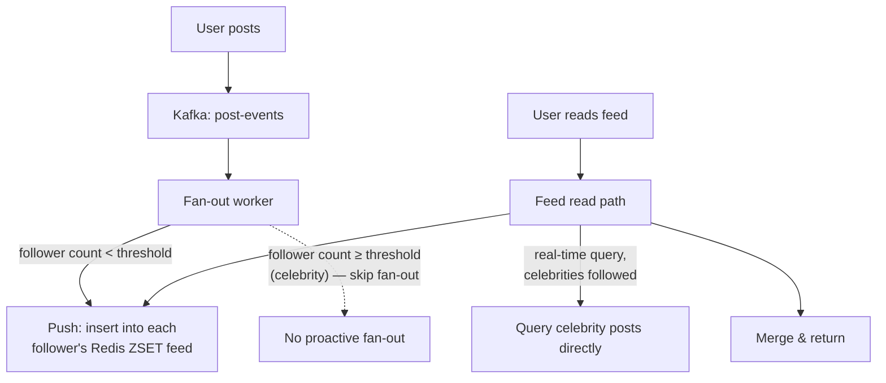

# Design Twitter / News Feed

> [!abstract] What you'll be able to do after this chapter
> Explain the fundamental "make the common operation cheap" insight behind fan-out-on-write, then explain precisely why that same idea catastrophically fails for celebrity accounts — and what the real, hybrid production answer actually is.

---

## Step 1 — The interview question

> [!question] As an interviewer would ask it
> "Design a system where users post short messages, follow other users, and see a feed aggregating posts from everyone they follow."

## Step 2 — Requirements

**Functional:** post a message. Follow/unfollow. View a home timeline (feed) aggregating followed users' posts. View a user's own profile timeline.

**Non-functional:** feed reads must be **very low latency** — it's the most-viewed page in the entire product. Writes (posting) must stay available even under load. **Eventual consistency is acceptable for feed freshness** (a few seconds' delay before a post appears in followers' feeds is fine) — but a post must **never be lost**.

## Step 3 — Back-of-envelope estimation

Assume 300M total users, 50M daily active, ~2 posts/user/day among active users → **100M posts/day** (~1,150 writes/sec average, higher at peak). Follower count is **highly skewed** — most accounts have few followers, a small number have millions — this skew is the single detail that drives the hardest design decision in this chapter. Feed *reads* dominate: 50M DAU checking their feed ~10×/day → ~500M reads/day (~5,800/sec average) — but the real asymmetry isn't the raw read:write ratio, it's **fan-out**: one post, read by potentially millions of followers over its lifetime, represents far more effective read amplification than the raw numbers alone suggest.

## Step 4 — Building it incrementally

**v0 — "pull" model (fan-out on read).** Building a feed queries everyone the user follows, fetches their recent posts, merge-sorts by time — on **every single feed view**. Correctness is trivial. It breaks because feed views are the single most frequent operation in the product, and this makes every one of them do `N` queries (`N` = number followed) — expensive exactly where it can least afford to be.

**Fix — "push" model (fan-out on write).** When a user posts, proactively insert that post into a **precomputed feed** (a list/sorted-set per follower) for every one of their followers. Reading a feed becomes `O(1)` — fetch one precomputed list. This **inverts the cost**: writes get more expensive (`N` feed-inserts per post, `N` = follower count), reads — the overwhelmingly common operation — become cheap. This inversion is the entire insight this design hinges on.

> [!bug] The celebrity problem — where fan-out-on-write catastrophically fails
> An account with 50M followers posting once means **50M feed-insert writes** for that single post — a massive write spike that can overwhelm the fan-out system and meaningfully delay feed visibility for followers, precisely the case this design is supposed to make fast. Fan-out-on-write's core assumption (follower counts are small enough that `N` inserts per post is cheap) simply doesn't hold for celebrity accounts.

**The real production answer: a hybrid.** Fan-out-on-write for the vast majority of normal accounts. For accounts above a follower-count threshold ("celebrities"), **skip proactive fan-out entirely** — at feed-read time, fetch the follower's precomputed (pushed) feed **and separately query any celebrities they follow in real time**, merging both. Cheap reads stay cheap for the common case; celebrity posts never trigger a catastrophic write storm.

---

## Step 5 — Deep dive: fan-out mechanics and where each piece lives

### Storage for the precomputed feed

A [[CS Fundamentals/Caching/Redis Internals|Redis sorted set]] per user, scored by post timestamp, is a near-perfect fit — this is literally the exact use case the Redis Internals chapter names for **ZSETs**: `O(log n)` insertion, `O(log n)` range queries by score, giving both fast fan-out writes and fast feed reads from one structure.

### Async fan-out via a queue

Posting publishes an event to [[CS Fundamentals/Messaging & Streaming/Kafka Internals|Kafka]]; a dedicated **fan-out worker** consumes it and performs the `N` feed-list insertions — the exact same asynchronous-fan-out architectural shape already established in [[HLD/04 - Design a Notification Service/Design a Notification Service|the Notification Service chapter]], reused here rather than reinvented. This keeps the original "post a tweet" request fast regardless of how many followers the fan-out eventually touches.

### Ranking (briefly, out of deep-dive scope)

Beyond pure chronological ordering, a ranking model can reorder the feed for engagement — a real production concern, but its own separate ML-systems domain, worth naming as existing rather than deep-diving here.

## Step 6 — Full architecture

---

## Step 7 — Interviewer follow-ups, answered

> [!quote]- "How do you define the celebrity threshold?"
> A configurable follower-count cutoff (e.g. >100K followers), checked at post-time to decide which fan-out strategy applies to that specific post — not a fixed, hardcoded constant, since the right threshold depends on the fan-out system's actual write capacity.

> [!quote]- "What if a normal user's post suddenly goes viral mid-fan-out?"
> The fan-out is already in progress under the "normal" strategy by the time virality is detected — accepted as an edge case, since it just means the fan-out completes as originally planned; a rare, brief latency effect for late followers, not a correctness problem.

> [!quote]- "How do you handle a user unfollowing someone right as a post is being fanned out to them?"
> Accepted as eventually consistent, matching the stated requirement — the post might briefly appear before disappearing on the follower's next feed refresh. Given the requirements explicitly allow feed-freshness eventual consistency, this isn't a bug to solve, it's within spec.

> [!quote]- "How would you scale this 10x?"
> Shard the feed storage (the Redis ZSETs) across more nodes via [[Glossary/Consistent Hashing|consistent hashing]] on user ID — the same sharding mechanics already covered in [[HLD/03 - Design a Distributed Cache (build Redis)/Design a Distributed Cache|the Distributed Cache chapter]], applied here to feed storage instead of a generic cache.

## Step 8 — Production experience

> [!info] What to monitor
> Fan-out worker lag ([[CS Fundamentals/Messaging & Streaming/Kafka Internals|Kafka consumer lag]], directly reused as the monitoring primitive). Redis memory usage for feed lists. **Celebrity-path read latency specifically** — since it does real, live query work unlike the `O(1)` normal path, it deserves its own latency SLO, not lumped into an aggregate feed-latency metric.

> [!tip] A real production technique worth naming
> Cap each user's precomputed feed list length (e.g. the most recent 1,000 posts) — bounding Redis memory usage. A user scrolling back further than that falls back to a direct query for older posts, trading a slightly slower "load more" experience deep in the feed for bounded memory cost on the hot, common case.

---
*Related: [[00 - Start Here/How This Handbook Works|Book Map]] · [[CS Fundamentals/Caching/Redis Internals|Redis Internals]] · [[HLD/04 - Design a Notification Service/Design a Notification Service|Design a Notification Service]] · [[Glossary/Fan-out vs Fan-in|Fan-out vs Fan-in]]*
