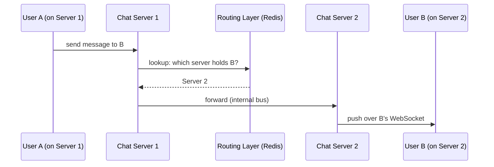
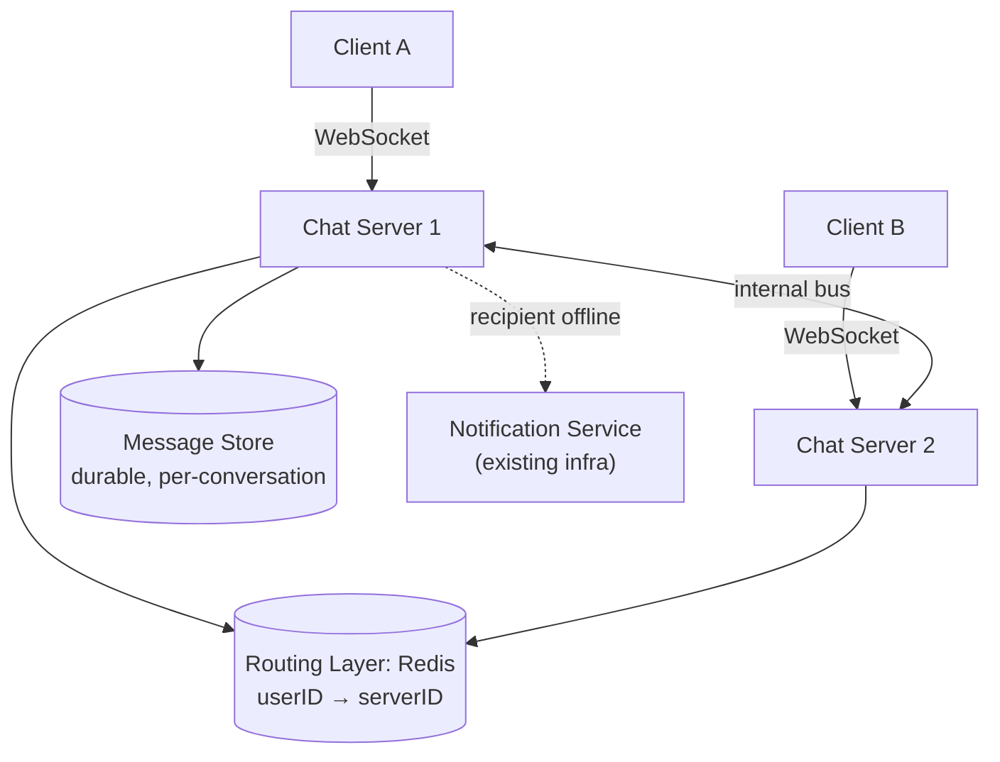

# Design WhatsApp / Chat System

> [!abstract] What you'll be able to do after this chapter
> Explain why persistent-connection systems are a fundamentally different scaling problem from stateless HTTP APIs, design the connection-routing layer that makes cross-server delivery work, and connect offline delivery directly to infrastructure you've already designed.

---

## Step 1 — The interview question

> [!question] As an interviewer would ask it
> "Design a real-time messaging system supporting 1:1 and group chats, delivery status (sent/delivered/read), online presence, and message history across devices."

## Step 2 — Requirements

**Functional:** send/receive messages 1:1 and in groups. Delivery status tracking. Online/last-seen presence. Message history synced across devices.

**Non-functional:** low-latency real-time delivery. **Messages must never be lost**, even if the recipient is offline when sent. Must support **tens of millions of concurrent persistent connections**. Multi-device sync.

## Step 3 — Back-of-envelope estimation

Assume 500M DAU, ~40 messages sent/user/day → **20B messages/day** (~230K messages/sec average, higher at peak). The defining constraint: every active user needs a **persistent connection** open while the app is running — not simple stateless request/response. Supporting tens of millions of concurrently open connections is a fundamentally different scaling problem than a typical HTTP API: **connection state itself** is the bottleneck, not just compute or bandwidth.

## Step 4 — Building it incrementally

**v0 — naive polling.** Client repeatedly asks "any new messages?" Wasteful (most polls return nothing), high latency (a message sits until the next poll fires), and load stays constant regardless of actual message activity.

**Fix — persistent connections via WebSockets.** The server pushes messages to connected clients the instant they arrive — no polling.

**The new architectural problem this introduces: a user's connection lives on exactly one specific server.** Out of potentially thousands of app-server instances, sending user A a message requires knowing **which one** currently holds A's open connection. This is the core problem this chapter exists to solve — a **connection-routing layer**: a lightweight, fast lookup service (backed by [[CS Fundamentals/04 - Caching/Redis Internals|Redis]] — a direct, simple `userID → serverID` mapping, exactly the kind of use case Redis's plain key-value operations are built for) updated on every connect/disconnect event.

**Need durability for offline recipients.** If the recipient isn't currently connected, the message must persist (a durable per-user inbox) and either wait for reconnection, or trigger a **push notification** — reusing [[HLD/04 - Design a Notification Service/Design a Notification Service|the exact fan-out/push infrastructure already designed]] rather than building a second, parallel delivery mechanism. The actual message content is fetched via a sync/history API the next time the client connects.

---

## Step 5 — Deep dive: routing, group fan-out, and delivery status

### Connection management and cross-server delivery

Each chat-server instance keeps an in-memory map of its own connected users; the routing layer's `userID → serverID` mapping stays in sync via connect/disconnect events. A message from user A to user B: **A's server → routing lookup for B's current server → forward over an internal bus (e.g. each chat server subscribes to its own dedicated channel/partition) → B's server → pushed over B's live WebSocket.**

### Group chat — the same fan-out principle, reused

A group message must reach every member — look up each member's connected server (or queue for offline ones), following the identical fan-out pattern already established for feeds and notifications. Nothing conceptually new here; worth stating explicitly that it's a reuse, not a new mechanism.

### Delivery status — acks flowing back through the same routing layer

`Delivered` fires when the recipient's client acknowledges receipt; `Read` fires when the client acknowledges the message being viewed. Both are small messages that flow **back to the sender**, through the exact same connection-routing infrastructure used for the original message, just in the reverse direction.

### Ordering & idempotency

Messages within one conversation need to preserve sender ordering — if using Kafka internally, keying by conversation ID guarantees this exactly the way [[CS Fundamentals/05 - Messaging & Streaming/Kafka Internals|partition-level ordering]] already works. Delivery must be [[Glossary/Idempotency|idempotent]] — a message ID plus client-side dedup means a retried/redelivered message never renders twice on screen, even if the underlying transport retries it.

---

## Step 6 — Full architecture

---

## Step 7 — Interviewer follow-ups, answered

> [!quote]- "What happens if a chat server crashes — do connected users lose messages?"
> The client detects the dropped connection and reconnects (via the load balancer, likely to a different server instance), re-registering in the routing layer. It then fetches any missed messages via a sync/history API using a last-seen cursor (message ID or timestamp). Messages are durably persisted independent of connection state — the crash causes a brief reconnect gap, not data loss.

> [!quote]- "How do you scale to 10x concurrent connections?"
> Add more chat-server instances horizontally, each bounded to a manageable connection count. The routing layer itself needs to scale in parallel — shard the routing lookup (via [[Glossary/Consistent Hashing|consistent hashing]] on user ID) across multiple Redis instances rather than assuming one instance handles the whole user base's routing state.

> [!quote]- "How would you implement 'last seen' presence without a write on every single heartbeat?"
> Throttle presence updates — update the stored "last seen" timestamp at most once per some interval (e.g. every 30 seconds) even if the client sends more frequent heartbeats, trading precision for a large reduction in write volume. Users rarely need last-seen accuracy tighter than tens of seconds anyway.

## Step 8 — Production experience

> [!info] What to monitor
> Concurrent connection count per chat-server instance (direct capacity-planning signal). Routing-layer lookup latency (it sits on the hot path of every single message). Message delivery latency percentiles.

> [!bug] A real production gotcha: reconnect storms
> A chat-server crash or rolling deploy causes **every client connected to it** to reconnect simultaneously — a thundering-herd variant hitting the load balancer and routing layer all at once. Mitigated with **staggered/jittered reconnect backoff** on the client side, so a server restart doesn't produce a synchronized reconnection spike.

---
*Related: [[00 - Start Here/How This Handbook Works|Book Map]] · [[HLD/04 - Design a Notification Service/Design a Notification Service|Design a Notification Service]] · [[CS Fundamentals/04 - Caching/Redis Internals|Redis Internals]] · [[Glossary/Idempotency|Idempotency]]*
