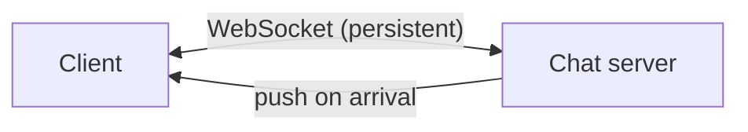
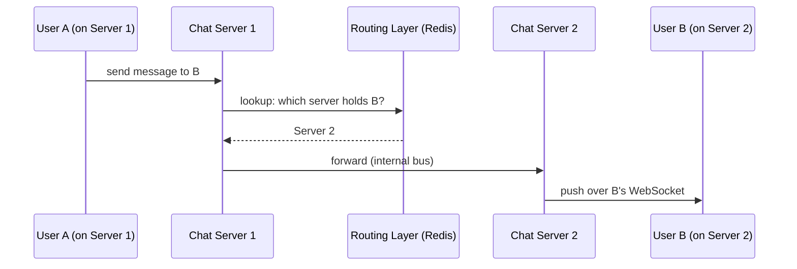
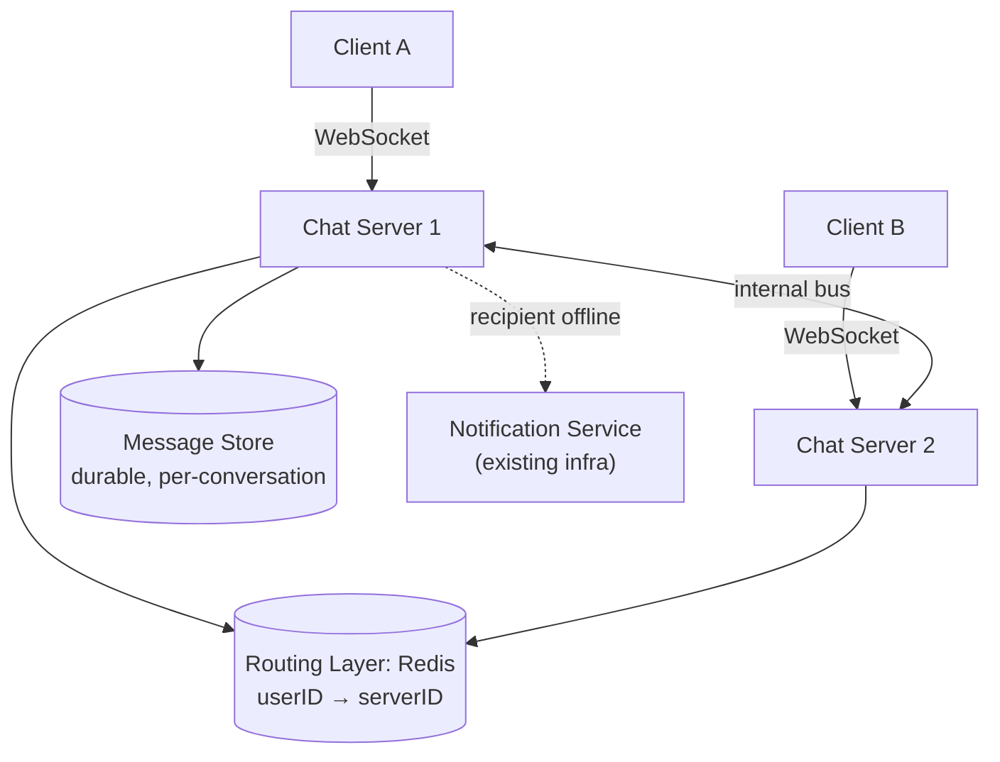

# Design WhatsApp / Chat System

> [!abstract] How to read this chapter
> Built phase by phase around one reframing: persistent-connection systems are a fundamentally different scaling problem from stateless HTTP. Each phase adds one idea, exposes the next bottleneck, and fixes it — landing on the connection-routing layer that makes cross-server delivery work.

> [!question] The interview question
> "Design a real-time messaging system supporting 1:1 and group chats, delivery status (sent/delivered/read), online presence, and message history across devices."

---

## Requirements

**Functional**
- Send/receive messages **1:1 and in groups**.
- Delivery **status** (sent / delivered / read).
- Online / **last-seen presence**.
- Message **history synced across devices**.

**Non-functional**

| Requirement | Why it matters here specifically |
|---|---|
| **Low-latency real-time delivery** | Chat feels broken above a second of lag — messages must push, not poll. |
| **Never lose a message** | Even if the recipient is offline when it's sent — durability independent of connection state. |
| **Tens of millions of concurrent connections** | The defining constraint — **connection state itself** is the bottleneck, not compute or bandwidth. |
| **Multi-device sync** | One logical history delivered to phone and laptop alike. |

---

## Phase 00 — Capacity math you can defend

| Quantity | Derivation | Result |
|---|---|---|
| Messages/day | 500M DAU × ~40 sent | 20B/day → ~230k msgs/s avg |
| The defining constraint | every active user holds an open connection | tens of millions of concurrent sockets |

> [!example] In plain words
> This is not a request/response API. Every active user keeps a **persistent connection** open the whole time the app runs. Holding tens of millions of them concurrently is a different scaling problem — **connection state** is the bottleneck. The whole design is about managing that state.

---

## Phase 01 — Naive polling

*Start with the obvious wrong answer so its waste names the fix.*

The client repeatedly asks "any new messages?" Wasteful (most polls return nothing), high latency (a message sits until the next poll fires), and load stays constant regardless of actual activity.

| 🔴 Bottleneck | 🟢 Next fix |
|---|---|
| Polling is all overhead and still slow — constant load, message-sized latency. | Server pushes over a persistent connection (Phase 2). |

> [!example] Layman
> Checking the mailbox every 30 seconds all day whether or not anything came. Wire a doorbell instead.

---

## Phase 02 — Persistent connections via WebSockets

*The server pushes the instant a message arrives — no polling.*

Instant delivery, no wasted polls. But it introduces the problem this whole chapter exists to solve:

| 🔴 Bottleneck | 🟢 Next fix |
|---|---|
| A user's connection lives on **exactly one** specific server out of thousands. To send user A a message, you must know *which* server holds A's open socket. | A connection-routing layer (Phase 3). |

---

## Phase 03 — The connection-routing layer

*Which of thousands of servers currently holds user B's connection?*

A lightweight, fast lookup service — backed by [[CS Fundamentals/04 - Caching/Redis Internals|Redis]] as a simple `userID → serverID` mapping (exactly the plain key-value use case Redis is built for) — updated on every connect/disconnect event.

A message from A to B: **A's server → routing lookup for B's current server → forward over an internal bus → B's server → pushed over B's live WebSocket.**

| 🔴 Bottleneck | 🟢 Next fix |
|---|---|
| Routing only works if B is *connected*. If B is offline, the message would just vanish. | Durable offline delivery (Phase 4). |

---

## Phase 04 — Durability for offline recipients

*A message must survive the recipient being offline.*

If the recipient isn't currently connected, the message persists in a **durable per-user inbox** and either waits for reconnection or triggers a **push notification** — reusing [[HLD/04 - Design a Notification Service/Design a Notification Service|the exact fan-out/push infrastructure already designed]], not a second parallel delivery mechanism. The actual content is fetched via a sync/history API the next time the client connects.

| 🔴 Bottleneck | 🟢 Next fix |
|---|---|
| Groups, delivery receipts, ordering and dedup all still need mechanics — and they should reuse, not reinvent, the routing layer. | Fan-out, status, ordering (Phase 5). |

---

## Phase 05 — Deep dive: group fan-out, delivery status, ordering

**Group chat — the same fan-out principle.** A group message must reach every member — look up each member's connected server (or queue for offline ones), following the identical fan-out pattern already established for feeds and notifications. A reuse, not a new mechanism.

**Delivery status — acks flow back through the same routing layer.** `Delivered` fires when the recipient's client acknowledges receipt; `Read` when it acknowledges viewing. Both are small messages flowing **back to the sender** through the same connection-routing infrastructure, in reverse.

**Ordering & idempotency.**
- Messages within a conversation preserve sender ordering — keying Kafka by conversation ID guarantees it via [[CS Fundamentals/05 - Messaging & Streaming/Kafka Internals|partition-level ordering]].
- Delivery is [[Glossary/Idempotency|idempotent]] — a message ID + client-side dedup means a retried/redelivered message never renders twice, even if the transport retries.
- Use a server-assigned **sequence/cursor per conversation** for history and sync. The client acks the highest *contiguous* sequence it has, not just the last packet seen — letting the server resend a gap after reconnect.
- Multi-device: treat each device as a delivery target but keep **one durable conversation history**, so a message from a phone syncs to a laptop without becoming a second logical message.

> [!warning] E2E encryption changes where indexing can happen
> If the product promises end-to-end encryption, the service routes and stores ciphertext but can't inspect content for server-side search or moderation. A product/security tradeoff worth stating: E2E privacy changes where indexing, abuse detection, and key management can live.

| 🔴 Bottleneck | 🟢 Next fix |
|---|---|
| Individual pieces handled — assemble the picture. | Final architecture (Phase 6). |

---

## Phase 06 — The final combined architecture

**Five principles to close with:**
1. Persistent connections make *connection state* the bottleneck — a different problem from stateless HTTP.
2. WebSockets push instead of poll; the routing layer answers "which server holds user X's socket?"
3. Durability is independent of connection state — offline messages persist and trigger push (reusing existing infra).
4. Groups, receipts, and sync all reuse the routing layer — nothing conceptually new, just directions and fan-out.
5. Order by conversation-keyed partition; dedup by message ID; ack the highest contiguous sequence for gap-free sync.

---

## Interviewer follow-ups, answered

> [!quote]- "Chat server crashes — do connected users lose messages?"
> The client detects the dropped connection and reconnects (via the LB, likely to a different instance), re-registering in the routing layer. It fetches missed messages via a sync/history API using a last-seen cursor. Messages are durably persisted independent of connection state — the crash causes a brief reconnect gap, not data loss.

> [!quote]- "Scale to 10× concurrent connections?"
> Add chat-server instances horizontally, each bounded to a manageable connection count. Scale the routing layer in parallel — shard the routing lookup via [[Glossary/Consistent Hashing|consistent hashing]] on user ID across multiple Redis instances rather than one instance holding the whole user base's routing state.

> [!quote]- "'Last seen' without a write on every heartbeat?"
> Throttle presence updates — write the stored "last seen" at most once per interval (e.g. every 30s) even if the client heartbeats more often, trading precision for a large drop in write volume. Users rarely need last-seen tighter than tens of seconds.

---

## Production experience

> [!info] What to monitor
> Concurrent connection count per chat-server instance (direct capacity signal). Routing-layer lookup latency (it's on the hot path of *every* message). Message delivery latency percentiles.

> [!bug] A real production gotcha: reconnect storms
> A server crash or rolling deploy makes **every client connected to it** reconnect simultaneously — a thundering-herd variant hitting the LB and routing layer at once. Mitigate with **staggered/jittered reconnect backoff** on the client so a restart doesn't produce a synchronized reconnection spike.

---

## Cheat sheet — if you remember nothing else

1. Persistent connections, not request/response — connection state is the bottleneck at tens of millions of sockets.
2. WebSockets push instead of poll; a Redis `userID → serverID` routing layer finds the server holding a user's socket.
3. Cross-server delivery: lookup B's server → forward over internal bus → push over B's socket.
4. Durability is independent of connection — offline messages persist and trigger push (reuse notification infra).
5. Order by conversation-keyed partition, dedup by message ID, ack highest contiguous sequence; shard routing + jitter reconnects to survive storms.

---
*Related: [[00 - Start Here/How This Handbook Works|Book Map]] · [[HLD/04 - Design a Notification Service/Design a Notification Service|Design a Notification Service]] · [[CS Fundamentals/04 - Caching/Redis Internals|Redis Internals]] · [[Glossary/Idempotency|Idempotency]]*
