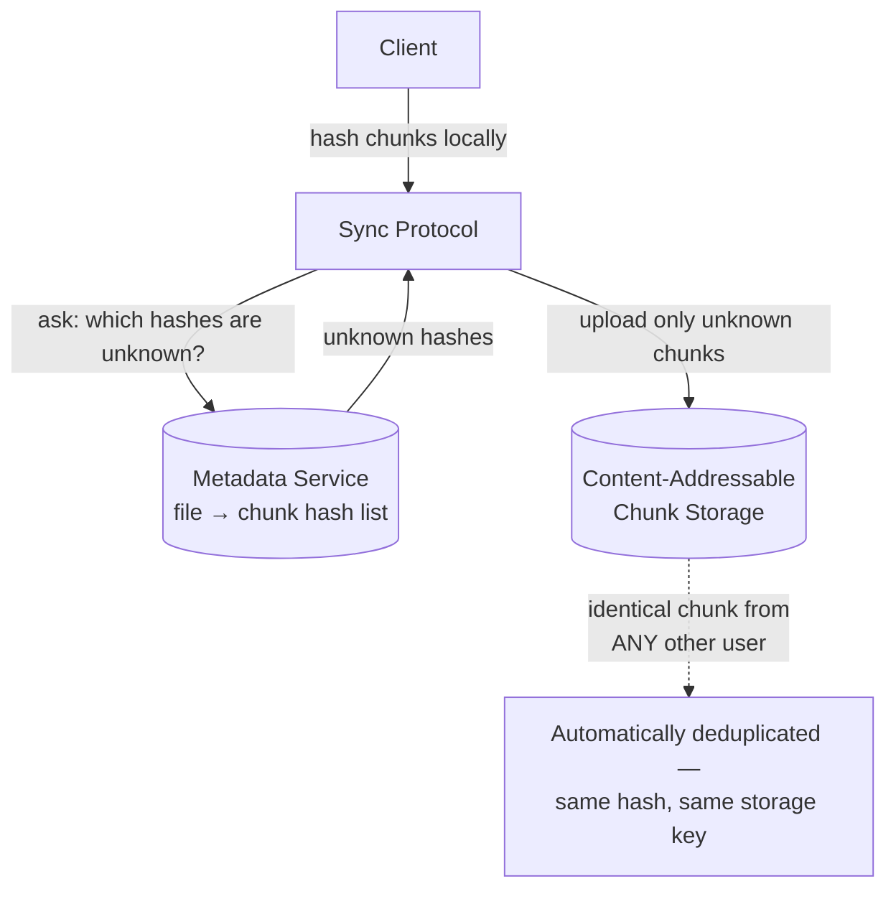

# Design Google Drive / Dropbox

> [!abstract] What you'll be able to do after this chapter
> Explain content-addressable chunk storage precisely enough to derive both delta-sync AND cross-user deduplication as side effects of the same mechanism — not two separate features.

---

## Step 1 — The interview question

> [!question] As an interviewer would ask it
> "Design a cloud file storage and sync service like Google Drive or Dropbox — upload/download files, sync changes across devices, share files, handle large files efficiently."

## Step 2 — Requirements

**Functional:** upload/download files, folder hierarchy, sharing with permissions, sync across multiple devices, version history.

**Non-functional:** handle very large files (GBs) efficiently. **Minimize sync bandwidth** — don't re-upload unchanged content. Storage efficiency (dedup identical content). Strong durability — never lose a file.

## Step 3 — Back-of-envelope estimation

Assume 100M users, ~10GB average storage/user → **~1 Exabyte** raw storage before any dedup — clearly requiring a distributed object storage layer, not a single filesystem. ~10% daily active, ~5 file changes/day each → ~25M file operations/day (~290/sec average) — modest in request-count terms; the real constraint is **bandwidth** for large-file transfer, not request throughput.

## Step 4 — Building it incrementally

**v0 — naive whole-file sync.** Re-upload the entire file on every change, however small. Breaks badly: editing one line in a document inside a large file re-uploads the *whole* file — enormously wasteful, and doesn't handle concurrent multi-device edits gracefully either.

**Fix — chunking + content-hash addressing.** Split every file into fixed-size chunks (e.g. 4MB blocks). Hash each chunk's content. On sync, only chunks whose hash **differs** from what's already stored need uploading — **delta sync**. As a direct side effect of the same mechanism: if the storage key for a chunk *is* its content hash (`SHA-256(chunk_bytes)`), identical content from **any** user naturally maps to the same storage key — **cross-user deduplication comes for free**, not as a separate system.

> [!tip] This is the single most important idea in this chapter
> Dedup here isn't a separate scan-and-merge process — it's an **emergent property of content-addressable storage**. Two different users uploading the same stock photo, the same OS installer, the same PDF template — their identical chunks collapse to one physical copy automatically, because they hash to the same key.

**Metadata service** (separate from chunk storage): tracks `file → ordered list of chunk hashes`, folder hierarchy, permissions, version history. A new file **version** is just a new ordered list of chunk hashes — unchanged chunks are simply **referenced again**, never recopied — making version history storage-cheap for the same underlying reason dedup is.

**Concurrent edits from multiple devices, reconnecting after being offline:** rather than automatic merging (which can silently lose data for arbitrary binary content, unlike text), the deliberate, safer product choice — and Dropbox's actual real-world approach — is to preserve **both** as a "conflicted copy" and let the user manually reconcile, rather than picking a silent winner.

---

## Step 5 — Deep dive: sync protocol and upload resilience

**Sync protocol:** a client periodically (or via push notification) asks "what's changed since my last known state" — a cursor-based sync, structurally identical to [[HLD/07 - Design WhatsApp - Chat System/Design WhatsApp - Chat System|WhatsApp's message-history sync]] using a last-seen cursor — the same pattern, reused rather than reinvented.

**Resumable large-file uploads:** because files are already chunked, a failed upload at 80% doesn't restart from zero — the client resumes uploading only the remaining un-acknowledged chunks. Chunking pays off here for a *second*, distinct reason beyond dedup/delta-sync.

## Step 6 — Full architecture

---

## Step 7 — Interviewer follow-ups, answered

> [!quote]- "How do you avoid re-uploading a file's unchanged chunks after a small edit?"
> Content-hash-based chunking — only chunks whose hash changed get uploaded; everything else is already present, referenced by the new version's chunk list.

> [!quote]- "How would you handle two devices editing the same file offline, then both syncing later?"
> Preserve both as a "conflicted copy" rather than silently picking a winner — safer for arbitrary binary content than automatic merging, and the actual real-world approach Dropbox takes.

> [!quote]- "How do you prevent a user from uploading illegal/malicious content undetected via dedup?"
> Since storage is shared across users through dedup, content-scanning/hash-blocklist checks must run at **upload/hash-computation time**, not skipped just because a chunk already exists in storage from another user — a real, genuine production and legal concern, not just a technical one.

> [!quote]- "How would you scale storage to exabytes?"
> Shard the chunk storage layer across many nodes/regions — the same underlying object-storage sharding concerns as a dedicated distributed file storage system.

## Step 8 — Production experience

> [!info] What to monitor
> Storage growth rate **relative to dedup ratio** (how much dedup is actually saving — a declining ratio over time can signal a shift in usage patterns). Upload/download bandwidth per region. Sync **conflict rate** — a sudden spike often points to a client-side bug generating false conflicts, not genuinely concurrent user edits.

---
*Related: [[00 - Start Here/How This Handbook Works|Book Map]] · [[HLD/07 - Design WhatsApp - Chat System/Design WhatsApp - Chat System|Design WhatsApp / Chat System]]*
