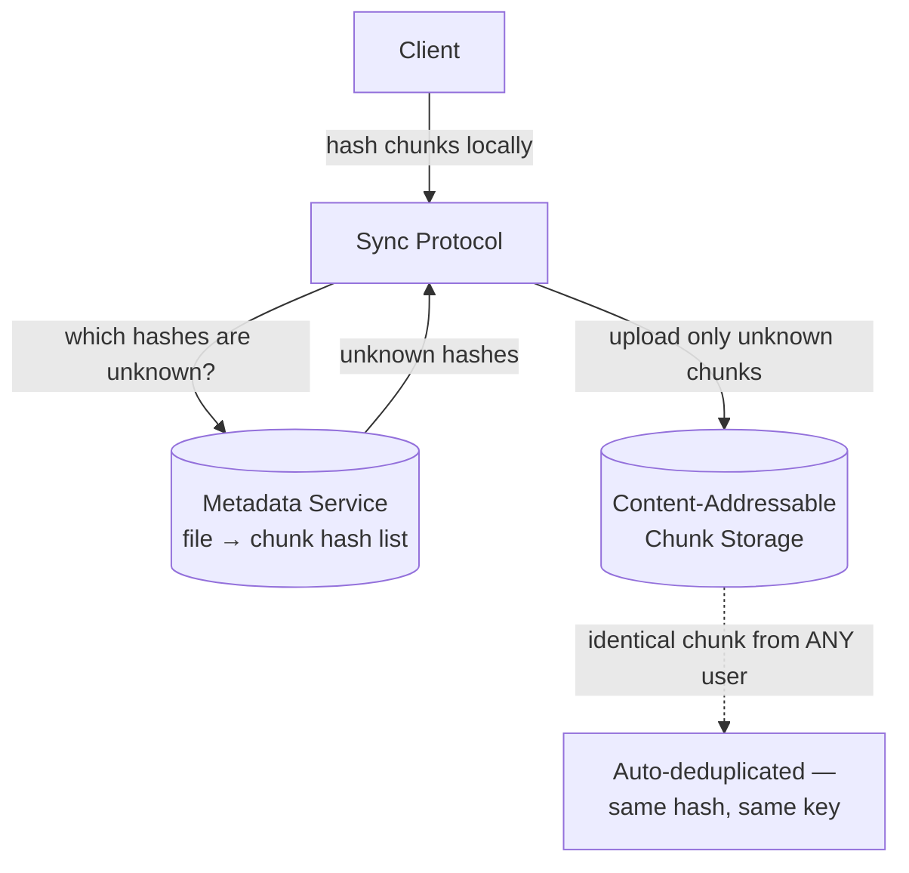
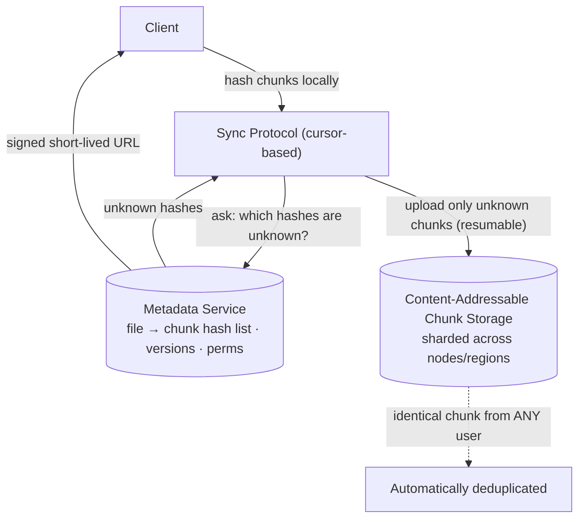

# Design Google Drive / Dropbox

> [!abstract] How to read this chapter
> Built phase by phase around one mechanism — content-addressable chunk storage — from which delta-sync *and* cross-user deduplication *and* cheap version history all fall out as side effects of the same idea. Each phase adds one piece, exposes the next bottleneck, and fixes it.

> [!question] The interview question
> "Design a cloud file storage and sync service like Google Drive or Dropbox — upload/download files, sync changes across devices, share files, handle large files efficiently."

---

## Requirements

**Functional**
- Upload / download files.
- Folder **hierarchy**.
- **Sharing** with permissions.
- **Sync** across multiple devices.
- **Version history**.

**Non-functional**

| Requirement | Why it matters here specifically |
|---|---|
| **Handle very large files (GBs)** | Whole-file transfer of a GB file per edit is untenable — chunking is mandatory. |
| **Minimize sync bandwidth** | Don't re-upload unchanged content — the defining efficiency requirement. |
| **Storage efficiency** | Deduplicate identical content across users, not just within one account. |
| **Strong durability** | Never lose a file — the one promise a storage product can't break. |

---

## Phase 00 — Capacity math you can defend

| Quantity | Derivation | Result |
|---|---|---|
| Raw storage | 100M users × ~10 GB | ~1 Exabyte before dedup |
| File ops/day | 10M DAU × ~5 changes | ~25M/day → ~290/s avg |
| The real constraint | large-file transfer | **bandwidth**, not request throughput |

> [!example] In plain words
> Request count is modest; the exabyte of storage forces distributed object storage, and the real bottleneck is **bandwidth** for moving big files. The whole design exists to move as few bytes as possible per change.

---

## Phase 01 — Naive whole-file sync

*Start with the obviously wasteful version so its cost names the fix.*

Re-upload the entire file on every change, however small. Editing one line in a large document re-uploads the *whole* file — enormously wasteful — and it doesn't handle concurrent multi-device edits gracefully.

| 🔴 Bottleneck | 🟢 Next fix |
|---|---|
| Bandwidth scales with file size, not edit size; a 1-byte change costs a full re-upload. | Chunk the file and upload only what changed (Phase 2). |

> [!example] Layman
> Re-photocopying an entire book because you fixed one typo. Copy only the changed page.

---

## Phase 02 — Chunking + content-hash addressing

*Split files into chunks, address each chunk by the hash of its own bytes — and watch three features fall out of one idea.*

Split every file into fixed-size chunks (e.g. 4 MB). Hash each chunk's content. On sync, only chunks whose hash **differs** from what's already stored need uploading — **delta sync**. And because the storage key for a chunk *is* its content hash (`SHA-256(chunk_bytes)`), identical content from **any** user maps to the same key — **cross-user deduplication comes for free.**

> [!tip] The single most important idea in this chapter
> Dedup isn't a separate scan-and-merge process — it's an **emergent property of content-addressable storage.** Two users uploading the same stock photo, OS installer, or PDF template: their identical chunks collapse to one physical copy automatically, because they hash to the same key.

> [!warning] Fix · fixed-size chunks shift on insertion
> An insertion near the start of a file shifts every later boundary, making many unchanged chunks look new. A production design can use **content-defined chunking with a rolling hash**, so boundaries follow the content and small edits change only nearby chunks — better bandwidth and dedup, at the cost of more CPU and trickier coordination. State the fixed-size design first, add this if sync efficiency is probed.

| 🔴 Bottleneck | 🟢 Next fix |
|---|---|
| Chunks alone aren't a file — something must track which chunks compose which file, version, and folder, and who may see it. | A metadata service (Phase 3). |

---

## Phase 03 — The metadata service (and why version history is cheap)

*Separate from chunk storage: tracks `file → ordered list of chunk hashes`, folders, permissions, versions.*

A new file **version** is just a new ordered list of chunk hashes — unchanged chunks are simply **referenced again**, never recopied — making version history storage-cheap for the same reason dedup is.

> [!tip] Fix · optimistic concurrency on the manifest
> Commit metadata with an optimistic version number: the client sends `base_version`, and the server accepts the new manifest only if the current version still matches. If two offline devices update the same file, the second commit becomes a **conflict** instead of silently overwriting the first. Issue signed, short-lived download URLs only after the metadata service authorizes the user — the chunk store never needs to expose every object publicly.

| 🔴 Bottleneck | 🟢 Next fix |
|---|---|
| Two devices editing offline then both syncing produce a genuine conflict — auto-merging binary content silently loses data. | A deliberate conflict-preservation policy (Phase 4). |

---

## Phase 04 — Concurrent edits: preserve both, never guess

*Multiple devices, reconnecting after being offline.*

Rather than automatic merging (which can silently lose data for arbitrary binary content, unlike text), the deliberate, safer product choice — and Dropbox's actual approach — is to preserve **both** as a **"conflicted copy"** and let the user manually reconcile, rather than picking a silent winner.

| 🔴 Bottleneck | 🟢 Next fix |
|---|---|
| Sync mechanics and large-upload resilience still need spelling out — and both should reuse chunking, not reinvent. | Sync protocol + resumable uploads (Phase 5). |

---

## Phase 05 — Deep dive: sync protocol & upload resilience

**Sync protocol.** A client periodically (or via push) asks "what's changed since my last known state" — a **cursor-based sync**, structurally identical to [[HLD/07 - Design WhatsApp - Chat System/Design WhatsApp - Chat System|WhatsApp's message-history sync]] using a last-seen cursor. The same pattern, reused.

**Resumable large-file uploads.** Because files are already chunked, a failed upload at 80% doesn't restart from zero — the client resumes only the remaining un-acknowledged chunks. Chunking pays off a *second* time, beyond dedup/delta-sync.

| 🔴 Bottleneck | 🟢 Next fix |
|---|---|
| Individual pieces handled — assemble the picture, and address the dedup-specific safety concern. | Final architecture (Phase 6). |

---

## Phase 06 — The final combined architecture

> [!danger] Dedup's safety trap
> Because storage is shared across users through dedup, content-scanning / hash-blocklist checks must run at **upload/hash-computation time** — never skipped just because a chunk already exists from another user. A real production *and legal* concern, not only a technical one.

**Five principles to close with:**
1. Content-addressable storage is the whole design — the chunk's key *is* the hash of its bytes.
2. Delta-sync, cross-user dedup, and cheap version history are three side effects of that one idea, not three systems.
3. Metadata (file → chunk-hash list, versions, perms) is separate from chunk storage; optimistic versioning turns races into conflicts.
4. Preserve both edits as a "conflicted copy" — never silently auto-merge binary content.
5. Chunking also buys resumable uploads; scanning must run at upload time despite dedup.

---

## Interviewer follow-ups, answered

> [!quote]- "Avoid re-uploading a file's unchanged chunks after a small edit?"
> Content-hash-based chunking — only chunks whose hash changed get uploaded; everything else is already present, referenced by the new version's chunk list.

> [!quote]- "Two devices editing the same file offline, both syncing later?"
> Preserve both as a "conflicted copy" rather than silently picking a winner — safer for arbitrary binary content than auto-merging, and Dropbox's actual approach.

> [!quote]- "Prevent uploading illegal/malicious content undetected via dedup?"
> Since storage is shared across users through dedup, content-scanning / hash-blocklist checks must run at **upload/hash-computation time**, not skipped just because a chunk already exists from another user — a real production and legal concern.

> [!quote]- "Scale storage to exabytes?"
> Shard the chunk storage across many nodes/regions — the same object-storage sharding concerns as a dedicated distributed file storage system.

---

## Production experience

> [!info] What to monitor
> Storage growth **relative to dedup ratio** (how much dedup is actually saving — a declining ratio can signal a usage-pattern shift). Upload/download bandwidth per region. Sync **conflict rate** — a sudden spike often points to a client-side bug generating false conflicts, not genuinely concurrent edits.

---

## Cheat sheet — if you remember nothing else

1. Chunk every file and key each chunk by `SHA-256` of its bytes — content-addressable storage.
2. Delta-sync (upload only changed hashes), cross-user dedup, and cheap versioning all fall out of that one key.
3. Metadata service (file → chunk list, versions, perms) is separate; optimistic version numbers turn concurrent edits into conflicts.
4. Conflicts → preserve "both as a conflicted copy", never auto-merge binary; chunking also enables resumable uploads.
5. Scan at upload/hash time despite dedup; shard chunk storage across nodes/regions for exabyte scale.

---
*Related: [[00 - Start Here/How This Handbook Works|Book Map]] · [[HLD/07 - Design WhatsApp - Chat System/Design WhatsApp - Chat System|Design WhatsApp / Chat System]]*
