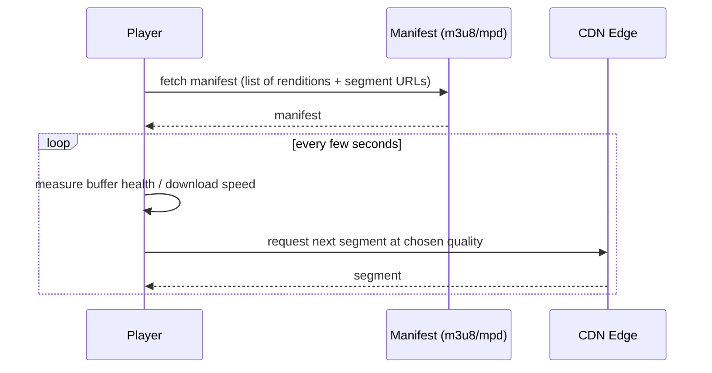
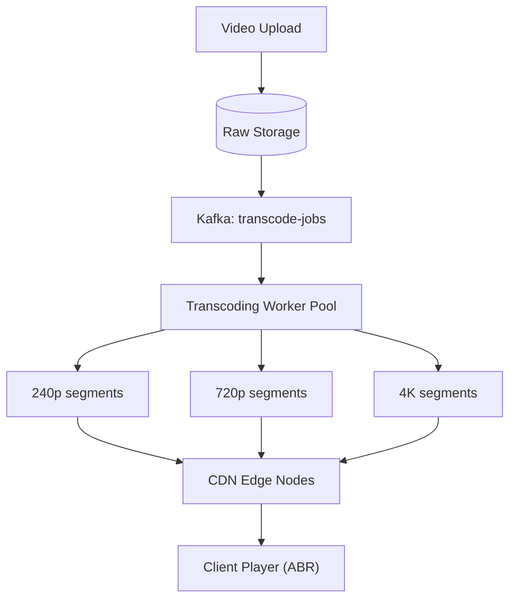

# Design YouTube / Netflix

> [!abstract] What you'll be able to do after this chapter
> Explain adaptive bitrate streaming down to the manifest-file mechanism, justify why transcoding must be fully asynchronous, and name the read/write asymmetry that should drive every architectural decision in this design.

---

## Step 1 — The interview question

> [!question] As an interviewer would ask it
> "Design a video streaming platform — users upload videos, videos get processed into multiple qualities, and users stream with adaptive quality based on their network."

## Step 2 — Requirements

**Functional:** upload video, transcode into multiple resolutions/bitrates, stream with adaptive bitrate switching, search/browse.

**Non-functional:** large uploads. Transcoding must not block the upload response — fully async. Global low-latency streaming. Storage efficiency at massive scale. **Reads (views) vastly exceed writes (uploads)** — more extreme than almost any other case study in this book.

## Step 3 — Back-of-envelope estimation

Assume 500M DAU, ~1 hour watched/user/day → **500M hours/day** streamed — this dominates cost and bandwidth planning entirely. Compare: ~500K new uploads/day at ~10 minutes each — real, but tiny next to streaming volume. **This asymmetry should drive the entire design**: invest heavily in read-side/CDN optimization; uploads and transcoding can afford to be comparatively slower without hurting the product at all.

## Step 4 — Building it incrementally

**v0 — naive.** Store the uploaded video as-is, stream that single file directly to everyone regardless of their device or network. Breaks immediately: a user on a slow mobile connection gets the same massive 4K file as someone on fiber, causing constant buffering — a single format can't serve every playback context well.

**Fix — an async transcoding pipeline.** Upload publishes an event to [[CS Fundamentals/05 - Messaging & Streaming/Kafka Internals|Kafka]] (direct reuse of established messaging infrastructure), triggering transcoding jobs that produce **multiple renditions** (240p through 4K), each chunked into short segments (a few seconds each) — the foundation of adaptive bitrate streaming (ABR) protocols like HLS/DASH.

**Adaptive bitrate streaming, concretely:** the client player continuously monitors its own buffer health and download speed, and requests each **next** short segment at whichever quality level currently fits — meaning a single playback session can switch resolution mid-stream as network conditions change, with **no playback interruption**. This is exactly *why* videos are chunked into short segments per rendition rather than served as one file per quality — switching quality just means requesting the next segment from a different rendition's list.

**CDN placement matters more here than almost anywhere else** given the extreme read/bandwidth skew: popular and recently-uploaded video renditions get cached at edge nodes close to users — it's the transcoding pipeline's **output** (rendition segments) that gets pushed to/pulled by the CDN, never the raw original upload.

---

## Step 5 — Deep dive: the transcoding pipeline and manifest-based playback

### Transcoding pipeline architecture

Upload → raw object storage → async **transcoding worker pool** consumes from the Kafka queue, each worker producing one rendition, writing output back to storage → once all renditions are ready, the video becomes watchable.

> [!bug] A real, stated product tradeoff — not a bug to hide
> A video is **not** watchable the instant it's uploaded — there's a genuine processing delay while transcoding completes. This is an accepted tradeoff of the design, worth stating explicitly rather than glossing over.

### Manifest files — the actual playback mechanism

HLS uses `.m3u8` **manifest** files listing available renditions and their segment URLs; DASH uses an analogous `.mpd` manifest. The player fetches the manifest **first**, then requests individual segments according to its own ABR logic — this is the concrete, real mechanism behind "the video streams," not something to hand-wave past.

---

## Step 6 — Full architecture

---

## Step 7 — Interviewer follow-ups, answered

> [!quote]- "Why not just serve the original uploaded file directly?"
> Device and network conditions vary enormously across viewers — a single format/quality can't serve a fiber connection and a throttled mobile connection well simultaneously; ABR exists specifically to adapt per-viewer, in real time.

> [!quote]- "How do you handle a video going viral immediately after upload, before transcoding finishes?"
> Prioritize/expedite transcoding for videos showing early strong engagement signals, or produce a fast, lower-effort initial transcode first while higher-quality renditions continue processing in the background — "fast transcode then refine" is a real, practical technique.

> [!quote]- "How would you reduce transcoding cost or latency?"
> Parallelize transcoding of independent segments within a video rather than processing the whole file serially, and use hardware-accelerated encoding where available.

> [!quote]- "How do you decide which videos to keep at the CDN edge vs origin-only?"
> Popularity-based eviction, directly reusing the [[CS Fundamentals/04 - Caching/Caching Strategies|LRU/LFU eviction concepts]] already covered — applied at CDN scale instead of an application cache.

## Step 8 — Production experience

> [!info] What to monitor
> Transcoding queue depth/lag (a growing backlog directly delays new-upload availability). CDN cache hit ratio **by region**. **Playback start latency and rebuffering rate** — the actual user-experience metrics that matter most here, more than raw server-side metrics. Storage cost growth — multiple renditions per video multiply storage several-fold over the original alone.

---
*Related: [[00 - Start Here/How This Handbook Works|Book Map]] · [[CS Fundamentals/05 - Messaging & Streaming/Kafka Internals|Kafka Internals]] · [[CS Fundamentals/04 - Caching/Caching Strategies|Caching Strategies]]*
