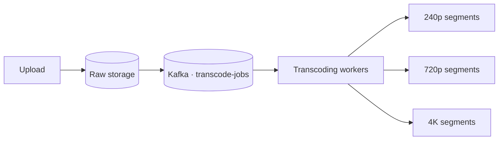
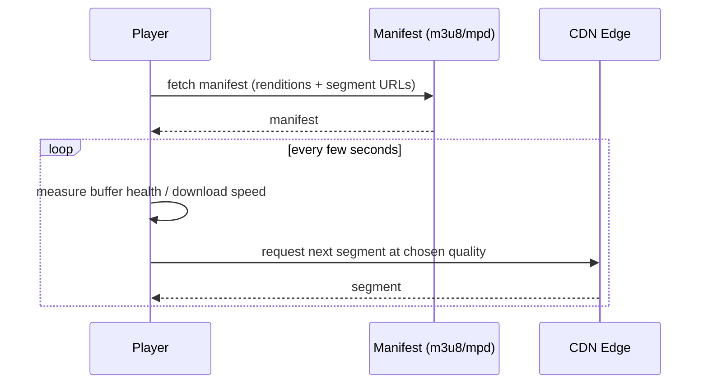
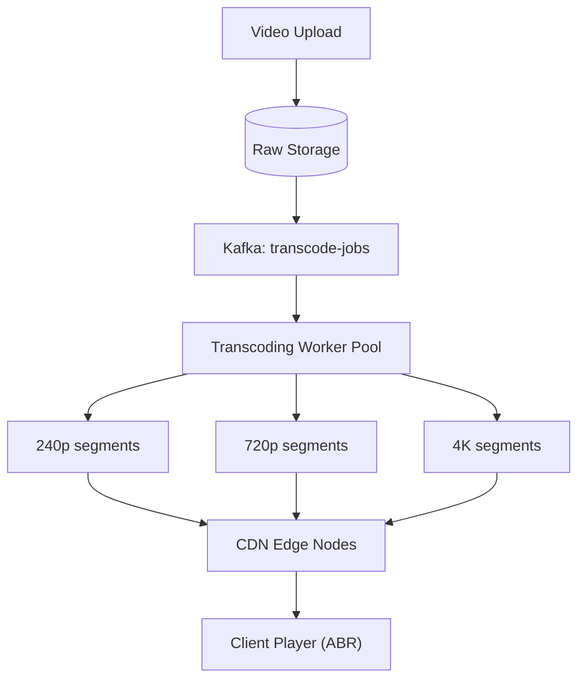

# Design YouTube / Netflix

> [!abstract] How to read this chapter
> Built phase by phase around one asymmetry — reads (views) dwarf writes (uploads) more extremely than any other case study here — and one mechanism, adaptive bitrate streaming, taken down to the manifest file. Each phase adds one idea, exposes the next bottleneck, and fixes it.

> [!question] The interview question
> "Design a video streaming platform — users upload videos, videos get processed into multiple qualities, and users stream with adaptive quality based on their network."

---

## Requirements

**Functional**
- Upload video.
- **Transcode** into multiple resolutions/bitrates.
- Stream with **adaptive bitrate** switching.
- Search / browse.

**Non-functional**

| Requirement | Why it matters here specifically |
|---|---|
| **Large uploads** | GB-scale files — need resumable, authorized upload sessions. |
| **Async transcoding** | Processing must not block the upload response — a video isn't watchable the instant it lands. |
| **Global low-latency streaming** | CDN placement matters more here than almost anywhere. |
| **Extreme read/write skew** | Views vastly exceed uploads — this drives *every* decision: invest in the read side, let uploads be slow. |

> [!info] Three supporting requirements to state explicitly
> Uploaders need **authorization + resumable uploads**; viewers need **access control** for private/paid videos; playback needs a durable **progress/bookmark** path *separate* from the high-volume media-segment path. These are control-plane operations — don't mix them with the bandwidth-heavy media plane.

---

## Phase 00 — Capacity math you can defend

| Quantity | Derivation | Result |
|---|---|---|
| Streaming | 500M DAU × ~1 hr | **500M hours/day** — dominates cost and bandwidth |
| Uploads | ~500K/day × ~10 min | real, but tiny beside streaming |

> [!example] In plain words
> Streaming volume is orders of magnitude above upload volume. That asymmetry *should drive the entire design*: pour investment into read-side/CDN optimization; uploads and transcoding can afford to be comparatively slow without hurting the product at all.

---

## Phase 01 — The naive version: serve the original file

*Start with the one-file approach so its failure names the fix.*

Store the uploaded video as-is and stream that single file directly to everyone regardless of device or network. Breaks immediately: a user on a slow mobile connection gets the same massive 4K file as someone on fiber — constant buffering. A single format can't serve every playback context.

| 🔴 Bottleneck | 🟢 Next fix |
|---|---|
| One file, one quality can't serve a fiber viewer and a throttled mobile viewer at once — buffering for everyone not on fast networks. | Produce multiple renditions via an async transcoding pipeline (Phase 2). |

> [!example] Layman
> Mailing everyone the same 40-pound encyclopedia whether they wanted the pocket edition or the full set. Print several sizes; let each reader take the one that fits.

---

## Phase 02 — Async transcoding into multiple renditions

*Uploads are rare and can be slow — process them off the critical path into many qualities.*

Upload publishes an event to [[CS Fundamentals/05 - Messaging & Streaming/Kafka Internals|Kafka]] (reusing established messaging infra), triggering transcoding jobs that produce **multiple renditions** (240p through 4K), each chunked into short segments (a few seconds each) — the foundation of adaptive bitrate streaming (ABR) protocols like HLS/DASH.

> [!bug] A stated product tradeoff — not a bug to hide
> A video is **not** watchable the instant it's uploaded — there's a genuine processing delay while transcoding completes. An accepted tradeoff of the design, worth stating explicitly rather than glossing over.

| 🔴 Bottleneck | 🟢 Next fix |
|---|---|
| Multiple renditions exist, but *how* the player picks and switches between them mid-stream is the real ABR mechanism. | Manifest-based adaptive playback (Phase 3). |

---

## Phase 03 — Adaptive bitrate playback via manifests

*The player, not the server, decides quality — and it can switch mid-stream with no interruption.*

The player continuously monitors its own buffer health and download speed, and requests each **next** short segment at whichever quality currently fits — so a single session can switch resolution mid-stream with **no playback interruption**. That's exactly *why* videos are chunked into short segments per rendition: switching quality just means requesting the next segment from a different rendition's list.

HLS uses `.m3u8` **manifest** files listing available renditions and their segment URLs; DASH uses an analogous `.mpd`. The player fetches the manifest **first**, then requests segments per its own ABR logic — the concrete mechanism behind "the video streams."

| 🔴 Bottleneck | 🟢 Next fix |
|---|---|
| Playback works, but serving 500M hours/day of segments from origin would be ruinous — and mixing that bandwidth with metadata APIs is dangerous. | CDN edge caching + control/media plane split (Phase 4). |

---

## Phase 04 — CDN edge + control plane vs media plane

*Given the extreme read/bandwidth skew, CDN placement matters more here than almost anywhere.*

Popular and recently-uploaded renditions get cached at edge nodes close to users — it's the pipeline's **output** (rendition segments) pushed to/pulled by the CDN, never the raw original upload.

**Split the two planes:**
- **Control plane** — upload sessions, metadata, permissions, manifests, search, comments, playback progress.
- **Media plane** — large immutable segments served from object storage through the CDN.

Keeping them separate lets a viral video consume enormous egress without starving metadata APIs, and lets a metadata outage fail gracefully without making already-cached segments unusable.

| 🔴 Bottleneck | 🟢 Next fix |
|---|---|
| Individual pieces handled — assemble the pipeline. | Final architecture (Phase 5). |

---

## Phase 05 — The final combined architecture

**Five principles to close with:**
1. Views dwarf uploads — invest in the read/CDN side; let uploads and transcoding be slow.
2. One format can't serve every network — transcode into multiple renditions, async, off the upload path.
3. ABR: chunk each rendition into short segments so the player switches quality by requesting the next segment elsewhere.
4. Manifests (`.m3u8`/`.mpd`) are the real playback mechanism — fetched first, then segments per the player's logic.
5. Split control plane (metadata, tiny) from media plane (segments, huge) so a viral video never starves the APIs.

---

## Interviewer follow-ups, answered

> [!quote]- "Why not just serve the original uploaded file directly?"
> Device and network conditions vary enormously — a single format/quality can't serve a fiber connection and a throttled mobile one well simultaneously; ABR exists specifically to adapt per-viewer, in real time.

> [!quote]- "Video goes viral immediately after upload, before transcoding finishes?"
> Prioritize/expedite transcoding for videos showing early strong engagement, or produce a fast, lower-effort initial transcode first while higher-quality renditions continue in the background — "fast transcode then refine" is a real technique.

> [!quote]- "Reduce transcoding cost or latency?"
> Parallelize transcoding of independent segments within a video rather than processing serially, and use hardware-accelerated encoding where available.

> [!quote]- "Which videos to keep at the CDN edge vs origin-only?"
> Popularity-based eviction, reusing the [[CS Fundamentals/04 - Caching/Caching Strategies|LRU/LFU eviction concepts]] already covered — applied at CDN scale instead of an application cache.

---

## Production experience

> [!info] What to monitor
> Transcoding queue depth/lag (a growing backlog directly delays new-upload availability). CDN cache hit ratio **by region**. **Playback start latency and rebuffering rate** — the actual UX metrics that matter most here, more than raw server-side numbers. Storage cost growth — multiple renditions multiply storage several-fold over the original.

---

## Cheat sheet — if you remember nothing else

1. Views dwarf uploads — the read/CDN side gets the investment; uploads and transcoding are allowed to be slow.
2. Transcode async (Kafka + worker pool) into multiple renditions, each chunked into short segments.
3. ABR = the player picks each next segment's quality by buffer/bandwidth; switching = requesting from a different rendition list.
4. Manifests (`.m3u8`/`.mpd`) are fetched first and drive segment requests — the real playback mechanism.
5. CDN edge-caches popular renditions; split control plane (metadata) from media plane (segments) so virality can't starve APIs.

---
*Related: [[00 - Start Here/How This Handbook Works|Book Map]] · [[CS Fundamentals/05 - Messaging & Streaming/Kafka Internals|Kafka Internals]] · [[CS Fundamentals/04 - Caching/Caching Strategies|Caching Strategies]]*
