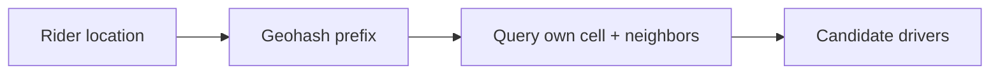
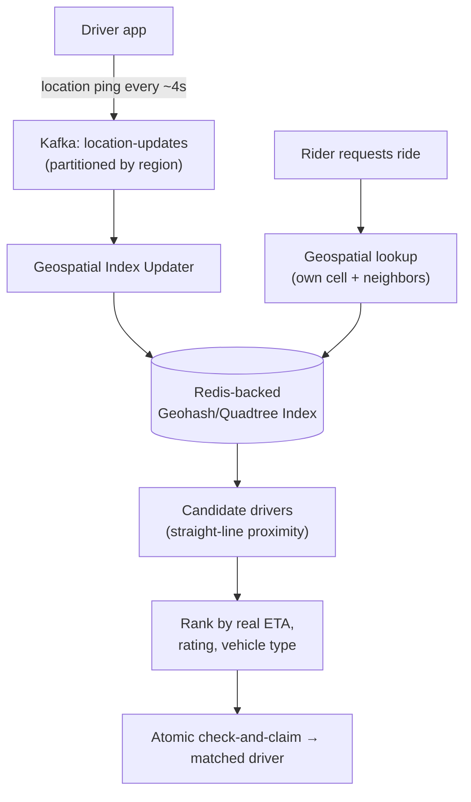

# Design Uber

> [!abstract] How to read this chapter
> Built phase by phase around one framing correction — **location-update volume, not ride requests, is the true bottleneck** — plus a real geohash-vs-quadtree tradeoff and a reused double-booking fix. Each phase adds one idea, exposes the next bottleneck, and fixes it.

> [!question] The interview question
> "Design a ride-hailing service — riders request a ride, the system matches them with a nearby available driver, tracks the ride in real time, and handles payment."

---

## Requirements

**Functional**
- Request a ride (pickup / dropoff).
- **Match** with a nearby available driver.
- Real-time **location tracking** during the ride.
- **Fare calculation**.
- Driver **accept / reject**.

**Non-functional**

| Requirement | Why it matters here specifically |
|---|---|
| **Low-latency matching** | Users expect near-instant assignment — matching is the core UX. |
| **Accurate real-time location at scale** | Millions of drivers pinging continuously — the real write firehose. |
| **Geographically-partitioned matching** | Matching is local, never global — partition by region for locality. |
| **Graceful localized surge** | A concert ending = mass simultaneous requests in one small area (hot partition). |

---

## Phase 00 — Capacity math you can defend

| Quantity | Derivation | Result |
|---|---|---|
| Location updates | 5M drivers × ping every 4s | **~1.25M updates/s globally** |
| Ride requests | ~1M/hour at peak | ~280/s |

> [!example] In plain words
> Location-update volume, **not** ride-matching volume, is the true scaling bottleneck — the write stream is ~4,000× the request stream. A critical framing point: it's easy to over-focus estimation on the "obvious" ride-request path and miss where the load actually is.

---

## Phase 01 — The naive version: scan every driver

*Start with the full-scan version so its cost names the fix.*

Store every driver's lat/long in a table; find nearby drivers by scanning **all** drivers and computing distance to each. Breaks immediately — comparing a rider's location against millions of drivers on every request is a full table scan, catastrophically slow, and gets linearly worse with driver count.

| 🔴 Bottleneck | 🟢 Next fix |
|---|---|
| "Find nearby" as a full scan is `O(all drivers)` per request — it collapses under real fleet size. | A geospatial index that makes "near this point" a localized lookup (Phase 2). |

> [!example] Layman
> Finding the closest taxi by phoning every taxi in the country and asking where it is. Instead, keep a map divided into neighborhoods and only ask the ones nearby.

---

## Phase 02 — Geospatial indexing

*Make "find drivers near this point" a fast, localized lookup instead of a full scan.*

A **geohash** or **quadtree** indexes driver locations. **Geohash**: encode lat/long into a string where longer shared prefixes mean closer proximity — drivers grouped/queried by geohash prefix. A location update writes to the driver's current geohash bucket; a ride request looks up the request's geohash prefix **plus adjacent buckets**.

> [!bug] The boundary problem — a real, named edge case
> A driver just across a geohash cell boundary can be physically **closer** than one technically "inside" the same cell as the rider. Querying only the exact matching cell misses this — **neighboring cells must always be checked too**, not just an exact match.

| 🔴 Bottleneck | 🟢 Next fix |
|---|---|
| Uniform geohash cells don't adapt to density (packed Manhattan vs empty highway); and straight-line proximity isn't real travel distance. | Geohash vs quadtree + two-stage matching (Phase 3). |

---

## Phase 03 — Deep dive: geohash vs quadtree, and two-stage matching

> [!info] General theory, if this moves too fast
> [[CS Fundamentals/06 - Distributed Systems/Geospatial Indexing|Geospatial Indexing]] covers geohash, quadtree, and S2/H3 as general structures independent of ride-hailing — read it for the algorithm and complexity, come back here for applied numbers.

**Geohash vs quadtree — a genuine tradeoff.** **Geohash** produces a **uniform grid** — every cell the same size regardless of driver density. **Quadtree** recursively subdivides space, with **more subdivision in dense areas** — a genuine advantage for wildly uneven density: it adapts resolution to where the data actually is, while geohash cells stay fixed-size everywhere whether packed or empty.

**Matching is two-stage, not one lookup.** The index returns **candidates** by straight-line ("as the crow flies") proximity — a **first-pass filter**, not final ranking. Real road networks aren't straight lines — a river or highway makes a straight-line-close driver genuinely far by road distance/ETA. Final ranking layers in real routing/ETA, driver rating, and vehicle-type match on top of the geospatial candidate set.

| 🔴 Bottleneck | 🟢 Next fix |
|---|---|
| The 1.25M/s location stream still has to be ingested somewhere fast — and not all of it needs the same durability. | Location ingestion at scale + tiered durability (Phase 4). |

---

## Phase 04 — Location ingestion at 1.25M/sec

*Fundamentally a high-throughput **write** problem — reuse the messaging shape.*

Updates publish to [[CS Fundamentals/05 - Messaging & Streaming/Kafka Internals|Kafka]] (partitioned by geographic region for locality), consumed by a service updating the geospatial index — backed by [[CS Fundamentals/04 - Caching/Redis Internals|Redis]] for speed, matching exactly the frequently-updated, latency-sensitive data Redis is built for.

> [!tip] Not every piece of data needs the same durability guarantee
> GPS pings are **ephemeral** — losing one is fine, the next arrives in 4 seconds and supersedes it. Writing every ping synchronously to a durable DB would be wasted cost. A ride's **financial transaction data**, in the same system, absolutely does need full durability. Recognizing that different data *within one system* can have different consistency/durability bars — rather than one uniform standard — is a genuine senior-level distinction.

| 🔴 Bottleneck | 🟢 Next fix |
|---|---|
| A matched driver must not be matched to a second rider simultaneously — a race on the "available" flag. | Atomic check-and-claim (Phase 5). |

---

## Phase 05 — Correctness: no double-matched drivers

*Structurally the identical correctness problem as seat double-booking.*

A naive check-then-act on a driver's "available" flag is a race condition. The fix is the exact pattern reused from [[LLD/06 - Design BookMyShow - Seat Booking/Design BookMyShow - Seat Booking|BookMyShow's seat double-booking]]: make the **check-and-claim one atomic operation** on driver availability status, so two concurrent match attempts can't both win.

| 🔴 Bottleneck | 🟢 Next fix |
|---|---|
| Individual pieces handled — and a concert-ending surge stresses one local shard. | Final architecture + surge handling (Phase 6). |

---

## Phase 06 — The final combined architecture

**Surge** (a concert ending) stresses the local geospatial shard serving that area — the same hot-partition problem as caches and shard keys elsewhere. Mitigation is the same pattern: the index can dynamically re-shard or add capacity for dense regions rather than assuming uniform load.

**Five principles to close with:**
1. Location-update volume, not ride requests, is the true bottleneck — size estimation for the write firehose.
2. Geospatial index turns "find nearby" from a full scan into a localized lookup — always query neighbor cells too.
3. Geohash (uniform grid) vs quadtree (density-adaptive) is a real tradeoff, not two names for one thing.
4. Matching is two-stage: straight-line candidates first, real ETA/rating/vehicle ranking second.
5. Tier durability within one system — ephemeral pings need none, financial data needs full; double-match is fixed by atomic check-and-claim.

---

## Interviewer follow-ups, answered

> [!quote]- "Boundary problem — nearby driver in an adjacent geohash cell?"
> Query neighboring cells alongside the exact-match cell for every request.

> [!quote]- "Massive demand surge in one small area (concert ending)?"
> It stresses the local geospatial shard for that area — the same hot-partition problem as caches/shard keys. Mitigate the same way: the index dynamically re-shards or adds capacity for dense regions rather than assuming uniform load.

> [!quote]- "Why not just use straight-line distance as final ranking?"
> Road networks aren't straight lines — a river, highway, or one-way system makes straight-line-close drivers genuinely far by travel time. Straight-line is only the cheap first-pass candidate filter.

> [!quote]- "Ensure a driver isn't matched to two riders simultaneously?"
> The identical correctness problem as [[LLD/06 - Design BookMyShow - Seat Booking/Design BookMyShow - Seat Booking|BookMyShow's seat double-booking]] — an atomic check-and-claim on driver availability; a naive check-then-act is a race, fixed by making check-and-claim one atomic operation.

---

## Production experience

> [!info] What to monitor
> Geospatial index update lag — are location updates reflected in match-eligible data in near-real-time? **Match latency** (rider-request to driver-assigned) — the core UX metric. Matching success rate **by region** (surfaces localized supply/demand imbalance). Kafka consumer lag on the location-ingestion pipeline.

---

## Cheat sheet — if you remember nothing else

1. Location updates (~1.25M/s) not ride requests (~280/s) are the bottleneck — estimate for the write firehose.
2. Geospatial index (geohash/quadtree) makes "find nearby" a localized lookup — always query neighbor cells (boundary problem).
3. Geohash = uniform grid; quadtree = density-adaptive subdivision — a genuine tradeoff.
4. Matching is two-stage: straight-line candidates, then real ETA/rating/vehicle-type ranking.
5. Tier durability (ephemeral pings vs durable payments); fix double-matching with an atomic check-and-claim; re-shard dense surge regions.

---
*Related: [[00 - Start Here/How This Handbook Works|Book Map]] · [[LLD/06 - Design BookMyShow - Seat Booking/Design BookMyShow - Seat Booking|Design BookMyShow / Seat Booking]] · [[CS Fundamentals/04 - Caching/Redis Internals|Redis Internals]]*
