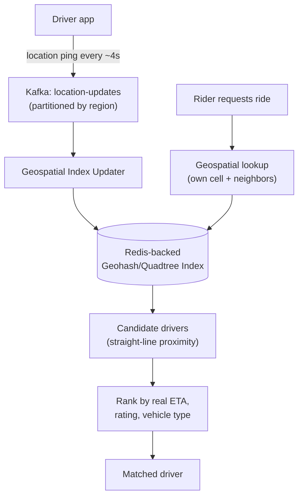

# Design Uber

> [!abstract] What you'll be able to do after this chapter
> Explain geohash vs quadtree with a real tradeoff, not just "both find nearby things," identify that location-update volume (not ride requests) is the true scaling bottleneck, and reuse the exact double-booking fix from the BookMyShow chapter for driver matching.

---

## Step 1 — The interview question

> [!question] As an interviewer would ask it
> "Design a ride-hailing service — riders request a ride, the system matches them with a nearby available driver, tracks the ride in real time, and handles payment."

## Step 2 — Requirements

**Functional:** request a ride (pickup/dropoff), match with a nearby driver, real-time location tracking during the ride, fare calculation, driver accept/reject.

**Non-functional:** **low-latency matching** — users expect near-instant assignment. Accurate real-time location updates at scale. Location-aware, geographically-partitioned matching (not global). Graceful handling of localized surge demand (a concert ending, mass simultaneous requests in one small area).

## Step 3 — Back-of-envelope estimation

Assume 5M active drivers, each reporting location every 4 seconds → **~1.25M location updates/sec globally** — a continuous, massive write stream. Compare: ~1M ride requests/hour at peak → ~280/sec. **Location-update volume, not ride-matching request volume, is the true scaling bottleneck** — a critical framing point, since it's easy to over-focus estimation on the "obvious" ride-request path instead.

## Step 4 — Building it incrementally

**v0 — naive.** Store every driver's lat/long in a table; find nearby drivers by scanning **all** drivers and computing distance to each. Breaks immediately — comparing a rider's location against millions of drivers on every single request is a full table scan, catastrophically slow, and gets worse linearly with driver count.

**Fix — geospatial indexing.** A **geohash** or **quadtree** structure indexes driver locations so "find drivers near this point" becomes a fast, localized lookup instead of a full scan. **Geohash**: encode lat/long into a string where longer shared prefixes mean closer proximity — drivers grouped/queried by geohash prefix. A location update becomes a write to the driver's current geohash bucket; a ride request becomes a lookup of the request's geohash prefix **plus adjacent buckets**.

> [!bug] The boundary problem — a real, named edge case
> A driver just across a geohash cell boundary can be physically **closer** than one technically "inside" the same cell as the rider. Querying only the exact matching cell misses this — neighboring cells must always be checked too, not just an exact match.

---

## Step 5 — Deep dive: geohash vs quadtree, and matching as two-stage filtering

### Geohash vs quadtree — a genuine tradeoff, not two names for the same thing

**Geohash** produces a **uniform grid** — every cell is the same size regardless of actual driver density. **Quadtree** recursively subdivides space, with **more subdivision in dense areas** — a genuine advantage for wildly uneven density (Manhattan vs a rural highway): a quadtree naturally adapts its resolution to where the data actually is, while geohash cells stay a fixed size everywhere whether that area is packed or empty.

### Matching is two-stage, not one lookup

Geospatial index lookup returns **candidates** by straight-line ("as the crow flies") proximity — this is a **first-pass filter**, not the final ranking. Real road networks aren't straight lines — a river or highway can make a straight-line-close driver genuinely far by actual road distance/ETA. Final ranking layers in real routing/ETA data, driver rating, and vehicle-type match on top of the geospatial candidate set.

### Location-update ingestion at 1.25M/sec

This is fundamentally a high-throughput **write** problem, structurally similar to the messaging infrastructure already covered elsewhere in this handbook: updates publish to [[CS Fundamentals/Messaging & Streaming/Kafka Internals|Kafka]] (partitioned by geographic region for locality), consumed by a service updating the geospatial index — backed by [[CS Fundamentals/Caching/Redis Internals|Redis]] for its speed, matching exactly the kind of frequently-updated, latency-sensitive data Redis is built for.

> [!tip] Not every piece of data in this system needs the same durability guarantee
> GPS location pings are **ephemeral** — losing one update is fine, since the next one arrives in 4 seconds and supersedes it. Writing every ping synchronously to a durable database would be wasted cost for no real benefit. A ride's **financial transaction data**, in the same system, absolutely does need full durability. Recognizing that different data *within one system* can legitimately have different consistency/durability bars — rather than applying one uniform standard everywhere — is a genuine senior-level distinction.

## Step 6 — Full architecture

---

## Step 7 — Interviewer follow-ups, answered

> [!quote]- "How do you handle the boundary problem where a nearby driver is in an adjacent geohash cell?"
> Query neighboring cells alongside the exact-match cell for every request — covered in Step 4.

> [!quote]- "How would you handle a massive demand surge in one small area, like a concert ending?"
> This genuinely stresses the local geospatial shard serving that area — the same hot-partition problem already covered for caches and shard keys elsewhere in this handbook. Mitigation follows the same pattern: ensure the geospatial index can dynamically re-shard or add capacity for dense regions rather than assuming uniform load across all shards.

> [!quote]- "Why not just use straight-line distance as the final ranking?"
> Road networks aren't straight lines — a river, highway, or one-way street system can make straight-line-close drivers genuinely far by actual travel time. Straight-line distance is only the cheap first-pass candidate filter.

> [!quote]- "How do you ensure a driver isn't matched to two riders simultaneously?"
> Structurally the identical correctness problem as [[LLD/06 - Design BookMyShow - Seat Booking/Design BookMyShow - Seat Booking|BookMyShow's seat double-booking]] — an atomic check-and-claim on driver availability status, the exact same fix pattern reused: a naive check-then-act on a driver's "available" flag is a race condition, fixed by making the check-and-claim one atomic operation.

## Step 8 — Production experience

> [!info] What to monitor
> Geospatial index update lag — are location updates reflected in match-eligible data in near-real-time, or is there a growing processing delay? **Match latency** (rider-request to driver-assigned time) — the core UX metric. Matching success rate **by region** (surfaces localized supply/demand imbalance). Kafka consumer lag on the location-ingestion pipeline.

---
*Related: [[00 - Start Here/How This Handbook Works|Book Map]] · [[LLD/06 - Design BookMyShow - Seat Booking/Design BookMyShow - Seat Booking|Design BookMyShow / Seat Booking]] · [[CS Fundamentals/Caching/Redis Internals|Redis Internals]]*
